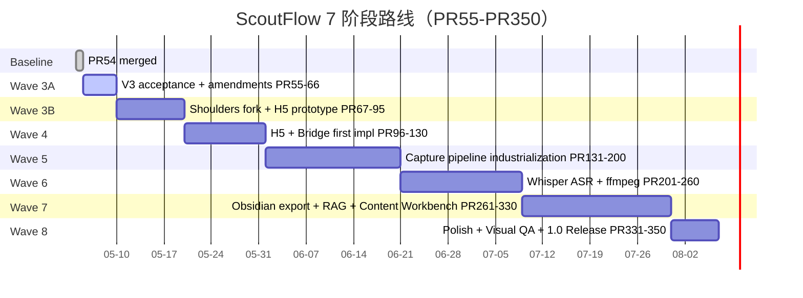

# ScoutFlow 基线路线图 — PR54 Merged 之后的 7 阶段方向

> **本文档定位**：v3 与 Codex/GPT Pro 修订融合后的**方向锚**。它不是 PRD/SRD authority，但所有后续 amendment / dispatch / wave ledger 都引用本文档的阶段定义、入口条件、出口条件。
>
> **所有"阶段升级"都是 user gate + 单独 dispatch + 外审三件套**，本文档**不**自动激活任何阶段。

---

## 0. PR54 Merged 后基线声明（事实层）

| 维度 | 当前状态 | 来源 |
|---|---|---|
| PR54 | merged (T-P1A-029 post S0/S1 authority candidate fix) | git log c133e0e |
| Wave 2 | closed | docs/current.md |
| Active product task | 0 | docs/current.md |
| Active count | 0/3 | docs/current.md |
| Authority writer slot | 0/1 | docs/current.md |
| PRD baseline | PRD-v2-2026-05-04.md (promoted) | docs/PRD-v2-*.md |
| SRD baseline | SRD-v2-2026-05-04.md (promoted) | docs/SRD-v2-*.md |
| SRD-v3 candidate | merged via PR51 + PR53 audit-fix | docs/specs/contracts-index.md |
| audio_transcript runtime | blocked | docs/current.md |
| BBDown live runtime | blocked | docs/current.md |
| migrations/** | FORBIDDEN | docs/current.md |
| apps/ workers/ packages/ | 不创建/不修改 (除非 dispatch 授权) | AGENTS.md |
| Active product lane max | 3 | AGENTS.md |
| Authority writer max | 1 | AGENTS.md |

**这些是基线，不能被本文档绕过。** 任何引用本文档的 dispatch 都必须验证基线一致性。

---

## 1. 项目终局：用户视角的 1.0 Release Definition

### 1.1 1.0 release 用户故事

```text
作为单人内容采集 operator，我打开浏览器到 http://localhost:8080：

1. 看到 ScoutFlow Capture Station 4 面板 H5：
   URL Bar / Live Metadata Panel / Capture Scope Panel / Trust Trace Graph
2. 粘贴 Bilibili URL，点击 ▶ Capture
3. Live Metadata Panel 实时显示 BBDown 抓到的 title/uploader/duration/...
4. Capture Scope Panel 显示 metadata_only 状态（audio_transcript 灰显 blocked）
5. Trust Trace Graph 实时填充 7 层 DTO（capture/state/job/probe/receipt/media/audit）
6. 点击 ▶ Commit to Vault
7. ScoutFlow Bridge 写入 ${SCOUTFLOW_VAULT_ROOT}/00-Inbox/scoutflow-{id}-{slug}.md
8. 切到 Obsidian → 看到新 markdown
9. 跑 /intake → 自动分类到 02-Raw/<domain>/
10. 跑 /compile → 编译进 01-Wiki/
11. 知识沉淀完成。下游 ContentFlow 可消费 03-Output/。
```

### 1.2 1.0 必备能力

| 能力 | 状态 |
|---|---|
| Bilibili metadata 采集（BBDown locked） | 必备 |
| 强视觉 H5 Capture Station 4 面板 | 必备 |
| Vault 写入（00-Inbox + 4 字段 frontmatter） | 必备 |
| Trust Trace 7 层实时图（React Flow） | 必备 |
| ScoutFlow Bridge HTTP API（route group） | 必备 |
| Whisper local ASR（audio_transcript 解锁后） | 必备 |
| ffmpeg 媒体处理 | 必备 |
| Normalization（Pydantic + Instructor + Outlines） | 必备 |
| Obsidian export 严格 frontmatter-templates | 必备 |
| ContentFlow / DiloFlow handoff（vault 03-Output 或 ingest-log） | 必备 |
| 5 Gate Checklist 视觉验收（每 H5 PR） | 必备 |
| RAG 索引（sqlite-vector / LanceDB） | 可选（1.0 之后） |
| 多平台扩展（XHS / YouTube / RSS） | 可选（1.0 之后） |

### 1.3 1.0 release 验收 4 把尺

```
尺 1: Bilibili capture 端到端跑通 100 个真实 URL，0 失败
尺 2: H5 Capture Station 5 Gate Checklist 全过
尺 3: Vault 写入符合 System/frontmatter-templates.md raw 4 字段，audit-wiki.py 0 报错
尺 4: 兄弟项目（ContentFlow）可在 vault 内消费 ScoutFlow 输出，无 schema 冲突
```

---

## 2. 架构基线（PR54 后 + Codex/GPT Pro 修订融合）

```text
┌────────────────────────────────────────────────────────────────┐
│ L3 Projection: Strong Visual H5 Capture Station                │
│ ─────────────────────────────────────────────────────────────  │
│ http://localhost:8080  (单页本机 Web app，浏览器，不要 Electron) │
│                                                                  │
│ Stack: Vite + React 19 + TypeScript                              │
│        + shadcn/ui (vendored) + Radix UI                         │
│        + TanStack Query / Form / Table                           │
│        + React Flow (Trust Trace + Capture Scope state machine)  │
│        + Tailwind v4 + Lucide icons + Zustand                    │
│                                                                  │
│ 4 面板:                                                           │
│   - URL Bar         (粘贴 Bilibili URL + ▶ Capture)              │
│   - Live Metadata   (BBDown 实时反馈)                             │
│   - Capture Scope   (state machine: metadata_only → blocked layers)│
│   - Trust Trace     (React Flow 7 层 DTO 实时填充)                │
│                                                                  │
│ 验收: 5 Gate Checklist (~/.claude/rules/aesthetic-first-principles.md)│
└────────────────────────────────────────────────────────────────┘
                  ↑ HTTP fetch (CORS scoped to localhost)
                  │
┌────────────────────────────────────────────────────────────────┐
│ L2 Thin API: 现有 services/api/scoutflow_api/ + Bridge route group│
│ ─────────────────────────────────────────────────────────────  │
│                                                                  │
│ 现有 routes (PR54 baseline 已有):                                  │
│   POST /captures/discover                                         │
│   POST /jobs/{job_id}/complete                                    │
│   GET  /captures/{capture_id}/trust-trace                         │
│                                                                  │
│ Bridge route group (新增 candidate, Wave 3B-4 实施):               │
│   GET  /bridge/health                                             │
│   GET  /bridge/vault/config                                       │
│   GET  /captures/{capture_id}/vault-preview                       │
│   POST /captures/{capture_id}/vault-commit                        │
│   future: POST /captures/{capture_id}/transcribe (Phase 5 解锁后)  │
│                                                                  │
│ 关键修订 (Codex 审计意见):                                         │
│   - Bridge 不是独立 Python 进程                                    │
│   - Bridge = Thin API 的 route group                              │
│   - 复用现有 authority server，避免绕开 receipt/state machine      │
└────────────────────────────────────────────────────────────────┘
                  ↓ subprocess + redacted output
                  │
┌────────────────────────────────────────────────────────────────┐
│ L1 Tools / Shoulders (subprocess, 不是 Python import)            │
│ ─────────────────────────────────────────────────────────────  │
│ - BBDown                  (Bilibili capture, locked)             │
│ - Whisper family          (local ASR, locked, Phase 5 解锁)       │
│ - ffmpeg                  (media processing, Phase 5)            │
│ - 其他 shoulders          (按 doc2 生命周期手册管理)               │
└────────────────────────────────────────────────────────────────┘
                  ↓
┌────────────────────────────────────────────────────────────────┐
│ L0 Authority: SQLite + FS + state words                         │
│ ─────────────────────────────────────────────────────────────  │
│ - SQLite tables (per SRD-v2 + SRD-v3 candidate)                  │
│ - FS artifact layout                                              │
│ - state words (capture / capture_state / metadata_job / ...)     │
│ - receipt ledger                                                  │
│                                                                  │
│ FORBIDDEN until dispatch + user gate + external audit:           │
│   migrations/** , apps/** , workers/** , packages/** , data/**   │
└────────────────────────────────────────────────────────────────┘
                  ↓ vault-commit (写 markdown 文件)
                  │
┌────────────────────────────────────────────────────────────────┐
│ External: 用户已有 Obsidian PARA + Claudian Vault                │
│ Default candidate root: ${SCOUTFLOW_VAULT_ROOT:-~/workspace/raw} │
│ ─────────────────────────────────────────────────────────────  │
│ ScoutFlow ONLY writes:                                            │
│   ${SCOUTFLOW_VAULT_ROOT}/00-Inbox/scoutflow-{id}-{slug}.md      │
│                                                                  │
│ User / Claudian then runs:                                       │
│   /intake → moves to 02-Raw/<domain>/                            │
│   /compile → compiles to 01-Wiki/                                │
│   /enrich, /query, /lint, /doc, /canvas, /diagram                │
│                                                                  │
│ ScoutFlow 项目管理位置:                                            │
│   ${SCOUTFLOW_VAULT_ROOT}/05-Projects/ScoutFlow/                 │
│   按 _project-template.md (README + decisions/ + handoff-log     │
│   + ingest-log + outcomes + blockers + dispatches/)              │
│                                                                  │
│ 兄弟项目 (已存在):                                                 │
│   05-Projects/ContentFlow/ (handoff-log + ingest-log + README)   │
│                                                                  │
│ 严格遵守 (不重造):                                                 │
│   System/frontmatter-templates.md (字段唯一真相源)                 │
│   System/domain-map.md (9 domain 枚举)                            │
│   System/intake-rules.md (/intake 决策树)                         │
│   System/audit-wiki.py (13 项审计)                                │
└────────────────────────────────────────────────────────────────┘
```

### 2.1 与 v3 的差异

| 维度 | v3 | v3+Codex/GPT Pro 修订 (本基线) |
|---|---|---|
| Bridge 形态 | 独立 Python 进程 | **Thin API route group** (Codex 修订) |
| Vault 位置 | 硬编码 ~/workspace/raw | **${SCOUTFLOW_VAULT_ROOT}** 配置（v1.1 errata P1-6: PRD 推荐默认 ~/workspace/raw / SRD 必须显式 fail loud / .env.local 配置） |
| Lane 上限 | 5/8/3/3 立即生效 | **Enforced baseline (product=3 + authority=1) + Tracked advisory pools (research=8 + prototype=3 + audit=3) + Surge candidate (product=5, 等 PR59+PR66 gate)**（v1.1 errata P1-1: 不再使用 3/0/0/0 / 3/8/3/3 混用） |
| Wave 3A 起点 | PR54 | **PR55** (PR54 已被 T-P1A-029 占用) |
| ARD 数量 | ARD-002 唯一 | **ADR-001 Obsidian PARA Lock 唯一** (重命名为 ADR-001) |
| H5 落点 | apps/h5 直接创建 | **repo 外 prototype + amendment 解禁后**才创建 apps/capture-station |
| H5 端口 | localhost:8080 (硬编码) | localhost:8080 (default, 可配置) |

---

## 3. 7 阶段路线图（PR55-PR350）

> 阶段命名同步 Codex 的 7-Wave 模型（不是 v3 的 8 阶段，避免命名冲突）。
> 每阶段含 6 字段：目标 / 入口条件 / 出口条件 / 关键肩膀 / 关键风险 / 预期 PR 段。

### 3.1 总览



### 3.2 Wave 3A — V3 Acceptance + Amendments (PR55-PR66)

```yaml
目标: |
  把 v3 方向 + Codex/GPT Pro 修订 落成 candidate 文档。
  不修改任何 runtime, 不创建 apps/, 不解禁 migrations/.

入口条件:
  - PR54 merged (T-P1A-029 done)
  - docs/current.md 显示 Active 0/3 + Authority writer 0/1
  - 用户显式 gate Wave 3A

出口条件:
  - shoulders-index.md 已建（10-列 schema）
  - ADR-001 Obsidian PARA Lock 已 commit
  - PRD-v2.1 amendment candidate 已 commit
  - SRD-v3 H5/Bridge amendment candidate 已 commit
  - Parallel Execution Protocol candidate 已 commit
  - OpenDesign H5 visual probe 已落 docs/research/prototypes/
  - 4 个 Shoulder Scan reports 已落 docs/research/shoulders/
  - PR Factory tooling plan 已 commit
  - Wave 3A closeout decision-log entry 已 commit

关键肩膀:
  - OpenDesign (repo 外 H5 visual probe)
  - 7 RedNote-MCP 候选 (XHS scan)
  - yt-dlp + Nemo2011 + bilibili-api mirrors (Bilibili comparator scan)
  - OpenWhispr + Kiranism shadcn starter (Console reference scan)
  - Hermes Kanban Bridge (port 27124 模式参考)
  - Bernstein (multi-agent 调度参考)

关键风险:
  - 文档膨胀 → 限定每文档 < 600 行
  - Lane 5 提议绕过 protocol → 显式标 candidate, 等 Wave 3A closeout 批准
  - referencerepo/ 没人管 → doc2 §1 7 阶段生命周期 + PR67 clone plan

预期 PR: PR55-PR66 (12 PR, 详见 doc3)
预期时长: 5-7 天 (PR factory 节奏)
```

### 3.3 Wave 3B — Shoulders Fork + H5 Prototype (PR67-PR95)

```yaml
目标: |
  把 Wave 3A 扫描出的肩膀, 按 doc2 生命周期 clone → probe → fork 到 referencerepo/。
  H5 prototype 在 repo 外 (~/workspace/scoutflow-prototypes/h5-capture-station/) 完成 mock 阶段。

入口条件:
  - Wave 3A closeout decision-log entry 已合并
  - 用户显式 gate Wave 3B
  - shoulders-index.md status 字段已填好 (scanning → integrating)

出口条件:
  - referencerepo/ 已组织 (按 doc2 §3 目录规范)
  - 6-8 个肩膀有 probe report (docs/research/shoulders/<id>-probe-report.md)
  - 决策表: 哪些肩膀 fork (长期维护) / 哪些 reference_only / 哪些丢弃
  - H5 prototype 4 面板 mock 完成 (~/workspace/scoutflow-prototypes/)
  - H5 design tokens 已抽出 (color/font/spacing JSON)
  - Bridge route group spec 已写 (services/api/scoutflow_api/bridge/SPEC.md, NOT 实施)
  - VaultWriter contract spec 已写 (services/api/scoutflow_api/vault/SPEC.md, NOT 实施)
  - 5 Gate Checklist 应用于 H5 mock (visual audit pass)
  - Wave 3B closeout decision-log

关键肩膀:
  - Hermes Kanban Bridge → fork to referencerepo/
  - Kiranism/next-shadcn-dashboard-starter → 一次性 clone, 抽组件用法
  - OpenWhispr → reference_only, 抽 stack 选型
  - 1-2 个 RedNote-MCP (winner from Wave 3A scan) → fork to referencerepo/
  - OpenDesign → repo_external_prototype (升级到 v0.3 deep)

关键风险:
  - referencerepo/ 体积膨胀 → doc2 §3.4 size budget (单 repo < 100MB)
  - prototype 漂移成 implementation → 严格 repo 外 + amendment 解禁后才进 apps/
  - clone 但不 probe → doc2 §1 强制 probe report 出口条件
  - 5 Gate Checklist 跳过 → CI 加 lint hook (Wave 4 起)

预期 PR: PR67-PR95 (29 PR, doc3 给出 PR67-PR74 8 个; PR75-PR95 由 GPT Pro 起草)
预期时长: 10-12 天
```

### 3.4 Wave 4 — H5 + Bridge First Implementation (PR96-PR130)

```yaml
目标: |
  apps/capture-station/ 解禁 (PRD-v2.1 amendment 升级 + dispatch + 外审三件套)。
  Bridge route group 进 services/api/scoutflow_api/bridge/ (实施)。
  VaultWriter 实施。
  H5 → Bridge → SQLite → vault 端到端 walking skeleton。

入口条件:
  - Wave 3B closeout 已合并
  - PRD-v2.1 candidate 已 promoted (经 user 授权 + dispatch + 外审)
  - SRD-v3 H5/Bridge amendment 已 promoted
  - apps/ 解禁的 dispatch 显式授权创建 apps/capture-station/

出口条件:
  - apps/capture-station/ 创建并实施 4 面板 (Vite + React + shadcn + TanStack + React Flow)
  - services/api/scoutflow_api/bridge/ route group 实施 (健康/preview/commit)
  - services/api/scoutflow_api/vault/ writer 实施 (frontmatter 4 字段 + path policy)
  - 端到端测试: BBDown placeholder → Bridge → SQLite → vault 00-Inbox/<id>.md
  - 5 Gate Checklist CI 集成
  - Wave 4 closeout

关键肩膀:
  - Vite + React 19 + shadcn + TanStack + React Flow + Tailwind v4 (locked stack)
  - BBDown (placeholder fixture, NOT real bounded live yet)
  - Hermes Kanban Bridge port 27124 模式 (本地端口约定)

关键风险:
  - apps/ 解禁后无人盯 → CI 加 redlines check apps/ 仅 capture-station 子目录可写
  - Bridge 偏离 route group → contract test 验 OpenAPI schema
  - vault 写错路径 → SCOUTFLOW_VAULT_ROOT env 验证 + dry-run 模式

预期 PR: PR96-PR130 (35 PR)
预期时长: 12-15 天
```

### 3.5 Wave 5 — BBDown Bounded + Capture Pipeline Industrialization (PR131-PR200)

```yaml
目标: |
  BBDown bounded live runtime 解禁 (PRD/SRD amendment + dispatch + 外审).
  Capture pipeline 工业化 (concurrent capture / state machine 完整 / receipt ledger 完整).
  vault commit 100 个真实 Bilibili URL 端到端跑通.

入口条件:
  - Wave 4 closeout
  - BBDown live runtime 解禁 dispatch
  - PRD-v2.2 / SRD-v4 amendment promoted (含 BBDown live + comparator 协议)

出口条件:
  - BBDown 真实抓 100 个 URL, 0 raw stdout/stderr 入库
  - capture state machine 完整 (discovered → metadata_fetched → blocked layers)
  - receipt ledger sha256 完整化
  - bilibili-api / yt-dlp comparator drift tests CI 跑通
  - Phase 2A migration plan 已 user gate 批准
  - migrations/ 解禁 (单独 dispatch, 单独 PR, 外审)

关键肩膀:
  - BBDown (locked, real runtime)
  - yt-dlp + bilibili-api (reference_only comparator, 不替换)

关键风险:
  - BBDown parser drift → comparator drift tests + 月度漂移监控
  - migrations/** 解禁后再次锁定 → 每次 migrations 都要新 dispatch
  - 100 真实 URL → 用户实际样本 + 隐私 review (个人采集, 不外泄)

预期 PR: PR131-PR200 (70 PR)
预期时长: 18-21 天
```

### 3.6 Wave 6 — Whisper ASR + Media Pipeline (PR201-PR260)

```yaml
目标: |
  audio_transcript runtime 解禁。
  Whisper local ASR + ffmpeg media pipeline 完整。
  Trust trace media_audio 层填充。

入口条件:
  - Wave 5 closeout
  - audio_transcript runtime 解禁 dispatch (含 Whisper benchmark report 已用户接受)
  - PRD/SRD amendment promoted (含 ASR scope + transcript redaction)

出口条件:
  - Whisper subprocess + whisply 调度 + stable-ts timestamp refine 集成
  - ffmpeg subprocess + audio extract / clip / thumbnail
  - segments.jsonl + .srt/.vtt 输出
  - transcript review UI in H5 (新面板 or modal)
  - 100 真实视频 ASR 端到端跑通

关键肩膀:
  - Whisper family (locked direction, impl from benchmark)
  - whisply (CLI batch + 自动选 GPU)
  - stable-ts (timestamp boundary refine)
  - WhisperTimeSync (sync to existing transcript, 边缘场景)
  - subsai (subtitle + diarization)
  - ffmpeg (media subprocess)

关键风险:
  - Whisper 长音频 OOM → whisply VAD chunking
  - 转写敏感内容 → redaction layer (PII detect)
  - GPU 不可用 → CPU fallback (slower acceptable)

预期 PR: PR201-PR260 (60 PR)
预期时长: 16-18 天
```

### 3.7 Wave 7 — Obsidian Export + RAG + Content Workbench (PR261-PR330)

```yaml
目标: |
  vault writer 全场景对齐 System/frontmatter-templates.md。
  RAG 索引 (sqlite-vector / LanceDB)。
  Content Workbench (Tiptap / Monaco) — 选题卡 / 脚本 / 引用证据。
  ContentFlow handoff 协议落地。

入口条件:
  - Wave 6 closeout
  - PRD/SRD amendment promoted (含 RAG scope + ContentFlow handoff)

出口条件:
  - vault writer 多类型支持 (capture / transcript / synthesis)
  - audit-wiki.py 13 项审计在 ScoutFlow 输出 0 红线
  - sqlite-vector / LanceDB 候选 PoC + benchmark 决策
  - Content Workbench 在 H5 (Tiptap 编辑选题卡 / Monaco 编辑脚本 / React Flow 引用图)
  - ContentFlow ingest-log 自动写入 (vault 内 05-Projects/ContentFlow/ingest-log.md)

关键肩膀:
  - Pydantic + Instructor + Outlines + json-repair (normalization)
  - sqlite-vector / LanceDB / sentence-transformers (RAG)
  - Tiptap / Monaco (content editor)
  - React Flow (引用图, 复用 Trust Trace 库)
  - axton-obsidian-visual-skills (Canvas/Excalidraw/Mermaid 自动)

关键风险:
  - frontmatter 偏离 templates → audit-wiki.py CI 强制
  - ContentFlow handoff 协议漂移 → 锚定 vault 现有 ingest-log 格式
  - RAG 引入复杂度 → 单用户优先 sqlite-vector (单文件, 0 服务)

预期 PR: PR261-PR330 (70 PR)
预期时长: 20-22 天
```

### 3.8 Wave 8 — Polish + Visual QA + 1.0 Release (PR331-PR350)

```yaml
目标: |
  Playwright visual regression。
  OpenDesign critique pass。
  全量端到端测试。
  1.0 release + DiloFlow handoff full demo。

入口条件:
  - Wave 7 closeout
  - PRD/SRD amendment 全部 promoted
  - 1.0 release definition (本文档 §1.3) 4 把尺达成

出口条件:
  - Playwright visual diff CI 集成
  - OpenDesign critique 给到 H5 5 Gate 全过
  - 1.0 release notes
  - 1.0 git tag
  - DiloFlow handoff 完整 demo (端到端, 含 vault 03-Output/ 交付)
  - User runbook (操作手册)

关键肩膀:
  - Playwright (visual QA)
  - OpenDesign critique (repo 外审计)
  - just/nox (release 编排)

关键风险:
  - Visual regression false positive → 阈值 + 可接受 diff 列表
  - 用户操作手册写不出 → 每 wave closeout 累积 runbook 草稿

预期 PR: PR331-PR350 (20 PR)
预期时长: 7-10 天
```

---

## 4. 项目整合（兄弟项目协议）

### 4.1 Vault 多项目共存（已是事实）

```text
~/workspace/raw/05-Projects/
├── _project-template.md         (用户已有模板)
├── ContentFlow/                 (兄弟，已存在)
│   ├── README.md
│   ├── handoff-log.md
│   └── ingest-log.md
├── AI 提效2.0/                  (兄弟)
├── 多语种/                       (兄弟)
├── E0V/                         (兄弟)
└── ScoutFlow/                   (Wave 3A PR55 创建)
```

### 4.2 ScoutFlow → ContentFlow handoff 协议

```text
方向: ScoutFlow capture → ContentFlow consumption

落地形态 (3 路并存):

路径 A: 经 vault 03-Output/
  ScoutFlow vault commit → 00-Inbox/
    → 用户 /intake → 02-Raw/调研/
      → 用户 /compile → 01-Wiki/<编译产物>
        → ContentFlow 直接 read 01-Wiki/

路径 B: 经 ContentFlow ingest-log
  ScoutFlow Wave 7 起, 自动 append:
    05-Projects/ContentFlow/ingest-log.md
  格式 (按 ContentFlow 已有约定):
    ## YYYY-MM-DD-HH-MM <capture_id>
    - source: scoutflow
    - capture_id: BV1xxx
    - vault_path: 02-Raw/调研/scoutflow-BV1xxx-...md
    - artifacts: <list>
    - state: ready_for_ingest

路径 C: 经 03-Output/ 交付物
  ScoutFlow Wave 7 起, 选定 capture promoted to:
    03-Output/scoutflow-deliverables/<topic>-<date>.md
  ContentFlow 按用户已有 03-Output/ 消费约定 read.
```

### 4.3 ScoutFlow ← DiloFlow / Hermes / OpenClaw 协议

```text
方向: 兄弟项目向 ScoutFlow 输入 (例如 DiloFlow 给一批 URL 让 ScoutFlow 抓)

落地形态:
  ScoutFlow vault 内:
    05-Projects/ScoutFlow/ingest-log.md (新增)

  其他项目 append 协议:
    ## YYYY-MM-DD-HH-MM <source_project>
    - source: <diloflow|hermes|openclaw>
    - urls: [...]
    - intent: capture | transcript | normalize
    - priority: P0|P1|P2

  ScoutFlow operator 读 ingest-log → 在 H5 批量 paste URL → capture.
```

### 4.4 跨项目 lessons 回流

```text
ScoutFlow 学到的工程教训 (例如 BBDown parser drift):
  写入 vault 01-Wiki/<topic>.md (compiled 类型)
  domain: 项目 (per System/domain-map.md)
  tags: ScoutFlow/工程教训, ContentFlow/可参考

兄弟项目可在 vault 内 search / dataview 查询这些 lessons.
```

---

## 5. 不变的红线（基线 invariants）

> 任何 wave 不能动这些。要动需 user 显式 gate + 单独 dispatch + 外审。

### 5.1 文件域红线

```
FORBIDDEN until explicit dispatch authorization:
  services/api/migrations/**
  apps/**
  workers/**
  packages/**
  data/**
  referencerepo/** (除非 doc2 §3 生命周期阶段授权)
  docs/PRD-v2-2026-05-04.md (base authority, 只能新建 PRD-v2.1 amendment)
  docs/SRD-v2-2026-05-04.md (base authority, 只能新建 SRD-v3 amendment)
```

### 5.2 行为红线

```
不允许:
  raw cookie/token/stdout/stderr 入库
  audio_transcript runtime (Wave 6 解禁)
  BBDown live runtime (Wave 5 解禁, 受限 bounded probe)
  yt-dlp / ffmpeg / ASR / browser automation runtime (按 wave 解禁)
  跳过 5 Gate Checklist (任何 H5 PR)
  research note 升 authority (必须 user gate + dispatch)
  PlatformResult enum / WorkerReceipt schema / Trust Trace DTO 改 (必须新 dispatch + 外审)
  subprocess.run 出现在 orchestrator (19 tripwire test 已就位)
  跨项目 vault 写入冲突 (ScoutFlow 只写 ScoutFlow 自己的 namespace)
```

### 5.3 文档红线

```
任何 candidate amendment / ADR / shoulders entry:
  必须标 not-authority / not-runtime-approval / not-frontend-approval
  必须有明确 status (scanning / candidate / promoted / deprecated)
  必须有 sunset trigger (什么时候考虑 deprecated)
```

---

## 6. 改进闭环

```
每个 Wave closeout 后, 用户 review:
  - 实际 PR 数 vs 预期
  - 实际时长 vs 预期
  - 哪些肩膀实际有用 / 哪些 deprecated
  - 哪些红线实际碰了 / 为什么
  - 哪些假设错了

更新本文档:
  追加 §3.X "Wave N retrospective" 子节
  调整下一 Wave 入口/出口条件 (如有必要)
  更新 doc2 §1 生命周期 (新模式 / anti-pattern)

不要做:
  推翻 §3 阶段定义 (除非 user 显式)
  改 §5 红线 (任何修改要 dispatch + 外审)
  跳过 review (信号丢失)
```

---

## 7. 与 v1/v2/v3 + Codex/GPT Pro 的最终对照

| 维度 | v1 | v2 | v3 | Codex/GPT Pro 修订 | **本基线 (本文档)** |
|---|---|---|---|---|---|
| Bridge | + sigstore | thin Python 进程 | thin Python 进程 | Thin API route group | **Thin API route group** ✓ |
| Vault path | 创建 vault | 硬编码 ~/workspace/raw | 硬编码 ~/workspace/raw | $SCOUTFLOW_VAULT_ROOT | **$SCOUTFLOW_VAULT_ROOT** ✓ |
| Lane 上限 | 3 | 3 | 5/8/3/3 立即 | 5 candidate | **3 当前 + 5 candidate** ✓ |
| 起始 PR | PR54 | PR54 | PR54 | PR55 | **PR55** ✓ |
| ARD 数量 | 0 | ARD-001/002 | ARD-002 唯一 | ADR-001 唯一 | **ADR-001 唯一** ✓ |
| Sigstore | P0 | 删 | 删 | P2 (未来) | **P2 (未来 / 不当前实施)** ✓ |
| 强视觉 | 没明确 | wiki 视觉 | H5 采集 | H5 采集 | **H5 采集 4 面板** ✓ |
| Vault 假设 | 创建新 | 创建新 | 复用 PARA | 复用 PARA + $ENV | **复用 PARA + $ENV + 严格 frontmatter** ✓ |
| 肩膀生命周期 | 没有 | scan + index | scan + index | scan + index | **discover → scan → clone → probe → decide/apply → integrate → archive** (doc2; stage 5 alternatives = adapt / fork / reference_only / drop) ✓ |
| 1.0 验收 | 没明确 | 没明确 | 8 件事 | 没明确 | **4 把尺端到端** ✓ |

---

## 8. 一句话基线

> ScoutFlow PR54 baseline 后，是 **Strong Visual H5 Capture Station + Thin API Bridge route group + 用户已有 PARA/Claudian Vault (默认 ~/workspace/raw, 可配置)** 三层。BBDown / Whisper family / Obsidian PARA 锁定。强视觉发生在采集时刻 H5 的 4 面板, 不在 wiki。350 PR 分 Wave 3A (PR55-66) → Wave 8 (PR331-350) 7 阶段, 每阶段 user gate. 开源肩膀走 doc2 §1 7 阶段生命周期 (discover → scan → clone → probe → decide/apply → integrate → archive), 不只 scan + index; stage 5 alternatives = adapt / fork / reference_only / drop. 红线在 §5 不动, 改进闭环在 §6.

---

## 附录 A：术语表

| 术语 | 定义 |
|---|---|
| Baseline | PR54 merged 后的 main 状态 (本文档 §0) |
| Wave | 一个 PR 段 + 入口/出口条件的工作包 (§3) |
| Authority | promoted 的 PRD-v2 / SRD-v2 / current.md / task-index.md / decision-log.md |
| Candidate | 写入 docs/research/ 或 docs/<x>-amendments/ 的 not-authority 文档 |
| Shoulder | 外部开源项目, 按 doc2 生命周期管理 |
| Lane | 并行执行通道 (authority/product/research/prototype/audit) |
| Reference repo | 本地 clone 的开源项目 (referencerepo/) |
| Bridge | services/api/scoutflow_api/bridge/ route group (NOT 独立进程) |
| H5 | apps/capture-station/ (Vite + React, NOT Electron) |
| Vault | 用户已有 Obsidian PARA + Claudian, 路径 $SCOUTFLOW_VAULT_ROOT |
| Five Gate | ~/.claude/rules/aesthetic-first-principles.md 的 5 项视觉验收 |
| Enforced baseline | product=3 + authority=1，来自 AGENTS.md 当前 |
| Tracked advisory pools | research=8, prototype=3, audit=3 — 调度可视化, 不是 enforced authority lane |
| Surge candidate | product=5 + 上述 advisory pools, 需 PR59 protocol promoted + PR66 closeout 显式批准才激活 |

## 附录 B：本文档与配套文档关系

```
doc1 (本文档): 7 阶段大方向 + 入口/出口条件 + 红线 + 1.0 验收
  ↓ 引用
doc2: 开源肩膀 7 阶段生命周期 (discover → archive)
  ↓ 引用
doc3: PR55-PR74 工作清单 (20 PR backbone)
  ↓ GPT Pro 起草
PR55-PR64 详细 dispatch markdown (10 个)
```

每个 dispatch markdown 都引用本文档 §3 的阶段定义 + §5 红线 + §1.3 验收。

## 附录 C：基线版本与签收

```
版本: 1.0-candidate
作者: Claude Opus 4.7
状态: research-only / not-authority
suggested commit path: docs/architecture/baseline-roadmap-after-pr54-candidate-2026-05-04.md
签收: 等待 user 显式 gate Wave 3A
下一步: 用户决定 → 启动 Wave 3A PR55 (T-P1A-030 Wave 3A ledger open + shoulders-index)
```
