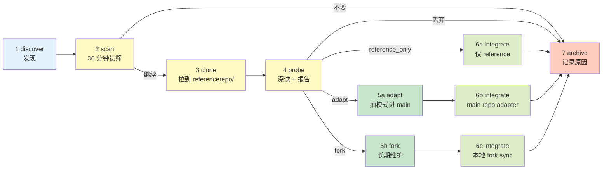

# ScoutFlow 开源肩膀生命周期手册 — 7 阶段从发现到退役

> **本文档定位**：补 v1/v2/v3 + Codex/GPT Pro 共同盲点。
>
> **盲点描述**：以上方案都把"开源肩膀"当成 shoulders-index.md 一行 entry 处理。但实际工程动作远不止 scan：要 clone、probe、决定是不是 fork、要不要 adapt 进 main repo、何时 deprecated。这是一个**生命周期**，不是一个**状态**。

---

## 0. 用户洞察：scan ≠ 完整生命周期

```
普通认知（错）:
  发现 repo → 加进 shoulders-index → 完事

实际工程（对，v1.1 errata 收口为 7 阶段 + stage 5 alternatives）:
  阶段 1 discover     发现 repo (URL + 简短目的)
    → 阶段 2 scan      30 min 初筛, decision = continue / drop
    → 阶段 3 clone     拉到 referencerepo/<category>/<id>/ (local-only, 不进 git)
    → 阶段 4 probe     深读 1-3h, 写 probe report
    → 阶段 5 decide/apply  4 选 1 alternative:
                        - adapt           (抽模式进 ScoutFlow main)
                        - fork            (本地 fork + 月度 sync)
                        - reference_only  (仅留作 agent 读物)
                        - drop            (放弃)
    → 阶段 6 integrate (CI / 测试 / 文档 / shoulders-index 更新)
    → 阶段 7 archive   (从 active list 移到 deprecated)

注: v1.1 errata P1-2 — adapt/fork/reference_only/drop 是 stage 5 的并列分支,
    不是独立阶段。所以是 "7 阶段" 不是 "8 阶段"。
```

每个阶段失败方式不同, 验收不同, 适合的 agent 不同。**不区分阶段就会出现"clone 了但没读"、"probe 了但没决策"、"fork 了但漂移到 upstream 旧版"等典型病**。

---

## 1. 7 阶段生命周期定义



### 1.1 阶段速查表（v1.1: 7 阶段 + stage 5 alternatives）

| 阶段 | 名称 | 时长 | 输出物 | shoulders-index status | 责任 agent |
|---|---|---|---|---|---|
| 1 | discover | 5 min | URL 写进 candidate pool | (默认未入 index; 例外见 §10.2) | user / Hermes / OpenClaw |
| 2 | scan | 30 min/repo | 通过/不通过 verdict | scanning | Codex / Opus 二选一 |
| 3 | clone | 10 min | referencerepo/<id>/ 创建（**local-only, 不进 git**） | scanning | Codex (机械动作) |
| 4 | probe | 1-3 h/repo | docs/research/shoulders/<id>-probe-report.md（tracked） | scanning → integrating | Opus (深度) 或 GPT Pro (外审) |
| 5 | decide/apply | 视分支而定 | mode 字段填 adapt/fork/reference_only/drop + 对应 artifact | integrating | 视分支 |
|  └─ 5/adapt | adapt | 3-8 h | services/<x>/<id>_adapter.py + tests | integrating | Codex (写代码) |
|  └─ 5/fork | fork | 1-2 h 初始 + 持续 | referencerepo/<id> 切 fork branch（local-only） | integrating | Codex (机械) |
|  └─ 5/ref_only | reference_only | 5 min | shoulders-index mode 字段 | integrating | user (确认) |
|  └─ 5/drop | drop | 5 min | shoulders-archive entry | deprecated | user |
| 6 | integrate | 30 min - 2 h | CI / 测试 / 文档 / shoulders-index status=integrated | integrated | Codex + audit |
| 7 | archive | 30 min | 移到 shoulders-archive 部分 + 写 sunset reason | deprecated | user |

> v1.1 errata P0-2: 阶段 3 clone 与阶段 5/fork 都明确 referencerepo/ 是 **local-only**, 不进 git。tracked summary mirror 走 docs/research/shoulders/referencerepo-index-YYYY-MM-DD.md 与 docs/shoulders-index.md（见 §3 + §10）。

---

## 2. 每阶段详细规范

### 2.1 阶段 1: discover (发现)

```yaml
触发:
  - 用户在 chat 中提到一个 repo
  - WebSearch / GitHub topic / awesome list 命中
  - 兄弟项目 (ContentFlow) 文档引用
  - 跨 agent 协作中 Codex/Opus/GPT Pro 提议

输入:
  - URL 或 repo name
  - 简短目的描述

输出:
  - candidate pool entry (临时, 在 dispatch markdown 或 chat 内)
  - 默认不写 shoulders-index — v1.1 errata P1-10 例外: 用户批准的 Wave batch candidates 可入, status=discovered

验收 (v1.1 修订, P1-9):
  - URL 可访问
  - 至少 README 或 LICENSE 之一
  - 不是 "no README + no LICENSE + no running code" 三无 repo
  - 维护活跃度从硬门槛改为评分项 (近 6 月+1, 6-18 月 neutral, >18 月需额外理由)

不做:
  - 不 clone (太早)
  - 不写 shoulders-index (默认; 例外见 P1-10)
  - 不因为 12 个月没 commit 直接 drop 小 repo (用户希望吸收小而锋利)

适合 agent:
  - 任何 (这是低成本动作)

预期时长: 5 min/候选
```

### 2.2 阶段 2: scan (30 分钟初筛)

```yaml
触发:
  - 阶段 1 发现的 candidate
  - 或: shoulders-index 内 status=scanning 的 entry

输入:
  - repo URL
  - ScoutFlow 模块目标 (例如 "XHS adapter" / "trust trace UI" / "PR factory tooling")

执行步骤 (单 agent, 30 min):
  1. 读 README (5 min)
  2. 读 LICENSE (1 min) — 确认是否商业兼容/Copyleft 风险
  3. 看 GitHub stars + last commit + open issues 数 (2 min)
  4. 看 release 频率 (3 min)
  5. 抽 1-2 个核心源码文件读 (15 min)
  6. 写 verdict (4 min, 5 字段):
     - decision: continue / clone_to_reference / drop
     - integration_mode_proposal: reference_only / subprocess / python_import / npm_import / ...
     - confidence: 0.0-1.0
     - blockers: [...] (如 license / 太旧 / 维护停滞)
     - next_action: clone / probe / drop

输出:
  - shoulders-index.md 添加/更新 entry, status=scanning
  - verdict 写在 docs/research/shoulders/<id>-scan-verdict.md (单文件, < 50 行)

验收:
  - verdict 5 字段齐全
  - LICENSE 显式记录
  - 不是 hallucination (实际看了 README + 源码至少 1 个文件)

不做:
  - 不 clone (除非 verdict=clone_to_reference)
  - 不写长 probe report
  - 不 fork

适合 agent:
  - Codex (快, 机械式) 或 Opus (深, 适合复杂 license/架构)
  - 不要 Hermes (Hermes 不写代码, scan 需要看源码)

预期时长: 30 min/repo
```

### 2.3 阶段 3: clone (拉到本地)

```yaml
触发:
  - 阶段 2 verdict 是 clone_to_reference
  - 用户 dispatch 显式批准 (因为要写 referencerepo/)

输入:
  - repo URL
  - shoulder_id (短代号, ≤15 char)
  - 子目录类别 (按 §3.1 目录规范)

执行步骤:
  1. cd ~/workspace/ScoutFlow/referencerepo/<category>/
  2. git clone --depth 1 <url> <shoulder_id>
  3. 写 referencerepo/<category>/<shoulder_id>/_SCOUTFLOW_META.local.md (5 字段, local-only):
     - shoulder_id
     - upstream_url
     - cloned_at: 2026-05-04
     - cloned_at_commit: <sha>
     - cloned_at_release: <tag or "main HEAD">
  4. 不修改 clone 内容 (只读)

输出:
  - referencerepo/<category>/<shoulder_id>/ 创建 (local-only)
  - _SCOUTFLOW_META.local.md 元数据 (local-only)
  - shoulders-index.md status 仍是 scanning

验收:
  - clone 成功 (.git 完整)
  - _SCOUTFLOW_META.local.md 5 字段齐全
  - 不污染 main repo (referencerepo/ 在 .gitignore 内)

不做:
  - 不 git clone --depth full (只 --depth 1, 节省体积; fork 阶段才 full)
  - 不修改 clone 内容
  - 不直接 import 进 ScoutFlow main

适合 agent:
  - Codex (纯机械)
  - 不需要 Opus (浪费推理预算)

预期时长: 10 min/repo
```

### 2.4 阶段 4: probe (深读 + 报告)

```yaml
触发:
  - 阶段 3 完成 (clone 落地)
  - 用户 dispatch 批准 (probe 占用 1-3h, 要预算)

输入:
  - referencerepo/<category>/<shoulder_id>/
  - ScoutFlow 模块目标

执行步骤 (1-3 h):
  1. 读 README full + ARCHITECTURE.md (如有) (15 min)
  2. 读 LICENSE 完整条款, 看是否 GPL/AGPL/Copyleft 风险 (10 min)
  3. 读 package manifest (package.json / pyproject.toml / Cargo.toml) (10 min)
  4. 跑 demo / quickstart 一次 (如适用) (15 min)
  5. 抽 3-5 个核心模块/类源码深读 (45-60 min)
  6. 看 issues / PRs 热点 (15-30 min)
  7. 写 probe report (15-30 min)

输出:
  docs/research/shoulders/<shoulder_id>-probe-report.md (200-400 行):
    1. 项目本质 (1 段)
    2. 架构机制 (含 ASCII 流程图)
    3. 核心 API / 接口形态
    4. 输出契约 (我们能拿到什么 JSON / file)
    5. 失败模式 (cookie/auth/version drift/rate limit)
    6. 与 ScoutFlow 集成方式: reference_only / subprocess / python_import / npm_import / fork
    7. 风险 (license, maintenance, security)
    8. 决策 verdict: adapt / reference / fork / drop
    9. 如果 adapt/fork: 后续 PR 切片建议
    10. shoulders-index 字段更新建议

验收:
  - report 含 10 节
  - 含至少 1 个源码引用 (file:line)
  - verdict 明确 (不能 "to be decided")
  - 风险至少 1 条 (没有完美 repo)

不做:
  - 不 import 进 main repo (probe 是 read-only)
  - 不 fork 远端 (本地 clone 即可)
  - 不写 ScoutFlow adapter (那是 5a)

适合 agent:
  - Opus (深度 + 长 narrative)
  - 或 GPT Pro (外审角度)
  - Codex 不适合 (probe 需要架构判断, Codex 偏机械)

预期时长: 1-3 h/repo
```

### 2.5 阶段 5a: adapt (抽模式进 main)

```yaml
触发:
  - 阶段 4 verdict 是 adapt
  - 用户 dispatch 批准 (要写 main repo 代码)

输入:
  - probe report 中的"集成方式 + 后续 PR 切片建议"

执行步骤:
  1. 抽出 1-2 个核心模式 (例如 Hermes Bridge 的 port 27124 模式)
  2. 在 ScoutFlow main repo 写 thin adapter (按 PRD/SRD 现有约定)
  3. 不直接 import 第三方代码 — 学模式, 写自己的实现
  4. 加 contract test (输出契约 fix)
  5. 加 fixture (sanitized output)

输出:
  - services/api/scoutflow_api/<module>/ 新增 adapter
  - tests/contracts/test_<module>_adapter.py
  - tests/fixtures/<module>/<sanitized>.json
  - shoulders-index.md status=integrating

验收:
  - main repo build 通过
  - contract test 跑通
  - 没有第三方 vendored code (学模式, 不复制代码)
  - 没有引入新 dependency (除非 PRD/SRD 批准)

不做:
  - 不直接复制源码 (license 风险)
  - 不引入大型框架 dependency
  - 不写 prematurely 通用 adapter (只解决当前模块需求)

适合 agent:
  - Codex (写代码主力)
  - 配合 audit lane (Opus / GPT Pro 外审)

预期时长: 3-8 h/模式
```

### 2.6 阶段 5b: fork (长期维护本地 fork)

```yaml
触发:
  - 阶段 4 verdict 是 fork
  - 适用场景:
    - 关键 hot path (例如 RedNote-MCP winner)
    - upstream 不接受 ScoutFlow patches
    - 需要 patch 定制化但保留 upstream sync 能力

输入:
  - referencerepo/<category>/<shoulder_id>/ (已 clone)

执行步骤:
  1. cd referencerepo/<category>/<shoulder_id>/
  2. git remote rename origin upstream
  3. git remote add origin <用户 fork URL on GitHub>
  4. git fetch upstream
  5. git checkout -b scoutflow-fork upstream/main
  6. git push -u origin scoutflow-fork
  7. 写 _SCOUTFLOW_FORK.local.md (如何 sync upstream + 我们的 patch list, local-only)
  8. 加进月度 漂移监控 cron (§6)

输出:
  - referencerepo/<category>/<shoulder_id>/ 切到 scoutflow-fork branch (local-only)
  - _SCOUTFLOW_FORK.local.md 元数据 (local-only)
  - GitHub 个人账号下 fork repo
  - shoulders-index.md status=integrating, mode=fork

验收:
  - 本地 git 切到 scoutflow-fork
  - 远端 fork repo 可访问
  - 月度 sync cron 已加 (§6)

不做:
  - 不 fork low-stakes shoulder (reference_only 更轻)
  - 不 fork 频繁更新的 repo (维护成本高)

适合 agent:
  - Codex (机械)
  - user 必须显式批准 (fork 是长期承诺)

预期时长: 1-2 h 初始 + 后续每月 30 min 维护
```

### 2.7 阶段 6: integrate (集成到工作流)

```yaml
6a integrate (reference_only):
  - shoulders-index.md status 改 integrated
  - 不需要 CI 改动
  - 后续仅作为 ScoutFlow agent 的"读物"
  时长: 30 min

6b integrate (adapt):
  - adapter PR merged
  - CI 跑过 contract test
  - decision-log 写一条 D-XXX
  时长: 1-2 h

6c integrate (fork):
  - 月度 sync cron 加 .github/workflows/sync-shoulders.yml
  - 漂移测试 CI 跑过
  - shoulders-index.md upstream_synced_at 字段更新
  时长: 1 h
```

### 2.8 阶段 7: archive (退役)

```yaml
触发:
  - 6 个月没动 + 没成为 hot path
  - 或: upstream abandoned > 12 个月
  - 或: 找到更好替代
  - 或: license 问题升级

执行步骤:
  1. shoulders-index.md status 改 deprecated
  2. 写 sunset_reason 字段
  3. 移到 shoulders-archive.md (或 shoulders-index.md 末尾的 archived 段)
  4. 如果有 fork: git remote 标记 archived
  5. referencerepo/ 不立即删 (保留 1 年作为历史参考)
  6. 写 decision-log 一条 D-XXX

输出:
  - shoulders-index.md status=deprecated + sunset_reason
  - decision-log entry

适合 agent:
  - user (决策)
  - Codex (机械执行)
```

---

## 3. referencerepo/ 目录组织规范

> **v1.1.1 命名约束（必读）**：
> 本节示例中所有 `_INDEX.local.md` / `_SHOULDERS_INDEX_RULES.local.md` / `_SCOUTFLOW_META.local.md` / `_SCOUTFLOW_FORK.local.md`
> 一律 **local-only**, 含 `.local.md` 后缀, 永远不进 git tracked diff。
> Tracked mirror 只走 `docs/research/shoulders/**` 与 `docs/shoulders-index.md`（受 `LOCAL_ONLY_ROOTS = ("data/", "referencerepo/")` 约束）。
> `.local.md` 后缀是工程提醒，不是 redline 脚本必需；redline 脚本只看路径前缀 `referencerepo/`。

### 3.1 目录结构 (按 hint 类别, 全部 local-only)

```text
~/workspace/ScoutFlow/referencerepo/
├── _INDEX.local.md                   (元 index, 列所有 shoulder + 状态; local-only)
├── _SHOULDERS_INDEX_RULES.local.md   (本文档的简版引用; local-only)
├── capture/                          (capture 类肩膀)
│   ├── BBDOWN-FORK/                  (如果 fork; 否则只是 clone)
│   ├── REDNOTE-MCP-WINNER/
│   ├── BILI-API-NEMO2011/            (reference_only, 不 fork)
│   └── YT-DLP/                       (reference_only)
├── frontend/
│   ├── OPENWHISPR/                   (reference_only)
│   ├── KIRANISM-NEXT-SHADCN-STARTER/ (clone, 一次性, 抽组件)
│   └── HERMES-KANBAN-BRIDGE/         (reference_only, port 27124 模式参考)
├── visual/
│   ├── OPEN-DESIGN/                  (repo_external_prototype)
│   ├── AXTON-VISUAL-SKILLS/          (reference_only)
│   └── EXCALIDRAW-OBSIDIAN/          (reference_only)
├── orchestration/
│   ├── BERNSTEIN/                    (reference_only, 思想参考)
│   └── PAPERCLIP/                    (reference_only)
├── obsidian/
│   ├── KEPANO-OBSIDIAN-SKILLS/       (reference_only)
│   ├── ARGAV-OBSIDIAN-WIKI/          (reference_only)
│   ├── NATELANDAU-OBSIDIAN-METADATA/ (可能 python_import)
│   └── BLACKSMITHGU-DATAVIEW/        (reference_only)
├── media/                            (Phase 6 Wave 6)
│   ├── WHISPLY/                      (subprocess, 可能 fork)
│   ├── STABLE-TS/                    (python_import)
│   ├── FFMPEG/                       (subprocess, 不 clone — 系统包)
│   └── SUBSAI/                       (reference_only)
├── normalization/                    (Phase 7 Wave 7)
│   ├── PYDANTIC-INSTRUCTOR/          (python_import)
│   └── DOTTXT-OUTLINES/              (python_import)
├── rag/                              (Phase 7 Wave 7)
│   ├── SQLITEAI-VECTOR/              (python_import)
│   └── LANCEDB/                      (python_import)
├── content/                          (Phase 7 Wave 7)
│   ├── TIPTAP/                       (npm_import)
│   └── MONACO/                       (npm_import)
└── _archived/                        (退役肩膀, 保留 1 年)
    └── <shoulder_id>/
```

### 3.2 _INDEX.local.md 元 index 格式 (local-only)

```markdown
# Reference Repos Index

## 当前 Active

| shoulder_id | category | upstream | clone_date | clone_commit | mode | status |
|---|---|---|---|---|---|---|
| BBDOWN-FORK | capture | nilaoda/BBDown | 2026-04-... | abc123 | subprocess | locked |
| HERMES-BRIDGE | frontend | gumby/hermes-kanban | 2026-05-05 | def456 | reference_only | scanning |
| ... | ... | ... | ... | ... | ... | ... |

## Archived

| shoulder_id | archived_date | reason |
|---|---|---|
```

### 3.3 size budget (防止 referencerepo 膨胀)

```
约束:
  - 单 shoulder clone < 100 MB (--depth 1)
  - referencerepo/ 总体积 < 5 GB
  - 超出时优先 archive 久未动的 shoulder
  - .git 不进 ScoutFlow main commit (referencerepo/ 在 .gitignore)

监控:
  月度 cron 跑:
    du -sh referencerepo/*/* | sort -h
  > 100 MB 单 repo: 警报
  > 5 GB 总: 强制 archive 评审
```

### 3.4 _SCOUTFLOW_META.local.md 模板 (local-only)

```markdown
---
shoulder_id: HERMES-BRIDGE
upstream_url: https://github.com/gumbyender/hermes-kanban
upstream_license: MIT
cloned_at: 2026-05-05T10:00:00Z
cloned_at_commit: abc123def456
cloned_at_release: v0.1.2 / main HEAD
clone_depth: 1
last_synced_at: 2026-05-05T10:00:00Z
sync_cadence: monthly | on-demand | never
---

# HERMES-BRIDGE Reference Clone

## 我们关心的核心模式
- port 27124 单文件 HTTP server
- file-as-source-of-truth REST API

## 我们 NOT 关心的部分
- Kanban 业务逻辑

## 漂移监控
- 月度 fetch upstream
- 比对 我们关心的 5 个文件 (server.ts / routes.ts / ...) hash
- 漂移触发 → 重新 probe report
```

---

## 4. 本地 fork 工作流（不只是 git clone）

### 4.1 误区

```text
错: git clone <url> 完事
对: clone + meta + probe + 决策 + (如 fork: 设 origin/upstream remote + sync cron)
```

### 4.2 完整 fork 命令序列

```bash
#!/bin/bash
# scripts/fork-shoulder.sh
# 用法: ./fork-shoulder.sh <shoulder_id> <category> <upstream_url> <github_user>

SHOULDER_ID=$1
CATEGORY=$2
UPSTREAM_URL=$3
GITHUB_USER=$4

cd referencerepo/$CATEGORY/

# 1. clone
git clone --depth 1 $UPSTREAM_URL $SHOULDER_ID
cd $SHOULDER_ID

# 2. 重命名 remote
git remote rename origin upstream

# 3. 在 GitHub 个人账号 fork (gh CLI)
gh repo fork $UPSTREAM_URL --clone=false

# 4. 加 origin = 我们的 fork
git remote add origin git@github.com:$GITHUB_USER/${UPSTREAM_URL##*/}.git

# 5. 创建 scoutflow-fork branch
git fetch upstream
git checkout -b scoutflow-fork upstream/main
git push -u origin scoutflow-fork

# 6. 写元数据 (local-only, 不进 git)
cat > _SCOUTFLOW_META.local.md <<EOF
---
shoulder_id: $SHOULDER_ID
upstream_url: $UPSTREAM_URL
fork_url: git@github.com:$GITHUB_USER/${UPSTREAM_URL##*/}.git
forked_at: $(date -u +%FT%TZ)
sync_cadence: monthly
---
EOF

# 7. 写 fork patch list 模板 (local-only, 不进 git)
cat > _SCOUTFLOW_FORK.local.md <<EOF
# $SHOULDER_ID Fork Patch List

## ScoutFlow 自有 patch
(列每个 commit hash + 一行说明)

## Upstream sync 历史
- $(date -u +%FT%TZ): cloned at $(git rev-parse HEAD)

## 已知 conflict points
(upstream 改了哪些文件可能冲突)
EOF

echo "Fork setup complete: $SHOULDER_ID"
```

### 4.3 月度 sync 工作流

```bash
#!/bin/bash
# scripts/sync-shoulder.sh
SHOULDER_PATH=$1

cd $SHOULDER_PATH
git fetch upstream
git checkout scoutflow-fork

# 跑 patch list 检查
PATCHES=$(git log origin/scoutflow-fork ^upstream/main --oneline)

# 看 upstream 是否动了我们关心的文件
WATCH_FILES=$(grep -A 20 "我们关心" _SCOUTFLOW_META.local.md | grep "^- " | sed 's/^- //')
DIFF_FILES=$(git diff origin/scoutflow-fork upstream/main --name-only)

CONFLICT_RISK="low"
for f in $WATCH_FILES; do
    if echo "$DIFF_FILES" | grep -q "$f"; then
        CONFLICT_RISK="high"
        echo "⚠️ Watched file drifted: $f"
    fi
done

# 输出报告
echo "Sync report for $(basename $SHOULDER_PATH):"
echo "  Local patches: $(echo "$PATCHES" | wc -l)"
echo "  Upstream new commits: $(git log scoutflow-fork..upstream/main --oneline | wc -l)"
echo "  Conflict risk: $CONFLICT_RISK"
```

---

## 5. 吸收 vs 引用 vs 复制 决策矩阵

```
肩膀价值大小 ↔ 集成深度选择

         │ 价值小       价值中       价值大
─────────┼─────────────────────────────
低风险   │ reference   adapt        adapt
中风险   │ reference   reference    fork
高风险   │ drop        reference    reference (NOT fork)

风险维度:
  - License (GPL/AGPL Copyleft = 高)
  - Maintenance (停滞 6 月 = 高)
  - Cookie/auth surface (反爬军备竞赛 = 高)
  - Binary 体积 (大 model file = 高)

价值维度:
  - 是否 hot path (BBDown / Whisper = 高)
  - 替代成本 (重写从零需 50 PR = 高)
  - upstream stability (稳定 release > 1 年 = 中)
  - 跨项目复用 (ScoutFlow + ContentFlow + DiloFlow 都能用 = 高)
```

### 5.1 具体例子

| shoulder | license | maint | hot path | 替代成本 | 决策 |
|---|---|---|---|---|---|
| BBDOWN | MIT | active | hot | 50 PR | adapt (subprocess + redaction) |
| Whisper | MIT | active | hot | 100 PR | adapt (subprocess) |
| Hermes Bridge | MIT | active | medium | 1 PR | reference (抄 port 模式) |
| Bernstein | Apache 2.0 / MIT (sources conflict) | active | low | 5 PR | reference (思想) |
| OpenDesign | Apache 2.0 | active | medium | 10 PR | reference (repo 外 prototype) |
| Nemo2011 bilibili-api | GPL v3 | active | low (BBDown 已 hot) | 0 (comparator) | reference_only (NOT fork — license + 已 BBDown) |
| sqlite-vec | MIT | active | future hot | 5 PR | future python_import |
| RedNote-MCP-winner | TBD | TBD | medium (XHS) | 10 PR | fork (winner from Wave 3A scan) |

---

## 6. 漂移监控

### 6.1 触发频率

```
fork 类: 月度 cron
adapt 类: 季度 (因为我们写自己的实现, 不依赖 upstream API 直接)
reference_only 类: 半年 (低优先级)
```

### 6.2 cron 文件 (.github/workflows/shoulders-drift-check.yml)

```yaml
name: Shoulders Drift Check
on:
  schedule:
    - cron: '0 0 1 * *'  # 每月 1 号
  workflow_dispatch:

jobs:
  drift-check:
    runs-on: ubuntu-latest
    steps:
      - uses: actions/checkout@v4
      - run: |
          # 不能 clone referencerepo 进 CI (太大)
          # CI 只看 shoulders-index.md, 比对上次 last_synced_at
          # 超过阈值 (fork: 30d, reference: 180d) → 创建 issue
          python tools/check-shoulders-drift.py
```

### 6.3 漂移触发的动作

```text
fork 漂移 → 自动创 GitHub issue: "shoulder X 月度 sync"
adapt 漂移 → 提示重跑 contract test
reference 漂移 → 仅记录, 不 break build
```

### 6.4 fixture 比对（防输出漂移）

```text
对每个 subprocess shoulder (BBDown / Whisper / ffmpeg):
  - 维护 tests/fixtures/<shoulder>/<sanitized-input>.json (输入)
  - 维护 tests/fixtures/<shoulder>/<sanitized-output>.json (期望输出)

CI 跑:
  - 真实 subprocess 执行 (有真 binary 时)
  - 输出与 fixture 比对 (allow 漂移列表)
  - 不在白名单的字段漂移 → break build

漂移可接受列表 (例如 BBDown):
  - thumbnail URL (会变)
  - cookie 字段 (NOT 入库)
  - server timestamp (会变)

漂移不可接受 (例如 BBDown):
  - 字段 schema 变化 (新字段 / 字段消失)
  - state machine 路径变化
  - PlatformResult enum 值变化
```

---

## 7. 退役流程

### 7.1 退役 trigger

```
trigger 1: 6 个月没动 (last_used_at 字段)
trigger 2: upstream abandoned > 12 个月
trigger 3: 找到更好替代 (例如 sqlite-vec 替代 sqlite-vector)
trigger 4: license 问题升级 (例如 GPL→AGPL)
trigger 5: 安全漏洞未修
```

### 7.2 退役步骤

```bash
#!/bin/bash
# scripts/archive-shoulder.sh
SHOULDER_ID=$1
REASON=$2

# 1. shoulders-index.md status 改 deprecated
sed -i "s/| $SHOULDER_ID |.*| .* |/| $SHOULDER_ID | ... | deprecated |/" docs/shoulders-index.md

# 2. 移到 shoulders-archive.md
cat >> docs/shoulders-archive.md <<EOF
## $SHOULDER_ID
- archived_at: $(date -u +%FT%TZ)
- reason: $REASON
- last_status: <copy 自 shoulders-index.md>
EOF

# 3. referencerepo/<id> 移到 _archived/
mv referencerepo/<category>/$SHOULDER_ID referencerepo/_archived/$SHOULDER_ID

# 4. decision-log 写 D-XXX
echo "## D-XXX archive $SHOULDER_ID" >> docs/decision-log.md

# 5. 1 年后 cron 清理 _archived/<id>
```

---

## 8. 跨 agent 协作映射

### 8.1 哪个阶段适合哪个 agent

| 阶段 | 推荐 agent | 不推荐 agent | 原因 |
|---|---|---|---|
| 1 discover | 任何 + user | — | 低成本动作 |
| 2 scan | Codex 或 Opus | Hermes (不写代码) | 30 min 看源码 + verdict |
| 3 clone | Codex (机械) | Opus (浪费推理) | 纯 git clone + meta 文件 |
| 4 probe | Opus (深度叙事) 或 GPT Pro (外审) | Codex (偏机械) | 1-3h 深读 + 架构判断 |
| 5a adapt | Codex (写代码主力) | Opus (写代码效率较低) | 写 thin adapter + tests |
| 5b fork | Codex (机械) | — | 命令序列执行 |
| 6 integrate | Codex + audit lane | — | CI / 测试 / 文档 |
| 7 archive | user (决策) + Codex (执行) | — | 决策 + 机械动作 |

### 8.2 lane 占用

```
1 discover      → 不占 lane (临时)
2 scan          → research lane (1 个/repo)
3 clone         → product lane (1 个 PR 可批量 clone 多个 shoulders)
4 probe         → research lane (1 个/repo, 1-3h)
5a adapt        → product lane (1 个/模式)
5b fork         → product lane (1 个/repo)
6 integrate     → product lane (与 5a/5b 合并)
7 archive       → 不占 lane (轻量动作)
```

### 8.3 跨 agent handoff 格式

```yaml
# 阶段切换时, 上一阶段 agent 给下一阶段 agent 的接力 header

handoff:
  from_stage: scan
  to_stage: clone
  from_agent: codex
  to_agent: codex
  shoulder_id: HERMES-BRIDGE
  attachments:
    - docs/research/shoulders/HERMES-BRIDGE-scan-verdict.md
  next_dispatch_id: T-P1A-XXX
  next_action: |
    cd referencerepo/frontend/
    git clone --depth 1 https://github.com/gumby/hermes-kanban HERMES-BRIDGE
    写 _SCOUTFLOW_META.local.md (local-only)
    update shoulders-index.md status=scanning + cloned_at
```

---

## 9. 案例：4 个肩膀的实际生命周期

### 9.1 BBDOWN — 已 integrated (locked)

```
1 discover: 早于 PR1 (用户已知)
2 scan: PR < 30 (T-P1A-003 BBDown tool surface research)
3 clone: 已 clone 到 referencerepo/capture/BBDown 早期
4 probe: PR T-P1A-009 (local runtime spike) + T-P1A-011 (no-auth probe)
5a adapt: T-P1A-010A (preflight) + T-P1A-010B (info adapter shell)
6 integrate: PR43+49 (T-P1A-020 trust trace 集成)
7 archive: NOT YET (locked, hot path)

shoulders-index entry:
  id: BBDOWN
  status: locked
  mode: subprocess
  owner_lane: capture
  next_action: 持续 fixture 维护 + parser drift 监控
```

### 9.2 OPEN-DESIGN — 还在 probe 阶段

```
1 discover: v1 报告
2 scan: v3 + Codex/GPT Pro 报告
3 clone: 已 clone 到 referencerepo/visual/open-design (v1 期间)
4 probe: docs/research/2026-05-04-opendesign-reference-repo-deep-research.md (Claude)
       + docs/research/opus-v3-acceptance-... (Codex)
       + GPT Pro 报告
5: Wave 3A PR60 — repo_external_prototype (NOT adapt, NOT fork)
6 integrate: NOT YET (Wave 3B 才会 integrate as repo_external_prototype)
7 archive: NOT YET

shoulders-index entry:
  id: OPEN-DESIGN
  status: scanning → integrating (Wave 3A 完成后)
  mode: repo_external_prototype
  owner_lane: visual
  next_action: Wave 3A PR60 OpenDesign H5 visual probe
```

### 9.3 HERMES-BRIDGE — 待 scan

```
1 discover: v3 报告
2 scan: 待做 (Wave 3A PR59 的一部分? 或独立)
3 clone: NOT YET
4 probe: NOT YET
5: 预期 reference_only (抄 port 27124 模式)
6 integrate: 写 ADR / Bridge route group spec 引用
7 archive: 看后续

shoulders-index entry:
  id: HERMES-BRIDGE
  status: discovered
  mode: reference_only (proposed)
  owner_lane: factory
  next_action: Wave 3A 期间 scan
```

### 9.4 BERNSTEIN — reference_only 已稳定

```
1 discover: v3 报告
2 scan: v3 (PyPI 1.5.17 active 2026-04-14, Apache-2.0/MIT sources conflict)
3 clone: 计划 Wave 3A 期间 clone 到 referencerepo/orchestration/
4 probe: PR Factory 工作流参考 (HMAC-chained audit log / worktree pool / janitor verify)
5: reference_only (不 adapt, 不 fork)
6 integrate: PR Factory tooling V1 (Wave 3A PR65) 引用 Bernstein 模式
7 archive: 看 6 个月内是否实际启发 ScoutFlow factory

shoulders-index entry:
  id: BERNSTEIN
  status: scanning → integrating (Wave 3A 完成后)
  mode: reference_only
  owner_lane: factory
  next_action: Wave 3A PR65 PR Factory tooling V1 引用其架构
```

---

## 10. 与 shoulders-index.md 的关系

```
shoulders-index.md = 当前状态快照 (status / mode / owner_lane / next_action)
本文档 (doc2) = 完整生命周期工作流 (7 阶段每阶段做什么)

关系:
  - shoulders-index.md 是 view (快照)
  - 本文档是 system of record (规范)

每次更新 shoulders-index.md 必须能映射到本文档的某个阶段:
  status=scanning → 阶段 2 或 3
  status=integrating → 阶段 4-5
  status=integrated → 阶段 6
  status=deprecated → 阶段 7

工程纪律:
  shoulders-index 改 status 必须有对应阶段动作 (probe report / adapter PR / archive doc)
```

### 10.0 Transition rule (v1.1 errata P1-10)

shoulders-index.md 顶部应写明:

```markdown
> 默认: 仅 stage 2+ 的 shoulder 入 index (status ∈ {scanning, integrating, integrated, deprecated}).
> 例外: 用户显式批准的 Wave batch candidate 可在 stage 1 (discover) 直接入, status=discovered,
>       前提是它属于已承诺的 scan backlog (例如 Wave 3A PR55 一次性建 19 entries).
> 状态机: discovered → scanning → integrating → integrated → deprecated
```

### 10.1 字段对照

```
shoulders-index.md 列          ↔ 本文档阶段
───────────────────────────────────────────
id                              所有阶段
module                          阶段 4 probe 决定
upstream                        阶段 1 discover
mode                            阶段 4 probe verdict
output_contract                 阶段 4 probe report §4
failure_modes                   阶段 4 probe report §5
kill_switch                     阶段 5a/5b/6
owner_lane                      阶段 4 probe verdict
status                          阶段 1-7 状态机
next_action                     当前阶段下一步
```

---

## 11. 一句话总结

> 开源肩膀不是一个 entry, 是一个 7 阶段生命周期。**discover → scan (30 min) → clone (10 min) → probe (1-3 h) → 决策 (adapt / fork / reference_only / drop) → integrate → archive**. 每阶段输入/输出/agent/时长明确, referencerepo/ 按 category 组织, fork 走 origin/upstream remote + 月度 cron, 漂移用 fixture 比对, 退役保留 1 年作历史. shoulders-index.md 是状态快照, 本文档是 system of record.

---

## 附录 A：实施清单（对应 doc3 PR 段）

```
Wave 3A:
[ ] PR55: 建 shoulders-index.md (10 列 schema)
[ ] PR59: 写 PR Factory tooling V1 (含 fork-shoulder.sh / sync-shoulder.sh / archive-shoulder.sh)
[ ] PR61-64: 4 个 Shoulder Scan reports (XHS / Bili comparator / Console / Obsidian frontmatter)

Wave 3B:
[ ] PR67: Shoulders Clone Plan + docs/research/shoulders/referencerepo-index-2026-05-05.md (tracked mirror; referencerepo/_INDEX.local.md 仅 local-only)
[ ] PR68: Probe Reports for 6-8 shoulders
[ ] PR73: Adapt 决策表 (按 §5 矩阵)

Wave 4+:
[ ] CI: shoulders-drift-check.yml
[ ] tests/fixtures/<shoulder>/ 落地
[ ] decision-log D-XXX 每个 integrate/archive 一条
```

## 附录 B：术语表

| 术语 | 定义 |
|---|---|
| Shoulder | 任何被 ScoutFlow 用作参考/集成/复用的开源 repo |
| Fork (本文档语义) | 在用户 GitHub 账号下创建 repo + 本地 git remote 设 origin/upstream |
| Adapt | 在 ScoutFlow main repo 写 thin adapter, 学模式不复制代码 |
| Reference_only | 仅 clone 到 referencerepo/ 作为 agent 读物, 不进 main |
| Repo_external_prototype | 在 ~/workspace/scoutflow-prototypes/ 跑 (例如 OpenDesign) |
| Drift | upstream 自上次 sync 以来变更, 可能影响 ScoutFlow |
| Fixture 比对 | tests/fixtures/<shoulder>/ 期望输出 vs 实际 subprocess 输出 |
| Hot path | ScoutFlow 主流程必经 (BBDown / Whisper / vault writer) |
