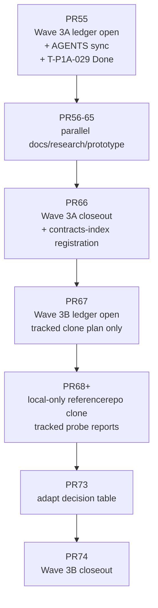
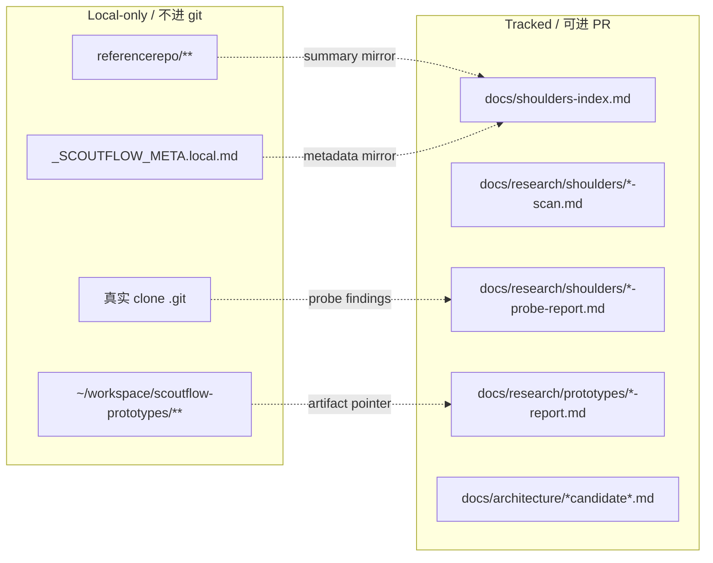

# ScoutFlow Doc1/Doc2/Doc3 接纳后的细节修订建议报告

> 日期：2026-05-04
> 输入文档：
> - doc1：`scoutflow-doc1-baseline-roadmap-after-pr54-20260504-220000.md`，723 行
> - doc2：`scoutflow-doc2-shoulders-lifecycle-handbook-20260504-220500.md`，972 行
> - doc3：`scoutflow-doc3-pr55-pr74-worklist-20260504-221000.md`，2055 行
> 基线：PR #54 merged 后的 ScoutFlow main
> 结论：**整体接纳，细节建议按本文 errata 修正后进入 dispatch。**
> 状态：review report / not authority / not runtime approval

---

## 0. 总裁决

```text
Verdict: ACCEPT WITH ERRATA
```

三个文档可以作为 Wave 3A / 3B 的主干接纳。
doc1 适合作为 **路线图方向锚**。
doc2 适合作为 **Shoulders lifecycle system of record**。
doc3 适合作为 **PR55-PR74 dispatch backbone**。

但有 10 个细节必须修，否则后续 dispatch 很容易在 docs-check、local-only、task ledger 或语义边界上踩坑。

---

## 1. 已核事实

### 1.1 PR54 状态

GitHub 已核：PR #54 `T-P1A-029 Post-S0/S1 authority + candidate wording fix` 已 merged，merge commit 为 `c133e0e514a18e0211133a914a46e17a64051472`。PR #54 范围是刷新 `current.md`、`AGENTS.md`、`task-index.md`、`decision-log.md`、`contracts-index.md` 与 SRD-v3 candidate wording，不含 runtime、migrations、tests、PRD/SRD base 修改。

### 1.2 当前仓库红线脚本约束

`tools/check-docs-redlines.py` 当前明确：

- `referencerepo/` 与 `data/` 属于 `LOCAL_ONLY_ROOTS`，不得被 git 跟踪。
- forbidden root dirs 包括 `apps`、`workers`、`packages`、`candidates`、`dispatches`、`audits`。
- REQUIRED_DOCS 包括 `AGENTS.md`、`docs/current.md`、`docs/task-index.md`、`docs/specs/contracts-index.md`、`docs/specs/parallel-execution-protocol.md`。
- 脚本会检查 AGENTS / current / task-index 的任务状态一致性。

这意味着 doc3 中所有计划“tracked referencerepo/_INDEX.md / _SCOUTFLOW_META.md”的地方都必须改成 local-only 或 docs/research 镜像记录。

---

## 2. P0 修订：不修会直接阻塞执行

### P0-1：PR55 / PR66 / PR67 / PR74 这类 authority ledger PR 必须允许改 `AGENTS.md`

**问题**

doc3 PR55 allowed paths 只有：

```text
docs/current.md
docs/task-index.md
docs/decision-log.md
docs/shoulders-index.md
```

但 PR55 目标会把 current 的主任务改成 `T-P1A-030`，Active count 改为 `1/3`。如果不同步 `AGENTS.md` 的当前活动任务，`check-docs-redlines.py` 的 task-state consistency 可能报错。

**建议**

所有 ledger open / close PR allowed paths 增加：

```text
AGENTS.md
```

影响 PR：

| PR | 原 allowed paths | 建议增加 |
|---|---|---|
| PR55 | current/task-index/decision-log/shoulders-index | `AGENTS.md` |
| PR66 | current/task-index/decision-log/shoulders-index | `AGENTS.md` |
| PR67 | current/task-index/decision-log/clone-plan/referencerepo-index | `AGENTS.md` |
| PR74 | current/task-index/decision-log/shoulders-index | `AGENTS.md` |

**建议 dispatch 文案**

```text
Allowed paths:
- AGENTS.md
- docs/current.md
- docs/task-index.md
- docs/decision-log.md
- docs/shoulders-index.md
```

---

### P0-2：`referencerepo/` 不能作为 tracked allowed path

**问题**

doc2 和 doc3 都有把以下文件写进 `referencerepo/` 的计划：

```text
referencerepo/_INDEX.md
referencerepo/<category>/<id>/_SCOUTFLOW_META.md
referencerepo/<category>/<id>/_SCOUTFLOW_FORK.md
```

但当前 redline 脚本把 `referencerepo/` 定义为 local-only，不得被 git 跟踪。
所以这些文件可以存在于本机，但不能进入 PR diff。

**建议**

把 shoulder 生命周期文档拆成两个层：

```text
Local-only:
  referencerepo/**                 # 真实 clone + local meta，不进 git

Tracked mirror:
  docs/research/shoulders/referencerepo-index-2026-05-xx.md
  docs/research/shoulders/<id>-probe-report.md
  docs/shoulders-index.md
```

**PR67 建议改法**

原：

```text
allowed_paths:
- referencerepo/_INDEX.md
```

改：

```text
tracked_allowed_paths:
- AGENTS.md
- docs/current.md
- docs/task-index.md
- docs/decision-log.md
- docs/research/shoulders/clone-plan-2026-05-05.md
- docs/research/shoulders/referencerepo-index-2026-05-05.md
- .gitignore

local_only_artifacts:
- referencerepo/_INDEX.local.md
- referencerepo/<category>/<id>/
- referencerepo/<category>/<id>/_SCOUTFLOW_META.local.md
```

**PR68 建议改法**

原：

```text
allowed_paths:
- referencerepo/
- referencerepo/<category>/<id>/
- referencerepo/<category>/<id>/_SCOUTFLOW_META.md
```

改：

```text
tracked_allowed_paths:
- docs/research/shoulders/<id>-probe-report.md
- docs/research/shoulders/referencerepo-index-2026-05-05.md
- docs/shoulders-index.md

local_only_artifacts:
- referencerepo/<category>/<id>/
- referencerepo/<category>/<id>/_SCOUTFLOW_META.local.md
```

**必须新增 validation**

```bash
git ls-files | grep -E '^referencerepo/' && exit 1 || true
```

---

### P0-3：`Bridge` 本地错误不应复用 `PlatformResult`

**问题**

doc3 PR58 / PR69 提议 Bridge route group 错误返回复用 `PlatformResult enum`。
但 `PlatformResult` 当前语义是平台边界结果，例如 BBDown/Bilibili 触达后的结果。Vault root 不存在、frontmatter 模板缺失、path escape、文件已存在，这些不是 platform boundary。

如果把 Bridge/Vault 错误塞进 PlatformResult，会污染当前已经很辛苦守住的 ToolPreflightResult / PlatformResult 分层。

**建议**

在 SRD candidate 中新增一个本地错误类型：

```python
BridgeErrorCode = Literal[
    "vault_root_not_configured",
    "vault_root_not_found",
    "vault_inbox_not_found",
    "vault_path_escape",
    "vault_file_exists",
    "frontmatter_invalid",
    "markdown_render_failed",
]
```

Bridge API response：

```json
{
  "ok": false,
  "error": {
    "code": "vault_root_not_found",
    "message": "...",
    "details": {}
  }
}
```

PlatformResult 只用于平台 probe / capture adapter。

---

### P0-4：PR55 应补记 `T-P1A-029 / PR54` 的 Done 或明确“closeout fix 不入 task-index”

**问题**

PR #54 标题是 `T-P1A-029`，但当前 task-index 的 Done 顶部是 `T-P1A-028` / `T-P1A-027` 等。PR54 自身在 task-index 里不明显。
这不是致命问题，但后续 PR55 以 PR54 为 baseline，会出现“PR54 是不是一个 task”的审计歧义。

**建议二选一**

**方案 A：补 Done row，推荐**

PR55 在 task-index Done 增加：

```markdown
| `T-P1A-029` | Post-S0/S1 authority + candidate wording fix | `2026-05-04` | PR #54; merge commit `c133e0e`; scope=`current/AGENTS/task-index/decision-log/contracts-index/SRD-v3 candidate wording`; no runtime / no migration |
```

**方案 B：在 decision-log 说明 PR54 是 closeout patch，不作为独立 active task 维护**

如果不想补 Done row，则 PR55 decision-log 必须解释。

我建议方案 A，审计链更干净。

---

### P0-5：PR57/58 candidate amendments 最好在 PR66 closeout 注册到 `contracts-index.md`

**问题**

doc3 让 PR57 创建 PRD v2.1 candidate，PR58 创建 SRD v3 H5/Bridge/PARA candidate，但 PR55/66 allowed paths 没有 `docs/specs/contracts-index.md`。
当前 `contracts-index.md` 的更新规则写着“任何新 contract 先入本文件，再进入任务实施”。

如果 PR57/58 不登记，后续 PRD/SRD candidate 会变成“散落的候选文件”，入口弱。

**建议**

不要让 PR57/58 直接改 contracts-index，避免并行冲突。
但 PR66 Wave 3A closeout 应允许并更新：

```text
docs/specs/contracts-index.md
```

登记：

```markdown
| docs/PRD-amendments/prd-v2.1-strong-visual-h5-para-pr-factory-candidate-2026-05-04.md | candidate amendment | not authority / not runtime approval |
| docs/SRD-amendments/h5-bridge-para-vault-srd-v3-candidate-2026-05-04.md | candidate amendment | not authority / not frontend approval |
```

---

## 3. P1 修订：建议改，不改也能跑但会增加返工

### P1-1：统一 lane 术语，避免 `3/0/0/0`、`3/8/3/3`、`5/8/3/3` 三套混用

doc1 里有 `3/8/3/3 当前`，doc3 里有 baseline `3/0/0/0`，同时又把 `5/8/3/3` 作为 candidate。容易让 dispatch writer 混淆。

**建议统一成三层**

| 名称 | 含义 |
|---|---|
| Enforced baseline | `product=3, authority=1`，来自 AGENTS/current |
| Tracked non-product pools | `research=8, prototype=3, audit=3`，只用于调度可视化，不是 authority lane |
| Surge candidate | `product=5, research=8, prototype=3, audit=3`，需 PR59 + PR66 gate |

建议不要再写 `3/0/0/0`。可以改为：

```text
Baseline enforced caps:
- authority_writer_max = 1
- product_lane_max = 3

Tracked advisory pools:
- research_pool_max = 8
- prototype_pool_max = 3
- audit_pool_max = 3

Surge candidate:
- product_lane_max = 5 after protocol approval
```

---

### P1-2：doc2 标题写“7 阶段”，正文列了 8 个动词，需要术语收口

doc2 的 verdict 写：

```text
discover → scan → clone → probe → fork → adapt → integrate → archive
```

这是 8 个动词，但正文把 adapt/fork 放在阶段 5a/5b，所以本质是 7 阶段。

**建议改表述**

```text
7 stages:
discover → scan → clone → probe → decide/apply → integrate → archive

where stage 5 has alternatives:
- adapt
- fork
- reference_only
- drop
```

这样不会被后续 agent 误读为 8 阶段。

---

### P1-3：scan 阶段不要强制“file:line 引用”，probe 阶段再强制

doc3 PR61 要求 7 个 RedNote repo 每个 verdict 都含 file:line 源码引用。
30 min/repo scan 阶段这个要求偏重，可能导致 scan 变成 probe。

**建议**

scan verdict 只要求：

```text
README / LICENSE / manifest / 1 个核心文件路径
```

probe report 再要求：

```text
至少 3 个源码 file:line 引用
```

PR61 可改为：

```text
每个 verdict 含核心文件 path 引用；file:line 在 Wave 3B PR68 probe 阶段强制。
```

---

### P1-4：PR68 太重，建议拆成 2-4 个 probe PR 或 cap 每 PR 4 个 shoulder

doc3 PR68 要一次性 clone + probe 6-8 个 repo，预计 8-12 小时、1500 行报告。
这与 PR Factory 的“小 PR”原则冲突。

**建议两种方案**

方案 A：拆成多个 PR，推荐：

| 原 PR68 | 建议拆分 |
|---|---|
| PR68 | XHS shoulders probe 1-3 |
| PR69 | Console shoulders probe |
| PR70 | Bilibili comparator probe |
| PR71 | Factory / orchestration shoulders probe |

下游 PR 编号顺延。

方案 B：保持 PR68，但硬 cap：

```text
PR68 最多 4 个 shoulders。
其余 2-4 个放 PR68B 或 PR69A。
```

如果你坚持 doc3 的 20 PR backbone 不动，我建议至少把 PR68 的验收改成：

```text
6-8 个可以分 batch commit，但每个 shoulder probe report 独立文件，review 可单独定位。
```

---

### P1-5：PR65 脚本要兼容 macOS，避免 GNU `sed -i`

doc2 `archive-shoulder.sh` 使用：

```bash
sed -i "s/..."
```

macOS BSD sed 需要 `sed -i ''`，否则脚本会失败。你是 macOS 本地开发，这个要改。

**建议**

PR65 里脚本优先写 Python 小脚本，或 shell 避免 sed 原地替换。
如果保留 shell，写兼容函数：

```bash
inplace_sed() {
  if [[ "$(uname)" == "Darwin" ]]; then
    sed -i '' "$@"
  else
    sed -i "$@"
  fi
}
```

另外，fork 脚本里 URL 处理要去掉 `.git` 后缀：

```bash
repo_name="$(basename "$UPSTREAM_URL" .git)"
```

否则可能生成 `repo.git.git`。

---

### P1-6：`SCOUTFLOW_VAULT_ROOT` 策略要统一

doc1 倾向：

```text
${SCOUTFLOW_VAULT_ROOT:-~/workspace/raw}
```

doc3 PR71 倾向：

```text
SCOUTFLOW_VAULT_ROOT 必填，不 default 硬编码
```

**建议统一**

产品文档可以写：

```text
推荐本机默认值：~/workspace/raw
```

工程 SRD / VaultWriter SPEC 应写：

```text
运行时必须显式配置 SCOUTFLOW_VAULT_ROOT；未配置 fail loud。
```

也就是：

| 层 | 策略 |
|---|---|
| PRD / 用户文档 | 说明推荐默认 `~/workspace/raw` |
| SRD / implementation | 不硬编码；读取 env/config；未设置失败 |
| 本机 `.env.local` | 用户填 `SCOUTFLOW_VAULT_ROOT=~/workspace/raw` |

---

### P1-7：PR59 candidate 文件名避免和 baseline spec 混淆

doc3 PR59 新建：

```text
docs/architecture/parallel-execution-protocol-candidate-2026-05-04.md
```

但仓库已有 required doc：

```text
docs/specs/parallel-execution-protocol.md
```

**建议**

命名更明确：

```text
docs/architecture/pr-factory-surge-protocol-candidate-2026-05-04.md
```

或：

```text
docs/research/pr-factory-surge-protocol-candidate-2026-05-04.md
```

避免后续 agent 误以为它是 specs baseline。

---

### P1-8：PR69/71 在 `services/api/.../SPEC.md` 是合理的，但 PR 描述必须防止误判

当前 AGENTS 写 `services/**` 只有任务明确授权才可动。
PR69/71 虽然只写 markdown，但路径在 services 下，容易被审计误解。

**建议 PR 描述首段固定写：**

```text
This PR creates SPEC.md only under services/api/scoutflow_api/<module>/.
No Python code, no import surface, no route registration, no runtime change.
This file is a future implementation spec and does not approve Wave 4 code.
```

同时 validation 加：

```bash
find services/api/scoutflow_api/bridge -type f ! -name SPEC.md -print | grep . && exit 1 || true
find services/api/scoutflow_api/vault -type f ! -name SPEC.md -print | grep . && exit 1 || true
```

---

### P1-9：doc2 的 “recent commit < 6 months” 规则不应自动 drop 小 repo

你希望探索低星小 repo。很多小而锋利的 repo 可能 8-12 个月没更新，但依然有可抽取的模式。

**建议**

scan 阶段把维护活跃度从硬门槛改为评分项：

```text
recent commit < 6 months = +1
6-18 months = neutral, can be reference_only
>18 months = require extra reason
```

自动 drop 只适用于：

```text
no README + no license + no running code
```

---

### P1-10：`shoulders-index.md` status 与 doc2 阶段要加 transition rule

doc2 说 discover 阶段不写 shoulders-index，但 doc3 PR55 要一次性建 19 entries，status=discovered/scanning。这不是不能做，但需要定义例外。

**建议**

在 shoulders-index 顶部写：

```markdown
Normally discover-stage candidates do not enter shoulders-index.
Exception: user-approved Wave batch candidates may enter with status=discovered
when they are part of a committed scan backlog.
```

这样 PR55 建 19 entries 合理。

---

## 4. PR55-PR74 逐项微调建议

| PR | 原计划 | 建议调整 |
|---:|---|---|
| 55 | Wave 3A ledger + shoulders-index | 增加 `AGENTS.md` allowed path；补 T-P1A-029 Done row；shoulders-index 加 transition rule |
| 56 | ADR Obsidian PARA Lock | 可以；建议用 `ADR` 而不是 `ARD`，并保留 `candidate` 状态 |
| 57 | PRD v2.1 candidate | 可以；frontmatter 加 `not_frontend_approval: true` |
| 58 | SRD H5/Bridge/Vault candidate | Bridge errors 改 `BridgeErrorCode`，不要 PlatformResult |
| 59 | PR Factory protocol | 文件名改 `pr-factory-surge-protocol-candidate`；去掉 `3/0/0/0` 表述 |
| 60 | OpenDesign H5 visual probe | 可以；明确 OpenDesign 输出只在 repo 外，不进入 `docs/visual` |
| 61 | XHS scan | 去掉 scan 阶段 file:line 硬要求；`xiaohongshu-crawler` repo 名可保留 |
| 62 | Bilibili comparator | 强调 GPL repo 只能 subprocess/reference，不 python_import |
| 63 | Console reference | 可以；别提前锁 `React Router 6`，因为 Vite + TanStack Router 也可选 |
| 64 | Obsidian frontmatter scan | 高价值；建议作为 PR58/71 的硬输入 |
| 65 | PR Factory scripts | 修 macOS `sed -i`；fork URL 去 `.git`；scripts 加 `--dry-run` |
| 66 | Wave 3A closeout | 增加 `AGENTS.md`、`docs/specs/contracts-index.md` allowed paths |
| 67 | Wave 3B ledger + clone plan | `referencerepo/_INDEX.md` 不要 tracked；改 tracked mirror doc |
| 68 | 6-8 shoulders probe | 建议拆分或 cap 4 个/PR；local clone 不进 git |
| 69 | Bridge SPEC | Bridge local errors 不用 PlatformResult；只 SPEC.md，无 .py |
| 70 | H5 Design Brief | 可以；`! grep -i marketing` 太硬，建议改为人工 checklist |
| 71 | VaultWriter SPEC | `SCOUTFLOW_VAULT_ROOT` 必填；推荐路径写 docs，不硬编码 runtime |
| 72 | H5 external mock | 可以；npm build 在 repo 外，主仓只留 report |
| 73 | Adapt decision table | 可以；只有 PR67 merged 后才能改 shoulders-index |
| 74 | Wave 3B closeout | 增加 AGENTS.md；Wave 4 条件里写清 apps/services 解禁 dispatch |

---

## 5. 建议的修订后执行结构



---

## 6. 建议的 tracked vs local-only 规则



---

## 7. 对“三文档是否进入 repo”的建议

你基本接纳三文档，我建议：

### 7.1 不原样直接提交，先加 errata overlay

三文档价值很高，但包含上述执行层冲突。建议：

```text
doc1 -> docs/architecture/baseline-roadmap-after-pr54-candidate-2026-05-04.md
doc2 -> docs/architecture/shoulders-lifecycle-handbook-candidate-2026-05-04.md
doc3 -> docs/research/pr55-pr74-worklist-candidate-2026-05-04.md
doc4 -> docs/research/doc1-doc2-doc3-acceptance-errata-2026-05-04.md
```

其中 doc4 就是本文建议报告的 repo 内版，作为后续 GPT Pro dispatch 的 overlay。

### 7.2 更推荐：把 errata 合并进 dispatch，不改三文档原文

如果不想增加 doc4，至少在 GPT Pro 起草 PR55-PR64 dispatch 时加一条总规则：

```text
When expanding doc3 backbone, apply GPT-Pro/Codex errata:
- add AGENTS.md to authority PR allowed paths
- keep referencerepo/** local-only, never tracked
- use BridgeErrorCode for Bridge/Vault local errors, not PlatformResult
- register PRD/SRD candidates in contracts-index during closeout
- no 3/0/0/0 terminology
```

我更推荐 doc4，因为未来 agent 不一定看到本次对话。

---

## 8. 建议写入 GPT Pro dispatch header 的“全局修订块”

```yaml
global_errata:
  source: scoutflow-doc1-doc2-doc3-review-2026-05-04
  applies_to: PR55-PR74
  rules:
    - All authority ledger PRs that update current/task-index must include AGENTS.md.
    - referencerepo/** is local-only and must never be tracked by git.
    - Local clone metadata must be mirrored into docs/research or docs/shoulders-index.md.
    - Bridge/Vault local errors use BridgeErrorCode, not PlatformResult.
    - PRD/SRD candidate amendments must be registered in contracts-index during wave closeout.
    - Current enforced lane cap remains product=3 and authority=1 until explicit protocol promotion.
    - Surge 5/8/3/3 is candidate only until PR59+PR66 approval.
    - Scan stage does not require file:line citations; probe stage does.
    - PR68 should be split or capped to four shoulders per PR.
    - Scripts must be macOS-compatible and support --dry-run.
```

---

## 9. 最终建议

### 9.1 可以直接接纳

- doc1 的路线图方向。
- doc2 的 shoulder 生命周期。
- doc3 的 PR55-PR74 backbone。
- Wave 3A / 3B 全部先 docs/research/prototype，不做 runtime。
- 强视觉 H5、PARA vault、PR Factory 三主轴。
- BBDown / Whisper / Obsidian fixed choices。

### 9.2 必须修订后接纳

- referencerepo tracking 设计。
- authority PR allowed paths。
- Bridge/Vault local error enum。
- contracts-index 登记点。
- lane 术语。
- PR68 probe 拆分。
- macOS shell scripts。

### 9.3 不建议现在做

- 把 `referencerepo/_INDEX.md` 跟踪进 git。
- 直接创建 `apps/`。
- 直接创建 Python route implementation。
- 把 `PlatformResult` 扩展成 Bridge/Vault 错误。
- 让 PR68 一次吞 8 个 repo 深 probe。
- 让 OpenDesign 或 H5 prototype 进入主仓代码。

---

## 10. 结论

三个文档已经足够作为 Wave 3 的主推进骨架。我的建议不是推翻，而是给它们加一层 **execution errata**，避免高马力并行时撞上当前仓库真实红线。

最重要的两条：

```text
1. referencerepo/ 永远 local-only，不进 git。
2. authority ledger PR 改 current/task-index 时必须同步 AGENTS.md。
```

只要这两条修正到 dispatch 里，doc1/doc2/doc3 就可以放心作为后续 PR55-PR74 的执行 backbone。
