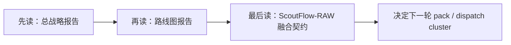

# Post-Dispatch176 报告索引

> 状态：`candidate / research / not-authority`。  
> 用途：为 `Dispatch127-176` 之后的大阶段路线设计提供中文底稿。  
> 说明：本文档集合按你的要求默认使用中文，并且把图表直接写入 Markdown。  
> 更新说明：本组 research candidate 现已基于后续收口后的 truth 入库。当前 repo authority 已进入 `WAVE_6_CANDIDATE_OPEN / NOT_EXECUTION_APPROVED`，并且 `RUN-Dispatch127-176-overnight-2026-05-05/READBACK-post-residual-repair-2026-05-06.md` 已补齐本机 run evidence reconciliation。以下报告仍保持 `candidate / research / not-authority`，只作为后续路线讨论底稿。

## 1. 报告清单

| 报告 | 目标 | 适合谁先读 | 核心问题 |
|---|---|---|---|
| [总战略报告](./post-dispatch176-wave-strategy-candidate-2026-05-05.md) | 吸收六份报告、本地 authority、RAW 规则、公开产品证据，给出总裁决 | 你 / commander / 外审 | `176` 后到底该往哪条主线推 |
| [路线图报告](./post-dispatch176-roadmap-candidate-2026-05-05.md) | 把 `127-176` 现有 slot 压缩成后续 cluster、gate、节奏 | commander / 派单人 | 后续不一定从 `177` 直着排，应该怎么重组成更大的 wave |
| [ScoutFlow-RAW 融合契约报告](./post-dispatch176-scoutflow-raw-bridge-candidate-2026-05-05.md) | 明确 ScoutFlow、H5、Bridge/Vault、RAW、巨人的肩膀流程如何拼成一条闭环 | 架构师 / PM / 后续写 PRD/SRD 的人 | 怎么避免第二知识库，怎么把现有工作真融合到 RAW 与后续交付 |

## 2. 建议阅读顺序

## 3. 三份报告的关系

| 层级 | 关注点 | 产出形态 |
|---|---|---|
| 战略层 | 方向对不对、哪些报告该吸收、哪些该降级 | 总裁决、风险矩阵、外部证据表 |
| 路线层 | Wave 怎么拆、哪些 slot 合并、哪些延后、哪些应 overflow | cluster、gate、阶段图、压缩矩阵 |
| 契约层 | ScoutFlow 与 RAW 的 SoR、preview、handoff、intake、shoulders 怎么配合 | ownership matrix、handoff contract、融合流程图 |

## 4. 本套报告的统一结论

1. `Dispatch127-176` 的当前设计值钱，但默认排法过宽。
2. `176` 之后不该直接继续 breadth-first 扩 Wave 5。
3. 最应该先证明的是一条 `ScoutFlow -> RAW` 的最小产品闭环，而不是继续补更多 glossary/spec/runtime-placeholder。
4. `ScoutFlow = 编译前端 / 证据控制面`，`RAW = 长期知识与交付面`，这条边界必须继续收紧，而不是被 topic card / preview / bridge helper 偷偷抹平。
