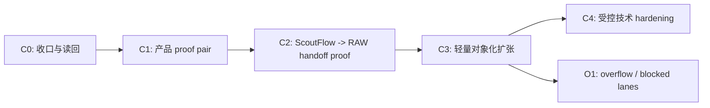
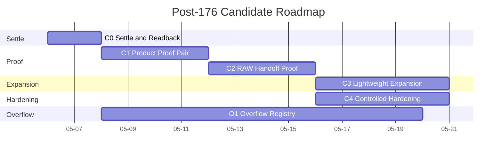

# Post-Dispatch176 路线图报告

> 状态：`candidate / research / not-authority`。  
> 本文不假设后续必须从 `177` 线性接着排。  
> 本文的目标不是再发明一套更大的 pack，而是把 `127-176` 已有成果压缩成更能证明产品价值的后续 cluster。

## 1. 路线总判断

### 1.1 不建议继续沿用的默认路线

当前 `127-176` 的默认心智是：

```text
Wave 4 收口
  -> Wave 5 大量 glossary/spec/IA/candidate
  -> topic-card bounded-code
  -> hardening / reporting / pack governance
  -> closeout / Wave 6 candidate
```

这个排法的问题不是“错”，而是**宽度太大，证明顺序太后**。

### 1.2 建议改成的路线



## 2. `127-176` 压缩矩阵

### 2.1 slot 组级重排

| 现有 slot | 当前角色 | 建议动作 | 重排后角色 |
|---|---|---|---|
| `127` | Wave 4 continuation map | 保留 | `C0.1 authority settle` |
| `128` | visual touchpoint roster | 保留但并入 proof 准备 | `C0.2 visual evidence prep` |
| `129` | bridge-vault gap matrix | 保留但降为 proof supporting note | `C0.3 gap note` |
| `130` | Wave 4 closeout + Wave 5 opening | 保留但重写 gate | `C0.4 gate reset` |
| `131-136` | signal / hypothesis / capture_plan / topic_card surface / workbench boundary | 合并 | `C1.1 core object contract` |
| `137-144` | continuity / trust-trace mapping / panel mapping / scoring / evidence-source matrix | 合并并减量 | `C1.2 proof-facing mapping pack` |
| `145-146` | topic-card vault rendering / preview shape | 提升优先级 | `C1.3 product proof pair` |
| `147` | capture plan dry-run note shape | 并入 `C1.1` | `core object appendix` |
| `148-150` | docs pack packaging / file-domain / dependency graph | 延后 | `C3.1 cluster packaging` |
| `151-154` | API placeholder / IA / UX compare | 延后且减量 | `C3.2 selective expansion` |
| `155-157` | audit lane / visual reporting / localhost roster | 部分前移部分延后 | `C2/C4 support` |
| `158-160` | handoff contract / resume rules / readback delta rules | 保留但收束 | `C4.1 execution discipline` |
| `161` | deferred/overflow registry | 保留 | `O1.1 overflow register` |
| `162-167` | bridge/vault continuation + Playwright/reporting | 默认延后 | `C4.2 hardening after proof` |
| `168-172` | runtime log / run summary / pool health / branch policy | 大幅降级 | `C4.3 operations appendix` |
| `173-176` | closeout / Wave6 / overflow / STEP3 handoff | 重写 | `C4.4 proof-based closeout` |

### 2.2 关键结论

1. `131-144` 不该再分 14 个小 slot 去推进。
2. `145/146` 不该埋在中段，它们应该成为下一阶段第一个真正的产品 proof canary。
3. `162-167` 这些 hardening / visual-runtime-adjacent 内容，必须等 `145/146` 的 proof 结果出来再决定优先级。
4. `173-176` 不能继续按“pack 跑完了就 closeout”的心智写，必须改成“proof 通过了什么，没通过什么”。

## 3. 建议的后续 cluster

### 3.1 Cluster 定义

| Cluster | 目标 | 产出 | 进入条件 | 退出条件 |
|---|---|---|---|---|
| `C0 Settle` | 收束 `176` 前后真实状态 | settle note、delta table、updated gate memo | post-repair readback 可用 | 你能 1 页看懂目前真状态 |
| `C1 Product Proof` | 证明 topic-card-lite 真的有产品价值 | proof pair、preview、review note | `C0` 完成 | 至少 3 条真实 URL 跑出可用 candidate |
| `C2 RAW Handoff Proof` | 证明 `ScoutFlow -> RAW` 不只是 preview 成功 | raw note candidate、intake result、script seed | `C1` 有可用 preview | 至少 2 条进入 RAW 下游并产出 downstream paragraph |
| `C3 Lightweight Expansion` | 只把 proof 需要的对象化补齐 | compressed entity pack | `C1/C2` 通过 | 对象化不再挡路 |
| `C4 Controlled Hardening` | 在产品 proof 后补 bridge/vault/visual hardening | scoped hardening notes / code tasks | `C1/C2` 通过 | hardening 为已验证主线服务 |
| `O1 Overflow` | 停放 DB vNext、runtime、ASR、browser automation 等 | overflow register | 任意时刻 | 不再污染默认主线 |

### 3.2 推荐顺序图



## 4. `177` 之后不建议按纯编号排的原因

| 原因 | 说明 |
|---|---|
| 修复 slot 可能插队 | 你已经明确说后面可能插若干修复 dispatch，因此用 `177/178/...` 去承载阶段语义会越来越混 |
| 当前 slot 粒度不均匀 | `145/146` 是 bounded-code canary，`168/169` 却是运行日志 schema；把它们放在同一线性层里会误导优先级 |
| 真正的门在 cluster，不在 slot | 下一轮该看的是 `proof pass / fail / partial`，不是 “数字有没有排下去” |

### 4.1 推荐命名法

建议下一轮优先用：

```text
W5-C0-*
W5-C1-*
W5-C2-*
W5-C3-*
W5-C4-*
W5-O1-*
```

如果你仍想保留线性 dispatch 号，也建议双写：

```text
Dispatch177 = W5-C0-1
Dispatch178 = W5-C0-2
Dispatch179 = W5-C1-1
...
```

这样后续插修复件不会把整条大路线打乱。

## 5. 下一阶段最小工作包

### 5.1 建议直接打开的最小包

| 包 | 建议内容 | 说明 |
|---|---|---|
| `W5-C0 settle pack` | real readback、127-176 结果归档、authority delta、proof gate rewrite | 把“当前真实发生了什么”先收束成 1 套读回 |
| `W5-C1 proof pair` | `topic-card-lite contract` + `topic-card preview` + `review rubric` | 用最小东西证明有没有产品价值 |
| `W5-C2 handoff pack` | `vault preview -> 00-Inbox raw note candidate -> RAW intake -> script seed` | 这是当前最该证明的跨系统闭环 |

### 5.2 暂时不要直接开的包

| 包 | 为什么先别开 |
|---|---|
| `full signal workbench pack` | 现在对象还太重，先做 workbench 容易继续 breadth-first |
| `DB vNext activation pack` | 架构正确，但顺序不对 |
| `Playwright/reporting extension pack` | 在产品 proof 之前，视觉/自动化继续补只会制造完成感 |
| `global pool / override evidence pack` | 当前最大问题不是执行吞吐，而是产品价值 |

## 6. gate 设计

### 6.1 C0 gate

| gate | 通过条件 |
|---|---|
| `G-C0-1` | post-repair readback 能明确区分 authority truth、merged PR truth、run evidence |
| `G-C0-2` | 127-176 的真实 terminal states 被压成 1 页可读表 |
| `G-C0-3` | 不再沿用“Batch 完成 = 产品推进完成”的口径 |

### 6.2 C1 gate

| gate | 通过条件 |
|---|---|
| `G-C1-1` | 至少 3 条真实 URL 在可接受时长内生成 `topic-card-lite` |
| `G-C1-2` | preview 明确区分 `evidence / hypothesis / next_action / blocked lanes` |
| `G-C1-3` | 用户能直接判断 `follow / park / reject` |

### 6.3 C2 gate

| gate | 通过条件 |
|---|---|
| `G-C2-1` | 至少 2 条 preview 成功进入 `00-Inbox raw note candidate` |
| `G-C2-2` | RAW intake 不把这类 note 判成异常格式 |
| `G-C2-3` | 至少 2 条成功产出 downstream paragraph 或 script seed |

### 6.4 C4 gate

只有在 `C1/C2` 通过后才打开：

| gate | 通过条件 |
|---|---|
| `G-C4-1` | topic-card 结构稳定到值得补 bridge/vault hardening |
| `G-C4-2` | H5 视觉证据需要更自动化，且人工复核已证明界面方向正确 |
| `G-C4-3` | 仍无 runtime / migration / audio unlock implied |

## 7. 与现有 pack 的兼容策略

### 7.1 不推翻已有工作

本路线图不是说 `127-176` 错了，而是说：

```text
原 pack 更像“候选骨架库存”
后续主线应该从库存里挑最值钱的那几块先证明
```

### 7.2 兼容办法

| 现有资产 | 在新路线里的位置 |
|---|---|
| `127/130` | 成为 `C0` 的 authority settle 与 opening gate 基础 |
| `131-144` | 成为 `C1/C3` 的对象 contract 素材库 |
| `145/146` | 直接变成 `C1` 主 canary |
| `161/175` | 成为 `O1` 的 overflow discipline 主体 |
| `158-160/168-172/176` | 成为 `C4` 的执行与归档纪律材料 |

## 8. 最终建议

### 8.1 强建议

1. 不把后续主线理解为“从 `177` 开始继续跑更多 slot”。
2. 把后续主线改成 `C0 -> C1 -> C2 -> C3/C4 -> O1`。
3. `145/146` 必须被提升成下一阶段第一类资产，而不是继续埋在中段。
4. `161/175` 的 overflow discipline 必须保留，否则 DB/runtime/ASR 会重新污染主线。

### 8.2 风险提示

如果继续按原 pack 宽排法推进，最可能发生的是：

```text
Wave 5 文档和 candidate 越来越完整
但用户仍说不清 ScoutFlow 每天打开一次到底比现在省了什么
```
