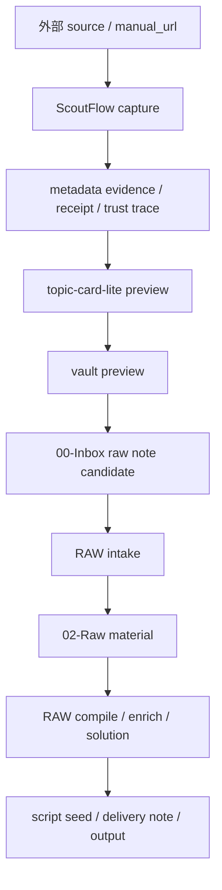
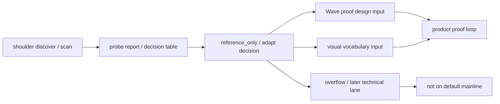
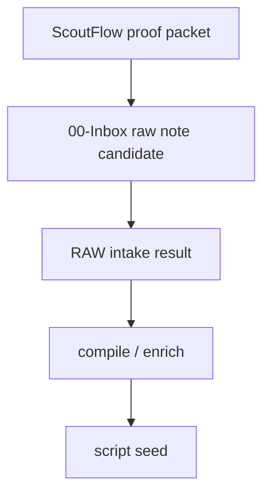

# Post-Dispatch176 ScoutFlow ↔ RAW 融合契约报告

> 状态：`candidate / research / not-authority`。  
> 目的：把 `ScoutFlow`、`RAW`、`H5/Bridge/Vault`、以及 doc1/doc2 的“巨人的肩膀流程”放到同一张图里，明确：  
> 1. 谁是哪个对象的 SoR。  
> 2. 现有工作如何融入后续大的 wave。  
> 3. 哪些动作只该是 `reference/projection/mirror`，哪些不能升级成 `authority/knowledge truth`。

## 1. 总原则

### 1.1 一句话定义

```text
ScoutFlow 负责：采集、证据、编译前段、preview、proof
RAW 负责：长期知识、入库、编译后段、脚本种子、交付
```

### 1.2 这份契约为什么必须写

因为当前最容易发生的误判不是代码 bug，而是以下三种边界误判：

| 误判 | 后果 |
|---|---|
| 把 `vault preview` 当成知识成功 | 形成第二知识库 |
| 把 `topic card candidate` 当成 authority object | DB/RAW 双写 |
| 把 `raw/05-Projects/ScoutFlow` mirror 当成 repo truth | authority drift |

## 2. Source of Record 矩阵

| 对象 | SoR | 可编辑面 | 可投影面 | 当前建议 |
|---|---|---|---|---|
| `capture` | ScoutFlow SQLite / API | API / bounded H5 intent | trust trace / H5 | 保持 ScoutFlow SoR |
| `probe_evidence` | FS + receipt path | worker through API | trust trace / summary | 保持 ScoutFlow SoR |
| `receipt` | ScoutFlow receipt ledger | API only | trust trace / report | 保持 ScoutFlow SoR |
| `trust_trace` | derived projection | 不直接编辑 | H5 / API | 只做 projection |
| `signal` | 先是 candidate IR | review doc / future UI | H5 cue / docs | 不急着进 DB authority |
| `hypothesis` | 先是 candidate IR | review doc / future UI | preview / docs | 不急着进 DB authority |
| `capture_plan` | 先是 bounded candidate | docs / future UI | scope panel / docs | 必须受 LP-001 约束 |
| `topic_card-lite` | 先是 candidate artifact | preview review | H5 preview / markdown | 先不做 authority object |
| `vault_preview` | ScoutFlow projection | 不直接编辑 | H5 / API markdown | 只代表 preview |
| `00-Inbox raw note candidate` | RAW vault candidate material | Obsidian / intake | downstream compile | 进入 RAW 后才开始知识化 |
| `compiled RAW note` | RAW | Obsidian / compile pipeline | wiki / project notes | RAW SoR |
| `script seed` | RAW / downstream project | Obsidian / editor | output / handoff | RAW SoR |
| `dispatch history` | RAW `05-Projects/ScoutFlow/dispatches` | PM cockpit / mirror | repo decision-log reference | mirror，不是 repo authority |
| `current/task-index/decision-log/contracts-index` | ScoutFlow repo | authority writer only | summary / reports | repo authority |

## 3. 融合流程图



### 3.1 这条链路的关键边界

| 节点 | 不能越界成什么 |
|---|---|
| `capture` | 不能直接变 recommendation/keyword/raw_gap auto-capture |
| `trust_trace` | 不能被写成内容理解完成 |
| `topic-card-lite preview` | 不能被写成最终知识卡 |
| `vault preview` | 不能被写成 true write |
| `00-Inbox raw note candidate` | 不能被写成已经完成 classify/compile |
| `RAW compile` | 不能反向覆盖 repo authority |

## 4. 为什么现有 RAW 规则支持这个判断

### 4.1 `frontmatter` 与 `/intake` 的真实作用

| RAW 规则 | 它实际保证什么 | 它不保证什么 |
|---|---|---|
| [frontmatter-templates.md](/Users/wanglei/workspace/raw/System/frontmatter-templates.md:31) | `02-Raw` 原料用 4 字段，`01-Wiki`/solution 有更完整模板 | 不保证一条 note 已经可复用 |
| [intake-rules.md](/Users/wanglei/workspace/raw/System/intake-rules.md:10) | `00-Inbox -> 02-Raw` 的分类和搬运 | 不保证 topic、claim、script 语义已经稳定 |
| [raw/AGENTS.md](/Users/wanglei/workspace/raw/AGENTS.md:1) | RAW 是个人知识 OS，保持内容架构稳定 | 不允许 ScoutFlow 借 bridge/vault 偷改 RAW 顶层结构 |

### 4.2 直接结论

```text
RAW 当前有“入库契约”
但还没有“证明某个 preview 已经是高质量知识资产”的自动背书
所以 ScoutFlow 不能把 preview 成功说成知识成功
```

## 5. “巨人的肩膀流程”该怎么接进来

### 5.1 doc2 的 7 阶段生命周期，不该直接变产品主线

[shoulders-lifecycle-handbook](/Users/wanglei/workspace/ScoutFlow/docs/architecture/shoulders-lifecycle-handbook-candidate-2026-05-04.md:18) 说得很清楚：

```text
discover -> scan -> clone -> probe -> decide/apply -> integrate -> archive
```

这套流程适合管理开源肩膀，不适合直接等同于产品对象生命周期。

### 5.2 正确接法

| shoulders 阶段 | 在 ScoutFlow 后续主线里的角色 |
|---|---|
| discover / scan | signal 来源与参考来源，不直接进 authority |
| clone / probe | 形成 `docs/research/shoulders/**` 和 design/architecture evidence |
| decide/apply | 决定 `adapt / reference_only / drop`，影响的是技术/视觉路线，不是 capture truth |
| integrate | 只在明确服务当前 proof 主线时才进入实现 |
| archive | 为后续重新评估保留证据，但不污染当前 wave |

### 5.3 接入图



### 5.4 最关键的一条规则

**肩膀流程应该喂给主线，但不应该吞掉主线。**

也就是说：

1. OpenDesign 可以喂给视觉语言。
2. Zotero / ArchiveBox / Karakeep / NotebookLM 的模式可以喂给对象边界。
3. 但它们都不该直接把后续主线带去“再做一层系统”。

## 6. 推荐的跨系统 handoff contract

### 6.1 最小 handoff 包

| 字段 | 含义 |
|---|---|
| `capture_id` | 这条素材在 ScoutFlow 的主键 |
| `source_url` | 原始入口 |
| `operator_angle` | 当前为什么看这条 |
| `metadata_summary` | 当前已证 metadata 摘要 |
| `trust_trace_locator` | 追溯入口 |
| `topic_seed` | 这条素材目前支撑的选题角度 |
| `blocked_lanes` | 哪些能力仍 blocked |
| `preview_hash` | preview 文本摘要指纹 |
| `raw_target_hint` | 预期进入 RAW 的方向 |
| `next_action` | follow / park / reject / need_more_evidence |

### 6.2 handoff packet 图



### 6.3 不该包含的字段

| 不该包含什么 | 原因 |
|---|---|
| `runtime approved` | 当前根本不成立 |
| `vault committed=true` | 当前根本不成立 |
| `knowledge final=true` | RAW 侧还没完成 compile |
| `DB vNext required` | 当前不该变成主线前提 |

## 7. 后续 Wave 该怎样真正融合现有工作

### 7.1 现有工作可直接复用的部分

| 现有成果 | 融入方式 |
|---|---|
| H5 四面板与 design brief | 作为 product proof 的操作表面 |
| Bridge/Vault helper contracts | 作为 preview/handoff 约束，不作为 write approval |
| Wave 4 retrospective | 作为 introduced vs exposed 的反复盘底稿 |
| corner cases / visual spec | 作为 proof pair 的验收与 copy 素材库 |
| RAW frontmatter / intake | 作为 `00-Inbox -> 02-Raw` 的最小 handoff 落点 |
| shoulders lifecycle | 作为“外部模式怎么喂主线”的技术治理方法 |

### 7.2 现有工作必须降级的部分

| 现有成果 | 为什么要降级 |
|---|---|
| `signal/hypothesis/...` 大量独立 slot | 当前太宽，不利于 proof |
| `DB vNext` 进入默认 backbone 的诱惑 | 顺序不对 |
| `Playwright/reporting` 继续扩张 | 现在最大瓶颈不是可视化自动化 |
| `raw dispatch mirror` 被当 authority | 会造成双真相源 |

## 8. 最终建议

### 8.1 该怎么定义后续大主线

后续主线不应叫：

```text
继续做 Wave 5
```

更准确的定义应该是：

```text
用 Wave 4 已有落地件，
先证明一条 ScoutFlow -> RAW 的最小产品闭环，
再决定 Wave 5 哪些对象值得真正展开
```

### 8.2 该怎么判断融合是否成功

| 判断项 | 成功信号 |
|---|---|
| SoR 是否清楚 | 用户能立刻回答 repo truth 在哪、RAW truth 在哪 |
| preview 是否只是 preview | 没有人再把 preview 成功写成知识成功 |
| `00-Inbox` 是否真进入下游 | 至少 2 条完成 RAW intake 并产出 downstream paragraph |
| shoulders 是否服务主线 | 外部模式被吸收成规则或界面约束，而不是新系统扩张 |

