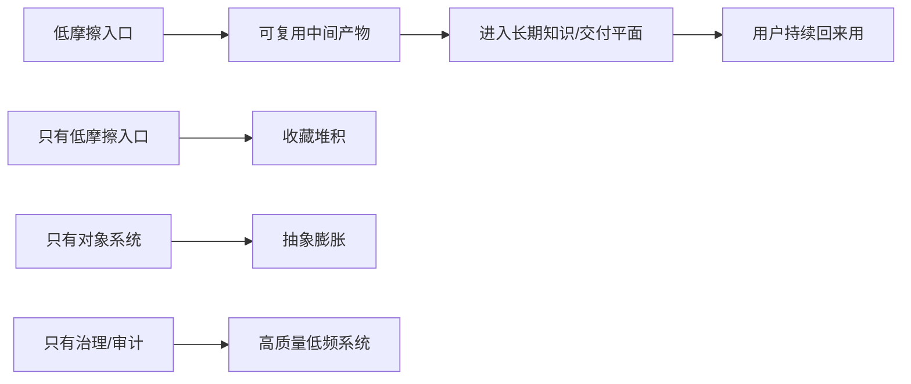
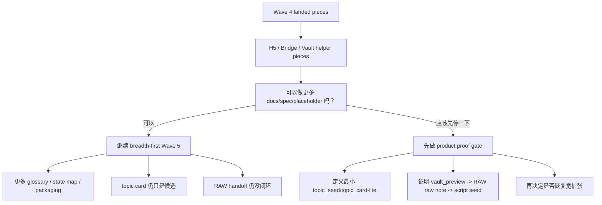

# Post-Dispatch176 总战略报告

> 状态：`candidate / research / not-authority`。  
> 本文不改 `docs/current.md`、`docs/task-index.md`、`docs/decision-log.md`、`docs/specs/contracts-index.md`。  
> 本文只回答三个问题：  
> 1. 其他三个窗口上下文里的六份报告，对 `Dispatch176` 之后的大方向到底是加分还是减分。  
> 2. 现有 PRD / SRD / addenda / Wave 4 落地物，应该怎样融合成下一阶段主线。  
> 3. `ScoutFlow`、`RAW`、`H5/Bridge/Vault`、`巨人的肩膀流程` 该如何拼成一条真实可用的闭环。

## 1. 执行摘要

### 1.1 总裁决

**裁决：`POST176_REPACK_AROUND_PRODUCT_PROOF_NOT_BREADTH`**

更直白一点：

```text
176 之后不该默认继续“更多对象 + 更多 spec + 更多 placeholder + 更多治理包”
而应改成：
先证明 1 条最小产品闭环
再按证据决定是否恢复更宽的 Wave 5 扩张
```

### 1.2 三条最重要结论

1. 六份报告整体是加分项，但它们**更适合做重排依据，不适合被直接抄成主线执行计划**。
2. 当前最危险的误判不是“代码没写出来”，而是**把 Wave 4 的工程闭环误当成产品闭环**。
3. `Dispatch127-176` 里真正最值钱的部分不是 `131-144` 那批对象化文档，而是：
   `127/130` 的阶段收口、`145/146` 的 topic-card canary、`161/175` 的 overflow discipline、以及 `176` 的 handoff contract。

## 2. 当前判断基线

### 2.1 现实证据层

| 维度 | 当前已确认事实 |
|---|---|
| repo authority | [current.md](/Users/wanglei/workspace/ScoutFlow/docs/current.md:1) 当前为 `WAVE_6_CANDIDATE_OPEN / NOT_EXECUTION_APPROVED`，且无 active product task、无 code-bearing next gate |
| current engineering baseline | [PRD-v2](/Users/wanglei/workspace/ScoutFlow/docs/PRD-v2-2026-05-04.md:42) 和 [SRD-v2](/Users/wanglei/workspace/ScoutFlow/docs/SRD-v2-2026-05-04.md:38) 仍把当前可证事实收在 `manual_url + metadata_only + receipt + trust trace` |
| addenda scope | [PRD-v2.1](/Users/wanglei/workspace/ScoutFlow/docs/PRD-amendments/prd-v2.1-strong-visual-h5-para-pr-factory-candidate-2026-05-04.md:24) 与 [SRD-v3 H5/Bridge](/Users/wanglei/workspace/ScoutFlow/docs/SRD-amendments/h5-bridge-para-vault-srd-v3-candidate-2026-05-04.md:24) 只是 planning/contract baseline，不批准 frontend/runtime/migration/vault true write |
| current run evidence | [READBACK-post-residual-repair-2026-05-06.md](/Users/wanglei/workspace/raw/05-Projects/ScoutFlow/dispatches/RUN-Dispatch127-176-overnight-2026-05-05/READBACK-post-residual-repair-2026-05-06.md:1) 已明确 `127-176` terminal truth、`slot 134 = FIXED_AND_MERGED`、以及 `PR #193` 仅是 post-run authority repair |
| RAW ingress contract | [frontmatter-templates.md](/Users/wanglei/workspace/raw/System/frontmatter-templates.md:31) 和 [intake-rules.md](/Users/wanglei/workspace/raw/System/intake-rules.md:1) 只保证 `00-Inbox -> 02-Raw` 原料入库，不保证知识沉淀或脚本复用 |

### 2.2 路线假设层

本报告当前采用的路线前提是：

```text
`Dispatch176` 已 landed，且 post-repair readback 已可用
```

但所有结论都额外保留一条防呆：

```text
如果后续 authority 或 raw evidence 再发生漂移，
则优先修正 readback / authority truth，再套用本文路线。
```

## 3. 六份报告的正负作用

### 3.1 综合评分表

| 报告 | 正向价值 | 负向风险 | 对后续主线的净作用 | 吸收方式 |
|---|---:|---:|---:|---|
| Product Mechanism Premortem | 5 | 2 | `+3` | 保留主裁决，压缩其第一版 loop |
| RAW Unified Knowledge OS Review | 5 | 2 | `+3` | 作为 `ScoutFlow != 第二知识库` 的边界锚 |
| OpenDesign Visual Spec v2 | 4 | 2 | `+2` | 作为视觉/交互约束，不作为运行时方案 |
| Corner Case & Persona v2 | 4 | 2 | `+2` | 作为 Wave 5 / H5 的 case/test/copy 种子库 |
| Wave 4 Retrospective v2 | 5 | 1 | `+4` | 作为“introduced vs exposed”复盘总账 |
| PRD-v3 / SRD-v4 Outline v2 | 4 | 3 | `+1` | 作为 section map，不作为 authority 起草稿 |

### 3.2 逐份分析

| 报告 | 应吸收的东西 | 不能直接照搬的东西 |
|---|---|---|
| Product Mechanism Premortem | `PRODUCT_PROOF_REQUIRED_BEFORE_MORE_DISPATCH`、topic card-lite、最小闭环思想 | 它对 dispatch127-176 的 slot 级理解仍偏 pack 设计层，不够吃透 RAW 真实 intake 约束 |
| RAW Unified Knowledge OS Review | `ScoutFlow = evidence/control/compiler front-end`、`RAW = long-lived knowledge/delivery vault` | 其中一些 comparator 仍偏模式类判断，需要用当前 repo/RAW 真边界收窄 |
| OpenDesign Visual Spec v2 | H5 不得变成 generic admin shell；visual proof 与 runtime proof分离 | 它解决的是“怎么做得像样”，不是“为什么用户每天要打开” |
| Corner Case & Persona v2 | operator mode 而不是 marketing persona；blocked lanes 不得制造错误承诺 | case 数量很多，若不压缩会继续把 Wave 5 做成清单工程 |
| Wave 4 Retrospective v2 | `Batch2 terminal != all planes clear`、`introduced vs exposed`、Stage A Node repair lesson | 不能因为 retrospective 写得全，就把 Wave 4 当已 closeout |
| PRD-v3 / SRD-v4 Outline v2 | section map、carry-forward / defer / overflow 分层 | 它很像“准备写一整套新权威文档”，而现在真正缺的是产品 proof，不是更早的 PRD/SRD replace |

## 4. 外部证据给出的共同模式

### 4.1 工具共性表

| 工具 | 入口低摩擦 | 可复用输出 | 来源/证据 | 对 ScoutFlow 的启发 |
|---|---|---|---|---|
| Obsidian Web Clipper | 强 | 中 | 中 | 先把剪藏入口做顺手，再让模板和 properties 承担结构化 |
| Readwise Reader | 强 | 强 | 中 | highlight/export 做得很顺，但它的价值成立依赖下游输出，不是只靠保存 |
| Zotero | 中 | 强 | 强 | 一键采集 + 高质量 metadata + snapshot/citation，是 evidence-first 的典型 |
| Raindrop.io | 很强 | 中 | 中 | 收藏、highlight、全文搜索、永久副本都能做，但如果没有 compile pass 就会变收藏坟场 |
| Karakeep | 很强 | 弱到中 | 弱到中 | “bookmark-everything + AI tagging” 说明采集层很容易膨胀成第二 inbox |
| ArchiveBox | 中 | 弱 | 强 | 归档能力强，但 archive 不等于 knowledge |
| NotebookLM | 中 | 强 | 强 | grounded Q&A 和 source-based synthesis 值得借鉴，但它是 source-set 工作台，不是长期 SoR |

### 4.2 统一结论



外部产品没有一个是靠“先定义 10 个对象、补 50 个 spec、再看用户会不会回来”成立的。它们基本都先抓住：

1. 一个低摩擦入口。
2. 一个可复用输出。
3. 一个稳定下游。

ScoutFlow 现在三个里只完全做好了第 1 个的一部分，正在补第 2 个，但第 3 个还没与 RAW 真闭环。

## 5. 真实矛盾在哪里

### 5.1 四个核心矛盾

| 矛盾 | 当前表现 | 如果不处理会怎样 |
|---|---|---|
| 产品闭环 vs 治理吞吐 | dispatch / pack / lint / report 已经非常强，topic card / downstream use 还没证明 | 形成“PR 很多、CI 很绿、用户不用” |
| preview 成功 vs 知识成功 | vault preview/dry-run/helper 很完整，但 RAW 规则只保证入库，不保证复用 | 把 `00-Inbox` 当成功终点 |
| Phase 2 对象化 vs Phase 1 proof | `signal / hypothesis / capture_plan / topic_card` 已被大规模拆 slot | 过早对象化，过早抽象化 |
| visual readiness vs user-visible proof | H5 设计、lint、typecheck、Playwright spec、reporting 都有了 | 技术完成感掩盖视觉与交互未完成 |

### 5.2 问题本质图



## 6. 最该先证明的闭环

### 6.1 推荐闭环

**推荐闭环：`Loop-B-lite`**

```text
operator_angle
  -> one manual_url
  -> metadata evidence
  -> trust trace
  -> topic_seed/topic_card-lite preview
  -> 00-Inbox raw note candidate
  -> RAW intake
  -> one downstream paragraph / script seed
```

### 6.2 为什么不是别的闭环

| 方案 | 不先选它的原因 |
|---|---|
| 纯 H5 coherence loop | 只能证明界面顺不顺，不能证明为什么用户要每天打开 |
| 纯 metadata -> trust trace loop | 已经太接近当前 Phase 1A，无法解释 Wave 5 为什么值得开 |
| 直接做 Signal Workbench | 现在对象过重，容易把产品问题再次抽象化 |
| 直接做 DB vNext / migration-prep | 工程价值高，但与当前产品 proof 顺序相反 |

## 7. 对现有 `127-176` 的净判断

### 7.1 哪些 slot 值钱

| slot 组 | 净判断 | 原因 |
|---|---|---|
| `127 + 130` | 保留 | 阶段收口与 opening gate 必须存在 |
| `131-142` | 压缩合并 | 当前太分散，应该收敛成 3-4 份 proof 文档而不是 12 份 |
| `145 + 146` | 提前提升优先级 | 它们最接近用户能看到的 topic card/value canary |
| `161 + 175` | 保留 | overflow discipline 是必要防线，能防 DB/runtime 偷跑 |
| `162-167` | 默认延后 | 没有 product proof 前，不该先硬化 bridge/vault/Playwright/reporting continuation |
| `168-172` | 降级 | runtime log / run-summary / pool health / branch policy 不是当前最大瓶颈 |
| `173-176` | 重写定位 | closeout 与 handoff 必须围绕“proof 是否通过”重写，而不是围绕“pack 是否跑完” |

### 7.2 压缩原则

1. `131-144` 不再按对象名一个个独立扩。
2. 先收敛成 `signal-hypothesis-plan-card` 四件套中的最小必要字段。
3. topic card 不先做成 authority object，只先做 `previewable candidate artifact`。
4. 所有与 `DB vNext`、`ASR`、`browser automation`、`true vault write` 相关内容，一律先进 overflow。

## 8. 结论与决定

### 8.1 应立即接受的决定

| 决定 | 结论 |
|---|---|
| D1 | `176` 之后不继续默认 breadth-first Wave 5 |
| D2 | 后续主线改成“产品 proof gate first” |
| D3 | `ScoutFlow = 编译前端 / 控制面`，`RAW = 知识/交付面` |
| D4 | `topic card` 先做 candidate artifact，不急着做 authority object |
| D5 | `DB vNext / ASR / browser automation / vault true write` 一律不进默认主线 |

### 8.2 需要你拍板的决定

| 决定 | 需要你拍板什么 |
|---|---|
| D6 | `145/146` 是否在下一轮被重写为“topic card proof pair”而不是继续原 slot 定义 |
| D7 | 是否允许下一轮新 pack 用 cluster 命名替代纯 `177/178/...` 线性心智 |
| D8 | 是否把 `RAW intake success` 与 `script seed generation` 作为下一轮硬验收指标 |

## 9. 外部来源

| 来源 | 作用 |
|---|---|
| [Obsidian Web Clipper](https://obsidian.md/clipper) | 证明低摩擦 capture + properties/highlights/template 的入口模式 |
| [Obsidian Highlighter Help](https://obsidian.md/help/web-clipper/highlight) | 证明官方 clipper 把 highlight 作为一等对象处理 |
| [Readwise Reader Exporting](https://docs.readwise.io/reader/docs/faqs/exporting) | 证明 highlight/export 到下游笔记应用是其核心价值之一 |
| [Readwise App Relationship](https://docs.readwise.io/get-started/app-relationship) | 证明 Reader 与 Readwise 通过同步形成下游复用链 |
| [Zotero Connector](https://www.zotero.org/support/connector) | 证明一键保存高质量 metadata/library item 是证据型产品的核心 |
| [Adding Items to Zotero](https://www.zotero.org/support/adding_items_to_zotero) | 证明 snapshot / web page save / library item 的 SoR 设计 |
| [Raindrop Highlights](https://help.raindrop.io/highlights/) | 证明 highlight、annotation、search/export 的收藏工具模式 |
| [Raindrop Search](https://help.raindrop.io/using-search) | 证明全文搜索依赖 archive/content copy，而不只是 URL |
| [Raindrop Subscription](https://help.raindrop.io/billing-faq) | 证明 archive/full-text/AI 结合后很容易演化成第二 inbox |
| [Karakeep GitHub](https://github.com/karakeep-app/karakeep) | 证明“bookmark everything + AI tagging”这一类产品的边界风险 |
| [ArchiveBox GitHub](https://github.com/ArchiveBox/ArchiveBox) | 证明 archive 能力很强，但 archive 不等于 knowledge |
| [NotebookLM Help](https://support.google.com/notebooklm/answer/16164461?hl=en) | 证明 grounded answers 与 sources-based artifacts 的价值模式 |
