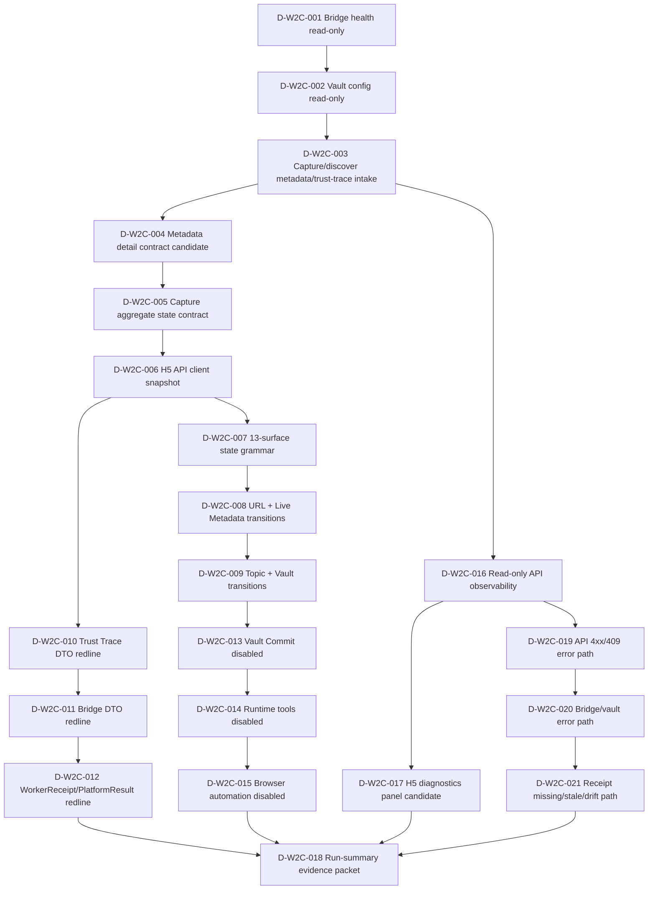

# 02-w2c-dispatch-pack.md

> State: candidate / not-authority / not runtime approval / not migration approval / not 5-overflow unlock.
> This pack is a dispatch design surface only. It does not write implementation code, authority ledgers, migrations, runtime binaries, browser automation, or raw vault content.

## §0.5 Prerequisite Check

| Check | Live readback | Result |
|---|---|---|
| docs/current.md | reports `main = c802de4`, Active `0/3`, Authority writer `0/1`, `WAVE_6_CANDIDATE_OPEN / NOT_EXECUTION_APPROVED`, `write_enabled=False` | drift on main-head only; authority counts match |
| docs/task-index.md | Active table empty, Review empty, Backlog empty; product lane `0/3`, authority writer `0/1` | matches prompt authority state |
| docs/decision-log.md | current authority file reachable; tail is tool-truncated, but repo search confirms PR #246/D-017 references exist on main | partial tail visibility; no authority-count drift detected |
| docs/memory/INDEX.md | `batch_count: 17`, 7 lessons + 5 feedback + 5 patterns | matches prompt |
| GitHub commit chronological | latest returned commit is `6dd27d7` / PR #245 W2D memory graph, after PR #248 / PR #247 chronologically | drift vs current.md anchor `c802de4` |

**prerequisite_check = `drift_detected`**. Main-head truth in this packet is: docs authority anchor still says `c802de4`, while GitHub chronological latest merge is `6dd27d7` (撰写时刻历史参考, GitHub live 以 §0.5 Check 为准). This packet does not write authority and does not repair that drift; it only records it for Codex / CC0 intake.

## §1 Dispatch Pack Overview

### §1.1 W2C scope

W2C is PF-C4-02 “真数据接线 + 微交互” planning. The upstream cluster split is preserved:

| Sub-lane | Role | Primary card range | Boundary |
|---|---|---|---|
| W2C-1 | 接现有 read-only routes | D-W2C-001 / 002 / 003 plus error-path/observability support | Read-only or dry-run only; no runtime tool execution |
| W2C-2 | 补缺失 contract 候选 + DTO redlines | D-W2C-004 / 005 / 006 / 010 / 011 / 012 / 018 | Candidate contracts only; no backend DTO mutation in this pack |
| W2C-3 | 13 surface 状态机 + 微交互 + disabled states | D-W2C-007 / 008 / 009 / 013 / 014 / 015 / 017 / 021 | H5 display/state only; no package strategy or browser automation unlock |

### §1.2 7 dimensions × 3 cards baseline

| Dimension | Cards | Why |
|---|---|---|
| read-only route wiring | D-W2C-001~003 | Establish current route truth before inventing any contract |
| missing contract | D-W2C-004~006 | Make future contract gaps explicit and candidate-only |
| state machine | D-W2C-007~009 | Prevent real-data wiring from becoming ambiguous UI state soup |
| DTO redlines | D-W2C-010~012 | Protect Trust Trace / Bridge / WorkerReceipt shapes |
| disabled state | D-W2C-013~015 | Keep true vault write / runtime / browser automation visibly blocked |
| observability | D-W2C-016~018 | Make safe route/gate/evidence state inspectable without raw secrets |
| error-path | D-W2C-019~021 | Handle route errors, bridge/vault errors, and stale/drift states honestly |

### §1.3 Global constraints for every card

- `write_enabled=false` is a hard invariant, not a UI setting.
- `services/api/migrations/**` remains forbidden for W2C.
- `audio_transcript`, BBDown live, yt-dlp, ffmpeg, ASR, and browser automation remain blocked.
- H5 may display candidate state and safe readback; it must not generate raw credential evidence, raw vault content, or authority writeback.
- Any card that appears to need a schema/DTO/enum change must stop and become a separate dispatch + audit request.

### §1.4 Dimension-specific anti-boilerplate guardrails

The following guardrails are part of the pack and should be used by CC0/CC1 to reject copy-paste card bodies that look structurally complete but are semantically generic.

#### Dimension 1 — read-only route wiring

- Verification must cite exact current route method and path.
- Acceptance must distinguish GET/read-only, POST/create, POST/enqueue, and POST/dry-run.
- Anti-patterns must forbid treating scaffold or dry-run routes as live runtime capability.
- Self-verification must include route inventory and UI copy review, not just build green.
- Any current route absence must be marked as missing contract, not patched by H5 mock data.

#### Dimension 2 — missing contract candidates

- Verification must split current fields from future fields.
- Acceptance must require provenance labels for each candidate field.
- Anti-patterns must forbid route invention and DTO mutation in the same card.
- Self-verification must confirm candidate-only language survived final copy.
- Missing contract cards are allowed to create future dispatch language, not implementation code.

#### Dimension 3 — state machine

- Verification must cover surface-specific events, not just idle/loading/error.
- Acceptance must include blocked/disabled states for future-gated lanes.
- Anti-patterns must forbid hiding blocked truth to make the UI look complete.
- Self-verification must walk at least one happy path and one blocked path.
- H5-local state names must not become backend status enums.

#### Dimension 4 — DTO redlines

- Verification must name the exact protected DTO/model.
- Acceptance must separate display aliases from backend field names.
- Anti-patterns must forbid flattening layered truth structures.
- Self-verification must compare proposed H5 fields against live model definitions.
- Any DTO change request exits W2C and becomes a separate dispatch with audit.

#### Dimension 5 — disabled state

- Verification must name the blocked overflow lane and the visible user affordance.
- Acceptance must make disabled state visually reviewable, not hidden in tooltip-only copy.
- Anti-patterns must forbid enabling true write/runtime/browser actions through wording.
- Self-verification must inspect package/config diffs for accidental unlocks.
- Disabled-state success means “honestly blocked,” not “implemented.”

#### Dimension 6 — observability

- Verification must define what is safe to observe and what is forbidden evidence.
- Acceptance must preserve machine-readable error/status code where available.
- Anti-patterns must forbid raw credentials, raw stdout/stderr, raw API bodies, and external telemetry.
- Self-verification must review evidence packet paths and redaction labels.
- Observability must not introduce migrations or persistent schema changes.

#### Dimension 7 — error path

- Verification must map concrete error code to user copy and operator action.
- Acceptance must include retry/no-retry policy.
- Anti-patterns must forbid generic “failed” flattening and fake success placeholders.
- Self-verification must walk at least five named error scenarios before closeout.
- Error paths must preserve authority gates: retry cannot bypass LP-001, runtime Hold, true_vault_write Hold, or browser automation Hold.

### §1.5 Card intake protocol for Codex

1. Intake this pack as candidate dispatch design, not authority.
2. Start from D-W2C-001 and stop at the first route/DTO mismatch instead of papering over it.
3. For every card, write a receipt sentence that says whether the card was implemented, deferred, or rejected.
4. If a card needs backend schema, DTO, enum, migration, runtime, package, browser automation, or authority write: stop and split a new dispatch.
5. If visual evidence is missing, say `visual evidence not collected`; do not convert a build pass into V-PASS.
6. If current.md / START-HERE anchor drift remains (`c802de4` vs latest `6dd27d7`), record it in run-summary only; do not update authority files from this pack.
7. If a route is missing, create a missing-contract note under W2C research storage; do not invent an API response.
8. If a disabled lane appears useful, keep it disabled and write an overflow follow-up candidate.
9. If an evidence packet would include secrets or raw stdout/stderr, redact or reject it before writing.
10. If a card’s acceptance cannot be made lane-specific, reject that card body as boilerplate and regenerate locally.

### §1.6 Acceptance bundle taxonomy

Every card should close into one of these bundle labels. This avoids “green by vibe” closeout.

| Bundle label | Meaning | Required proof |
|---|---|---|
| `route-readback-clear` | Current API route shape matched card assumptions | Route file/model readback + method/path table |
| `candidate-contract-only` | Card documents a missing contract without implementing it | Missing/current split + future owner lane |
| `state-machine-ready` | Surface states are specified and can be wired without DTO mutation | Per-surface state table + blocked path |
| `dto-redline-clear` | H5 fields do not mutate backend DTOs | DTO freeze table + display alias table |
| `disabled-state-visible` | Future-gated capability is visibly blocked | UI copy + disabled affordance checklist |
| `observability-safe` | Evidence packet excludes secret/raw material | Redaction/evidence-source checklist |
| `error-path-covered` | Named errors map to user action and retry/no-retry | Error matrix + machine code retention |
| `blocked-split-required` | Card found a need outside W2C | Split dispatch note + stop reason |

### §1.7 Stop-the-line escalation map

| Need discovered during W2C | Escalate to | Why |
|---|---|---|
| New API route implementation | Separate W2C contract/route dispatch | This pack is dispatch design and H5 wiring prep, not backend expansion approval |
| Trust Trace DTO change | DTO redline audit + separate PR | Current DTO is layered and locked by model docstring |
| PlatformResult enum change | Platform contract dispatch | H5 display cannot redefine platform semantics |
| Vault true write | W4 Lane 1 / true_vault_write authority upgrade | `write_enabled=false` remains hard truth |
| Runtime/download/ASR | W4 Lane 2 / runtime_tools authority upgrade | W2C must not execute tools |
| Browser automation/screenshots | W4 Lane 3 / browser_automation authority upgrade | Visual evidence does not equal browser automation approval |
| DB schema/entity expansion | W4 Lane 4 / dbvnext_migration authority upgrade | migrations are forbidden without explicit gate |
| Full signal workbench | W4 Lane 5 after Lane 1+2+4 V-PASS | Workbench is dependency-blocked |

---

## §2 Dispatch Cards

### D-W2C-001: Bridge health read-only wiring contract

| 字段 | 值 |
|---|---|
| **id** | D-W2C-001 |
| **status** | candidate |
| **cluster** | W2C-1 |
| **dimension** | read-only route wiring |
| **dependency** | null |
| **TL;DR** | Connect the H5 shell to the existing `/bridge/health` shape as a read-only capability banner. The card must preserve `write_enabled=false` and treat unavailable bridge modules as visible blocked state, not as product failure. |
| **input_pack** | https://raw.githubusercontent.com/RayWong1990/ScoutFlow/main/docs/COLLECTION-LINE-MASTER-SPEC-2026-05-07.md https://raw.githubusercontent.com/RayWong1990/ScoutFlow/main/services/api/scoutflow_api/bridge/router.py https://raw.githubusercontent.com/RayWong1990/ScoutFlow/main/services/api/scoutflow_api/bridge/config.py https://raw.githubusercontent.com/RayWong1990/ScoutFlow/main/services/api/scoutflow_api/bridge/schemas.py |
| **deliverable** | `docs/research/post-frozen/2026-05-08/W2-w2c/cards/D-W2C-001-bridge-health-readonly.md` section spec plus an H5 API-client mapping note for `apps/capture-station/src/lib/api-client.*` if Codex later implements. No authority files and no runtime unlock. |
| **acceptance** | T-PASS: route inventory lists `/bridge/health` as GET/read-only and identifies `BridgeHealthResponse.bridge_available`, `spec_version`, `write_enabled`, `blocked_by`. T-PASS: UX text distinguishes “bridge scaffold unavailable” from “capture failed”; blocked state is visible in console without opening a runtime lane. Contract-readiness: no new Bridge DTO fields are proposed; any display field maps to existing `BridgeHealthResponse`. Boundary: `write_enabled=false` remains a displayed fact, not a toggle. |
| **anti_pattern** | ❌ REGENERATE if the card proposes a new bridge health route or mutates `bridge/router.py`. ❌ REGENERATE if the UI copy says bridge runtime is approved, live, unlocked, or write-capable. ❌ REGENERATE if `blocked_by` is flattened into free text and loses `BridgeErrorCode` provenance. ❌ REGENERATE if it adds package dependencies to render the banner. |
| **pre_flight_check** | Codex local only: verify current branch and latest main before intake (`git fetch origin`, then inspect latest 5 commits). Codex local only: open `services/api/scoutflow_api/bridge/router.py` and confirm `/bridge/health` is GET/read-only. Codex local only: inspect `services/api/scoutflow_api/bridge/schemas.py` for `BridgeHealthResponse`; do not infer fields from prompt prose. Codex local only: grep `write_enabled` in bridge files and confirm no assignment flips to true. |
| **self_verification** | Run the API contract snapshot that covers bridge health, or add a candidate-only test plan if test path is absent. Review H5 copy for blocked-state language: “不可用/未实现” is allowed; “已启用/可写入” is not. Diff-check that no authority docs changed and no runtime tool dependency entered package.json. |

### D-W2C-002: Vault config read-only card and write-disabled truth surface

| 字段 | 值 |
|---|---|
| **id** | D-W2C-002 |
| **status** | candidate |
| **cluster** | W2C-1 |
| **dimension** | read-only route wiring |
| **dependency** | D-W2C-001 |
| **TL;DR** | Wire the existing `/bridge/vault/config` response into a config truth card. The UI must show vault root resolution, preview availability, frontmatter mode, and hard write-disabled status without implying true vault commit permission. |
| **input_pack** | https://raw.githubusercontent.com/RayWong1990/ScoutFlow/main/docs/COLLECTION-LINE-MASTER-SPEC-2026-05-07.md https://raw.githubusercontent.com/RayWong1990/ScoutFlow/main/services/api/scoutflow_api/bridge/router.py https://raw.githubusercontent.com/RayWong1990/ScoutFlow/main/services/api/scoutflow_api/bridge/config.py https://raw.githubusercontent.com/RayWong1990/ScoutFlow/main/services/api/scoutflow_api/bridge/schemas.py |
| **deliverable** | `docs/research/post-frozen/2026-05-08/W2-w2c/cards/D-W2C-002-vault-config-readonly.md` with a field-by-field rendering contract for `BridgeVaultConfigResponse` and blocked/error copy matrix. |
| **acceptance** | T-PASS: card maps `vault_root_resolved`, `vault_root`, `preview_enabled`, `write_enabled`, `frontmatter_mode`, and `error` exactly to existing schema. V-PASS candidate: write-disabled state is visually primary enough that a user cannot mistake preview for commit. Contract-readiness: `frontmatter_mode` stays `raw_4_field`; this card does not upgrade to 12-field vault frontmatter. Stop-the-line: if `SCOUTFLOW_VAULT_ROOT` is unset, UX displays fail-loud config error rather than hiding vault state. |
| **anti_pattern** | ❌ REGENERATE if it treats `preview_enabled=true` as `write_enabled=true`. ❌ REGENERATE if it proposes writing to `~/workspace/raw/**` or to any raw vault path. ❌ REGENERATE if it changes `BridgeVaultConfigResponse.frontmatter_mode` or adds new enum values. ❌ REGENERATE if it buries `vault_root_unset` behind generic loading copy. |
| **pre_flight_check** | Codex local only: inspect `bridge/config.py` and confirm both return paths set `write_enabled=False`. Codex local only: inspect `bridge/schemas.py` for `BridgeVaultConfigResponse` and `BridgeErrorCode.vault_root_unset`. Codex local only: check `docs/current.md` current prohibition lines before any H5 wording that mentions write/commit. Codex local only: verify no raw-vault path is present in planned deliverables except as display copy/reference. |
| **self_verification** | Snapshot expected states: vault root unset, vault root set + preview module available, and bridge module missing. Confirm H5 disabled/blocked copy uses candidate language and does not claim user approval. Confirm no `true_vault_write` lane is opened, named active, or counted in task-index by this card. |

### D-W2C-003: Capture discover / metadata-fetch / trust-trace read-only intake map

| 字段 | 值 |
|---|---|
| **id** | D-W2C-003 |
| **status** | candidate |
| **cluster** | W2C-1 |
| **dimension** | read-only route wiring |
| **dependency** | D-W2C-002 |
| **TL;DR** | Build the route intake map for `POST /captures/discover`, `POST /captures/{capture_id}/metadata-fetch/jobs`, and `GET /captures/{capture_id}/trust-trace`. This card is read-only planning for H5 data wiring and must not execute BBDown or mutate receipts. |
| **input_pack** | https://raw.githubusercontent.com/RayWong1990/ScoutFlow/main/docs/COLLECTION-LINE-MASTER-SPEC-2026-05-07.md https://raw.githubusercontent.com/RayWong1990/ScoutFlow/main/services/api/scoutflow_api/bridge/router.py https://raw.githubusercontent.com/RayWong1990/ScoutFlow/main/services/api/scoutflow_api/captures.py |
| **deliverable** | `docs/research/post-frozen/2026-05-08/W2-w2c/cards/D-W2C-003-capture-route-intake-map.md` with request/response table, allowed statuses, and explicit “no runtime execution” notes. |
| **acceptance** | T-PASS: distinguishes creation route (`/captures/discover`) from metadata job enqueue and layered trust-trace readback. T-PASS: preserves LP-001 scope: only `manual_url` + `metadata_only`; recommendation/keyword/raw_gap cannot create capture. Contract-readiness: trust-trace labels keep seven-layer model: capture, capture_state, metadata_job, probe_evidence, receipt_ledger, media_audio, audit. Boundary: metadata-fetch enqueue does not execute BBDown and does not write artifact ledger by itself. |
| **anti_pattern** | ❌ REGENERATE if metadata-fetch enqueue is described as running BBDown live. ❌ REGENERATE if `audio_transcript` becomes supported, enabled, or “coming soon” without disabled state. ❌ REGENERATE if LP-001 rejected source kinds are allowed into capture creation. ❌ REGENERATE if trust trace is flattened into a single summary string. |
| **pre_flight_check** | Codex local only: inspect `captures.py` route decorators and response models before writing H5 mapping. Codex local only: inspect `models.py` `TrustTraceResponse` sub-model list and preserve layer names. Codex local only: verify `docs/specs/locked-principles.md` LP-001 before allowing new source kinds. Codex local only: confirm no worker/runtime path is in scope for this dispatch. |
| **self_verification** | Run/read existing capture API tests for discover + metadata job enqueue + trust-trace if present. Review the route map for exact HTTP method separation: POST create/enqueue vs GET readback. Confirm the dispatch output only records candidate mapping and does not edit DB schema. |

### D-W2C-004: Missing metadata detail contract candidate

| 字段 | 值 |
|---|---|
| **id** | D-W2C-004 |
| **status** | candidate |
| **cluster** | W2C-2 |
| **dimension** | missing contract |
| **dependency** | D-W2C-003 |
| **TL;DR** | Specify a candidate contract for H5 Live Metadata detail readback without implementing a new route. The goal is to define what the console needs while keeping current API truth separate from future contract approval. |
| **input_pack** | https://raw.githubusercontent.com/RayWong1990/ScoutFlow/main/docs/COLLECTION-LINE-MASTER-SPEC-2026-05-07.md https://raw.githubusercontent.com/RayWong1990/ScoutFlow/main/services/api/scoutflow_api/bridge/router.py https://raw.githubusercontent.com/RayWong1990/ScoutFlow/main/services/api/scoutflow_api/captures.py |
| **deliverable** | `docs/research/post-frozen/2026-05-08/W2-w2c/cards/D-W2C-004-metadata-detail-contract-candidate.md` containing candidate fields, source of each field, and “not currently routed” status. |
| **acceptance** | T-PASS: metadata detail needs are split into already-available capture fields vs future contract candidates. T-PASS: field provenance labels each item as `current route`, `receipt-derived`, `probe-evidence-derived`, or `future contract`. Contract-readiness: any future route name is marked candidate and not added to OpenAPI in this card. Boundary: no claim that Live Metadata has true runtime metadata refresh. |
| **anti_pattern** | ❌ REGENERATE if it invents a live `GET /captures/{id}/metadata` as already implemented. ❌ REGENERATE if it copies raw API response or credential-bearing content into UI field list. ❌ REGENERATE if it bypasses redaction requirements for metadata_probe evidence. ❌ REGENERATE if it edits `models.py` shape in this candidate pack. |
| **pre_flight_check** | Codex local only: inspect `models.py` `ProducedAsset` redaction rules for metadata probe evidence. Codex local only: inspect current storage/readback paths before assigning a field source. Codex local only: compare Live Metadata surface needs against PF-C4-01 current TSX without changing TSX yet. Codex local only: mark route absence explicitly instead of assuming implementation. |
| **self_verification** | Check every candidate field has a provenance and a privacy label. Check no future route is described as current. Check acceptance language lets Codex stop if current API cannot satisfy the surface. |

### D-W2C-005: Capture aggregate state contract candidate for 13 surfaces

| 字段 | 值 |
|---|---|
| **id** | D-W2C-005 |
| **status** | candidate |
| **cluster** | W2C-2 |
| **dimension** | missing contract |
| **dependency** | D-W2C-004 |
| **TL;DR** | Define the H5 aggregate state contract that can drive all 13 surfaces without forcing a DB migration. The card should formalize a candidate adapter shape derived from existing route responses. |
| **input_pack** | https://raw.githubusercontent.com/RayWong1990/ScoutFlow/main/docs/COLLECTION-LINE-MASTER-SPEC-2026-05-07.md https://raw.githubusercontent.com/RayWong1990/ScoutFlow/main/services/api/scoutflow_api/bridge/router.py https://raw.githubusercontent.com/RayWong1990/ScoutFlow/main/services/api/scoutflow_api/captures.py |
| **deliverable** | `docs/research/post-frozen/2026-05-08/W2-w2c/cards/D-W2C-005-capture-aggregate-state-contract.md` with aggregate state map and source-route join rules. |
| **acceptance** | T-PASS: aggregate state is a front-end adapter candidate, not a backend DTO mutation. T-PASS: state source precedence is explicit: route response > receipt ledger > probe evidence > disabled future lane. Contract-readiness: 13 surface requirements are mapped to existing/current or future/missing fields. Boundary: no SQLite schema change and no `services/api/migrations/**` touch. |
| **anti_pattern** | ❌ REGENERATE if it opens dbvnext_migration to support this aggregate state. ❌ REGENERATE if it mutates Trust Trace DTO names to match H5 convenience. ❌ REGENERATE if it drops disabled future lanes from the aggregate, hiding blocked truth. ❌ REGENERATE if it treats candidate adapter fields as current authority. |
| **pre_flight_check** | Codex local only: list current H5 surface names from capture-station before mapping state consumers. Codex local only: inspect migration files and confirm no aggregate table exists. Codex local only: read `TrustTraceResponse` model and bridge schemas before proposing adapter fields. Codex local only: verify task-index still permits no authority file write. |
| **self_verification** | Validate 13-surface coverage: app shell, URL bar, live metadata, capture scope, trust trace, vault preview, vault commit, topic cards, signal, capture plan, density/type refs. Confirm every aggregate field has a source and fallback. Confirm the contract is marked candidate and cannot be consumed as backend implementation approval. |

### D-W2C-006: H5 API client contract snapshot and missing-route ledger

| 字段 | 值 |
|---|---|
| **id** | D-W2C-006 |
| **status** | candidate |
| **cluster** | W2C-2 |
| **dimension** | missing contract |
| **dependency** | D-W2C-005 |
| **TL;DR** | Create a client-side contract snapshot separating current routes from missing W2C candidate routes. This prevents Codex from silently inventing API calls while wiring the console. |
| **input_pack** | https://raw.githubusercontent.com/RayWong1990/ScoutFlow/main/docs/COLLECTION-LINE-MASTER-SPEC-2026-05-07.md https://raw.githubusercontent.com/RayWong1990/ScoutFlow/main/services/api/scoutflow_api/bridge/router.py https://raw.githubusercontent.com/RayWong1990/ScoutFlow/main/services/api/scoutflow_api/captures.py |
| **deliverable** | `docs/research/post-frozen/2026-05-08/W2-w2c/cards/D-W2C-006-h5-api-client-contract-snapshot.md` with current/missing/deferred route table and “stop instead of inventing” rule. |
| **acceptance** | T-PASS: route table includes `/bridge/health`, `/bridge/vault/config`, vault preview, vault commit dry-run, discover, metadata-fetch enqueue, trust-trace. T-PASS: missing route rows include explicit `candidate-only` status and expected owner lane. Contract-readiness: client error-handling expectations are documented before implementation. Boundary: no package install and no new backend route implementation in this dispatch. |
| **anti_pattern** | ❌ REGENERATE if the client snapshot says all surfaces have current backend routes. ❌ REGENERATE if it adds TanStack Query/Zustand/React Flow/shadcn/Radix dependency. ❌ REGENERATE if it treats vault commit dry-run as true write. ❌ REGENERATE if route ownership is omitted for missing contracts. |
| **pre_flight_check** | Codex local only: inspect `apps/capture-station/src/lib/api-client.*` and current imports before planning any client changes. Codex local only: inspect API route decorators for current methods and paths. Codex local only: compare snapshot with contracts-index current research/draft contract table. Codex local only: stop if a route is missing rather than synthesizing response shape from UI copy. |
| **self_verification** | Confirm missing/current/deferred route labels are mutually exclusive. Confirm client snapshot contains blocked-lane notes for true vault write, runtime tools, browser automation, migration, signal workbench. Confirm no authority or implementation path is listed as deliverable. |

### D-W2C-007: 13-surface state grammar inventory

| 字段 | 值 |
|---|---|
| **id** | D-W2C-007 |
| **status** | candidate |
| **cluster** | W2C-3 |
| **dimension** | state machine |
| **dependency** | D-W2C-006 |
| **TL;DR** | Inventory each capture-station surface and assign a minimal state grammar: idle, loading, ready, stale, blocked/error. This is the baseline before micro-interactions or real-data wiring. |
| **input_pack** | https://raw.githubusercontent.com/RayWong1990/ScoutFlow/main/docs/COLLECTION-LINE-MASTER-SPEC-2026-05-07.md https://raw.githubusercontent.com/RayWong1990/ScoutFlow/main/apps/capture-station/package.json https://raw.githubusercontent.com/RayWong1990/ScoutFlow/main/services/api/scoutflow_api/captures.py https://raw.githubusercontent.com/RayWong1990/ScoutFlow/main/services/api/scoutflow_api/bridge/schemas.py |
| **deliverable** | `docs/research/post-frozen/2026-05-08/W2-w2c/cards/D-W2C-007-13-surface-state-grammar.md` with per-surface state row and owner route/source. |
| **acceptance** | V-PASS candidate: each of 13 surfaces has at least 5 states or an explicit reason for reference-only treatment. T-PASS: blocked states correspond to known gates, not vague “coming soon” language. Contract-readiness: state names are H5-local and do not mutate backend status enums. Boundary: density/type spec pages can be reference-state only, not live product states. |
| **anti_pattern** | ❌ REGENERATE if all surfaces get identical boilerplate states without route-specific semantics. ❌ REGENERATE if blocked future lanes are hidden or styled as enabled. ❌ REGENERATE if backend `status` strings are changed to fit H5 state grammar. ❌ REGENERATE if mobile/tablet responsive states are prioritized over localhost desktop operator workflow. |
| **pre_flight_check** | Codex local only: inspect `apps/capture-station/src/features/**` current surface directories. Codex local only: identify reference surfaces (`_specs`) separately from operational surfaces. Codex local only: read PF-V lessons if available for L8 sync-badge semantics before topic-card states. Codex local only: verify no browser automation is required to define the state inventory. |
| **self_verification** | Check inventory has no missing surface. Check each state has a data source or blocked-gate explanation. Check state grammar does not claim visual terminal verdict. |

### D-W2C-008: URL Bar and Live Metadata transition matrix

| 字段 | 值 |
|---|---|
| **id** | D-W2C-008 |
| **status** | candidate |
| **cluster** | W2C-3 |
| **dimension** | state machine |
| **dependency** | D-W2C-007 |
| **TL;DR** | Define the first real-data transition matrix from URL input through metadata visibility. This card locks how validation, enqueue, receipt absence, and stale metadata are represented without executing runtime tools. |
| **input_pack** | https://raw.githubusercontent.com/RayWong1990/ScoutFlow/main/docs/COLLECTION-LINE-MASTER-SPEC-2026-05-07.md https://raw.githubusercontent.com/RayWong1990/ScoutFlow/main/apps/capture-station/package.json https://raw.githubusercontent.com/RayWong1990/ScoutFlow/main/services/api/scoutflow_api/captures.py https://raw.githubusercontent.com/RayWong1990/ScoutFlow/main/services/api/scoutflow_api/bridge/schemas.py |
| **deliverable** | `docs/research/post-frozen/2026-05-08/W2-w2c/cards/D-W2C-008-url-live-metadata-transitions.md` with transition table and per-event copy. |
| **acceptance** | T-PASS: URL input transitions include empty, editing, validating, discover-created, rejected, and history-open. T-PASS: Live Metadata transitions distinguish capture-created, metadata-job-queued, receipt-missing, evidence-present, stale/error. V-PASS candidate: metadata loading copy does not imply BBDown live execution. Boundary: rejected LP-001 source kinds produce explicit guardrail copy. |
| **anti_pattern** | ❌ REGENERATE if “validating URL” silently creates capture from recommendation/keyword/raw_gap. ❌ REGENERATE if metadata loading suggests runtime adapter is running. ❌ REGENERATE if capture-created and metadata-evidence-present are collapsed. ❌ REGENERATE if error copy omits platform/url rejection causes. |
| **pre_flight_check** | Codex local only: inspect `extract_bilibili_bv_id` and LP-001 rejected source kinds before writing URL transitions. Codex local only: inspect metadata-fetch enqueue response model for queued/running/succeeded/failed statuses. Codex local only: inspect current URL Bar and Live Metadata components for existing local states. Codex local only: verify no new source adapter is introduced. |
| **self_verification** | Walk a manual_url metadata_only happy path from URL input to queued job. Walk a rejected recommendation/raw_gap case and verify UX stop. Walk receipt-missing and stale metadata cases; they must not auto-run tools. |

### D-W2C-009: Topic Card / Vault Preview / Vault Commit transition matrix

| 字段 | 值 |
|---|---|
| **id** | D-W2C-009 |
| **status** | candidate |
| **cluster** | W2C-3 |
| **dimension** | state machine |
| **dependency** | D-W2C-008 |
| **TL;DR** | Define downstream state transitions for topic cards, vault preview, and vault commit dry-run. The matrix must preserve L8 sync-badge 3-state semantics and hard-disabled true write. |
| **input_pack** | https://raw.githubusercontent.com/RayWong1990/ScoutFlow/main/docs/COLLECTION-LINE-MASTER-SPEC-2026-05-07.md https://raw.githubusercontent.com/RayWong1990/ScoutFlow/main/apps/capture-station/package.json https://raw.githubusercontent.com/RayWong1990/ScoutFlow/main/services/api/scoutflow_api/captures.py https://raw.githubusercontent.com/RayWong1990/ScoutFlow/main/services/api/scoutflow_api/bridge/schemas.py |
| **deliverable** | `docs/research/post-frozen/2026-05-08/W2-w2c/cards/D-W2C-009-topic-vault-transitions.md` with sync state matrix and commit-disabled copy. |
| **acceptance** | V-PASS candidate: sync badge retains `synced`, `pending`, and `external-changed` as distinct user-facing states. T-PASS: vault preview uses current dry-run/preview data only; vault commit true write remains disabled. T-PASS: topic-card promotion state is candidate UI state, not product approval. Boundary: `write_enabled=false` blocks commit affordance regardless of vault root availability. |
| **anti_pattern** | ❌ REGENERATE if sync badge collapses to binary saved/not-saved. ❌ REGENERATE if Vault Commit button becomes enabled for raw vault write. ❌ REGENERATE if topic-card promote state writes authority or decision-log. ❌ REGENERATE if external-changed state lacks manual-review posture. |
| **pre_flight_check** | Codex local only: inspect `SyncBadge` current props/classes before specifying state names. Codex local only: inspect `BridgeVaultCommitResponse.write_enabled: Literal[False]`. Codex local only: inspect vault preview/commit current feature files for disabled copy. Codex local only: confirm current authority still says true_vault_write Hold. |
| **self_verification** | Review topic/vault transition table for three sync states. Verify commit-disabled copy cites write gate rather than UI error. Verify no raw vault write path appears in deliverables except display/reference. |

### D-W2C-010: Trust Trace DTO redline guard

| 字段 | 值 |
|---|---|
| **id** | D-W2C-010 |
| **status** | candidate |
| **cluster** | W2C-2 |
| **dimension** | DTO redlines |
| **dependency** | D-W2C-006 |
| **TL;DR** | Create a DTO redline guard for Trust Trace so H5 wiring cannot rename, flatten, or conflate its seven layers. This card protects the API model while allowing a front-end adapter layer. |
| **input_pack** | https://raw.githubusercontent.com/RayWong1990/ScoutFlow/main/docs/COLLECTION-LINE-MASTER-SPEC-2026-05-07.md https://raw.githubusercontent.com/RayWong1990/ScoutFlow/main/services/api/scoutflow_api/captures.py https://raw.githubusercontent.com/RayWong1990/ScoutFlow/main/services/api/scoutflow_api/models.py https://raw.githubusercontent.com/RayWong1990/ScoutFlow/main/docs/specs/contracts-index.md |
| **deliverable** | `docs/research/post-frozen/2026-05-08/W2-w2c/cards/D-W2C-010-trust-trace-dto-redline.md` with field freeze table and allowed front-end adapter aliases. |
| **acceptance** | T-PASS: guard lists `label`, `capture`, `capture_state`, `metadata_job`, `probe_evidence`, `receipt_ledger`, `media_audio`, `audit`. T-PASS: allowed H5 aliases are explicitly non-DTO and never written back to API. Contract-readiness: error if any proposed H5 state requires renaming backend sub-models. Boundary: media/audio remains `not_approved`/blocked as exposed by current trace semantics. |
| **anti_pattern** | ❌ REGENERATE if `probe_evidence` and `receipt_ledger` are merged. ❌ REGENERATE if `media_audio.audio_transcript` becomes an enabled transcript route. ❌ REGENERATE if H5 convenience labels mutate Pydantic model names. ❌ REGENERATE if audit block fields are dropped from redline coverage. |
| **pre_flight_check** | Codex local only: inspect `models.py` TrustTrace* classes before writing redline. Codex local only: inspect existing trust-trace component placeholders and data shape. Codex local only: compare any proposed UI fields to DTO freeze table. Codex local only: stop if API model change seems necessary; route to separate dispatch + audit. |
| **self_verification** | Check redline table covers every TrustTrace sub-model. Check front-end adapter aliases are marked display-only. Check no DTO field name changes are proposed in deliverable paths. |

### D-W2C-011: Bridge DTO redline guard for config / preview / commit dry-run

| 字段 | 值 |
|---|---|
| **id** | D-W2C-011 |
| **status** | candidate |
| **cluster** | W2C-2 |
| **dimension** | DTO redlines |
| **dependency** | D-W2C-010 |
| **TL;DR** | Protect bridge DTOs from UI-driven drift while W2C wires data. This card separates display decisions from `BridgeErrorCode` and response model immutability. |
| **input_pack** | https://raw.githubusercontent.com/RayWong1990/ScoutFlow/main/docs/COLLECTION-LINE-MASTER-SPEC-2026-05-07.md https://raw.githubusercontent.com/RayWong1990/ScoutFlow/main/services/api/scoutflow_api/bridge/router.py https://raw.githubusercontent.com/RayWong1990/ScoutFlow/main/services/api/scoutflow_api/bridge/config.py https://raw.githubusercontent.com/RayWong1990/ScoutFlow/main/services/api/scoutflow_api/bridge/schemas.py |
| **deliverable** | `docs/research/post-frozen/2026-05-08/W2-w2c/cards/D-W2C-011-bridge-dto-redline.md` with DTO freeze table and forbidden mutation list. |
| **acceptance** | T-PASS: covers `BridgeHealthResponse`, `BridgeVaultConfigResponse`, `BridgeVaultPreviewResponse`, and `BridgeVaultCommitResponse`. T-PASS: `BridgeErrorCode` values stay exact and machine-readable; UI labels may map but not rewrite. Contract-readiness: `BridgeVaultCommitResponse.write_enabled` remains `Literal[False]`. Boundary: no new frontmatter mode beyond `raw_4_field` in W2C. |
| **anti_pattern** | ❌ REGENERATE if `write_disabled` is removed from error code vocabulary. ❌ REGENERATE if `committed` dry-run semantics are changed to true commit semantics. ❌ REGENERATE if `frontmatter_mode` gains new values in this dispatch. ❌ REGENERATE if UI copy hides `vault_root_unset` or `path_escape_blocked`. |
| **pre_flight_check** | Codex local only: inspect `bridge/schemas.py` for all bridge response models. Codex local only: inspect `bridge/router.py` default handlers for missing modules. Codex local only: inspect vault preview/commit route docs before display mapping. Codex local only: confirm current W2C scope is not true_vault_write. |
| **self_verification** | Check each bridge response model has an entry. Check `write_enabled: Literal[False]` is quoted as a hard invariant. Check all UI error labels retain the original error code. |

### D-W2C-012: WorkerReceipt / PlatformResult boundary redline for H5 display

| 字段 | 值 |
|---|---|
| **id** | D-W2C-012 |
| **status** | candidate |
| **cluster** | W2C-2 |
| **dimension** | DTO redlines |
| **dependency** | D-W2C-011 |
| **TL;DR** | Define how the console may display receipt and platform result facts without changing `WorkerReceipt`, `ProducedAsset`, or `PlatformResult`. This card prevents display-layer drift from becoming receipt schema drift. |
| **input_pack** | https://raw.githubusercontent.com/RayWong1990/ScoutFlow/main/docs/COLLECTION-LINE-MASTER-SPEC-2026-05-07.md https://raw.githubusercontent.com/RayWong1990/ScoutFlow/main/services/api/scoutflow_api/captures.py https://raw.githubusercontent.com/RayWong1990/ScoutFlow/main/services/api/scoutflow_api/models.py https://raw.githubusercontent.com/RayWong1990/ScoutFlow/main/docs/specs/contracts-index.md |
| **deliverable** | `docs/research/post-frozen/2026-05-08/W2-w2c/cards/D-W2C-012-receipt-platform-redline.md` with allowed display fields and blocked schema changes. |
| **acceptance** | T-PASS: lists receipt fields that may appear in UI: job id, capture id, job type, platform result, artifact count, redaction summary. T-PASS: keeps metadata probe evidence redaction and source task constraints visible. Contract-readiness: H5 display cannot introduce new `PlatformResult` enum values. Boundary: raw credential material is never evidence and never display content. |
| **anti_pattern** | ❌ REGENERATE if H5 display adds new `PlatformResult` values. ❌ REGENERATE if raw API response body or raw stdout/stderr appears in UI. ❌ REGENERATE if metadata evidence from blocked `T-P1A-011` is treated as success. ❌ REGENERATE if receipt schema changes are folded into W2C. |
| **pre_flight_check** | Codex local only: inspect `WorkerReceipt`, `ProducedAsset`, and current metadata evidence constants in `models.py`. Codex local only: inspect `platform_result.py` before any UI status mapping. Codex local only: inspect contracts-index C-WRK/C-ART/C-PLT/C-SEC rows. Codex local only: confirm secret redline policy applies to any displayed evidence. |
| **self_verification** | Check no raw evidence body is requested. Check display status maps exactly to existing platform_result values. Check receipt schema changes are deferred to separate dispatch and audit. |

### D-W2C-013: Vault Commit disabled-state acceptance contract

| 字段 | 值 |
|---|---|
| **id** | D-W2C-013 |
| **status** | candidate |
| **cluster** | W2C-3 |
| **dimension** | disabled state |
| **dependency** | D-W2C-009 |
| **TL;DR** | Lock the Vault Commit surface into an honest disabled state for true writes. The button/panel can show dry-run details but cannot become an enabled write action. |
| **input_pack** | https://raw.githubusercontent.com/RayWong1990/ScoutFlow/main/docs/COLLECTION-LINE-MASTER-SPEC-2026-05-07.md https://raw.githubusercontent.com/RayWong1990/ScoutFlow/main/apps/capture-station/package.json https://raw.githubusercontent.com/RayWong1990/ScoutFlow/main/services/api/scoutflow_api/captures.py https://raw.githubusercontent.com/RayWong1990/ScoutFlow/main/services/api/scoutflow_api/bridge/schemas.py |
| **deliverable** | `docs/research/post-frozen/2026-05-08/W2-w2c/cards/D-W2C-013-vault-commit-disabled-contract.md` with visual acceptance, copy, and stop-line rules. |
| **acceptance** | V-PASS candidate: primary commit action is disabled or explicitly dry-run only. T-PASS: disabled reason cites `write_enabled=false` and true_vault_write Hold. Contract-readiness: dry-run response may show target path/error, but never successful real write. Boundary: no `~/workspace/raw/**` write or file creation. |
| **anti_pattern** | ❌ REGENERATE if a user can click a true “Commit to Vault” action. ❌ REGENERATE if disabled state is styled as temporary network failure rather than authority gate. ❌ REGENERATE if a demo write path is created for screenshots. ❌ REGENERATE if commit success copy lacks “dry-run” qualification. |
| **pre_flight_check** | Codex local only: inspect Vault Commit component and bridge commit response model. Codex local only: inspect bridge config and current authority write_enabled wording. Codex local only: search planned diff for raw vault writes before proceeding. Codex local only: confirm `true_vault_write` is not active in task-index. |
| **self_verification** | Manual UI review should be able to identify the disabled reason without hovering. Diff-review no raw vault file paths are written. Test/visual smoke must distinguish dry-run from committed. |

### D-W2C-014: Transcribe / runtime-tools disabled-state acceptance contract

| 字段 | 值 |
|---|---|
| **id** | D-W2C-014 |
| **status** | candidate |
| **cluster** | W2C-3 |
| **dimension** | disabled state |
| **dependency** | D-W2C-013 |
| **TL;DR** | Lock all transcription/runtime affordances into blocked or future-gated states. This card prevents W2C real-data wiring from quietly reopening BBDown, yt-dlp, ffmpeg, or ASR. |
| **input_pack** | https://raw.githubusercontent.com/RayWong1990/ScoutFlow/main/docs/COLLECTION-LINE-MASTER-SPEC-2026-05-07.md https://raw.githubusercontent.com/RayWong1990/ScoutFlow/main/apps/capture-station/package.json https://raw.githubusercontent.com/RayWong1990/ScoutFlow/main/services/api/scoutflow_api/captures.py https://raw.githubusercontent.com/RayWong1990/ScoutFlow/main/services/api/scoutflow_api/bridge/schemas.py |
| **deliverable** | `docs/research/post-frozen/2026-05-08/W2-w2c/cards/D-W2C-014-runtime-tools-disabled-contract.md` with per-affordance disabled copy and error-state mapping. |
| **acceptance** | V-PASS candidate: any Transcribe/ASR/download affordance is visually gated and not primary. T-PASS: copy lists runtime_tools Hold and `audio_transcript` blocked truth. Contract-readiness: if metadata exists, UI still does not imply media/audio readiness. Boundary: no runtime binary, subprocess, ffmpeg, ASR, yt-dlp, or BBDown execution. |
| **anti_pattern** | ❌ REGENERATE if “Transcribe” becomes enabled because metadata exists. ❌ REGENERATE if UI suggests BBDown live probe is available in W2C. ❌ REGENERATE if runtime failures are simulated with fake successful transcript data. ❌ REGENERATE if browser automation or download tooling is added for visual proof. |
| **pre_flight_check** | Codex local only: inspect current authority “audio_transcript runtime blocked” and runtime tool prohibitions. Codex local only: inspect package/dependency files for absence of runtime/download additions. Codex local only: inspect components for any Transcribe label and add disabled-state contract before implementation. Codex local only: confirm W4 Lane 2 is separate and not unlocked. |
| **self_verification** | Review all surfaces for runtime verbs: download, transcribe, extract, ASR. Confirm runtime verbs have disabled or future-gated copy. Confirm no subprocess or binary invocation appears in W2C plan/diff. |

### D-W2C-015: Browser automation / visual evidence disabled-state contract

| 字段 | 值 |
|---|---|
| **id** | D-W2C-015 |
| **status** | candidate |
| **cluster** | W2C-3 |
| **dimension** | disabled state |
| **dependency** | D-W2C-014 |
| **TL;DR** | Clarify that W2C visual readiness does not unlock browser automation. Screenshot evidence can be requested by future gated lanes, but this dispatch pack only defines disabled visual evidence states. |
| **input_pack** | https://raw.githubusercontent.com/RayWong1990/ScoutFlow/main/docs/COLLECTION-LINE-MASTER-SPEC-2026-05-07.md https://raw.githubusercontent.com/RayWong1990/ScoutFlow/main/apps/capture-station/package.json https://raw.githubusercontent.com/RayWong1990/ScoutFlow/main/services/api/scoutflow_api/captures.py https://raw.githubusercontent.com/RayWong1990/ScoutFlow/main/services/api/scoutflow_api/bridge/schemas.py |
| **deliverable** | `docs/research/post-frozen/2026-05-08/W2-w2c/cards/D-W2C-015-browser-automation-disabled-contract.md` with visual-evidence labels and fallback review path. |
| **acceptance** | V-PASS candidate: visual review state says “manual/local review required” unless a separate browser automation gate exists. T-PASS: package.json remains free of Playwright/Selenium/Puppeteer additions in W2C. Contract-readiness: visual evidence requirement is a readiness criterion, not execution approval. Boundary: no automated screenshot run is assumed or required by this card. |
| **anti_pattern** | ❌ REGENERATE if W2C starts Playwright/Selenium/Puppeteer. ❌ REGENERATE if screenshot absence is hidden while claiming V-PASS terminal verdict. ❌ REGENERATE if visual review copy says global product UI is approved. ❌ REGENERATE if Lane 3 browser_automation is marked ready/unlocked. |
| **pre_flight_check** | Codex local only: inspect capture-station package.json dependency list before any visual evidence plan. Codex local only: inspect docs/current.md browser automation blocked line. Codex local only: identify any existing static visual smoke harness separately from live browser automation. Codex local only: route screenshot needs to future gated lane if required. |
| **self_verification** | Check all V-PASS language is candidate/manual unless evidence exists. Check no browser automation package enters dependencies. Check disabled visual-evidence state is visible in UX/audit notes. |

### D-W2C-016: Read-only API observability receipt map

| 字段 | 值 |
|---|---|
| **id** | D-W2C-016 |
| **status** | candidate |
| **cluster** | W2C-1 |
| **dimension** | observability |
| **dependency** | D-W2C-003 |
| **TL;DR** | Define what W2C can observe from existing read-only API calls: route status, error code, response layer, and redaction-safe summary. This card prevents opaque UI states during real-data wiring. |
| **input_pack** | https://raw.githubusercontent.com/RayWong1990/ScoutFlow/main/docs/COLLECTION-LINE-MASTER-SPEC-2026-05-07.md https://raw.githubusercontent.com/RayWong1990/ScoutFlow/main/services/api/scoutflow_api/captures.py https://raw.githubusercontent.com/RayWong1990/ScoutFlow/main/services/api/scoutflow_api/models.py https://raw.githubusercontent.com/RayWong1990/ScoutFlow/main/docs/specs/contracts-index.md |
| **deliverable** | `docs/research/post-frozen/2026-05-08/W2-w2c/cards/D-W2C-016-readonly-api-observability.md` with event taxonomy and no-PII logging notes. |
| **acceptance** | T-PASS: observability map records route, method, response status, machine error code, and display state. T-PASS: no raw response body, credential, cookie, token, or raw stderr is recorded. Contract-readiness: observability remains client/run receipt candidate, not DB schema change. Boundary: no additional backend logging implementation in this dispatch. |
| **anti_pattern** | ❌ REGENERATE if raw API response or token-like data becomes UI/run evidence. ❌ REGENERATE if observability requires new DB tables. ❌ REGENERATE if missing route errors are hidden behind generic spinner. ❌ REGENERATE if telemetry leaves local project context. |
| **pre_flight_check** | Codex local only: inspect C-SEC-001/redaction rules before defining observable fields. Codex local only: inspect error models in route files for machine-readable codes. Codex local only: check whether current H5 has a diagnostics area; if absent, keep as candidate spec. Codex local only: avoid adding external telemetry packages. |
| **self_verification** | Review event taxonomy for PII/credential exclusion. Review mapping between API error codes and display states. Review that observability does not require migration or runtime unlock. |

### D-W2C-017: H5 diagnostics panel candidate for route and gate state

| 字段 | 值 |
|---|---|
| **id** | D-W2C-017 |
| **status** | candidate |
| **cluster** | W2C-3 |
| **dimension** | observability |
| **dependency** | D-W2C-016 |
| **TL;DR** | Specify a lightweight diagnostics panel that exposes gate truth to the operator: bridge health, vault config, receipt layer, disabled lanes, and last safe error. It must be zero-install and local-only. |
| **input_pack** | https://raw.githubusercontent.com/RayWong1990/ScoutFlow/main/docs/COLLECTION-LINE-MASTER-SPEC-2026-05-07.md https://raw.githubusercontent.com/RayWong1990/ScoutFlow/main/services/api/scoutflow_api/bridge/router.py https://raw.githubusercontent.com/RayWong1990/ScoutFlow/main/services/api/scoutflow_api/captures.py |
| **deliverable** | `docs/research/post-frozen/2026-05-08/W2-w2c/cards/D-W2C-017-h5-diagnostics-panel-candidate.md` with panel sections and gate truth copy. |
| **acceptance** | V-PASS candidate: diagnostics panel is readable in operator workstation tone, not generic admin dashboard. T-PASS: panel includes bridge, vault, capture, receipt, runtime hold, browser automation hold, migration hold. Contract-readiness: panel consumes existing route/gate facts and does not invent APIs. Boundary: no external telemetry, no package install, no authority write. |
| **anti_pattern** | ❌ REGENERATE if diagnostics panel hides gate truth to make UI look complete. ❌ REGENERATE if it imports a third-party dashboard/logging library. ❌ REGENERATE if it creates a “fix now” action for authority-gated lanes. ❌ REGENERATE if panel copy claims runtime/migration/write approval. |
| **pre_flight_check** | Codex local only: inspect current components for PanelCard/SurfaceFrame reuse before proposing new primitives. Codex local only: read docs/current.md allowed/forbidden sections before gate copy. Codex local only: inspect package.json for zero-install constraint. Codex local only: verify no authority files are in deliverable write list. |
| **self_verification** | Check every diagnostics section maps to a route or authority gate. Check copy uses candidate/blocked language. Check zero-install styling policy is preserved. |

### D-W2C-018: W2C run-summary and evidence packet shape

| 字段 | 值 |
|---|---|
| **id** | D-W2C-018 |
| **status** | candidate |
| **cluster** | W2C-2 |
| **dimension** | observability |
| **dependency** | D-W2C-017 |
| **TL;DR** | Define the run-summary packet Codex should produce after W2C implementation: route coverage, DTO redline results, disabled-state proof, visual/manual evidence, and self-audit flags. |
| **input_pack** | https://raw.githubusercontent.com/RayWong1990/ScoutFlow/main/docs/COLLECTION-LINE-MASTER-SPEC-2026-05-07.md https://raw.githubusercontent.com/RayWong1990/ScoutFlow/main/services/api/scoutflow_api/bridge/router.py https://raw.githubusercontent.com/RayWong1990/ScoutFlow/main/services/api/scoutflow_api/captures.py |
| **deliverable** | `docs/research/post-frozen/2026-05-08/W2-w2c/cards/D-W2C-018-run-summary-evidence-packet.md` with packet schema and review checklist. |
| **acceptance** | T-PASS: packet includes per-card verdict, tests run, route coverage, DTO redline result, disabled-state proof, and boundary preservation. T-PASS: packet records missing evidence honestly as `not collected`, not V-PASS. Contract-readiness: packet lands in research/post-frozen W2 path, not authority docs. Boundary: no raw credential, raw stdout, or raw vault content in evidence. |
| **anti_pattern** | ❌ REGENERATE if run summary claims green tests without actual Codex evidence. ❌ REGENERATE if missing screenshots are rewritten as visual pass. ❌ REGENERATE if packet writes docs/current.md/task-index/decision-log. ❌ REGENERATE if evidence stores credential-bearing output. |
| **pre_flight_check** | Codex local only: define receipt path under `docs/research/post-frozen/2026-05-08/W2-w2c/receipts/`. Codex local only: check previous PF-C4 receipt style only as reference, not immutable rewrite target. Codex local only: identify exact test commands available in package/scripts before reporting. Codex local only: confirm secrets check applies to evidence packet. |
| **self_verification** | Check run-summary schema cannot be mistaken for authority ledger. Check each evidence slot has allowed source and forbidden source. Check failure/partial states are first-class. |

### D-W2C-019: 4xx / 409 API error-path UX matrix

| 字段 | 值 |
|---|---|
| **id** | D-W2C-019 |
| **status** | candidate |
| **cluster** | W2C-1 |
| **dimension** | error-path |
| **dependency** | D-W2C-016 |
| **TL;DR** | Map API 4xx and 409 errors into user-facing error paths for URL, metadata job, trust trace, and vault surfaces. The matrix must retain machine-readable error codes for audit. |
| **input_pack** | https://raw.githubusercontent.com/RayWong1990/ScoutFlow/main/docs/COLLECTION-LINE-MASTER-SPEC-2026-05-07.md https://raw.githubusercontent.com/RayWong1990/ScoutFlow/main/services/api/scoutflow_api/bridge/router.py https://raw.githubusercontent.com/RayWong1990/ScoutFlow/main/services/api/scoutflow_api/captures.py |
| **deliverable** | `docs/research/post-frozen/2026-05-08/W2-w2c/cards/D-W2C-019-api-error-path-matrix.md` with route/error/display/retry table. |
| **acceptance** | T-PASS: matrix covers unsupported platform, invalid Bilibili URL, LP-001 direct capture forbidden, capture not found, capture state conflict, and trust-trace source-kind not allowed. T-PASS: each error has user copy, operator action, retry policy, and no-auto-fix rule. Contract-readiness: machine error code is preserved next to display label. Boundary: retry cannot execute runtime tools or bypass LP-001. |
| **anti_pattern** | ❌ REGENERATE if 422/409 errors are normalized to generic “failed”. ❌ REGENERATE if retry turns recommendation/keyword/raw_gap into manual_url automatically. ❌ REGENERATE if trust-trace 404 creates fake trace data. ❌ REGENERATE if error copy suggests platform result success without receipt evidence. |
| **pre_flight_check** | Codex local only: inspect `captures.py` error_response branches and status codes. Codex local only: inspect storage exceptions if available for metadata job conflicts. Codex local only: inspect existing H5 error state components. Codex local only: preserve machine code in any UI adapter. |
| **self_verification** | Walk at least five concrete error cases with expected display. Check each retry path is safe and authority-respecting. Check no error state silently advances capture status. |

### D-W2C-020: Bridge/vault error-path UX matrix

| 字段 | 值 |
|---|---|
| **id** | D-W2C-020 |
| **status** | candidate |
| **cluster** | W2C-1 |
| **dimension** | error-path |
| **dependency** | D-W2C-019 |
| **TL;DR** | Map bridge and vault errors into disabled or blocked states: bridge not implemented, vault root unset, capture missing, metadata missing, frontmatter invalid, path escape blocked, and write disabled. |
| **input_pack** | https://raw.githubusercontent.com/RayWong1990/ScoutFlow/main/docs/COLLECTION-LINE-MASTER-SPEC-2026-05-07.md https://raw.githubusercontent.com/RayWong1990/ScoutFlow/main/services/api/scoutflow_api/bridge/router.py https://raw.githubusercontent.com/RayWong1990/ScoutFlow/main/services/api/scoutflow_api/bridge/config.py https://raw.githubusercontent.com/RayWong1990/ScoutFlow/main/services/api/scoutflow_api/bridge/schemas.py |
| **deliverable** | `docs/research/post-frozen/2026-05-08/W2-w2c/cards/D-W2C-020-bridge-vault-error-path-matrix.md` with BridgeErrorCode-to-UX table. |
| **acceptance** | T-PASS: covers every current `BridgeErrorCode` value. T-PASS: `write_disabled` is rendered as authority gate, not as a local config bug. T-PASS: `path_escape_blocked` is security-critical and never bypassed by UI. Boundary: vault root unset can show setup hint but not write approval. |
| **anti_pattern** | ❌ REGENERATE if path escape is downgraded to warning only. ❌ REGENERATE if write_disabled copy tells user to flip config manually. ❌ REGENERATE if vault_root_unset is hidden while showing preview success. ❌ REGENERATE if frontmatter_invalid triggers schema mutation inside W2C. |
| **pre_flight_check** | Codex local only: inspect `BridgeErrorCode` enum values. Codex local only: inspect `build_bridge_vault_config` for vault_root_unset behavior. Codex local only: inspect vault preview/commit route handlers before retry policy. Codex local only: confirm no true_vault_write dispatch is active. |
| **self_verification** | Check every BridgeErrorCode has a UX row. Check security errors stop, not retry. Check write-disabled guidance points to authority upgrade path, not local hack. |

### D-W2C-021: Receipt-missing / stale-data / external-changed error path

| 字段 | 值 |
|---|---|
| **id** | D-W2C-021 |
| **status** | candidate |
| **cluster** | W2C-3 |
| **dimension** | error-path |
| **dependency** | D-W2C-020 |
| **TL;DR** | Define non-API error paths for data absence and drift: receipt missing, stale metadata, external raw-vault change, and split-truth main-head drift. This card makes uncertainty visible instead of over-smoothing the H5 experience. |
| **input_pack** | https://raw.githubusercontent.com/RayWong1990/ScoutFlow/main/docs/COLLECTION-LINE-MASTER-SPEC-2026-05-07.md https://raw.githubusercontent.com/RayWong1990/ScoutFlow/main/services/api/scoutflow_api/captures.py https://raw.githubusercontent.com/RayWong1990/ScoutFlow/main/services/api/scoutflow_api/models.py https://raw.githubusercontent.com/RayWong1990/ScoutFlow/main/docs/specs/contracts-index.md |
| **deliverable** | `docs/research/post-frozen/2026-05-08/W2-w2c/cards/D-W2C-021-stale-drift-error-path.md` with data-drift UX matrix and evidence requirements. |
| **acceptance** | V-PASS candidate: stale/external-changed state is visually distinct from synced/pending. T-PASS: missing receipt does not fabricate metadata; it points to evidence layer absence. T-PASS: split-truth docs anchor vs GitHub commit drift is surfaced in run-summary, not hidden. Boundary: external-changed does not auto-write raw vault or authority docs. |
| **anti_pattern** | ❌ REGENERATE if missing receipt is rendered as success with placeholder values. ❌ REGENERATE if external-changed is auto-resolved without manual review. ❌ REGENERATE if main-head drift is ignored in W2C intake. ❌ REGENERATE if stale metadata triggers runtime refresh automatically. |
| **pre_flight_check** | Codex local only: inspect current `SyncBadge` state names and PF-V L8 note if available. Codex local only: inspect task/current docs before recording split-truth drift. Codex local only: identify route evidence source for receipt presence/absence. Codex local only: route stale refresh to future runtime_tools gate if needed. |
| **self_verification** | Review stale/missing/external-changed states against sync badge 3-state contract. Check every uncertain data state has honest copy and no fake value. Check run-summary records drift without mutating authority docs. |
---

## §3 Dependency Graph

### §3.1 Execution ordering rule

1. W2C-1 read-only route cards must be consumed before W2C-2 missing-contract cards.
2. DTO redline cards must be accepted before W2C-3 wires state machines to real response shapes.
3. Disabled-state cards must precede any visual or micro-interaction claim.
4. Error-path and observability cards must be included in the final run-summary packet; they are not optional polish.

---

## §4 Self-flag

1. ⚠️ D-W2C-004 metadata detail route name is intentionally candidate-only. I did not promote `GET /captures/{id}/metadata` to current route because the live route inventory I could verify exposes discover, metadata-fetch enqueue, trust-trace, and bridge/vault routes, but not that exact metadata detail route.
2. ⚠️ D-W2C-005 aggregate state contract is front-end adapter framed. If Codex finds existing API-client code already materializes a similar adapter, CC0 should merge concepts rather than create duplicate terminology.
3. ⚠️ D-W2C-015 visual evidence disabled-state card is conservative. If a later human explicitly approves bounded screenshot automation, this card should be amended rather than silently bypassed.
4. ⚠️ D-W2C-018 run-summary packet path is proposed under W2C research storage. CC0 should align exact folder naming with local raw PARA intake before land.
5. ⚠️ D-W2C-019 combines 4xx and 409 error paths into one card to keep the pack at 21 cards. If implementation complexity spikes, split into 4xx-input and 409-state-conflict follow-up cards.
6. ⚠️ The decision-log tail was reachable but tool-truncated in this run; I recorded the D-017/PR246 search hit and left Codex local tail verification as a pre-flight step rather than inventing a latest D-number.

## §5 Output self-verification checklist

- [x] 21 dispatch cards present (`D-W2C-001` through `D-W2C-021`).
- [x] 7 dimensions × 3 cards covered.
- [x] Every card includes 12 fields: id/status/cluster/dimension/dependency/TL;DR/input_pack/deliverable/acceptance/anti_pattern/pre_flight_check/self_verification.
- [x] Every anti-pattern section contains explicit `REGENERATE` stop language.
- [x] No implementation code, migration SQL, TSX/CSS/Python body, runtime binary, browser automation, or authority write is included.
- [x] All live truth numbers are marked as §0.5 Check / 撰写时刻历史参考.

