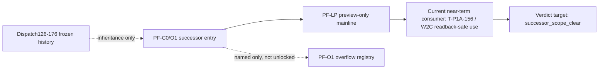

# Successor scope memo

## Historical reference disclaimer

`PF-C0-01R` and adjacent pack wording still mention `PR #194`, but that is no longer a live execution anchor. As of `2026-05-08`, live repo truth in this worktree is `origin/main = 02ccbdc`, with `docs/current.md` naming `T-P1A-156 / W2C` as the only active code-bearing lane and keeping global state at `WAVE_6_CANDIDATE_OPEN / NOT_EXECUTION_APPROVED`.

This memo therefore treats `PR #194` and `Dispatch126-176` as historical reference only. They can explain lineage and inheritance, but they do not open work by themselves and they do not override current authority.

## Live truth snapshot

- Live branch anchor: `origin/main`, `main`, and this worktree `HEAD` are all at `02ccbdc`.
- Current authority anchor: `docs/current.md` and `docs/task-index.md` both show `T-P1A-156 / W2C PF-C4-02 real-data wiring` as the single active product lane.
- Current global guardrail: `write_enabled=False`, `WAVE_6_CANDIDATE_OPEN / NOT_EXECUTION_APPROVED`, overflow lanes remain hold-only.
- Current routing consequence: successor work may clarify entry, preview, and sequencing rules, but may not imply broader unlocks.

## successor_route_diagram

- `Dispatch126-176` are frozen inputs. They are evidence and naming background only.
- `PF-C0/O1` is the successor-entry gate that refreshes current truth and restates blocked overflow.
- `PF-LP` is the only mainline shape this memo recognizes at successor scope: localhost preview-safe consumption, not downstream expansion.
- `PF-O1` stays registry-only in this memo. Naming an overflow lane does not unlock it.

## Frozen inheritance boundary

The inheritance boundary is explicit and closed:

1. `Dispatch126-176` remain frozen historical assets, including the Wave 5 candidate chain, the Wave 6 open/overflow/handoff candidate surfaces, and related post-frozen docs.
2. Successor work may inherit their lessons, vocabulary, and bounded evidence claims.
3. Successor work may not reopen, reorder, relabel, or auto-continue that line.
4. `Dispatch177+` is not an approved sequencing model. Any next work must open from current cluster truth plus a new dispatch or already-open active lane, not from frozen numbering momentum.

## Preview-only and mainline-only scope

This memo sets a narrow scope for successor consumption:

1. Preview-only means localhost-safe readback, preview rendering, copy/download-style user actions, and evidence wording that stays below execution approval.
2. Mainline-only means the near-term useful path is the current code-bearing mainline already named by authority, not speculative parallel successor branches.
3. The current 24h consumer is `T-P1A-156 / W2C`: it can consume this memo as a wording and routing guard so that W2C readback stays honest about preview/readback boundaries.
4. No statement here should be read as approval for authority writeback, runtime enablement, browser automation, vault true write, DB vNext migration, or any automatic downstream cluster opening.

## Seven-step preview-only pass bar

1. Refresh truth from current authority and current `origin/main`, not from frozen pack wording alone.
2. Mark all stale `PR194` and `Dispatch126-176` references as historical-reference-only when reused.
3. Keep successor routing bound to preview-safe localhost surfaces and readback-safe wording.
4. Keep `write_enabled=false` and overflow lanes as blocked names, not soft-ready work items.
5. Treat W2C as the only current mainline consumer; do not infer `PF-C1`, `PF-C2`, `PF-C4`, or `PF-GLOBAL` auto-open from this memo.
6. Reject any automatic `Dispatch177+` continuation logic in naming, staffing, or lane-opening decisions.
7. Use a bounded verdict word: `verdict_target=successor_scope_clear` means the scope memo is internally consistent for successor routing only.

## 24h consumer and verdict target

- 24h consumer: `T-P1A-156 / W2C` implementer, reviewer, or auditor who needs a current wording guard before reading post-frozen successor material.
- Consumer question: "Can I treat frozen 126-176 as background only and keep W2C inside preview-safe/mainline-safe wording?"
- Verdict target: `successor_scope_clear`
- Meaning of the verdict target: the memo cleanly separates historical inheritance, current mainline, and blocked overflow without creating implied approval language.

## Sequencing reset

- Use cluster names and current authority truth for successor sequencing.
- Do not use linear frozen numbering as an execution trigger.
- If a future task needs to open beyond W2C or beyond preview-only localhost scope, it requires a fresh dispatch or authority change elsewhere; this memo does not supply that permission.
