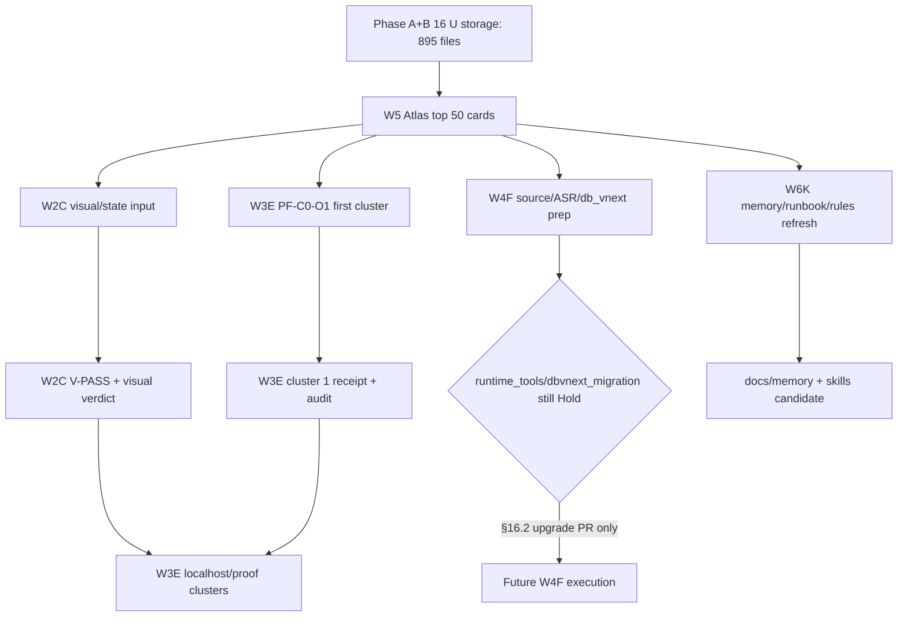

# §0 边界声明 + 4 status 词

本文是 **candidate / not-authority**。它的作用是把 16 U-series reference storage 压缩成 7-day consumption atlas，不替代 current authority、promoted addendum、master spec 或任何 decision log。🧭

| Status word | 本文用法 | 禁止误读 |
|---|---|---|
| current authority | 只由 live authority 文件承载 | 本文不写入/不替代 authority |
| promoted addendum | 已批准补丁，如 PRD/SRD addendum | 本文不自称 promoted |
| candidate north-star | master spec / 本文这种候选地图 | 可指导，不批准 runtime |
| reference storage | 16 U outputs / audit archive | 可 grep，可抽卡，不直接执行 |

**硬边界**:

- 5 overflow lanes 全 Hold: true_vault_write / runtime_tools / browser_automation / dbvnext_migration / full_signal_workbench。
- 不写 implementation code，不输出 `.tsx/.py/.css/.sql` 真 body。
- 不改 authority files，不把 16 U 假装成 authority。
- 所有 promote / instrument / dispatch 都必须走 master spec §16.2 合法升级路径。

## §0.5 Prerequisite Check 真态核验

| Check | 输入 | 结果 | 处置 |
|---:|---|---|---|
| ✅ 1 | `docs/current.md` | live main HEAD=`6dd27d7` (PR #245 latest merge); current.md body anchor=`c802de4` (PR #247 last_refresh, body drift ack); Active product lane=`0/3`; Authority writer=`0/1`; wave=`WAVE_6_CANDIDATE_OPEN / NOT_EXECUTION_APPROVED`; 5 overflow lane Hold | 本文全部按 live main HEAD 锚定 |
| ✅ 2 | `docs/task-index.md` | Active row 空 (`—`); max=`3`; authority writer max=`1` 仍生效 | W3E 可作为 research/spec cluster，不占 product lane，除非后续写 authority |
| ✅ 3 | `docs/decision-log.md` | 已读取；PR #247 closeout 写回 PR #246 closeout chain，decision-log 输出过长，最新 D 编号未在连接器返回中可靠截取 | 以 current.md + PR #247 closeout 为 SHA/PR anchor；见 Self-flag |
| ✅ 4 | `docs/memory/INDEX.md` | cross-vendor memory batch_count=`17`; lessons 7 / feedback 5 / patterns 5 | W6K memory cards 以 17 为当前 live anchor |
| ✅ 5 | master spec §9.13 patch | 11/16 1:1 + 5 U gap；§9.4 Cost Ledger 无 U 来源；U9 semantic cross §9.2 + §14 | 映射表采用 live patch，不采用 prompt stale wording |
| ✅ 6 | Phase A+B + Sniff Master | 16 ZIP / 895 markdown / 1,479,998 words / 137 Mermaid / secret hits 0; Tier verdict 已落 | file count 全用 Sniff Master 真值 |

# §1 16 U cluster 总览表

| U | 主题 | Files | Words | Mermaid | Sniff verdict | Spot verdict | Tier | 关键 deliverable | §9.x 映射 | 消费 wave |
|---|---:|---:|---:|---|---|---|---|---|---|---|

| `U1-deep` | U1 deep | 8 | 22,835 | 7 | CONCERN | CLEAR | Tier 1 promote-ready | PRD-v3/SRD-v3 supplement + NFR envelope | Gap → §19.2 / PRD-v3 candidate shell | W4F+W4G prep |
| `U2-deep` | U2 deep | 9 | 28,622 | 7 | CONCERN | CLEAR | Tier 1 promote-ready + Tier 2 spikes | 5 lane spike + 3D vendor matrix + 15 fail-mode case | Gap → §4-§6 source/ASR/rewrite input | W4F+W4G+W5H spec input |
| `U3-deep` | U3 deep | 9 | 35,867 | 3 | CONCERN | CLEAR | Tier 1 promote-ready | 4 entity v0→v1 + 36 RI test + OpenAPI + cluster trace | Gap → §5.4 db_vnext outline | W4F Lane-4 dbvnext prep |
| `U4-visual-asset` | U4 visual asset | 10 | 21,898 | 0 | CLEAR | CLEAR | Tier 1 promote-ready + Tier 2 hook | visual asset DDL/CRUD/state machine/5-Gate hooks | Gap → W2C visual contract, §9.x 待补 | W2C 后续 visual module |
| `U5-agent-fleet` | U5 agent fleet | 10 | 30,159 | 0 | CONCERN | — | Tier 2 | agent_fleet_dispatch_ledger schema + cross-lane view | §9.2 Agent Fleet | W3E 80-pack |
| `U6-retrieval-dam` | U6 retrieval dam | 9 | 20,278 | 0 | CONCERN false-alarm noted | — | Tier 2 | Asset DAM + thumbnail + pHash | §9.1 Asset DAM | W2C 后续 / W6J |
| `U7-state-library` | U7 state library | 9 | 19,730 | 0 | CONCERN | — | Tier 2 | capture/asset/dispatch/promotion state machines | §9.9 State Machine Library | W2C state machine |
| `U8-egress` | U8 egress | 10 | 20,973 | 0 | CONCERN | — | Tier 2 | Obsidian / ContentFlow / DiloFlow egress manifest | §9.10 Cross-System Egress | W2C output contract / W6J |
| `U9-dispatch-catalog` | U9 dispatch catalog | 96 | 185,637 | 15 | CONCERN | CONCERN-MAJOR | Tier 1 selective dispatch | ≥71 Phase 2-4 dispatch prompt; 60-70% true unique | Gap → §14 pre-flight; semantic cross §9.2 | W3E 80-pack residual |
| `U10-runbook` | U10 runbook | 82 | 164,681 | 10 | CONCERN | CONCERN-MINOR | Tier 1 selective runbook | prosumer SOP runbook 9-segment schema | §9.12 Prosumer SOP Runbook | ScoutFlow-runbooks skill lane |
| `U11-anti-pattern` | U11 anti pattern | 100 | 178,011 | 5 | CONCERN | CONCERN-MAJOR | Tier 2 selective instrument | 80 AP attribution; ~10 worth extracting | §9.6 Anti-pattern Defense | pre-commit + anti-pattern rules |
| `U12-tools-catalog` | U12 tools catalog | 119 | 165,637 | 13 | CONCERN | — | Tier 3 archive | skills/tool/MCP candidate catalog; path drift ≥30% | §9.5 Skills/Tools/MCP Catalog | W6K after deepening |
| `U13-visual-brand` | U13 visual brand | 108 | 198,247 | 37 | CLEAR | CONCERN-MINOR | Tier 1 visual promote-ready | 15 token + 8 panel + 30 icon; prune audit-expansion | §9.7 Visual Brand Atlas Cascade | W2C visual input |
| `U14-apple-silicon` | U14 apple silicon | 78 | 122,693 | 9 | CLEAR | — | Tier 3 archive | Whisper.cpp Metal / VideoToolbox / CoreML / mlx | §9.8 Apple Silicon Optimization | W4F after runtime unlock |
| `U15-decision-log` | U15 decision log | 142 | 118,765 | 19 | CLEAR | CLEAR | Tier 1 promote-ready | 80/240 PR decision atlas + amend chain verification | §9.11 Decision Log Atlas | ScoutFlow-pr-decisions skill lane |
| `U16-memory-graph` | U16 memory graph | 96 | 145,965 | 12 | CONCERN | — | Tier 2 selective instrument | cross-session memory graph 79 candidate nodes | §9.3 Memory Graph | W2D done + W6K refresh |

**质量结论**:

- 小 ZIP（U1/U2/U3/U4）密度最高，Tier 1 可直接抽成 promote/spec cards。
- 大 ZIP 中 U15 是例外：142 file 但 80 PR atlas 天然差异化，Spot CLEAR。
- U9/U10/U11/U13 有明确价值，但必须先处理 boilerplate / audit-expansion 污染，不应整包 promote。
- U12 / U14 先 archive，不主动消费；等 W6K / W4F 解禁后再深挖。

# §2 §9.x 1:1 映射 + 5 U gap 对应表

## §2.1 11/16 1:1 映射

| U | §9.x | 子模块 | 消费 wave | Atlas 动作 |
|---|---|---|---|---|
| U6 | §9.1 | Asset DAM | W2C 后续 / W6J | reference; 等 true_vault_write 或 DAM contract 时读 |
| U5 | §9.2 | Agent Fleet Dispatch Ledger | W3E 80-pack | 抽 ledger schema 进 memory/runbook |
| U16 | §9.3 | Memory Graph | W2D / W6K | 已 land 17 memory; 后续 50-100 graph plan |
| U12 | §9.5 | Skills/Tools/MCP Catalog | W6K | Tier 3 archive，路径 deepening 后再用 |
| U11 | §9.6 | Anti-pattern Defense | pre-commit + rules | 抽 ~10 真 AP，不整包 promote |
| U13 | §9.7 | Visual Brand Atlas Cascade | W2C visual | 抽 token/panel/icon，先删 audit-expansion |
| U14 | §9.8 | Apple Silicon Optimization | W4F | ASR/runtime 解禁后读，不提前执行 |
| U7 | §9.9 | State Machine Library | W2C | 抽 capture/asset 状态机 |
| U8 | §9.10 | Cross-System Egress | W2C/W6J | 抽 not-second-inbox egress checklist |
| U15 | §9.11 | Decision Log Atlas | W6K skills | 抽 PR decision skill + amend patterns |
| U10 | §9.12 | Prosumer SOP Runbook | W6K skills | 抽 RB-REC/RB-BND/RB-MEM/RB-CAP |

## §2.2 5 U gap 真路线

| Gap U | 为什么 gap | 真路线 | 不做什么 |
|---|---|---|---|
| U1 | PRD/SRD supplement，不是 §9 横切模块 | §19.2 / PRD-v3 candidate shell input | 不直接写 authority PRD/SRD |
| U2 | Source/ASR/rewrite 多阶段 spike，不是单模块 | §4-§6 / W4F+W4G+W5H spec input | 不把 spike 当 runtime approval |
| U3 | db_vnext entity/migration evidence | §5.4 / W4F Lane-4 dbvnext prep | 不生成 migration SQL |
| U4 | Visual asset module尚未有 §9.x slot | W2C 后续 visual contract; §9.x 待补 | 不写 services 实现 |
| U9 | dispatch catalog 是 governance/pre-flight 语义 | §14 pre-flight + semantic cross §9.2 | 不整包派 96 file |

# §3 Top 50 actionable cards

> 约束: 每张 card 必含 24h consumer；没有 24h consumer 的候选一律降为 archive。`dest path` 为后续候选落地路径，不代表本窗写入。⚙️

| card_id | source U | source path raw URL | TL;DR | type | 24h consumer | pri | dependency | dest path | effort | verdict | self-flag |
|---|---|---|---|---|---|---|---|---|---|---|---|

| `C01` | `U1-deep` | `https://raw.githubusercontent.com/RayWong1990/ScoutFlow/main/docs/research/strategic-upgrade/2026-05-07/outputs/U1-deep/README-supplement-index-2026-05-07.md` | PRD-v3 supplement worked examples compress into candidate promotion notes | promote | CC1 / W4F PRD-v3 prep / PRD supplement card | P1 | PR #244 storage + §16.2 promotion path | `docs/research/post-frozen/W4F-prd-v3-input/U1-prd-examples.md` | 2h | clear | verify exact source file before PR |
| `C02` | `U1-deep` | `https://raw.githubusercontent.com/RayWong1990/ScoutFlow/main/docs/research/strategic-upgrade/2026-05-07/outputs/U1-deep/README-supplement-index-2026-05-07.md` | SRD-v3 supplement deltas become implementation-neutral contract appendix | promote | CC1 / W4F SRD-v3 prep / SRD supplement card | P1 | PR #244 + no authority direct write | `docs/research/post-frozen/W4F-srd-v3-input/U1-srd-deltas.md` | 2h | clear | verify exact source file before PR |
| `C03` | `U1-deep` | `https://raw.githubusercontent.com/RayWong1990/ScoutFlow/main/docs/research/strategic-upgrade/2026-05-07/outputs/U1-deep/README-supplement-index-2026-05-07.md` | NFR single-user envelope 5-50 signals/day + p99 guardrail | spec | Codex / W4F capacity spike / NFR acceptance | P1 | human capacity assumption confirmed | `docs/research/post-frozen/W4F-nfr/U1-single-user-envelope.md` | 90m | clear | verify exact source file before PR |
| `C04` | `U1-deep` | `https://raw.githubusercontent.com/RayWong1990/ScoutFlow/main/docs/research/strategic-upgrade/2026-05-07/outputs/U1-deep/README-supplement-index-2026-05-07.md` | Single-user prosumer scope lock prevents enterprise/SaaS drift | rule | CC1 / all new cluster pre-flight / boundary paragraph | P0 | none | `docs/research/post-frozen/W5-u-series-execution-atlas/scope-lock.md` | 30m | clear | verify exact source file before PR |
| `C05` | `U1-deep` | `https://raw.githubusercontent.com/RayWong1990/ScoutFlow/main/docs/research/strategic-upgrade/2026-05-07/outputs/U1-deep/README-supplement-index-2026-05-07.md` | PRD-v3 thin shell delta inventory: what is supplement vs authority | spec | GPT Pro / CC1 audit / candidate shell readback | P1 | §16.2 no direct promotion | `docs/research/post-frozen/W4F-prd-v3-input/U1-delta-inventory.md` | 2h | clear | verify exact source file before PR |
| `C06` | `U1-deep` | `https://raw.githubusercontent.com/RayWong1990/ScoutFlow/main/docs/research/strategic-upgrade/2026-05-07/outputs/U1-deep/README-supplement-index-2026-05-07.md` | Promotion redline checklist for U1: not runtime, not migration, not authority | checklist | CC1 / promotion PR pre-flight / redline check | P0 | none | `docs/research/post-frozen/W4F-prd-v3-input/U1-redline-check.md` | 45m | clear | verify exact source file before PR |
| `C07` | `U2-deep` | `https://raw.githubusercontent.com/RayWong1990/ScoutFlow/main/docs/research/strategic-upgrade/2026-05-07/audit/02-spot-U2-deep.md` | 3D vendor matrix becomes source-adapter routing evidence | spec | GPT Pro / W4F adapter matrix / source choice memo | P1 | no live runtime approval | `docs/research/post-frozen/W4F-source-adapter/U2-vendor-matrix.md` | 2h | clear | verify exact source file before PR |
| `C08` | `U2-deep` | `https://raw.githubusercontent.com/RayWong1990/ScoutFlow/main/docs/research/strategic-upgrade/2026-05-07/audit/02-spot-U2-deep.md` | 15 fail-mode cases become runtime gate test scenarios | instrument | Codex / W4F gate tests / failure-mode card | P1 | runtime_tools still Hold | `docs/research/post-frozen/W4F-failmodes/U2-15-cases.md` | 3h | clear | verify exact source file before PR |
| `C09` | `U2-deep` | `https://raw.githubusercontent.com/RayWong1990/ScoutFlow/main/docs/research/strategic-upgrade/2026-05-07/audit/02-spot-U2-deep.md` | Lane spike command 1: source adapter discovery only | runbook | Codex / W4F spike / no-runtime discovery dispatch | P2 | explicit no runtime execution | `docs/research/post-frozen/W4F-spikes/U2-lane1-source.md` | 1h | clear | verify exact source file before PR |
| `C10` | `U2-deep` | `https://raw.githubusercontent.com/RayWong1990/ScoutFlow/main/docs/research/strategic-upgrade/2026-05-07/audit/02-spot-U2-deep.md` | Lane spike command 2: ASR model comparison plan | runbook | Codex / W4F spike / ASR benchmark plan | P2 | runtime_tools Hold until authority upgrade | `docs/research/post-frozen/W4F-spikes/U2-lane2-asr.md` | 1h | clear | verify exact source file before PR |
| `C11` | `U2-deep` | `https://raw.githubusercontent.com/RayWong1990/ScoutFlow/main/docs/research/strategic-upgrade/2026-05-07/audit/02-spot-U2-deep.md` | Lane spike command 3: rewrite router A/B plan | runbook | GPT Pro / W5H spec / rewrite matrix | P2 | LLM cost budget missing | `docs/research/post-frozen/W5H-rewrite/U2-router-plan.md` | 1h | clear | verify exact source file before PR |
| `C12` | `U2-deep` | `https://raw.githubusercontent.com/RayWong1990/ScoutFlow/main/docs/research/strategic-upgrade/2026-05-07/audit/02-spot-U2-deep.md` | Lane spike command 4-5: egress and full loop readiness | runbook | CC1 / W6J prep / gate checklist | P2 | true_vault_write Hold | `docs/research/post-frozen/W6J-prep/U2-egress-full-loop.md` | 90m | clear | verify exact source file before PR |
| `C13` | `U3-deep` | `https://raw.githubusercontent.com/RayWong1990/ScoutFlow/main/docs/research/strategic-upgrade/2026-05-07/audit/02-spot-U3-deep.md` | 4 entity v0→v1 worked examples become db_vnext design evidence | spec | CC1 / W4F Lane-4 / entity upgrade card | P1 | dbvnext_migration Hold | `docs/research/post-frozen/W4F-db-vnext/U3-entity-examples.md` | 3h | clear | verify exact source file before PR |
| `C14` | `U3-deep` | `https://raw.githubusercontent.com/RayWong1990/ScoutFlow/main/docs/research/strategic-upgrade/2026-05-07/audit/02-spot-U3-deep.md` | 36 referential-integrity tests become migration pre-flight checklist | checklist | Codex / W4F db preflight / RI contract | P1 | no migration SQL generated | `docs/research/post-frozen/W4F-db-vnext/U3-ri-36.md` | 2h | clear | verify exact source file before PR |
| `C15` | `U3-deep` | `https://raw.githubusercontent.com/RayWong1990/ScoutFlow/main/docs/research/strategic-upgrade/2026-05-07/audit/02-spot-U3-deep.md` | 16 OpenAPI samples become thin API route contract examples | spec | Codex / W4F API card / route schema | P2 | OpenAPI only, no implementation | `docs/research/post-frozen/W4F-api/U3-openapi-samples.md` | 2h | clear | verify exact source file before PR |
| `C16` | `U3-deep` | `https://raw.githubusercontent.com/RayWong1990/ScoutFlow/main/docs/research/strategic-upgrade/2026-05-07/audit/02-spot-U3-deep.md` | 28 cluster traces become dependency graph for db_vnext lane | instrument | CC1 / W4F planning / trace map | P2 | requires human review | `docs/research/post-frozen/W4F-db-vnext/U3-cluster-traces.md` | 2h | clear | verify exact source file before PR |
| `C17` | `U3-deep` | `https://raw.githubusercontent.com/RayWong1990/ScoutFlow/main/docs/research/strategic-upgrade/2026-05-07/audit/02-spot-U3-deep.md` | Rollback path card for any future entity migration | rule | Hermes / migration external audit / rollback check | P0 | §16.2 explicit migration approval | `docs/research/post-frozen/W4F-db-vnext/U3-rollback-rule.md` | 1h | clear | verify exact source file before PR |
| `C18` | `U3-deep` | `https://raw.githubusercontent.com/RayWong1990/ScoutFlow/main/docs/research/strategic-upgrade/2026-05-07/audit/02-spot-U3-deep.md` | Entity expansion anti-KM guard: proof before objectification | rule | GPT Pro / W3E + W4F pre-flight / overobjectification guard | P0 | docs/memory P-OBJECTS-AFTER-PROOF | `docs/research/post-frozen/W4F-db-vnext/U3-object-guard.md` | 45m | clear | verify exact source file before PR |
| `C19` | `U4-visual-asset` | `https://raw.githubusercontent.com/RayWong1990/ScoutFlow/main/docs/research/strategic-upgrade/2026-05-07/audit/02-spot-U4-visual-asset.md` | Visual asset module contract extracted without writing implementation | spec | CC1 / W2C visual module / contract skeleton | P1 | no services implementation in this pass | `docs/research/post-frozen/W2C-visual/U4-module-contract.md` | 2h | clear | verify exact source file before PR |
| `C20` | `U4-visual-asset` | `https://raw.githubusercontent.com/RayWong1990/ScoutFlow/main/docs/research/strategic-upgrade/2026-05-07/audit/02-spot-U4-visual-asset.md` | Visual asset state machine feeds W2C surface state grammar | instrument | Codex / W2C state-machine dispatch / state table | P1 | W2C dispatch registration | `docs/research/post-frozen/W2C-visual/U4-state-machine.md` | 2h | clear | verify exact source file before PR |
| `C21` | `U4-visual-asset` | `https://raw.githubusercontent.com/RayWong1990/ScoutFlow/main/docs/research/strategic-upgrade/2026-05-07/audit/02-spot-U4-visual-asset.md` | CRUD semantics translated to API contract language only | spec | Codex / W2C API contract / non-code spec | P2 | no CRUD code body | `docs/research/post-frozen/W2C-visual/U4-crud-contract.md` | 2h | clear | verify exact source file before PR |
| `C22` | `U4-visual-asset` | `https://raw.githubusercontent.com/RayWong1990/ScoutFlow/main/docs/research/strategic-upgrade/2026-05-07/audit/02-spot-U4-visual-asset.md` | 5-Gate automation hooks become visual QA lock guard | checklist | CC1 / W2C visual V-PASS / 5-Gate card | P1 | browser_automation Hold | `docs/research/post-frozen/W2C-visual/U4-5gate-hooks.md` | 90m | clear | verify exact source file before PR |
| `C23` | `U4-visual-asset` | `https://raw.githubusercontent.com/RayWong1990/ScoutFlow/main/docs/research/strategic-upgrade/2026-05-07/audit/02-spot-U4-visual-asset.md` | Asset lifecycle event ledger mapped to Trust Trace evidence | spec | GPT Pro / W2C Trust Trace / asset evidence | P2 | requires U6 DAM cross-check | `docs/research/post-frozen/W2C-visual/U4-asset-ledger.md` | 2h | clear | verify exact source file before PR |
| `C24` | `U4-visual-asset` | `https://raw.githubusercontent.com/RayWong1990/ScoutFlow/main/docs/research/strategic-upgrade/2026-05-07/audit/02-spot-U4-visual-asset.md` | Placeholder honesty checklist for thumbnail / graph / timeline / error-path | checklist | Codex / W2C closeout / honest TODO check | P0 | none | `docs/research/post-frozen/W2C-visual/U4-placeholder-honesty.md` | 30m | clear | verify exact source file before PR |
| `C25` | `U15-decision-log` | `https://raw.githubusercontent.com/RayWong1990/ScoutFlow/main/docs/research/strategic-upgrade/2026-05-07/audit/02-spot-U15-decision-log.md` | MASTER decision atlas becomes PR decision retrieval skill input | skill | CC1 / ScoutFlow-pr-decisions skill / recall card | P1 | no authority rewrite | `docs/research/post-frozen/W6K-skills/U15-master-atlas.md` | 3h | clear | verify exact source file before PR |
| `C26` | `U15-decision-log` | `https://raw.githubusercontent.com/RayWong1990/ScoutFlow/main/docs/research/strategic-upgrade/2026-05-07/audit/02-spot-U15-decision-log.md` | AMEND trail map normalizes amend_and_proceed history | runbook | Codex / cluster closeout / amend receipt schema | P1 | none | `docs/research/post-frozen/W6K-skills/U15-amend-trail.md` | 2h | clear | verify exact source file before PR |
| `C27` | `U15-decision-log` | `https://raw.githubusercontent.com/RayWong1990/ScoutFlow/main/docs/research/strategic-upgrade/2026-05-07/audit/02-spot-U15-decision-log.md` | 80 PR cards indexed by introduced/exposed/both category | instrument | CC1 / PR review preflight / category query | P2 | verify latest PR status when cited | `docs/research/post-frozen/W6K-skills/U15-pr-card-index.md` | 3h | clear | verify exact source file before PR |
| `C28` | `U15-decision-log` | `https://raw.githubusercontent.com/RayWong1990/ScoutFlow/main/docs/research/strategic-upgrade/2026-05-07/audit/02-spot-U15-decision-log.md` | PATTERN-04 boundary preservation distilled into guard rule | rule | Hermes / external audit / boundary preservation | P0 | none | `docs/research/post-frozen/W6K-rules/U15-pattern-04.md` | 1h | clear | verify exact source file before PR |
| `C29` | `U15-decision-log` | `https://raw.githubusercontent.com/RayWong1990/ScoutFlow/main/docs/research/strategic-upgrade/2026-05-07/audit/02-spot-U15-decision-log.md` | PATTERN-11 introduced-vs-exposed prevents false blame | rule | CC1 / audit closeout / attribution rule | P1 | none | `docs/research/post-frozen/W6K-rules/U15-pattern-11.md` | 1h | clear | verify exact source file before PR |
| `C30` | `U15-decision-log` | `https://raw.githubusercontent.com/RayWong1990/ScoutFlow/main/docs/research/strategic-upgrade/2026-05-07/audit/02-spot-U15-decision-log.md` | PATTERN-15 rollback path becomes PR closeout checklist | checklist | Codex / PR closeout / rollback section | P1 | none | `docs/research/post-frozen/W6K-rules/U15-pattern-15.md` | 1h | clear | verify exact source file before PR |
| `C31` | `U13-visual-brand` | `https://raw.githubusercontent.com/RayWong1990/ScoutFlow/main/docs/research/strategic-upgrade/2026-05-07/audit/02-spot-U13-visual-brand.md` | TOKEN-01 palette becomes capture-station visual source candidate | promote | Codex / W2C visual token dispatch / token card | P1 | prune audit-expansion first | `docs/research/post-frozen/W2C-visual/U13-token-palette.md` | 2h | concern-minor | verify exact source file before PR |
| `C32` | `U13-visual-brand` | `https://raw.githubusercontent.com/RayWong1990/ScoutFlow/main/docs/research/strategic-upgrade/2026-05-07/audit/02-spot-U13-visual-brand.md` | Contrast matrix becomes 5-Gate visual acceptance evidence | checklist | CC1 / W2C V-PASS / contrast card | P1 | human visual review | `docs/research/post-frozen/W2C-visual/U13-contrast-matrix.md` | 90m | concern-minor | verify exact source file before PR |
| `C33` | `U13-visual-brand` | `https://raw.githubusercontent.com/RayWong1990/ScoutFlow/main/docs/research/strategic-upgrade/2026-05-07/audit/02-spot-U13-visual-brand.md` | Panel 01-04 specs map to capture workstation surface grammar | spec | Codex / W2C surface dispatch / panel group A | P1 | token-only discipline | `docs/research/post-frozen/W2C-visual/U13-panel-01-04.md` | 2h | concern-minor | verify exact source file before PR |
| `C34` | `U13-visual-brand` | `https://raw.githubusercontent.com/RayWong1990/ScoutFlow/main/docs/research/strategic-upgrade/2026-05-07/audit/02-spot-U13-visual-brand.md` | Panel 05-08 specs map to Trust Trace / Vault / Topic surfaces | spec | Codex / W2C surface dispatch / panel group B | P1 | token-only discipline | `docs/research/post-frozen/W2C-visual/U13-panel-05-08.md` | 2h | concern-minor | verify exact source file before PR |
| `C35` | `U13-visual-brand` | `https://raw.githubusercontent.com/RayWong1990/ScoutFlow/main/docs/research/strategic-upgrade/2026-05-07/audit/02-spot-U13-visual-brand.md` | 30 icon library becomes sprite candidate inventory | promote | Codex / W2C icons dispatch / icon sprite | P2 | no vendored UI | `docs/research/post-frozen/W2C-visual/U13-icon-library.md` | 2h | concern-minor | verify exact source file before PR |
| `C36` | `U13-visual-brand` | `https://raw.githubusercontent.com/RayWong1990/ScoutFlow/main/docs/research/strategic-upgrade/2026-05-07/audit/02-spot-U13-visual-brand.md` | State grammar merges U7 state library with visual badge states | instrument | GPT Pro / W2C state grammar / cross-U bridge | P1 | requires U7 cross-check | `docs/research/post-frozen/W2C-visual/U13-state-grammar.md` | 2h | concern-minor | verify exact source file before PR |
| `C37` | `U13-visual-brand` | `https://raw.githubusercontent.com/RayWong1990/ScoutFlow/main/docs/research/strategic-upgrade/2026-05-07/audit/02-spot-U13-visual-brand.md` | Audit-expansion boilerplate removal plan preserves true token content | cleanup | CC1 / U13 promote prep / prune patch | P1 | mechanical prune only | `docs/research/post-frozen/W2C-visual/U13-boilerplate-prune.md` | 1h | concern-minor | verify exact source file before PR |
| `C38` | `U13-visual-brand` | `https://raw.githubusercontent.com/RayWong1990/ScoutFlow/main/docs/research/strategic-upgrade/2026-05-07/audit/02-spot-U13-visual-brand.md` | Visual brand cascade becomes no-shadcn/no-Radix decision note | rule | Codex / frontend boundary / package redline | P0 | none | `docs/research/post-frozen/W2C-visual/U13-vendor-redline.md` | 30m | clear | verify exact source file before PR |
| `C39` | `U9-dispatch-catalog` | `https://raw.githubusercontent.com/RayWong1990/ScoutFlow/main/docs/research/strategic-upgrade/2026-05-07/audit/02-spot-U9-dispatch-catalog.md` | P2-LANE2-01 BBDown legal recheck dispatch extracted | dispatch | Codex / W3E cluster / legal recheck card | P2 | runtime_tools Hold | `docs/research/post-frozen/W3E-u9/U9-bbdown-legal.md` | 90m | concern-major | boilerplate tail must be pruned |
| `C40` | `U9-dispatch-catalog` | `https://raw.githubusercontent.com/RayWong1990/ScoutFlow/main/docs/research/strategic-upgrade/2026-05-07/audit/02-spot-U9-dispatch-catalog.md` | P2-LANE4-05 db_vnext dispatch extracted without migration | dispatch | Codex / W3E cluster / db-vnext prep | P2 | dbvnext_migration Hold | `docs/research/post-frozen/W3E-u9/U9-db-vnext.md` | 90m | concern-major | boilerplate tail must be pruned |
| `C41` | `U9-dispatch-catalog` | `https://raw.githubusercontent.com/RayWong1990/ScoutFlow/main/docs/research/strategic-upgrade/2026-05-07/audit/02-spot-U9-dispatch-catalog.md` | P3-CapturePlan-01 dispatch feeds localhost preview proof | dispatch | Codex / W3E localhost / capture plan card | P2 | W2C proof or strong partial | `docs/research/post-frozen/W3E-u9/U9-capture-plan.md` | 90m | concern-major | boilerplate tail must be pruned |
| `C42` | `U9-dispatch-catalog` | `https://raw.githubusercontent.com/RayWong1990/ScoutFlow/main/docs/research/strategic-upgrade/2026-05-07/audit/02-spot-U9-dispatch-catalog.md` | MOD-EGRESS-01 dispatch bridges U8 cross-system egress | dispatch | Codex / W3E egress / handoff card | P2 | true_vault_write Hold | `docs/research/post-frozen/W3E-u9/U9-egress.md` | 90m | concern-major | boilerplate tail must be pruned |
| `C43` | `U10-runbook` | `https://raw.githubusercontent.com/RayWong1990/ScoutFlow/main/docs/research/strategic-upgrade/2026-05-07/audit/02-spot-U10-runbook.md` | RB-REC six-pack becomes recommendation review SOP bundle | runbook | CC1 / ScoutFlow-runbooks / recommendation SOP | P2 | linked_dispatch remap | `docs/research/post-frozen/W6K-runbooks/U10-rb-rec.md` | 2h | concern-minor | linked_dispatch namespace remap needed |
| `C44` | `U10-runbook` | `https://raw.githubusercontent.com/RayWong1990/ScoutFlow/main/docs/research/strategic-upgrade/2026-05-07/audit/02-spot-U10-runbook.md` | RB-BND-04/05 becomes boundary review SOP | runbook | Hermes / external audit / boundary SOP | P1 | remove boilerplate tail | `docs/research/post-frozen/W6K-runbooks/U10-rb-bnd.md` | 90m | concern-minor | linked_dispatch namespace remap needed |
| `C45` | `U10-runbook` | `https://raw.githubusercontent.com/RayWong1990/ScoutFlow/main/docs/research/strategic-upgrade/2026-05-07/audit/02-spot-U10-runbook.md` | RB-MEM-01 becomes memory ingestion SOP | runbook | CC1 / W6K memory refresh / memory SOP | P2 | align docs/memory path | `docs/research/post-frozen/W6K-runbooks/U10-rb-mem.md` | 90m | concern-minor | linked_dispatch namespace remap needed |
| `C46` | `U10-runbook` | `https://raw.githubusercontent.com/RayWong1990/ScoutFlow/main/docs/research/strategic-upgrade/2026-05-07/audit/02-spot-U10-runbook.md` | RB-CAP-01 becomes capture station review SOP | runbook | Codex / W2C closeout / capture SOP | P1 | remove P1-P8 precondition boilerplate | `docs/research/post-frozen/W6K-runbooks/U10-rb-cap.md` | 90m | concern-minor | linked_dispatch namespace remap needed |
| `C47` | `U7-state-library` | `https://raw.githubusercontent.com/RayWong1990/ScoutFlow/main/docs/research/strategic-upgrade/2026-05-07/outputs/U7-state-library/` | Capture + Asset state machines distilled into W2C state grammar | instrument | Codex / W2C state-machine dispatch / state table | P1 | U13 visual grammar cross-check | `docs/research/post-frozen/W2C-state/U7-state-grammar.md` | 2h | clear | exact source README not fetched |
| `C48` | `U8-egress` | `https://raw.githubusercontent.com/RayWong1990/ScoutFlow/main/docs/research/strategic-upgrade/2026-05-07/outputs/U8-egress/` | Egress manifest becomes not-second-inbox handoff checklist | instrument | Codex / W3E raw handoff / egress checklist | P2 | true_vault_write Hold | `docs/research/post-frozen/W3E-egress/U8-egress-check.md` | 2h | clear | exact source README not fetched |
| `C49` | `U11-anti-pattern` | `https://raw.githubusercontent.com/RayWong1990/ScoutFlow/main/docs/research/strategic-upgrade/2026-05-07/audit/02-spot-U11-anti-pattern.md` | ~10 true ScoutFlow PR-anchored AP extracted, template prose rejected | instrument | CC1 / anti-pattern rule refresh / AP shortlist | P1 | prune 80/80 shared template prose | `docs/research/post-frozen/W6K-anti-patterns/U11-top10.md` | 3h | concern-major | high boilerplate risk |
| `C50` | `U16-memory-graph` | `https://raw.githubusercontent.com/RayWong1990/ScoutFlow/main/docs/research/strategic-upgrade/2026-05-07/outputs/U16-memory-graph/MASTER-MEMORY-ATLAS.md` | Memory graph 79 node source feeds 50-100 cross-session graph plan | instrument | CC1 / W6K refresh / memory graph card | P1 | docs/memory 17 already landed | `docs/research/post-frozen/W6K-memory/U16-graph-plan.md` | 2h | clear | add linked_memory fields |

## §3.1 Top 50 派单原则

- **P0**: boundary / redline / rollback / no-runtime / no-authority-write；这些先进入每个 cluster commander prompt。
- **P1**: Tier 1 promote-ready 与 W2C/W3E/W4F 24h 可消费输入。
- **P2**: 依赖 Hold lane 或需要 boilerplate prune 的高价值卡。
- **P3/P4**: 本轮未列入 top 50，默认 archive。

## §3.2 拒绝整包 promote 的理由

| ZIP | 不整包 promote 原因 | 可抽取策略 |
|---|---|---|
| U9 | 96 file 中 README/尾部 boilerplate 明显；Spot CONCERN-MAJOR | 只抽 4 个高密度 dispatch |
| U10 | 82 file 中 P1-P8 precondition 尾部共同句；Spot CONCERN-MINOR | 只抽 RB-REC / RB-BND / RB-MEM / RB-CAP |
| U11 | 80/80 AP 共享模板 prose；unique 25-30% | 只抽约 10 个真 PR 锚点 AP |
| U13 | audit-expansion 30-40% 字污染；视觉真内容强 | prune 后抽 token/panel/icon |
| U12 | ≥30% 路径不准 | archive，W6K deepening 后再消费 |

## §3.3 50-card mini acceptance ledger

> 这一段用于 CC1 / Codex 把 top 50 表转成单卡 dispatch 或 promote checklist 时做微验收；每卡都列 pre-flight / pass condition / stop condition。

### C01 — U1-deep
- **24h consumer**: CC1 / W4F PRD-v3 prep / PRD supplement card.
- **Pre-flight**: read `current.md` live anchor + confirm dependency: PR #244 storage + §16.2 promotion path.
- **Pass condition**: `docs/research/post-frozen/W4F-prd-v3-input/U1-prd-examples.md` candidate note/card exists, status not-authority, verdict target `clear` preserved.
- **Stop condition**: any authority write, runtime/migration/browser/vault unlock claim, or missing consumer → REGENERATE / archive.

### C02 — U1-deep
- **24h consumer**: CC1 / W4F SRD-v3 prep / SRD supplement card.
- **Pre-flight**: read `current.md` live anchor + confirm dependency: PR #244 + no authority direct write.
- **Pass condition**: `docs/research/post-frozen/W4F-srd-v3-input/U1-srd-deltas.md` candidate note/card exists, status not-authority, verdict target `clear` preserved.
- **Stop condition**: any authority write, runtime/migration/browser/vault unlock claim, or missing consumer → REGENERATE / archive.

### C03 — U1-deep
- **24h consumer**: Codex / W4F capacity spike / NFR acceptance.
- **Pre-flight**: read `current.md` live anchor + confirm dependency: human capacity assumption confirmed.
- **Pass condition**: `docs/research/post-frozen/W4F-nfr/U1-single-user-envelope.md` candidate note/card exists, status not-authority, verdict target `clear` preserved.
- **Stop condition**: any authority write, runtime/migration/browser/vault unlock claim, or missing consumer → REGENERATE / archive.

### C04 — U1-deep
- **24h consumer**: CC1 / all new cluster pre-flight / boundary paragraph.
- **Pre-flight**: read `current.md` live anchor + confirm dependency: none.
- **Pass condition**: `docs/research/post-frozen/W5-u-series-execution-atlas/scope-lock.md` candidate note/card exists, status not-authority, verdict target `clear` preserved.
- **Stop condition**: any authority write, runtime/migration/browser/vault unlock claim, or missing consumer → REGENERATE / archive.

### C05 — U1-deep
- **24h consumer**: GPT Pro / CC1 audit / candidate shell readback.
- **Pre-flight**: read `current.md` live anchor + confirm dependency: §16.2 no direct promotion.
- **Pass condition**: `docs/research/post-frozen/W4F-prd-v3-input/U1-delta-inventory.md` candidate note/card exists, status not-authority, verdict target `clear` preserved.
- **Stop condition**: any authority write, runtime/migration/browser/vault unlock claim, or missing consumer → REGENERATE / archive.

### C06 — U1-deep
- **24h consumer**: CC1 / promotion PR pre-flight / redline check.
- **Pre-flight**: read `current.md` live anchor + confirm dependency: none.
- **Pass condition**: `docs/research/post-frozen/W4F-prd-v3-input/U1-redline-check.md` candidate note/card exists, status not-authority, verdict target `clear` preserved.
- **Stop condition**: any authority write, runtime/migration/browser/vault unlock claim, or missing consumer → REGENERATE / archive.

### C07 — U2-deep
- **24h consumer**: GPT Pro / W4F adapter matrix / source choice memo.
- **Pre-flight**: read `current.md` live anchor + confirm dependency: no live runtime approval.
- **Pass condition**: `docs/research/post-frozen/W4F-source-adapter/U2-vendor-matrix.md` candidate note/card exists, status not-authority, verdict target `clear` preserved.
- **Stop condition**: any authority write, runtime/migration/browser/vault unlock claim, or missing consumer → REGENERATE / archive.

### C08 — U2-deep
- **24h consumer**: Codex / W4F gate tests / failure-mode card.
- **Pre-flight**: read `current.md` live anchor + confirm dependency: runtime_tools still Hold.
- **Pass condition**: `docs/research/post-frozen/W4F-failmodes/U2-15-cases.md` candidate note/card exists, status not-authority, verdict target `clear` preserved.
- **Stop condition**: any authority write, runtime/migration/browser/vault unlock claim, or missing consumer → REGENERATE / archive.

### C09 — U2-deep
- **24h consumer**: Codex / W4F spike / no-runtime discovery dispatch.
- **Pre-flight**: read `current.md` live anchor + confirm dependency: explicit no runtime execution.
- **Pass condition**: `docs/research/post-frozen/W4F-spikes/U2-lane1-source.md` candidate note/card exists, status not-authority, verdict target `clear` preserved.
- **Stop condition**: any authority write, runtime/migration/browser/vault unlock claim, or missing consumer → REGENERATE / archive.

### C10 — U2-deep
- **24h consumer**: Codex / W4F spike / ASR benchmark plan.
- **Pre-flight**: read `current.md` live anchor + confirm dependency: runtime_tools Hold until authority upgrade.
- **Pass condition**: `docs/research/post-frozen/W4F-spikes/U2-lane2-asr.md` candidate note/card exists, status not-authority, verdict target `clear` preserved.
- **Stop condition**: any authority write, runtime/migration/browser/vault unlock claim, or missing consumer → REGENERATE / archive.

### C11 — U2-deep
- **24h consumer**: GPT Pro / W5H spec / rewrite matrix.
- **Pre-flight**: read `current.md` live anchor + confirm dependency: LLM cost budget missing.
- **Pass condition**: `docs/research/post-frozen/W5H-rewrite/U2-router-plan.md` candidate note/card exists, status not-authority, verdict target `clear` preserved.
- **Stop condition**: any authority write, runtime/migration/browser/vault unlock claim, or missing consumer → REGENERATE / archive.

### C12 — U2-deep
- **24h consumer**: CC1 / W6J prep / gate checklist.
- **Pre-flight**: read `current.md` live anchor + confirm dependency: true_vault_write Hold.
- **Pass condition**: `docs/research/post-frozen/W6J-prep/U2-egress-full-loop.md` candidate note/card exists, status not-authority, verdict target `clear` preserved.
- **Stop condition**: any authority write, runtime/migration/browser/vault unlock claim, or missing consumer → REGENERATE / archive.

### C13 — U3-deep
- **24h consumer**: CC1 / W4F Lane-4 / entity upgrade card.
- **Pre-flight**: read `current.md` live anchor + confirm dependency: dbvnext_migration Hold.
- **Pass condition**: `docs/research/post-frozen/W4F-db-vnext/U3-entity-examples.md` candidate note/card exists, status not-authority, verdict target `clear` preserved.
- **Stop condition**: any authority write, runtime/migration/browser/vault unlock claim, or missing consumer → REGENERATE / archive.

### C14 — U3-deep
- **24h consumer**: Codex / W4F db preflight / RI contract.
- **Pre-flight**: read `current.md` live anchor + confirm dependency: no migration SQL generated.
- **Pass condition**: `docs/research/post-frozen/W4F-db-vnext/U3-ri-36.md` candidate note/card exists, status not-authority, verdict target `clear` preserved.
- **Stop condition**: any authority write, runtime/migration/browser/vault unlock claim, or missing consumer → REGENERATE / archive.

### C15 — U3-deep
- **24h consumer**: Codex / W4F API card / route schema.
- **Pre-flight**: read `current.md` live anchor + confirm dependency: OpenAPI only, no implementation.
- **Pass condition**: `docs/research/post-frozen/W4F-api/U3-openapi-samples.md` candidate note/card exists, status not-authority, verdict target `clear` preserved.
- **Stop condition**: any authority write, runtime/migration/browser/vault unlock claim, or missing consumer → REGENERATE / archive.

### C16 — U3-deep
- **24h consumer**: CC1 / W4F planning / trace map.
- **Pre-flight**: read `current.md` live anchor + confirm dependency: requires human review.
- **Pass condition**: `docs/research/post-frozen/W4F-db-vnext/U3-cluster-traces.md` candidate note/card exists, status not-authority, verdict target `clear` preserved.
- **Stop condition**: any authority write, runtime/migration/browser/vault unlock claim, or missing consumer → REGENERATE / archive.

### C17 — U3-deep
- **24h consumer**: Hermes / migration external audit / rollback check.
- **Pre-flight**: read `current.md` live anchor + confirm dependency: §16.2 explicit migration approval.
- **Pass condition**: `docs/research/post-frozen/W4F-db-vnext/U3-rollback-rule.md` candidate note/card exists, status not-authority, verdict target `clear` preserved.
- **Stop condition**: any authority write, runtime/migration/browser/vault unlock claim, or missing consumer → REGENERATE / archive.

### C18 — U3-deep
- **24h consumer**: GPT Pro / W3E + W4F pre-flight / overobjectification guard.
- **Pre-flight**: read `current.md` live anchor + confirm dependency: docs/memory P-OBJECTS-AFTER-PROOF.
- **Pass condition**: `docs/research/post-frozen/W4F-db-vnext/U3-object-guard.md` candidate note/card exists, status not-authority, verdict target `clear` preserved.
- **Stop condition**: any authority write, runtime/migration/browser/vault unlock claim, or missing consumer → REGENERATE / archive.

### C19 — U4-visual-asset
- **24h consumer**: CC1 / W2C visual module / contract skeleton.
- **Pre-flight**: read `current.md` live anchor + confirm dependency: no services implementation in this pass.
- **Pass condition**: `docs/research/post-frozen/W2C-visual/U4-module-contract.md` candidate note/card exists, status not-authority, verdict target `clear` preserved.
- **Stop condition**: any authority write, runtime/migration/browser/vault unlock claim, or missing consumer → REGENERATE / archive.

### C20 — U4-visual-asset
- **24h consumer**: Codex / W2C state-machine dispatch / state table.
- **Pre-flight**: read `current.md` live anchor + confirm dependency: W2C dispatch registration.
- **Pass condition**: `docs/research/post-frozen/W2C-visual/U4-state-machine.md` candidate note/card exists, status not-authority, verdict target `clear` preserved.
- **Stop condition**: any authority write, runtime/migration/browser/vault unlock claim, or missing consumer → REGENERATE / archive.

### C21 — U4-visual-asset
- **24h consumer**: Codex / W2C API contract / non-code spec.
- **Pre-flight**: read `current.md` live anchor + confirm dependency: no CRUD code body.
- **Pass condition**: `docs/research/post-frozen/W2C-visual/U4-crud-contract.md` candidate note/card exists, status not-authority, verdict target `clear` preserved.
- **Stop condition**: any authority write, runtime/migration/browser/vault unlock claim, or missing consumer → REGENERATE / archive.

### C22 — U4-visual-asset
- **24h consumer**: CC1 / W2C visual V-PASS / 5-Gate card.
- **Pre-flight**: read `current.md` live anchor + confirm dependency: browser_automation Hold.
- **Pass condition**: `docs/research/post-frozen/W2C-visual/U4-5gate-hooks.md` candidate note/card exists, status not-authority, verdict target `clear` preserved.
- **Stop condition**: any authority write, runtime/migration/browser/vault unlock claim, or missing consumer → REGENERATE / archive.

### C23 — U4-visual-asset
- **24h consumer**: GPT Pro / W2C Trust Trace / asset evidence.
- **Pre-flight**: read `current.md` live anchor + confirm dependency: requires U6 DAM cross-check.
- **Pass condition**: `docs/research/post-frozen/W2C-visual/U4-asset-ledger.md` candidate note/card exists, status not-authority, verdict target `clear` preserved.
- **Stop condition**: any authority write, runtime/migration/browser/vault unlock claim, or missing consumer → REGENERATE / archive.

### C24 — U4-visual-asset
- **24h consumer**: Codex / W2C closeout / honest TODO check.
- **Pre-flight**: read `current.md` live anchor + confirm dependency: none.
- **Pass condition**: `docs/research/post-frozen/W2C-visual/U4-placeholder-honesty.md` candidate note/card exists, status not-authority, verdict target `clear` preserved.
- **Stop condition**: any authority write, runtime/migration/browser/vault unlock claim, or missing consumer → REGENERATE / archive.

### C25 — U15-decision-log
- **24h consumer**: CC1 / ScoutFlow-pr-decisions skill / recall card.
- **Pre-flight**: read `current.md` live anchor + confirm dependency: no authority rewrite.
- **Pass condition**: `docs/research/post-frozen/W6K-skills/U15-master-atlas.md` candidate note/card exists, status not-authority, verdict target `clear` preserved.
- **Stop condition**: any authority write, runtime/migration/browser/vault unlock claim, or missing consumer → REGENERATE / archive.

### C26 — U15-decision-log
- **24h consumer**: Codex / cluster closeout / amend receipt schema.
- **Pre-flight**: read `current.md` live anchor + confirm dependency: none.
- **Pass condition**: `docs/research/post-frozen/W6K-skills/U15-amend-trail.md` candidate note/card exists, status not-authority, verdict target `clear` preserved.
- **Stop condition**: any authority write, runtime/migration/browser/vault unlock claim, or missing consumer → REGENERATE / archive.

### C27 — U15-decision-log
- **24h consumer**: CC1 / PR review preflight / category query.
- **Pre-flight**: read `current.md` live anchor + confirm dependency: verify latest PR status when cited.
- **Pass condition**: `docs/research/post-frozen/W6K-skills/U15-pr-card-index.md` candidate note/card exists, status not-authority, verdict target `clear` preserved.
- **Stop condition**: any authority write, runtime/migration/browser/vault unlock claim, or missing consumer → REGENERATE / archive.

### C28 — U15-decision-log
- **24h consumer**: Hermes / external audit / boundary preservation.
- **Pre-flight**: read `current.md` live anchor + confirm dependency: none.
- **Pass condition**: `docs/research/post-frozen/W6K-rules/U15-pattern-04.md` candidate note/card exists, status not-authority, verdict target `clear` preserved.
- **Stop condition**: any authority write, runtime/migration/browser/vault unlock claim, or missing consumer → REGENERATE / archive.

### C29 — U15-decision-log
- **24h consumer**: CC1 / audit closeout / attribution rule.
- **Pre-flight**: read `current.md` live anchor + confirm dependency: none.
- **Pass condition**: `docs/research/post-frozen/W6K-rules/U15-pattern-11.md` candidate note/card exists, status not-authority, verdict target `clear` preserved.
- **Stop condition**: any authority write, runtime/migration/browser/vault unlock claim, or missing consumer → REGENERATE / archive.

### C30 — U15-decision-log
- **24h consumer**: Codex / PR closeout / rollback section.
- **Pre-flight**: read `current.md` live anchor + confirm dependency: none.
- **Pass condition**: `docs/research/post-frozen/W6K-rules/U15-pattern-15.md` candidate note/card exists, status not-authority, verdict target `clear` preserved.
- **Stop condition**: any authority write, runtime/migration/browser/vault unlock claim, or missing consumer → REGENERATE / archive.

### C31 — U13-visual-brand
- **24h consumer**: Codex / W2C visual token dispatch / token card.
- **Pre-flight**: read `current.md` live anchor + confirm dependency: prune audit-expansion first.
- **Pass condition**: `docs/research/post-frozen/W2C-visual/U13-token-palette.md` candidate note/card exists, status not-authority, verdict target `concern-minor` preserved.
- **Stop condition**: any authority write, runtime/migration/browser/vault unlock claim, or missing consumer → REGENERATE / archive.

### C32 — U13-visual-brand
- **24h consumer**: CC1 / W2C V-PASS / contrast card.
- **Pre-flight**: read `current.md` live anchor + confirm dependency: human visual review.
- **Pass condition**: `docs/research/post-frozen/W2C-visual/U13-contrast-matrix.md` candidate note/card exists, status not-authority, verdict target `concern-minor` preserved.
- **Stop condition**: any authority write, runtime/migration/browser/vault unlock claim, or missing consumer → REGENERATE / archive.

### C33 — U13-visual-brand
- **24h consumer**: Codex / W2C surface dispatch / panel group A.
- **Pre-flight**: read `current.md` live anchor + confirm dependency: token-only discipline.
- **Pass condition**: `docs/research/post-frozen/W2C-visual/U13-panel-01-04.md` candidate note/card exists, status not-authority, verdict target `concern-minor` preserved.
- **Stop condition**: any authority write, runtime/migration/browser/vault unlock claim, or missing consumer → REGENERATE / archive.

### C34 — U13-visual-brand
- **24h consumer**: Codex / W2C surface dispatch / panel group B.
- **Pre-flight**: read `current.md` live anchor + confirm dependency: token-only discipline.
- **Pass condition**: `docs/research/post-frozen/W2C-visual/U13-panel-05-08.md` candidate note/card exists, status not-authority, verdict target `concern-minor` preserved.
- **Stop condition**: any authority write, runtime/migration/browser/vault unlock claim, or missing consumer → REGENERATE / archive.

### C35 — U13-visual-brand
- **24h consumer**: Codex / W2C icons dispatch / icon sprite.
- **Pre-flight**: read `current.md` live anchor + confirm dependency: no vendored UI.
- **Pass condition**: `docs/research/post-frozen/W2C-visual/U13-icon-library.md` candidate note/card exists, status not-authority, verdict target `concern-minor` preserved.
- **Stop condition**: any authority write, runtime/migration/browser/vault unlock claim, or missing consumer → REGENERATE / archive.

### C36 — U13-visual-brand
- **24h consumer**: GPT Pro / W2C state grammar / cross-U bridge.
- **Pre-flight**: read `current.md` live anchor + confirm dependency: requires U7 cross-check.
- **Pass condition**: `docs/research/post-frozen/W2C-visual/U13-state-grammar.md` candidate note/card exists, status not-authority, verdict target `concern-minor` preserved.
- **Stop condition**: any authority write, runtime/migration/browser/vault unlock claim, or missing consumer → REGENERATE / archive.

### C37 — U13-visual-brand
- **24h consumer**: CC1 / U13 promote prep / prune patch.
- **Pre-flight**: read `current.md` live anchor + confirm dependency: mechanical prune only.
- **Pass condition**: `docs/research/post-frozen/W2C-visual/U13-boilerplate-prune.md` candidate note/card exists, status not-authority, verdict target `concern-minor` preserved.
- **Stop condition**: any authority write, runtime/migration/browser/vault unlock claim, or missing consumer → REGENERATE / archive.

### C38 — U13-visual-brand
- **24h consumer**: Codex / frontend boundary / package redline.
- **Pre-flight**: read `current.md` live anchor + confirm dependency: none.
- **Pass condition**: `docs/research/post-frozen/W2C-visual/U13-vendor-redline.md` candidate note/card exists, status not-authority, verdict target `clear` preserved.
- **Stop condition**: any authority write, runtime/migration/browser/vault unlock claim, or missing consumer → REGENERATE / archive.

### C39 — U9-dispatch-catalog
- **24h consumer**: Codex / W3E cluster / legal recheck card.
- **Pre-flight**: read `current.md` live anchor + confirm dependency: runtime_tools Hold.
- **Pass condition**: `docs/research/post-frozen/W3E-u9/U9-bbdown-legal.md` candidate note/card exists, status not-authority, verdict target `concern-major` preserved.
- **Stop condition**: any authority write, runtime/migration/browser/vault unlock claim, or missing consumer → REGENERATE / archive.

### C40 — U9-dispatch-catalog
- **24h consumer**: Codex / W3E cluster / db-vnext prep.
- **Pre-flight**: read `current.md` live anchor + confirm dependency: dbvnext_migration Hold.
- **Pass condition**: `docs/research/post-frozen/W3E-u9/U9-db-vnext.md` candidate note/card exists, status not-authority, verdict target `concern-major` preserved.
- **Stop condition**: any authority write, runtime/migration/browser/vault unlock claim, or missing consumer → REGENERATE / archive.

### C41 — U9-dispatch-catalog
- **24h consumer**: Codex / W3E localhost / capture plan card.
- **Pre-flight**: read `current.md` live anchor + confirm dependency: W2C proof or strong partial.
- **Pass condition**: `docs/research/post-frozen/W3E-u9/U9-capture-plan.md` candidate note/card exists, status not-authority, verdict target `concern-major` preserved.
- **Stop condition**: any authority write, runtime/migration/browser/vault unlock claim, or missing consumer → REGENERATE / archive.

### C42 — U9-dispatch-catalog
- **24h consumer**: Codex / W3E egress / handoff card.
- **Pre-flight**: read `current.md` live anchor + confirm dependency: true_vault_write Hold.
- **Pass condition**: `docs/research/post-frozen/W3E-u9/U9-egress.md` candidate note/card exists, status not-authority, verdict target `concern-major` preserved.
- **Stop condition**: any authority write, runtime/migration/browser/vault unlock claim, or missing consumer → REGENERATE / archive.

### C43 — U10-runbook
- **24h consumer**: CC1 / ScoutFlow-runbooks / recommendation SOP.
- **Pre-flight**: read `current.md` live anchor + confirm dependency: linked_dispatch remap.
- **Pass condition**: `docs/research/post-frozen/W6K-runbooks/U10-rb-rec.md` candidate note/card exists, status not-authority, verdict target `concern-minor` preserved.
- **Stop condition**: any authority write, runtime/migration/browser/vault unlock claim, or missing consumer → REGENERATE / archive.

### C44 — U10-runbook
- **24h consumer**: Hermes / external audit / boundary SOP.
- **Pre-flight**: read `current.md` live anchor + confirm dependency: remove boilerplate tail.
- **Pass condition**: `docs/research/post-frozen/W6K-runbooks/U10-rb-bnd.md` candidate note/card exists, status not-authority, verdict target `concern-minor` preserved.
- **Stop condition**: any authority write, runtime/migration/browser/vault unlock claim, or missing consumer → REGENERATE / archive.

### C45 — U10-runbook
- **24h consumer**: CC1 / W6K memory refresh / memory SOP.
- **Pre-flight**: read `current.md` live anchor + confirm dependency: align docs/memory path.
- **Pass condition**: `docs/research/post-frozen/W6K-runbooks/U10-rb-mem.md` candidate note/card exists, status not-authority, verdict target `concern-minor` preserved.
- **Stop condition**: any authority write, runtime/migration/browser/vault unlock claim, or missing consumer → REGENERATE / archive.

### C46 — U10-runbook
- **24h consumer**: Codex / W2C closeout / capture SOP.
- **Pre-flight**: read `current.md` live anchor + confirm dependency: remove P1-P8 precondition boilerplate.
- **Pass condition**: `docs/research/post-frozen/W6K-runbooks/U10-rb-cap.md` candidate note/card exists, status not-authority, verdict target `concern-minor` preserved.
- **Stop condition**: any authority write, runtime/migration/browser/vault unlock claim, or missing consumer → REGENERATE / archive.

### C47 — U7-state-library
- **24h consumer**: Codex / W2C state-machine dispatch / state table.
- **Pre-flight**: read `current.md` live anchor + confirm dependency: U13 visual grammar cross-check.
- **Pass condition**: `docs/research/post-frozen/W2C-state/U7-state-grammar.md` candidate note/card exists, status not-authority, verdict target `clear` preserved.
- **Stop condition**: any authority write, runtime/migration/browser/vault unlock claim, or missing consumer → REGENERATE / archive.

### C48 — U8-egress
- **24h consumer**: Codex / W3E raw handoff / egress checklist.
- **Pre-flight**: read `current.md` live anchor + confirm dependency: true_vault_write Hold.
- **Pass condition**: `docs/research/post-frozen/W3E-egress/U8-egress-check.md` candidate note/card exists, status not-authority, verdict target `clear` preserved.
- **Stop condition**: any authority write, runtime/migration/browser/vault unlock claim, or missing consumer → REGENERATE / archive.

### C49 — U11-anti-pattern
- **24h consumer**: CC1 / anti-pattern rule refresh / AP shortlist.
- **Pre-flight**: read `current.md` live anchor + confirm dependency: prune 80/80 shared template prose.
- **Pass condition**: `docs/research/post-frozen/W6K-anti-patterns/U11-top10.md` candidate note/card exists, status not-authority, verdict target `concern-major` preserved.
- **Stop condition**: any authority write, runtime/migration/browser/vault unlock claim, or missing consumer → REGENERATE / archive.

### C50 — U16-memory-graph
- **24h consumer**: CC1 / W6K refresh / memory graph card.
- **Pre-flight**: read `current.md` live anchor + confirm dependency: docs/memory 17 already landed.
- **Pass condition**: `docs/research/post-frozen/W6K-memory/U16-graph-plan.md` candidate note/card exists, status not-authority, verdict target `clear` preserved.
- **Stop condition**: any authority write, runtime/migration/browser/vault unlock claim, or missing consumer → REGENERATE / archive.


# §4 “进 memory” vs “只 reference” 二选一表

| U | 决策 | 理由 | dest / next action |
|---|---|---|---|
| U1-deep | reference | PRD/SRD supplement 体量长；进 memory 会污染短 instinct | PRD-v3/SRD-v3 candidate prep 时直读 |
| U2-deep | reference + 抽 spike | 5 lane spike 有 24h consumer，但 vendor matrix 太长 | 抽 U2 lane spike runbook |
| U3-deep | reference + 抽 worked examples | db_vnext Hold；RI test 可作为 pre-flight | 抽 entity v0→v1 + RI checklist |
| U4-visual-asset | reference + 抽 visual contract | Tier 1 真内容，但实现需 W2C dispatch | 抽 visual asset state/contract card |
| U5-agent-fleet | memory | agent_fleet_dispatch_ledger 是长期复用结构 | W6K memory/rule candidate |
| U6-retrieval-dam | reference | DAM 依赖 asset/vault 后续；frontmatter sniff false alarm | W2C/W6J 时直读 |
| U7-state-library | memory-lite | 状态机短、跨 dispatch 复用高 | 抽 state-machines candidate note |
| U8-egress | reference | egress 依赖 true vault/writeback gate | W3E raw-handoff / W6J 时直读 |
| U9-dispatch-catalog | reference | 96 file 太大且 boilerplate；只抽 4 dispatch | W3E first/second cluster 消费 |
| U10-runbook | skill | SOP 适合技能化；但需删尾部 boilerplate | ScoutFlow-runbooks candidate skill pack |
| U11-anti-pattern | memory/rule selective | 模板污染重；只抽真 PR 锚点 AP | anti-pattern shortlist |
| U12-tools-catalog | reference | 路径漂移 ≥30%，不进 memory | W6K deepening 后再判 |
| U13-visual-brand | reference + visual source | token/panel/icon可强消费，不宜 memory 化 | W2C token/panel/icon candidate source |
| U14-apple-silicon | reference | runtime_tools Hold，现阶段不可执行 | W4F ASR unlock 后直读 |
| U15-decision-log | skill + rule | PR decision atlas / amend pattern 复用高 | ScoutFlow-pr-decisions + pattern rules |
| U16-memory-graph | memory | 已 17 条 cross-vendor land；后续扩 50-100 | W6K graph refresh |

# §5 7-day actionable timeline

## Day 1 — P0 真态与可派入口

| 动作 | Owner | 输入 | 验收 |
|---|---|---|---|
| W1A untracked batch land / Tier clean-up readback | CC1 | Phase A+B summary + PR #244 storage | Tier 1/2/3 list 与 main storage 对齐 |
| W2D U16 memory ingest readback | CC1 | docs/memory/INDEX.md | 17 memory 可被 GPT Pro / Codex / Hermes 读到 |
| W3E starter cluster audit | GPT Pro + CC1 | Deliverable 3 | PF-C0-O1 vs PF-C3 取舍清楚 |

## Day 2 — W2C + W3E 起跑

| 动作 | Owner | 输入 | 验收 |
|---|---|---|---|
| W2C V-PASS 13 surface review | 战友 | capture-station current shell | 人类视觉 verdict，不自动解禁 browser automation |
| W3E cluster 1 commander prompt finalize | CC1 | Deliverable 2 + 3 | 5-7 dispatch card 全含 pre-flight/self-verification |
| Codex long-run start | Codex | PF-C0-O1 starter pack | receipt + CHECKPOINT，不写 authority |

## Day 3 — W3E cluster 1 closeout

| 动作 | Owner | 输入 | 验收 |
|---|---|---|---|
| W3E cluster 1 audit | CC1 + Hermes | Codex receipt | clear/concern/partial/reject |
| U9/U10 boilerplate prune plan | CC1 | cards C39-C46 | 不整包 promote |
| W1B visual/open design candidate | GPT Pro | U13 + PF-V/PF-C4 evidence | token/panel/icon candidate source |

## Day 4-5 — W3E cluster 2 + W4F prep

| 动作 | Owner | 输入 | 验收 |
|---|---|---|---|
| W3E cluster 2 choose | 战友 + CC1 | PF-localhost-preview or PF-C3 | 单 cluster 一夜可跑 |
| W4F authority upgrade prep | CC1 + Hermes | U2/U3/U14 | §16.2 upgrade path doc, no runtime execution |
| db_vnext pre-flight | GPT Pro | U3 RI tests | migration redline + rollback path |

## Day 6-7 — selective spike + W6K refresh

| 动作 | Owner | 输入 | 验收 |
|---|---|---|---|
| W4F ASR/Apple Silicon spike design | GPT Pro | U14 + U2 ASR matrix | benchmark plan only, not runtime approval |
| W6K skill/runbook extraction | CC1 | U10/U11/U15/U16 | skills/rules candidate pack |
| START-HERE forced refresh readiness | CC1 | PR #246/247 closeout lessons | next_forced_refresh_pr=300 awareness |

# §6 真态依赖图



ASCII fallback:

```text
16 U reference storage -> top 50 cards -> {W3E, W2C, W4F prep, W6K}
W3E is independent and can start now.
W4F runtime/dbvnext execution remains blocked until §16.2 authority upgrade.
W6K memory refresh does not block product lanes.
```

# §7 优先级排序 + ROI 矩阵

ROI = `(24h consumer urgency × strategic value) / (effort × dependency count)`。

| Rank | Card group | Priority | ROI | Reason |
|---:|---|---|---:|---|
| 1 | C04/C06/C17/C36 boundary guards | P0 | 10 | 每个后续 cluster 都能复用，低成本高防错 |
| 2 | C31-C38 U13 visual | P1 | 9 | W2C 主菜直接消费，视觉是一级轴 |
| 3 | C25-C30 U15 decision atlas | P1 | 8 | 降低 PR/decision drift，跨 agent 复用 |
| 4 | C19-C24 U4 visual asset | P1 | 8 | W2C visual/data bridge 的 contract input |
| 5 | C01-C06 U1 PRD/SRD/NFR | P1 | 7 | PRD-v3/SRD-v3 升级准备，但不能直接 promote |
| 6 | C13-C18 U3 db_vnext | P1/P2 | 6 | 高战略价值，受 dbvnext Hold 限制 |
| 7 | C07-C12 U2 source/ASR/rewrite | P1/P2 | 6 | W4F/W5H 需要，但 runtime Hold |
| 8 | C39-C42 U9 dispatch | P2 | 5 | W3E 可派，但 boilerplate risk 明显 |
| 9 | C43-C46 U10 runbooks | P1/P2 | 5 | 技能化价值高，需 remap linked_dispatch |
| 10 | C47-C50 Tier 2 selective | P1/P2 | 4 | 作为补充 instrument，不抢 Day 1 主线 |

# §8 Self-verification Checklist

| Item | Result |
|---|---|
| 3 deliverables frontmatter status candidate | pass |
| 真态数字带 anchor | pass |
| 无 implementation code body | pass |
| 未解禁 5 overflow lanes | pass |
| 未把 16 U 当 authority | pass |
| Top 50 每张含 24h consumer | pass |
| File count 用 00-sniff-master live 真值 | pass |
| dispatch/rules schema 转入 Deliverable 2/3 | pass |
| 复杂路径留 self-flag | pass |
| 末尾 Self-flag 存在 | pass |

## §Self-flag

### 弱项 / 不确定

- ⚠️ `decision-log.md` 连接器返回内容过长，最新 D 编号未可靠截取；本文以 `current.md` + PR #247 closeout 为主 anchor，CC1 可补最新 D-ID。
- ⚠️ Top 50 card 的部分 `source path raw URL` 使用 spot audit / summary anchor，而非逐个 U 内部 exact working file；正式 PR 前建议 CC1 用 repo search 枚举 exact file。
- ⚠️ U7/U8/U16 README exact path 未逐一确认；对应 cards 已标 self-flag。
- ⚠️ Day 5 W4F spike 时间估算偏乐观；runtime_tools / dbvnext_migration 仍 Hold，不能把 prep 当 execution。
- ⚠️ U13/U9/U10/U11 boilerplate 污染需要机械 prune，否则不建议整包 promote。

### 真态 drift

- prompt 撰写参考 main `c802de4` (README/START-HERE last_refresh anchor, PR #247) → live `6dd27d7` (PR #245 latest merge by chronological，instinct §3 #17：PR # 顺序 ≠ merge chronological)，已用 live。
- prompt 内多套 file count（~810/895/897/911 或旧 U count）→ live Sniff Master `895`，已用 live。
- prompt 中 U10/U13/U14/U15 counts 与 live drift：U10 `83→82`; U13 `109→108`; U14 `80→78`; U15 `145→142`; U16 `100→96`; U12 `122→119`; 已用 live。
- PR #246 body 曾写 “12 U 1:1 + 4 gap”，但 PR #246 actual patch §9.13 写 “11/16 1:1 + 5 U gap”；本文采用 patch 真值。

### 待战友 / CC1 拍板取舍点

1. 是否同意 W3E 第 1 cluster 用 PF-C0-O1，而不是 master spec §15.2 leaning 的 PF-C3。
2. U13 是否先机械 prune audit-expansion，再进入 W2C token/panel/icon。
3. U9/U10/U11 是否只抽 top cards，不整包 promote。
