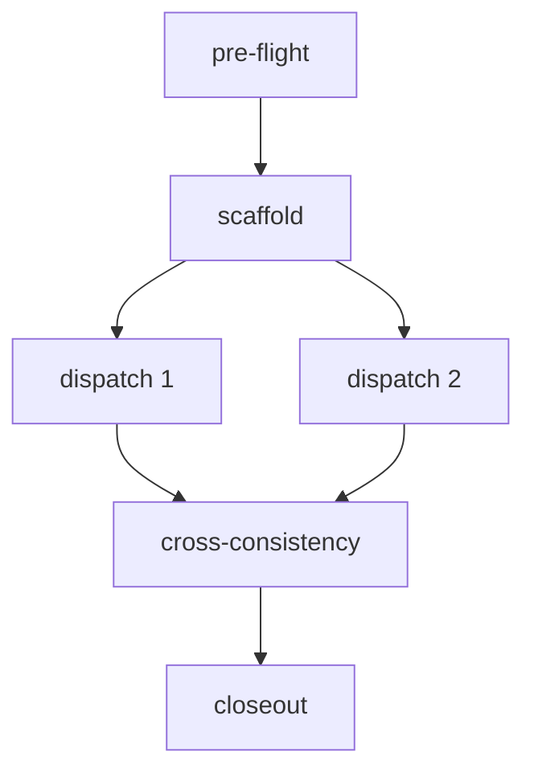

# §0 边界 + 4 status 词

本文是 **candidate / not-authority**。它只定义 cluster → dispatch 的拆解规则，不批准任何 code-bearing work，不打开 runtime / migration / browser automation / true vault write / full_signal_workbench。🧩

| Status | 本规则中的含义 |
|---|---|
| current authority | 只读，不写；用于 pre-flight readback |
| promoted addendum | 只作为 contract baseline 引用 |
| candidate north-star | cluster spec / commander prompt 的推荐状态 |
| reference storage | U-series / audit / storage pack 的引用状态 |

适用场景: W2C / W3E / W4F / W6K 等任何“一个 cluster spec 需要拆成 5-15 个 Codex dispatch”的场景。

# §1 cluster vs dispatch 定义

| 层级 | 定义 | 合格粒度 | 反例 |
|---|---|---|---|
| cluster spec | 统筹 5-15 dispatch 的 contract / boundary / dependency / sequence | 一个可 paste 给 Codex 的 commander prompt | 把多个 wave 混成一个 megaspec |
| dispatch card | cluster 内独立可派 task 单元 | 一个 surface / entity / module / validation task | “把所有东西做好” |

**PF-C4-01 实证**: 1 cluster spec → 4 phase → 20 dispatch；P1×1 + P2×3 + P3×14 + P4×2；5-7h Codex long-runner；严格 boundary + amend_and_proceed。

# §2 cluster spec schema（1 cluster 1 文件）

每个 cluster spec 必含以下 10 段：

| 段 | 名称 | 必填内容 | 质量门槛 |
|---:|---|---|---|
| §0 | 角色与上下文 | 4-agent v3 分工、executor、协作模式 | 明确 GPT Pro / CC1 / Codex / Hermes / 战友角色 |
| §1 | Mission | 1-2 段，说明为什么现在做 | 不超过一个 cluster 的范围 |
| §2 | Inputs | raw URL list，按读序排序 | 不假设本地路径；私有 RAW 不可替代 |
| §3 | Hard Boundaries | yaml + allowed paths + forbidden paths + forbidden claim | 与 master spec §16.1/§16.2 对齐 |
| §4 | N-Phase plan | 5-15 dispatch，按 phase / dependency / risk 排序 | 每 dispatch 有 ID、目标、输出、验收 |
| §5 | Cross-dispatch contract | 命名、状态、验证、boundary 一致性 | 避免 5-15 dispatch 互相漂移 |
| §6 | Dispatch list table | 全 dispatch 表 | 24h consumer 必填 |
| §7 | Dispatch card schema | 9 段 schema | 每张卡完整 |
| §8 | amend_and_proceed | 触发、记录、revert/continue 策略 | 每 cluster 自主 amend 次数有上限 |
| §9 | Lane closeout | receipt + CHECKPOINT + acceptance | 不伪造 build/test/runtime |
| §10 | Self-verification | 反模式扫描 + self-flag | 输出前跑完 |

## §2.1 cluster frontmatter minimum

```yaml
---
title: <cluster title>
status: candidate
authority: not-authority
target_executor: Codex long-runner | GPT Pro spec | CC1 audit
expected_runtime: <bounded estimate>
created_at: <YYYY-MM-DD>
inputs:
  - <raw URL 1>
  - <raw URL 2>
boundary_anchor:
  write_enabled: false
  5_overflow_lane_hold: true
---
```

# §3 dispatch card schema（1 dispatch 1 卡）

每张 dispatch card 必含 9 段：

| # | 段 | 内容 | 必填检查 |
|---:|---|---|---|
| 1 | dispatch_id | `PF-C{N}-{cluster}-P{phase}-{NN}-{kebab}` | 唯一、可 grep |
| 2 | mission | ≤80 字，说明单卡完成什么 | 不跨 cluster |
| 3 | input | raw URL list / verified repo path | 不引用无法访问的本地路径 |
| 4 | output | candidate/research/spec path list | 不写 authority files |
| 5 | steps | 1-N numbered steps | 每步可执行，可验证 |
| 6 | verification | pre-flight + post-execution checks | 必含 current/task/memory readback |
| 7 | verdict | clear / concern / partial / reject | 不假装 done |
| 8 | boundary | 允许 / 禁止 / 禁止 claim | 比 cluster 更窄，不更宽 |
| 9 | amend_trigger | silent_flexibility / runtime / migration / authority | 触发后写 receipt |

## §3.1 dispatch card text template

```markdown
## <dispatch_id> — <title>

### 1. mission
<≤80 字>

### 2. input
- <raw URL / repo path>

### 3. output
- <candidate path only>

### 4. steps
1. ...

### 5. verification
- pre-flight: current.md / task-index.md / decision-log.md readback
- post-execution: docs-check / boundary-check / receipt

### 6. verdict
- expected: clear | concern | partial | reject

### 7. boundary
- allowed: ...
- forbidden: ...
- forbidden claim: runtime approved / migration approved / 5 overflow unlocked

### 8. amend_trigger
- silent_flexibility: stop + receipt + revert or ask explicit gate
- runtime/migration/authority: stop; cannot self-approve

### 9. self-verification
- [ ] 24h consumer exists
- [ ] boundary narrower than cluster
- [ ] no implementation body beyond scope
```

# §4 cluster → dispatch 拆解 5 步法

## Step 1 — 读 Mission + Inputs，确定 phase logic

按 dependency / parallelism / risk 拆 phase：

| Phase kind | 适用 | 示例 |
|---|---|---|
| pre-flight | 真态 readback / redline / environment | PF-C0 authority readback |
| scaffold | shared schema / tokens / registry | PF-C4 tokens + icons |
| implement/spec | surface/entity/module | W2C state grammar / W3E handoff card |
| verify | cross-consistency / acceptance | 5-Gate / docs-check / receipt |
| closeout | CHECKPOINT / self-audit / PR body | PF-C4 lane closeout |

## Step 2 — 7 维拆

| 维度 | 问题 | 拆分准则 |
|---|---|---|
| vertical | 这张卡是否只处理一个 surface/entity/module? | 是则可派；否则继续拆 |
| horizontal | 是否是跨 surface common contract? | 独立成 consistency dispatch |
| phase | 它属于 setup / scaffold / implement / verify / closeout? | phase 内按依赖排序 |
| actor | GPT Pro / CC1 / Codex / Hermes 谁消费? | actor 不清 = 不可派 |
| state | pending/running/success/failed/amended 如何记录? | 必须能写 receipt |
| cost | token/wallclock/dependency 是否 bounded? | 超一夜则拆 cluster |
| boundary | allowed/forbidden/claim 是否足够窄? | 不窄化则 REGENERATE |

## Step 3 — 画依赖图



ASCII fallback:

```text
pre-flight -> scaffold -> parallel dispatches -> consistency -> closeout
```

## Step 4 — 套 §3 9 段 schema

每张卡生成后，问三件事：

1. **24h consumer 是谁？** 没有则降 archive。
2. **这张卡能独立 clear/partial/reject 吗？** 不能则继续拆。
3. **它有没有可能越权？** 有则把 boundary narrowing 写清楚。

## Step 5 — self-verify

跑 §5 反模式 + §6 self-check。任一失败 → REGENERATE，不要靠 self-flag 混过。

# §5 反模式（违反 = REGENERATE）

| # | 反模式 | 判定 | 修复 |
|---:|---|---|---|
| 1 | dispatch 没 24h actionable consumer | REGENERATE | 降 archive 或填明确 consumer |
| 2 | dispatch boundary 缺 amend_trigger | REGENERATE | 加 silent_flexibility/runtime/migration/authority trigger |
| 3 | input 只写本地路径，不写 raw URL / repo path | REGENERATE | 改成 GitHub raw 或 repo tracked path |
| 4 | verification 缺 pre-flight | REGENERATE | 加 current/task/decision/memory readback |
| 5 | 一个 dispatch 横跨多 cluster | REGENERATE | 拆成 cluster 或拆成 cards |
| 6 | 假装 5 overflow lane 解禁 | REGENERATE | 改成 Hold + §16.2 upgrade path |
| 7 | authority files 出现在写入清单 | REGENERATE | 改到 research/candidate path |
| 8 | 假设本地 shell / gh / git / npm | REGENERATE for cloud spec | 改成 Codex executor step 或 raw URL readback |
| 9 | 引整套 vendored UI install | REGENERATE | 只允许 explicit approved dependency path |
| 10 | 写 implementation code body | REGENERATE | 改 schema/contract/acceptance description |

# §6 self-check 10 项

- [ ] 1. cluster spec §0-§10 段全。
- [ ] 2. 每 dispatch card 9 段全。
- [ ] 3. 每 dispatch 24h consumer 全填。
- [ ] 4. boundary 跟 master spec §16.1 align。
- [ ] 5. 升级路径走 §16.2，不偷开 Hold lane。
- [ ] 6. frontmatter status: candidate，不 promoted。
- [ ] 7. 真态 disclaimer 标明 check anchor。
- [ ] 8. raw URL / repo tracked path 明确，不用私有本地路径。
- [ ] 9. amend_trigger 全：silent_flexibility / runtime / migration / authority。
- [ ] 10. §Self-flag 末尾段填。

# §7 跟 4-agent v3 分工映射

| Agent | 在 cluster → dispatch 中的角色 | 输出 |
|---|---|---|
| GPT Pro | Heavy Producer: atlas / spec / card design | candidate spec / starter pack |
| CC1 | Conductor + Auditor: 整合 / commander prompt / cross-file audit | final commander prompt / audit report |
| Codex | Long Runner Coder: 本地跑 dispatch / commit / PR | receipts / CHECKPOINT / PR |
| Hermes | Independent Auditor: 大改 PR / authority upgrade 外审 | CLEAR/CONCERN/REJECT audit |
| 战友 | PM / human gate | 拍板 cluster / visual verdict / merge decision |

**审计纪律**: same-family Layer 2 是 weak audit；大改 PR 应至少跨 GPT Pro / Codex / Hermes 其中一方做 external check。

# §8 实证示例：PF-C4-01 cross-walk

| PF-C4-01 段 | 本规则对应 | 实证价值 |
|---|---|---|
| frontmatter | §2 cluster frontmatter | 明确 candidate / not-authority / Codex target |
| §0 Codex 角色 | §2 §0 | 4-agent 分工清楚 |
| §1 Mission | §2 §1 | 13 surface migration 范围明确 |
| §2 Inputs | §2 §2 | 按读序列出 handoff / P7 / app state |
| §3 Hard Boundaries | §2 §3 | 5 overflow Hold + forbidden paths |
| §4 4-Phase plan | §2 §4 | 20 dispatch 可派 |
| Cross-surface contract | §2 §5 | sync-badge / token discipline 防漂移 |
| Dispatch list | §2 §6 | 13 surface + consistency card |
| amend_and_proceed | §2 §8 | 每 lane 自主 amend ≤1 |
| Lane closeout | §2 §9 | CHECKPOINT + receipt + truthful stdout |

# §9 Quality Audit Notes

- 一个 cluster 最好 5-15 dispatch；超过 15 时，必须有非常强的 consistency contract，或拆两个 cluster。
- 每个 dispatch 应能在 30-120min 内 clear/partial/reject；超过半天就是 cluster。
- “reference storage → dispatch” 中间必须经过 atlas/card 层；不能把 U ZIP 直接 paste 给 Codex 开跑。
- 凡涉及 runtime_tools / dbvnext_migration / true_vault_write，必须写成 prep/spec/checklist，不写 execution step。

# §Self-flag

### 弱项 / 不确定

- ⚠️ 本规则书抽象自 PF-C4-01 20 dispatch 实证，但 W3E 单 cluster 建议仍控制在 5-10 dispatch；20 dispatch 只能作为上限例外。
- ⚠️ “raw URL list” 对私有仓云端读取可行，但 Codex 本地执行时仍需用 repo path；commander prompt 应同时给 raw URL + tracked repo path。
- ⚠️ 24h consumer 规则会砍掉部分长期战略项；这符合 W5 目标，但可能牺牲远期完整性。
- ⚠️ same-family audit 的弱点已列出，但本文未指定 Hermes exact audit prompt，需要后续 cluster 另写。

### 真态 drift

- PF-C4-01 已 merged PR #243；当前 main 已到 PR #247 closeout，不应把 PR #243 当 live HEAD。
- master spec §9.13 是 PR #246 patch 新增；本文采用该 patch 的 11/16 + 5 gap。

### 待战友 / CC1 拍板取舍点

1. 后续 commander prompt 是否强制“每 cluster 自主 amend ≤1”。
2. W3E cluster 是否统一用本 9 段 dispatch card schema。
