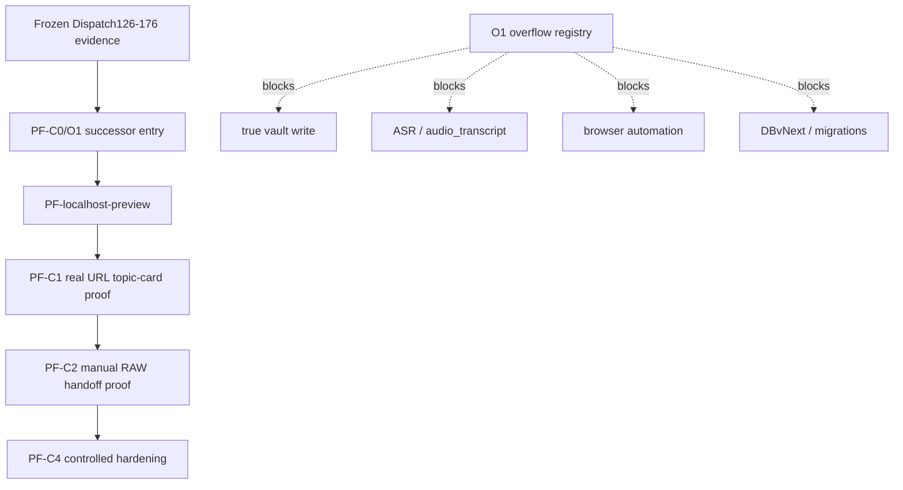

# 总路线说明

```mermaid
flowchart TD
  F["Frozen Dispatch126-176 evidence"] --> C0["PF-C0/O1 successor entry"]
  C0 --> LP["PF-localhost-preview"]
  LP --> C1["PF-C1 real URL topic-card proof"]
  C1 --> C2["PF-C2 manual RAW handoff proof"]
  C2 --> C4["PF-C4 controlled hardening"]
  O1["O1 overflow registry"] -. blocks .-> TW["true vault write"]
  O1 -. blocks .-> ASR["ASR / audio_transcript"]
  O1 -. blocks .-> BA["browser automation"]
  O1 -. blocks .-> DB["DBvNext / migrations"]
```

The near-term job is not to make everything. It is to prove the shortest useful localhost loop and then measure whether it feeds RAW.
