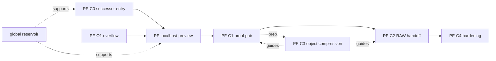

# Cluster Dependency And Parallelism

| Work | Parallel? | Notes |
|---|---|---|
| C0 + O1 | yes | Thin docs/gates, no code. |
| localhost backend + frontend prep | partial | API client and router tests can parallelize; final wiring serial. |
| C1 contract + C2 contract | yes | Preparation only; real C2 waits for C1 verdict. |
| C4 prep | limited | Can prepare rubric; cannot harden before proof. |
