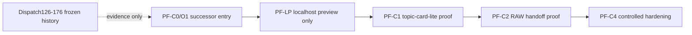

# Successor entry and preview-only scope

## successor_route_diagram

- Frozen rule:
  - Dispatch126-176 are historical evidence only.
  - Successor work reads them; it does not reopen, reorder, or auto-continue them.
- Route rule:
  - `PF-C0/O1` is the entry gate that refreshes live truth and names blocked overflow.
  - `PF-LP` is the shortest valuable localhost proof line.
  - `PF-C1` / `PF-C2` / `PF-C4` stay downstream of preview-only localhost readiness.

## preview_only_pass_bar

The preview-only localhost pass bar is a seven-step bounded chain:

1. Live truth is refreshed from PR193/PR194 and current `origin/main`, not from frozen dispatch history alone.
2. Overflow lanes stay named as overflow: true write, runtime tools, browser automation, migration, and full Signal Workbench remain blocked.
3. `create_app()` mounts the Bridge router while keeping `write_enabled=false`.
4. Backend smoke proves a manual-url metadata-only capture can reach vault preview and fail loud when `SCOUTFLOW_VAULT_ROOT` is unset.
5. Frontend preview loop reaches "paste URL -> create capture -> receive capture_id -> fetch preview markdown" without claiming RAW handoff or commit.
6. Local user actions are bounded to preview-safe outputs such as copy/download; they do not unlock commit, migration, or automation.
7. Readback language stays preview-only: `T-PASS` means localhost preview proof only, not execution approval, runtime approval, visual terminal verdict, or true write approval.

## dispatch_naming_reset

- Successor tasks should be named by PF cluster and local dependency truth, not by imaginary linear continuation such as `Dispatch177+`.
- Naming rule:
  - `PF-C0/*` = successor-entry routing and truth refresh
  - `PF-O1/*` = overflow registry and blocked future gates
  - `PF-LP/*` = localhost preview-only mainline
  - `PF-C1/*`, `PF-C2/*`, `PF-C4/*` = downstream proof/handoff/hardening clusters
  - `PF-GLOBAL/*` = reservoir or cross-pack support, not automatic next-step mainline
- Consequence:
  - a task can open because its cluster gate is satisfied
  - a task does **not** open merely because an older frozen dispatch number exists before it
  - successor sequencing is cluster-over-linear and proof-gated, not renumber-and-continue
