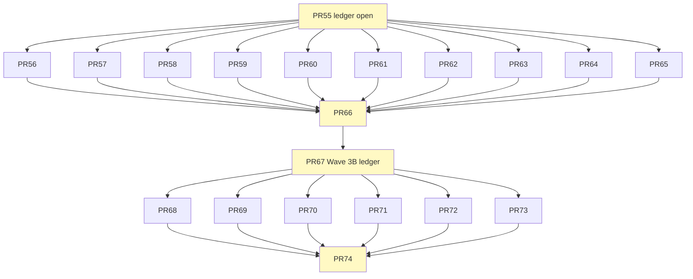

# ScoutFlow PR55-PR74 工作清单 — 20 个 PR Backbone

> **本文档定位**：PR factory 启动器。每个 PR 已锁 8-10 个关键字段, GPT Pro 拿到后把 backbone 扩成完整 dispatch markdown (含 prompt 段 / 边界声明 / agent handoff header / probe questions / verification ladder).
>
> **基线一致性**：所有 PR 引用 doc1 §3 (阶段定义) + doc1 §5 (红线) + doc2 §1 (肩膀生命周期).
>
> **不变量**：本清单中**没有任何**修改 services/api/migrations/** / apps/** / workers/** / packages/** / data/** / referencerepo/** (除非标 referencerepo dispatch) 的 PR。Wave 4+ 才解禁。

---

## 0. 总览

### 0.1 20 个 PR 速查

| PR | Task ID | Wave | 类型 | Lane | 标题 (短) | 预期 PR 时长 |
|---:|---|---|---|---|---|---:|
| 55 | T-P1A-030 | 3A | docs (authority) | authority | Wave 3A ledger open + shoulders-index | 1-2 h |
| 56 | T-P1A-031 | 3A | docs | research | ADR-001 Obsidian PARA Lock | 1-2 h |
| 57 | T-P1A-032 | 3A | docs | research | PRD v2.1 Strong Visual H5 candidate | 2-3 h |
| 58 | T-P1A-033 | 3A | docs | research | SRD v3 H5/Bridge/PARA Vault candidate | 2-4 h |
| 59 | T-P1A-034 | 3A | docs | research | Parallel Execution Protocol PR Factory candidate | 2-3 h |
| 60 | T-P1A-035 | 3A | prototype | prototype | OpenDesign H5 Visual Probe (repo 外) | 3-5 h |
| 61 | T-P1A-036 | 3A | research | research | XHS RedNote Shoulder Scan (7 repos) | 3-5 h |
| 62 | T-P1A-037 | 3A | research | research | Bilibili Comparator Scan (yt-dlp + Nemo2011) | 2-4 h |
| 63 | T-P1A-038 | 3A | research | research | Console Reference Scan (OpenWhispr + shadcn) | 2-3 h |
| 64 | T-P1A-039 | 3A | research | research | Obsidian Frontmatter Compatibility Scan | 2-3 h |
| 65 | T-P1A-040 | 3A | docs | research | PR Factory V1 Tooling Plan + scripts | 2-3 h |
| 66 | T-P1A-041 | 3A | docs (authority) | authority | Wave 3A Closeout + Go/No-Go for Wave 3B | 1-2 h |
| 67 | T-P1A-042 | 3B | docs (authority) | authority | Wave 3B ledger open + Shoulders Clone Plan | 1-2 h |
| 68 | T-P1A-043 | 3B | research | research | Shoulders Probe Reports (6-8 个深读) | 8-12 h |
| 69 | T-P1A-044 | 3B | docs | research | Bridge route group SPEC.md (NOT 实施) | 2-3 h |
| 70 | T-P1A-045 | 3B | docs | research | H5 Capture Station Design Brief + 5 Gate | 2-4 h |
| 71 | T-P1A-046 | 3B | docs | research | VaultWriter Contract SPEC.md (NOT 实施) | 2-3 h |
| 72 | T-P1A-047 | 3B | prototype | prototype | H5 Prototype Mock (~/workspace/scoutflow-prototypes/) | 6-10 h |
| 73 | T-P1A-048 | 3B | docs | research | Shoulders Adapt Decision Table | 2-4 h |
| 74 | T-P1A-049 | 3B | docs (authority) | authority | Wave 3B Closeout + Wave 4 ledger candidate | 1-2 h |

### 0.2 Lane 占用矩阵

```
                              Wave 3A (PR55-66)              Wave 3B (PR67-74)
authority lane (max 1)       55 - - - - - - - - - - 66      67 - - - - - - 74
research lane (max 8)        - 56 57 58 59 - 61 62 63 64    - - 68 69 70 71 - 73
prototype lane (max 3)       - - - - - 60 - - - -           - - - - - - 72 -
product code lane (max 3)    (空 — 0 product code change)    (空 — 0 product code change)
audit lane (max 3)           (按需 Codex/Opus/GPT 并行)        (按需)
```

注意：**没有任何 product code lane 占用**。这 20 个 PR 全是 docs/research/prototype。

### 0.3 文件域冲突矩阵 (Wave 3A 高峰期 5 PR 并行)

```
PR55 authority:    docs/current.md, docs/task-index.md, docs/decision-log.md, docs/shoulders-index.md (新建)
PR56 research:     docs/architecture/ADR-001-...md (新建)
PR57 research:     docs/PRD-amendments/prd-v2.1-...md (新建)
PR58 research:     docs/SRD-amendments/h5-bridge-...md (新建)
PR59 research:     docs/architecture/parallel-execution-protocol-...md (新建)
PR60 prototype:    repo 外 ~/workspace/scoutflow-prototypes/ (NOT touch ScoutFlow repo)
PR61 research:     docs/research/shoulders/xhs-rednote-mcp-scan-2026-05-04.md
PR62 research:     docs/research/shoulders/bilibili-comparator-scan-2026-05-04.md
PR63 research:     docs/research/shoulders/console-reference-scan-2026-05-04.md
PR64 research:     docs/research/shoulders/obsidian-frontmatter-compat-scan-2026-05-04.md
PR65 research:     docs/research/pr-factory-v1-tooling-plan-2026-05-04.md + tools/pr-factory/* (候选)

冲突检查:
  - PR55 authority writes are exclusive (不能与 PR66 authority 同时跑)
  - PR56-PR65 文件域 0 交集 → 可真并行
  - PR60 在 repo 外 → 不冲突
  - PR65 tools/ 路径需要 PR55 ledger entry 中允许
```

### 0.4 依赖图



---

## 1. PR55 — T-P1A-030 Wave 3A ledger open + shoulders-index

```yaml
task_id: T-P1A-030
title: T-P1A-030 Wave 3A ledger open + shoulders-index
type: docs (authority writer)
lane: authority (1/1)
wave: 3A
sequence: 1 (must be first)

目标: |
  打开 Wave 3A ledger (current.md / task-index.md / decision-log.md);
  创建 docs/shoulders-index.md 含 doc2 §10 字段定义 + 19 个候选 entries (status=discovered/scanning);
  显式说明 Wave 3A 不解禁任何 runtime, 不修改 PRD/SRD base.

allowed_paths:
  - AGENTS.md  # v1.1 errata P0-1: authority ledger PR 必加 (check-docs-redlines.py task-state 一致性)
  - docs/current.md
  - docs/task-index.md
  - docs/decision-log.md
  - docs/shoulders-index.md  # 新建

forbidden_paths:
  - services/**
  - apps/**
  - workers/**
  - packages/**
  - migrations/**
  - data/**
  - referencerepo/**  # local-only, 永远不进 git
  - docs/PRD-v2-2026-05-04.md
  - docs/SRD-v2-2026-05-04.md
  - docs/specs/contracts-index.md  # PR55 不动; PR66 closeout 时一并登记 candidates (v1.1 errata P0-5)

输入素材:
  - doc1 §3.2 (Wave 3A 入口/出口条件)
  - doc2 §10 (shoulders-index 字段定义 + 字段对照)
  - 当前 docs/current.md 状态

输出物:
  1. docs/current.md 更新:
     - Phase 改 "1A / Wave 3A open"
     - 主任务 = T-P1A-030
     - Active count 0 → 1/3
     - 当前允许 = Wave 3A 12 PR (PR55-66)
     - 当前禁止 = doc1 §5 红线
     - 下一步 = Wave 3A closeout
  2. docs/task-index.md 更新:
     - **Done 段补 T-P1A-029 行 (v1.1 errata P0-4 审计连续性)**:
       | `T-P1A-029` | Post-S0/S1 authority + candidate wording fix | `2026-05-04` | PR #54; merge commit `c133e0e`; scope=`current/AGENTS/task-index/decision-log/contracts-index/SRD-v3 candidate wording`; no runtime / no migration |
     - Active 段加 T-P1A-030 行
     - Backlog 加 T-P1A-031 ~ T-P1A-041 (PR56-66)
  2.5 AGENTS.md 同步 (v1.1 errata P0-1):
     - 当前活动任务字段更新为 T-P1A-030
     - lane 上限继续保持 product=3 + authority=1 (Surge 5 待 PR59+PR66 批准)
  3. docs/decision-log.md 加 D-XXX:
     - "Wave 3A open: V3 acceptance + amendments + shoulder scan"
     - 引用 doc1/doc2/doc3 路径
  4. docs/shoulders-index.md 新建:
     - 标题 + 引用 doc2
     - **顶部加 transition rule (v1.1 errata P1-10, 见 doc2 §10.0)**:
       > 默认: 仅 stage 2+ shoulder 入 index. 例外: 用户批准的 Wave batch candidates 可 status=discovered 入.
       > 状态机: discovered → scanning → integrating → integrated → deprecated
     - 10 列表头 (id / module / upstream / mode / output_contract / failure_modes / kill_switch / owner_lane / status / next_action)
     - 19 个 entries (从 doc1 §3 + doc2 §3.1 + 之前 v3 报告抽出, 属 P1-10 例外: Wave 3A 批准的 batch candidate)
     - 每个 entry status 初始为 discovered (除 BBDOWN/WHISPER/OBSIDIAN status=locked)

验收标准:
  - 5 个文件全部修改/新建 (AGENTS.md / current.md / task-index.md / decision-log.md / shoulders-index.md)
  - shoulders-index 19 entries 字段齐全 (10 列) + 顶部 transition rule
  - task-index Done 段含 T-P1A-029 row (v1.1 errata P0-4)
  - 没有任何代码改动 (services/ apps/ 空)
  - 没有 referencerepo/ tracked 文件 (v1.1 errata P0-2)
  - decision-log entry 引用 doc1+doc2+doc3 路径

validation:
  - python tools/check-docs-redlines.py
  - python tools/check-secrets-redlines.py
  - python -m pytest tests/api tests/contracts -q  # 期望 142 passed (PR54 baseline)
  - git diff --check
  - grep -c "^|" docs/shoulders-index.md  # 期望 ≥22 (header + separator + 19 entries + transition rule 行)
  - grep -q "T-P1A-029" docs/task-index.md  # v1.1 errata P0-4
  - git ls-files | grep -E "^referencerepo/" && exit 1 || true  # v1.1 errata P0-2

依赖前置:
  - PR54 merged ✓ (已 done, T-P1A-029, merge commit c133e0e)
  - 用户显式 gate Wave 3A

预期 diff 行数: +220 / -15
预期时长: 1-2 h
PR 标题模板: "T-P1A-030 Wave 3A ledger open + shoulders index"
```

---

## 2. PR56 — T-P1A-031 ADR-001 Obsidian PARA Lock

```yaml
task_id: T-P1A-031
title: T-P1A-031 ADR-001 Obsidian PARA Lock
type: docs (research)
lane: research
wave: 3A
sequence: parallel after PR55

目标: |
  落地唯一保留的 ADR (其他用 shoulders-index 替代).
  显式锁定: ScoutFlow 不创建新 vault / 不重造 frontmatter / 不重写 Claudian 命令链 / vault root 由 SCOUTFLOW_VAULT_ROOT 配置.

allowed_paths:
  - docs/architecture/ADR-001-obsidian-para-lock-2026-05-04.md  # 新建 + 创建 docs/architecture/

forbidden_paths:
  - 同 PR55

输入素材:
  - doc1 §2 (架构基线)
  - doc1 §4 (项目整合)
  - doc2 §3 (referencerepo 不动 vault)
  - 用户 vault 实地探索结果 (~/workspace/raw)
  - 用户已粘贴 GPT Pro/Codex acceptance 报告 中 Vault 段

输出物:
  docs/architecture/ADR-001-obsidian-para-lock-2026-05-04.md (~150 行):
    Status: Accepted (candidate)
    Context: 用户 ~/workspace/raw 已是成熟 PARA + Claudian 基座
    Decision (5 条):
      D1 ScoutFlow 不创建新 vault
      D2 ScoutFlow 仅写 ${SCOUTFLOW_VAULT_ROOT}/00-Inbox/ (不写 02-Raw / 01-Wiki / 03-Output)
      D3 ScoutFlow 严格遵守 System/frontmatter-templates.md raw 4 字段模板
      D4 ScoutFlow 不重造 /intake /compile /enrich /query /lint
      D5 ScoutFlow 项目管理位置 = ${SCOUTFLOW_VAULT_ROOT}/05-Projects/ScoutFlow/ (按 _project-template)
    Consequences:
      - 节省 50+ PR (不重造)
      - vault 升级 ScoutFlow 自动受益
      - 跨项目 (ContentFlow) 共享 vault 天然 handoff
      - 强依赖 Obsidian 生态稳定
    Rejected alternatives (3 条):
      - 自建 ScoutFlow 私有 vault (rejected, 用户已有基座)
      - 自定义 frontmatter schema (rejected, frontmatter-templates 唯一真相源)
      - 自建 Console 替代 Obsidian (rejected, vault 强于 SaaS dashboard)
    References:
      - ~/workspace/raw/System/_SPEC_INDEX.md
      - ~/workspace/raw/System/frontmatter-templates.md
      - ~/workspace/raw/System/intake-rules.md
      - ~/workspace/raw/05-Projects/_project-template.md
      - ~/workspace/raw/05-Projects/ContentFlow/  (兄弟项目证明)
      - doc1 §2.1 (架构基线)

验收标准:
  - 5 条 Decision 字段齐全
  - 3 条 Rejected alternatives
  - 引用 6+ 文件路径 (sanity check 实际存在)
  - 文档 ≤ 200 行

validation:
  - python tools/check-docs-redlines.py
  - python tools/check-secrets-redlines.py
  - test -d ~/workspace/raw/System  # 验证 vault 路径
  - test -f ~/workspace/raw/System/frontmatter-templates.md
  - git diff --check

依赖前置:
  - PR55 merged

预期 diff 行数: +180 / -0 (新建)
预期时长: 1-2 h
PR 标题模板: "T-P1A-031 ADR-001 Obsidian PARA Lock"
```

---

## 3. PR57 — T-P1A-032 PRD v2.1 Strong Visual H5 Candidate

```yaml
task_id: T-P1A-032
title: T-P1A-032 PRD v2.1 Strong Visual H5 Candidate amendment
type: docs (research, candidate amendment)
lane: research
wave: 3A
sequence: parallel after PR55

目标: |
  落 PRD-v2.1 candidate amendment, 4 章节 (Strong Visual H5 + PARA integration + Fixed Shoulders + PR Factory mode).
  显式标 candidate / not-authority / not-runtime-approval.
  base PRD-v2 不动.

allowed_paths:
  - docs/PRD-amendments/prd-v2.1-strong-visual-h5-para-pr-factory-candidate-2026-05-04.md  # 新建 + 创建 docs/PRD-amendments/

forbidden_paths:
  - 同 PR55
  - docs/PRD-v2-2026-05-04.md  (base, NOT touch)

输入素材:
  - doc1 §1 (1.0 release definition)
  - doc1 §2 (架构基线)
  - GPT Pro/Codex acceptance §3.1-3.4 (4 PRD 章节建议)
  - 用户对 strong-visual=H5 的明确说法

输出物:
  docs/PRD-amendments/prd-v2.1-strong-visual-h5-para-pr-factory-candidate-2026-05-04.md (~300 行):

    Frontmatter:
      candidate: true
      not_authority: true
      not_runtime_approval: true
      not_frontend_implementation_approval: true
      base_prd: docs/PRD-v2-2026-05-04.md (不动)
      sunset_trigger: 当 PRD-v3 promoted 时 deprecated

    §X.1 Strong Visual Capture H5
      - 强视觉发生在采集时刻 H5, 不在 wiki
      - 4 面板: URL Bar / Live Metadata / Capture Scope / Trust Trace Graph
      - H5 是 projection / operation surface, 不是 authority
      - 5 Gate Checklist 视觉验收 (引用 ~/.claude/rules/aesthetic-first-principles.md)

    §X.2 Existing PARA / Claudian Vault Integration
      - vault root 配置 = ${SCOUTFLOW_VAULT_ROOT:-~/workspace/raw}
      - ScoutFlow 仅写 00-Inbox/
      - 不重造 /intake /compile /enrich /query /lint
      - 不自定义 frontmatter (严格 System/frontmatter-templates.md raw 4 字段)

    §X.3 Fixed Product Shoulders
      - Bilibili primary capture: BBDown
      - Local ASR direction: Whisper family (impl benchmark 后定)
      - Knowledge base output: Obsidian PARA vault
      - Strong visual design: OpenDesign repo-external probe
      - H5 stack candidate: Vite + React + shadcn + TanStack + React Flow

    §X.4 PR Factory Product Operating Mode
      - 单 operator + 多 Agent
      - research/prototype lanes 不计入 product lane (除非写 authority)
      - product lane 3 → 5 提升 必须经 protocol amendment (PR59)
      - authority writer 仍 max 1
      - 每 PR 小 diff / 清晰文件域 / 明确验收

    §X.5 Out of scope (不做)
      - 不做合规 / 安全 / 备份层 (单人项目)
      - 不做 Sigstore / HMAC chain (P2 未来)
      - 不做 Electron (浏览器 H5 即可)
      - 不做 SaaS / 多用户

    §X.6 Acceptance criteria for promotion
      - Wave 3A closeout 完成
      - Wave 4 walking skeleton 跑通
      - 用户显式 gate promotion

验收标准:
  - 6 章节字段齐全
  - 显式引用 base PRD 路径
  - candidate frontmatter 4 字段齐
  - sunset_trigger 明确

validation:
  - python tools/check-docs-redlines.py
  - python tools/check-secrets-redlines.py
  - grep -c "^## §X" docs/PRD-amendments/prd-v2.1-*.md  # 期望 6
  - grep -q "candidate: true" docs/PRD-amendments/prd-v2.1-*.md
  - git diff --check

依赖前置:
  - PR55 merged

预期 diff 行数: +320 / -0 (新建)
预期时长: 2-3 h
PR 标题模板: "T-P1A-032 PRD v2.1 Strong Visual H5 candidate amendment"
```

---

## 4. PR58 — T-P1A-033 SRD v3 H5 Bridge PARA Vault Candidate

```yaml
task_id: T-P1A-033
title: T-P1A-033 SRD v3 H5 Bridge PARA Vault Candidate amendment
type: docs (research, candidate amendment)
lane: research
wave: 3A
sequence: parallel after PR55, after PR57

目标: |
  落 SRD-v3 H5/Bridge/VaultWriter candidate amendment 4 章节.
  Bridge 显式定义为 Thin API route group (NOT 独立 server) — Codex 修订.
  VaultWriter 写入路径用 ${SCOUTFLOW_VAULT_ROOT} — GPT Pro 修订.

allowed_paths:
  - docs/SRD-amendments/h5-bridge-para-vault-srd-v3-candidate-2026-05-04.md  # 新建 + 创建 docs/SRD-amendments/ (or 已存在)

forbidden_paths:
  - 同 PR55
  - docs/SRD-v2-2026-05-04.md (base, NOT touch)
  - docs/SRD-amendments/db-vnext-srd-v3-candidate-2026-05-04.md (PR51/53 已合并, NOT touch)

输入素材:
  - doc1 §2 (架构基线)
  - GPT Pro/Codex §4 (SRD 4 章节建议)
  - 用户 vault 实地探索结果 (raw 4 字段模板)

输出物:
  docs/SRD-amendments/h5-bridge-para-vault-srd-v3-candidate-2026-05-04.md (~400 行):

    §17.1 H5 Capture Station
      - 形态: L3 Projection layer 新形态
      - 不直接写 SQLite / 不直接写 vault / 不直接执行 BBDown/Whisper/ffmpeg
      - Stack table: Vite / React + TS / shadcn + Radix / TanStack Query+Form+Table / React Flow / Zustand / Tailwind / Lucide
      - 4 面板规范 (每面板含: 输入 / 输出 / 内部状态 / API 调用)
      - 默认 port 8080 (可配 H5_PORT)

    §17.2 Bridge / Thin API Route Group
      - 关键修订: 不是独立 server, 是现有 services/api/scoutflow_api 的 route group
      - 路由清单:
        GET  /bridge/health
        GET  /bridge/vault/config (返回 SCOUTFLOW_VAULT_ROOT 等; 未配置时返回 BridgeErrorCode.vault_root_not_configured)
        GET  /captures/{capture_id}/vault-preview (生成 markdown 预览, 不写文件)
        POST /captures/{capture_id}/vault-commit (实际写文件)
        future: POST /captures/{capture_id}/transcribe (Wave 6 解锁)
      - 每路由含 OpenAPI schema (输入/输出 JSON 字段)
      - **错误返回 BridgeErrorCode (v1.1 errata P0-3, NOT 复用 PlatformResult)**:
        ```python
        BridgeErrorCode = Literal[
            "vault_root_not_configured",
            "vault_root_not_found",
            "vault_inbox_not_found",
            "vault_path_escape",
            "vault_file_exists",
            "frontmatter_invalid",
            "markdown_render_failed",
        ]
        ```
        Bridge API response shape:
        ```json
        { "ok": false,
          "error": { "code": "vault_root_not_found", "message": "...", "details": {} } }
        ```
        理由: PlatformResult enum 仅描述平台边界结果 (BBDown/Bilibili 触达后), 不污染 Bridge/Vault 本地错误.

    §17.3 VaultWriter Contract
      - 写入目标:
        ${SCOUTFLOW_VAULT_ROOT}/00-Inbox/scoutflow-{capture_id}-{slug}.md
      - frontmatter 严格 4 字段 (引用 System/frontmatter-templates.md):
        title / date / tags / status: pending
      - 正文段 (固定 4 节):
        ## ScoutFlow Capture (capture_id / platform / source_url / source_kind / quick_capture_preset)
        ## Metadata (字段从 BBDown probe)
        ## Trust Trace (trust_trace_url / receipt_ledger / probe_evidence / media_audio: not_approved)
        ## Notes (用户留空, /intake 后填)
      - 显式禁止:
        不移动到 02-Raw
        不写 01-Wiki
        不运行 /intake
        不运行 /compile
        不改 System/
        不创建自定义 Obsidian schema

    §17.4 PR Factory Protocol (引用 PR59)
      - lane caps: 候选 5/8/3/3 (要 protocol amendment)
      - file-domain matrix 每 wave 必声明
      - merge ordering: authority → product → research/prototype

    §17.5 Out of scope (不做)
      - 不做 Sigstore signing
      - 不做密码学 receipt
      - 不做跨 vault 同步
      - 不做远程 vault (例如 Notion / Logseq)

    §17.6 Acceptance criteria for promotion
      - Wave 4 walking skeleton 跑通端到端
      - vault commit 100 个 placeholder URL 0 失败
      - audit-wiki.py 0 红线

验收标准:
  - 6 章节齐全
  - Bridge 5 路由 + OpenAPI schema 齐
  - VaultWriter 4 字段 frontmatter + 4 节正文 显式
  - 5 条 "显式禁止" 与 ADR-001 (PR56) 一致
  - sunset_trigger 明确

validation:
  - python tools/check-docs-redlines.py
  - grep -c "^### §17\." docs/SRD-amendments/h5-bridge-para-vault-*.md  # 期望 6
  - grep -q "SCOUTFLOW_VAULT_ROOT" docs/SRD-amendments/h5-bridge-para-vault-*.md
  - grep -q "Thin API" docs/SRD-amendments/h5-bridge-para-vault-*.md
  - git diff --check

依赖前置:
  - PR55 merged
  - PR56 merged (ADR-001 一致性)
  - PR57 in flight or merged (PRD-v2.1 引用)

预期 diff 行数: +420 / -0 (新建)
预期时长: 2-4 h
PR 标题模板: "T-P1A-033 SRD v3 H5 Bridge PARA Vault candidate amendment"
```

---

## 5. PR59 — T-P1A-034 Parallel Execution Protocol PR Factory Candidate

```yaml
task_id: T-P1A-034
title: T-P1A-034 Parallel Execution Protocol PR Factory Candidate
type: docs (research)
lane: research
wave: 3A
sequence: parallel after PR55

目标: |
  显式定义 5/8/3/3 lane 上限的"激活条件" (不是无条件升级).
  落 PR Factory 工作流 (从 dispatch 到 merge 的 7 步骤).
  与 ScoutFlow 现有 lane policy 兼容 (current AGENTS.md 仍 product max=3).

allowed_paths:
  - docs/architecture/pr-factory-surge-protocol-candidate-2026-05-04.md  # v1.1 errata P1-7: 改名避免与 docs/specs/parallel-execution-protocol.md baseline spec 混淆

forbidden_paths:
  - 同 PR55
  - AGENTS.md (base lane policy, NOT touch — PR59 是 candidate, 不动 baseline)
  - docs/specs/parallel-execution-protocol.md (REQUIRED_DOC, baseline, NOT touch)

输入素材:
  - doc1 §3 (Wave 入口/出口)
  - GPT Pro/Codex 报告 §6 (lane 上限提议)
  - v3 §6 (PR Factory 模式)
  - doc2 §8 (跨 agent 协作映射)

输出物:
  docs/architecture/pr-factory-surge-protocol-candidate-2026-05-04.md (~250 行):

    §1 Status quo (Enforced baseline, v1.1 errata P1-1)
      - authority_writer_max = 1
      - product_lane_max = 3
      - 来自 AGENTS.md / docs/specs/parallel-execution-protocol.md (REQUIRED baseline)

    §2 Tracked advisory pools (新引入概念, 调度可视化, NOT enforced authority lane)
      - research_pool_max = 8
      - prototype_pool_max = 3
      - audit_pool_max = 3

    §3 Surge candidate (要 PR59 promoted + PR66 closeout 显式批准才激活)
      - product_lane_max = 5 (从 baseline 3 提升)
      - 上述 advisory pools 转 enforced

    §4 激活条件 (gates)
      - PR59 文档 promoted + Wave 3A closeout (PR66) 决议批准 surge
      - 文件域互斥矩阵每 wave 强制
      - 各 lane 各 agent 责任明确 (引用 doc2 §8)
      - Pull-request CI 强制跑 redlines + secrets + tests
      - 出现 lane 冲突 → 自动 rollback 回 Enforced baseline: product_lane_max=3, authority_writer_max=1
        (v1.1.1 errata P1-1: 仅使用 named 字段, 不使用旧式数字串)

    §4 文件域互斥协议
      - 每个 wave dispatch 必声明 file-domain matrix (每 PR 的 allowed_paths)
      - 矩阵交集为空才允许并行
      - PR 标题前缀 = task_id (T-P1A-XXX)
      - merge 顺序: authority first → product → research/prototype 末尾

    §5 PR factory 7 步骤工作流
      Step 1 dispatch markdown 生成 (GPT Pro 起草)
      Step 2 worktree 创建 (git worktree add)
      Step 3 agent 执行 (Codex / Opus 等)
      Step 4 self-validation (redlines + tests)
      Step 5 push + PR 创建 (gh pr create)
      Step 6 audit lane (Codex/Opus/GPT 反方审)
      Step 7 merge (gh pr merge --squash --delete-branch)

    §6 工具支持 (引用 PR65)
      - tools/pr-factory/dispatch.sh
      - tools/pr-factory/worktree.sh
      - tools/pr-factory/audit.sh
      - tools/pr-factory/merge.sh

    §7 Roll-back protocol
      - lane 冲突 / CI 失败 → 立即 reset 到 Enforced baseline: product_lane_max=3, authority_writer_max=1
      - 写 decision-log: incident 详情
      - 重新 surge 需 user 显式 gate

    §8 Acceptance criteria for promotion
      - Wave 3A closeout (PR66) 显式批准 surge 5/8/3/3
      - PR Factory tooling V1 (PR65) 已 merged
      - 0 个 lane 冲突 incident in PR55-66

验收标准:
  - 8 节齐
  - Surge candidate (product_lane_max=5) 与 Enforced baseline (product_lane_max=3, authority_writer_max=1) 显式区分
  - 7 步骤工作流明确
  - 引用 PR65 tools
  - rollback protocol 显式 (rollback target = Enforced baseline)

validation:
  - python tools/check-docs-redlines.py
  - grep -c "^## §" docs/architecture/pr-factory-surge-protocol-*.md  # 期望 8
  - grep -q "Surge candidate" docs/architecture/pr-factory-surge-protocol-*.md
  - grep -q "Enforced baseline" docs/architecture/pr-factory-surge-protocol-*.md
  - grep -q "rollback" docs/architecture/pr-factory-surge-protocol-*.md
  - grep -q "product_lane_max=3" docs/architecture/pr-factory-surge-protocol-*.md  # v1.1.1: named field, 不用数字串
  - git diff --check

依赖前置:
  - PR55 merged

预期 diff 行数: +260 / -0 (新建)
预期时长: 2-3 h
PR 标题模板: "T-P1A-034 Parallel Execution Protocol PR Factory candidate"
```

---

## 6. PR60 — T-P1A-035 OpenDesign H5 Visual Probe (repo 外 prototype)

```yaml
task_id: T-P1A-035
title: T-P1A-035 OpenDesign H5 Visual Probe (repo-external prototype)
type: prototype
lane: prototype
wave: 3A
sequence: parallel after PR55

目标: |
  跑一次 OpenDesign 输出 ScoutFlow H5 Capture Station 4 面板候选 mockup.
  完全在 ScoutFlow repo 外 (~/workspace/scoutflow-prototypes/h5-capture-station/).
  不在 ScoutFlow main repo 创建任何 apps/.

allowed_paths:
  - ~/workspace/scoutflow-prototypes/h5-capture-station/  # ScoutFlow repo 外
  - docs/research/prototypes/h5-opendesign-probe-2026-05-04.md  # ScoutFlow main 内, 仅 probe report

forbidden_paths:
  - 同 PR55
  - apps/**
  - ScoutFlow main repo 任何 frontend code

输入素材:
  - doc1 §1.1 (1.0 release 用户故事)
  - doc1 §2 (架构基线 — H5 stack)
  - doc2 §9.2 (OpenDesign 案例 — repo_external_prototype)
  - referencerepo/visual/open-design/ (已 clone)
  - ~/.claude/rules/aesthetic-first-principles.md (5 Gate)

输出物 (在 ~/workspace/scoutflow-prototypes/h5-capture-station/):
  - capture-station-v0.html (高保真 mockup, 静态 HTML/CSS)
  - capture-station-v0.png (截图)
  - design-tokens.json (color / font / spacing)
  - state-machine-vis-spec.md (React Flow 节点规范)
  - trust-trace-live-spec.md (实时填充动画规范)
  - five-gate-audit.md (5 Gate Checklist 自审报告)

ScoutFlow repo 内仅写:
  docs/research/prototypes/h5-opendesign-probe-2026-05-04.md (~150 行):
    - 标题 + frontmatter (not-authority / repo_external_prototype)
    - 引用 OpenDesign upstream + clone 路径
    - 输出 artifact 路径列表 (在 ~/workspace/scoutflow-prototypes/)
    - 5 Gate Checklist 结果 (5/5 pass / 4/5 / 3/5)
    - 视觉决策抽出: 颜色 / 字号 / 布局 / 状态色
    - 不放原 HTML 进 ScoutFlow main (license 隔离)

OpenDesign prompt 用法 (写在 probe report 中):
  - 输入只读 PRD-v2 / SRD-v2 / doc1 §1.1
  - placeholder 数据 (NOT 真实 BBDown URL)
  - 不允许 OpenDesign daemon 写 ScoutFlow apps/

验收标准:
  - ~/workspace/scoutflow-prototypes/h5-capture-station/ 含 6 文件
  - ScoutFlow repo 内仅 1 个 probe report markdown
  - 5 Gate Checklist 至少 4/5 pass
  - 不引入 OpenDesign daemon / pnpm / Node 24 进 ScoutFlow main

validation:
  - python tools/check-docs-redlines.py
  - python tools/check-secrets-redlines.py
  - test -d ~/workspace/scoutflow-prototypes/h5-capture-station/
  - test -f ~/workspace/scoutflow-prototypes/h5-capture-station/capture-station-v0.html
  - test -f docs/research/prototypes/h5-opendesign-probe-2026-05-04.md
  - ! grep -r "open-design" apps/ services/ workers/ packages/ 2>/dev/null  # ScoutFlow main 0 OpenDesign refs
  - git diff --check

依赖前置:
  - PR55 merged
  - referencerepo/visual/open-design/ 已存在 (v1 clone)

预期 diff 行数: +160 / -0 (ScoutFlow main 内只 1 文件)
预期时长: 3-5 h (含 OpenDesign 一次完整跑)
PR 标题模板: "T-P1A-035 OpenDesign H5 Visual Probe (repo-external)"
```

---

## 7. PR61 — T-P1A-036 XHS RedNote Shoulder Scan

```yaml
task_id: T-P1A-036
title: T-P1A-036 XHS RedNote Shoulder Scan (7 candidates)
type: research
lane: research
wave: 3A
sequence: parallel after PR55

目标: |
  按 doc2 §2.2 阶段 2 (scan) 工作流, 30 min/repo 快速筛 7 个 RedNote-MCP 候选;
  写 verdict report; 决定 1-2 个 winner 进 Wave 3B clone+probe.

allowed_paths:
  - docs/research/shoulders/xhs-rednote-mcp-scan-2026-05-04.md  # 新建

forbidden_paths:
  - 同 PR55
  - referencerepo/**  (PR67 才 clone)

输入素材:
  - doc2 §2.2 (scan 工作流 + 5 字段 verdict)
  - 7 候选 URL list:
    1. iFurySt/RedNote-MCP
    2. MilesCool/rednote-mcp
    3. TimeCyber/mcp-xiaohongshu
    4. ShellyDeng08/rednote-analyzer-mcp
    5. cloudy-sfu/MCP-rednote-assistant
    6. MrMao007/RedNote-MCP-Plus
    7. yangsijie666/xiaohongshu-crawler

输出物:
  docs/research/shoulders/xhs-rednote-mcp-scan-2026-05-04.md (~400 行):
    Frontmatter:
      candidate: true
      type: shoulder-scan-report
      stage: 2 (per doc2)

    §1 Scan 目标
      - 找 1-2 个 winner 给 ScoutFlow Phase 5+ XHS adapter

    §2 候选清单 (7 repos)

    §3 7 个 verdict (每个 ~40 行, v1.1 errata P1-3 收紧 scan 要求):
      For each repo:
        - URL + last commit + stars + license
        - README 摘要 (3 句)
        - manifest 字段（package.json / pyproject.toml）
        - 1 个核心文件 path (NOT file:line; file:line 在 PR68 probe 阶段强制)
        - decision: continue_to_clone / drop
        - integration_mode_proposal
        - confidence: 0.0-1.0
        - blockers (含 license / maintenance / cookie surface)
        - next_action

    > v1.1 errata P1-3: scan 阶段不强制 file:line, 避免 30 min/repo 工作变成 probe.
    > scan 验收 = README + LICENSE + manifest + 1 个核心文件 path 即可.
    > probe 阶段 (PR68) 才强制 ≥3 个 file:line 引用 (按 doc2 §2.4).
    > v1.1 errata P1-9: 维护活跃度从硬门槛改评分项 (近 6 月+1, 6-18 月 neutral, >18 月需额外理由).
    > 自动 drop 仅适用于 no README + no LICENSE + no running code.

    §4 决策矩阵 (按 doc2 §5 价值/风险)

    §5 Winner 推荐 (1-2 个 → Wave 3B PR67 clone)

    §6 Drop 列表 + 原因

    §7 shoulders-index 更新建议
      - winner status → scanning
      - drop status → discovered (留存历史) 或直接不入 index

验收标准:
  - 7 个 verdict 字段齐全
  - 至少 1 个 winner 推荐
  - 至少 2 个 drop (drop 也是结果)
  - 每个 verdict 含 README/LICENSE/manifest/核心文件 path; 不强制 file:line; file:line 在 PR68 probe 阶段强制 (v1.1.1 errata P1-3)

validation:
  - python tools/check-docs-redlines.py
  - grep -c "^### " docs/research/shoulders/xhs-rednote-mcp-scan-*.md  # 期望 ≥7 verdict
  - grep -q "Winner" docs/research/shoulders/xhs-rednote-mcp-scan-*.md
  - grep -q "license" docs/research/shoulders/xhs-rednote-mcp-scan-*.md
  - git diff --check

依赖前置:
  - PR55 merged

预期 diff 行数: +420 / -0 (新建)
预期时长: 3-5 h (7 repo × 30 min + 报告写作)
PR 标题模板: "T-P1A-036 XHS RedNote Shoulder Scan"
```

---

## 8. PR62 — T-P1A-037 Bilibili Comparator Scan

```yaml
task_id: T-P1A-037
title: T-P1A-037 Bilibili Comparator Scan (yt-dlp + bilibili-api family)
type: research
lane: research
wave: 3A
sequence: parallel after PR55

目标: |
  scan yt-dlp + Nemo2011/bilibili-api + 几个 mirror, 决定 comparator pool 最终 1-2 个;
  显式 NOT 替换 BBDown (BBDown locked); 仅作 field reference + parser drift 监控.

allowed_paths:
  - docs/research/shoulders/bilibili-comparator-scan-2026-05-04.md  # 新建

forbidden_paths:
  - 同 PR55
  - referencerepo/**

输入素材:
  - doc2 §2.2 scan 工作流
  - doc1 §3.5 (Wave 5 BBDown bounded + comparator 协议)
  - 候选清单:
    1. yt-dlp/yt-dlp (主 comparator candidate)
    2. Nemo2011/bilibili-api (Python lib, fpgen 浏览器指纹)
    3. InMirrors/bilibili-api-Nemo2011 (mirror)
    4. shakenetwork/bilibili-api (fork)
    5. Pudding2024/bilibili-api (fork)

输出物:
  docs/research/shoulders/bilibili-comparator-scan-2026-05-04.md (~300 行):

    §1 立场声明
      - BBDown locked (per ADR / PRD-v2.1 §X.3)
      - Comparator 用途: field discovery + parser drift 监控 + 备用 fallback
      - NOT 替换 / NOT cross-validation 强制 (单 vendor 容忍 break)

    §2 候选 5 个 (每个 30-40 行)
      For each:
        - URL + last commit + license
        - 与 BBDown 字段对照 (overlap / unique fields)
        - integration_mode_proposal: reference_only
        - field reference 价值 (1-5 分)
        - drop 风险

    §3 license 严审 (v1.1 errata 强调 GPL repo subprocess only)
      - yt-dlp: Unlicense (公共领域) — 任意 mode 可用
      - Nemo2011: GPL v3 — **MUST subprocess only, 严禁 python_import** (license 污染风险)
      - mirrors: 跟随原 license; 无 LICENSE 的 fork 一律按 reference_only 处理
      - 任何 GPL/AGPL repo 进入 main repo dependency 前必须新 dispatch + 外审 license check

    §4 推荐 comparator pool
      - 主: yt-dlp (license 友好 + 多平台)
      - 副: Nemo2011 (subprocess only) 或 official mirror

    §5 drift 监控建议
      - 月度 fixture diff (BBDown 输出 vs comparator 输出)
      - 字段消失/新增 → 警报
      - rpid Tag 8→2 类历史 drift 事件登记

    §6 shoulders-index 更新建议

验收标准:
  - 5 候选 verdict 齐全
  - license 风险显式 (Nemo2011 GPL v3 subprocess only)
  - 推荐 1-2 个 comparator
  - drift 监控建议 (引用 doc2 §6)

validation:
  - python tools/check-docs-redlines.py
  - grep -c "^### " docs/research/shoulders/bilibili-comparator-scan-*.md  # 期望 ≥5
  - grep -q "GPL v3" docs/research/shoulders/bilibili-comparator-scan-*.md
  - grep -q "BBDown locked" docs/research/shoulders/bilibili-comparator-scan-*.md
  - git diff --check

依赖前置:
  - PR55 merged

预期 diff 行数: +320 / -0 (新建)
预期时长: 2-4 h
PR 标题模板: "T-P1A-037 Bilibili Comparator Scan"
```

---

## 9. PR63 — T-P1A-038 Console Reference Scan

```yaml
task_id: T-P1A-038
title: T-P1A-038 Console Reference Scan (OpenWhispr + shadcn starter)
type: research
lane: research
wave: 3A
sequence: parallel after PR55

目标: |
  scan OpenWhispr 整 stack + Kiranism/next-shadcn-dashboard-starter (含 forks);
  决定 ScoutFlow H5 stack 选型最终锁定 (Vite vs Next.js, shadcn 用法等).

allowed_paths:
  - docs/research/shoulders/console-reference-scan-2026-05-04.md  # 新建

forbidden_paths:
  - 同 PR55
  - referencerepo/**

输入素材:
  - doc1 §2 H5 stack 候选
  - doc2 §9 案例 (OpenDesign / Hermes Bridge)
  - 候选清单:
    1. OpenWhispr/openwhispr (整 stack 参考)
    2. OpenWhispr/openwhispr-mcp (MCP 化)
    3. Kiranism/next-shadcn-dashboard-starter (主 starter)
    4. Kiranism/tanstack-start-dashboard (Vite + TanStack)
    5. arhamkhnz/next-shadcn-admin-dashboard
    6. satnaing/shadcn-admin (Vite)
    7. SSV0726/next-shadcn-dashboard-starter (fork)

输出物:
  docs/research/shoulders/console-reference-scan-2026-05-04.md (~350 行):

    §1 Scan 目标 + ScoutFlow H5 限制
      - 不要 Next.js (no SSR, no server runtime)
      - 不要 Electron (浏览器即可)
      - 不要 dashboard 模板风格 (capture station ≠ admin)

    §2 候选 7 个 verdict

    §3 stack 决策表
      | 组件 | 候选 1 | 候选 2 | 选择 | 理由 |
      | Build | Vite 7 | Next.js 16 | Vite | 不需要 SSR |
      | UI 组件 | shadcn (vendored) | Material UI | shadcn | OpenDesign 兼容 |
      | 路由 | TanStack Router | React Router 6 | **延后 PR72 prototype 验证后定** (v1.1 errata: 不预锁) | Vite + TanStack Router 也是合理选项, 不强制 |
      | 状态 | Zustand | Redux Toolkit | Zustand | 单页轻量 |
      | 数据 | TanStack Query | SWR | TanStack Query | 生态强 |
      | 表单 | TanStack Form + Zod | React Hook Form | TanStack Form | shadcn 配套 |
      | 图 | React Flow | xyflow | React Flow | 同库, 别名 |
      | 样式 | Tailwind v4 | CSS Modules | Tailwind v4 | shadcn 默认 |
      | Icons | Lucide | Heroicons | Lucide | shadcn 默认 |

    §4 OpenWhispr 借鉴矩阵
      - 借: stack 选型 (上表) / better-sqlite3 集成模式 (Wave 4+)
      - 不借: Electron / whisper.cpp 集成 (Wave 6 单独评估)

    §5 next-shadcn-dashboard-starter 借鉴矩阵
      - 借: shadcn 组件用法 (Form / Table / Dialog / Toast)
      - 不借: dashboard 整布局 (capture station 是 4 面板, 不是 sidebar)

    §6 Wave 3B 行动建议
      - PR72 prototype mock 用决策表 stack
      - PR67 clone 1 个 winner (Kiranism 或 satnaing) 进 referencerepo/frontend/

验收标准:
  - 7 个 verdict 齐
  - stack 决策表 9 行
  - OpenWhispr / shadcn starter 借鉴/不借鉴明确
  - Wave 3B 行动 1-2 条

validation:
  - python tools/check-docs-redlines.py
  - grep -c "^### " docs/research/shoulders/console-reference-scan-*.md  # 期望 ≥7
  - grep -q "Vite" docs/research/shoulders/console-reference-scan-*.md
  - grep -q "Electron" docs/research/shoulders/console-reference-scan-*.md  # 应明确 NOT 用
  - git diff --check

依赖前置:
  - PR55 merged

预期 diff 行数: +380 / -0
预期时长: 2-3 h
PR 标题模板: "T-P1A-038 Console Reference Scan"
```

---

## 10. PR64 — T-P1A-039 Obsidian Frontmatter Compatibility Scan

```yaml
task_id: T-P1A-039
title: T-P1A-039 Obsidian Frontmatter Compatibility Scan
type: research
lane: research
wave: 3A
sequence: parallel after PR55

目标: |
  深审 ~/workspace/raw/System/frontmatter-templates.md + intake-rules.md + audit-wiki.py;
  决定 ScoutFlow 写 00-Inbox/ 时的精确 frontmatter 字段;
  防止 Wave 4 VaultWriter 实施时跑出 audit-wiki.py 红线.

allowed_paths:
  - docs/research/shoulders/obsidian-frontmatter-compat-scan-2026-05-04.md  # 新建

forbidden_paths:
  - 同 PR55
  - ~/workspace/raw/System/**  (绝对 NOT 改用户 vault)
  - ~/workspace/raw/  (绝对只读)

输入素材:
  - ~/workspace/raw/System/frontmatter-templates.md (raw 4 字段 + compiled 9 字段)
  - ~/workspace/raw/System/intake-rules.md (/intake 决策树)
  - ~/workspace/raw/System/audit-wiki.py (13 项审计)
  - ~/workspace/raw/System/_SPEC_INDEX.md
  - ~/workspace/raw/System/domain-map.md (9 domain 枚举)

输出物:
  docs/research/shoulders/obsidian-frontmatter-compat-scan-2026-05-04.md (~250 行):

    §1 用户 vault 现状 (只读读取)
      - PARA 5 目录
      - System/ 11+ 规范文件
      - frontmatter 4 模板 (raw / compiled / crafted / solution)
      - audit-wiki.py 13 项审计列举

    §2 raw 4 字段精确映射
      | ScoutFlow 输出 | frontmatter 字段 | 类型 | 示例 |
      | 视频标题 | title | string | "BV1xxx UP主名 视频标题" |
      | 抓取日期 | date | YYYY-MM-DD | "2026-05-04" |
      | 标签 | tags | string (内联, NOT 数组) | "调研/ScoutFlow采集" |
      | 状态 | status | enum {pending} | "pending" |

    §3 audit-wiki.py 13 项与 ScoutFlow 相关的 5 项
      - 字段重复检测 (CRITICAL — 不能两个 last_validated)
      - status 枚举 (pending/active/draft/archived/stale, NOT processed/compiled)
      - tags 格式 (内联, NOT YAML list)
      - date 格式 (YYYY-MM-DD)
      - file 路径与 source 字段一致性 (compiled type 才有 source, raw 没有)

    §4 domain 决策
      - ScoutFlow capture 默认 domain = 项目 (per domain-map.md)
      - 或 调研 (per intake-rules 决策树)
      - 不主动新增 domain 枚举 (vault 9 值已稳定)
      - 用 tags 子分类: "调研/ScoutFlow采集" / "调研/Bilibili" / etc

    §5 ScoutFlow 写入 markdown 模板 (锁定)
      ```yaml
      ---
      title: "<video title>"
      date: 2026-05-04
      tags: 调研/ScoutFlow采集
      status: pending
      ---

      ## ScoutFlow Capture
      - capture_id: BV1xxx
      - platform: bilibili
      - source_url: https://...
      - source_kind: manual_url
      - quick_capture_preset: metadata_only

      ## Metadata
      <BBDown 输出, 隐去敏感字段>

      ## Trust Trace
      - trust_trace_url: http://localhost:8080/trust-trace/<id>
      - receipt_ledger: <sha256>
      - probe_evidence: <list>
      - media_audio: not_approved

      ## Notes
      <留空>
      ```

    §6 不变量
      - ScoutFlow 不写 02-Raw / 01-Wiki
      - ScoutFlow 不修改 System/
      - ScoutFlow 不重定义 frontmatter
      - 所有 markdown 必须能 audit-wiki.py 0 红线

    §7 集成验收 (Wave 4 实施时)
      - 跑 audit-wiki.py on 100 个 ScoutFlow 输出 → 0 红线
      - 用户 /intake 0 报错
      - 用户 /compile 0 字段缺失

验收标准:
  - 7 节齐
  - raw 4 字段精确映射表
  - markdown 模板锁定
  - 不变量明确

validation:
  - python tools/check-docs-redlines.py
  - test -f ~/workspace/raw/System/frontmatter-templates.md  # 验证 vault 路径
  - test -f ~/workspace/raw/System/audit-wiki.py
  - grep -q "tags: 调研/ScoutFlow采集" docs/research/shoulders/obsidian-frontmatter-compat-*.md
  - grep -q "audit-wiki.py" docs/research/shoulders/obsidian-frontmatter-compat-*.md
  - git diff --check

依赖前置:
  - PR55 merged

预期 diff 行数: +280 / -0
预期时长: 2-3 h
PR 标题模板: "T-P1A-039 Obsidian Frontmatter Compatibility Scan"
```

---

## 11. PR65 — T-P1A-040 PR Factory V1 Tooling Plan + Scripts

```yaml
task_id: T-P1A-040
title: T-P1A-040 PR Factory V1 Tooling Plan + Scripts
type: docs (research) + tooling (candidate scripts)
lane: research
wave: 3A
sequence: parallel after PR55

目标: |
  落 PR Factory tooling V1 计划 + 3 个 shell scripts (fork/sync/archive shoulder);
  scripts 进 tools/pr-factory/ (新建); 不涉及 services / apps.

allowed_paths:
  - docs/research/pr-factory-v1-tooling-plan-2026-05-04.md  # 新建
  - tools/pr-factory/  # 新目录
  - tools/pr-factory/fork-shoulder.sh
  - tools/pr-factory/sync-shoulder.sh
  - tools/pr-factory/archive-shoulder.sh
  - tools/pr-factory/dispatch-template.md
  - tools/pr-factory/README.md

forbidden_paths:
  - 同 PR55
  - services/**, apps/**, workers/**, packages/**

输入素材:
  - doc2 §4 (本地 fork 工作流 — 完整 fork-shoulder.sh)
  - doc2 §6 (漂移监控 — sync-shoulder.sh)
  - doc2 §7 (退役流程 — archive-shoulder.sh)
  - PR59 PR Factory 7 步骤工作流

输出物 (v1.1 errata P1-5 + P0-2 修订):
  1. docs/research/pr-factory-v1-tooling-plan-2026-05-04.md (~220 行):
     - tooling 设计原则 (薄, 单文件 shell, 0 Python deps, macOS+Linux 兼容)
     - 3 scripts 用途 + signature + --dry-run 模式 (强制)
     - macOS 兼容性约束 (BSD sed `sed -i ''`, 不是 GNU `sed -i`)
     - dispatch template 用法
     - V2 路线 (未来增强)

  2. tools/pr-factory/fork-shoulder.sh (按 doc2 §4.2 + v1.1 errata P1-5):
     - 顶部加 `inplace_sed()` 兼容函数:
       ```bash
       inplace_sed() {
         if [[ "$(uname)" == "Darwin" ]]; then sed -i '' "$@"; else sed -i "$@"; fi
       }
       ```
     - URL 处理去 .git 后缀: `repo_name="$(basename "$UPSTREAM_URL" .git)"`
     - 加 `--dry-run` 标志 (打印将执行命令但不实际跑)
     - 强制每次操作前确认 referencerepo/ 在 .gitignore (P0-2)

  3. tools/pr-factory/sync-shoulder.sh (按 doc2 §4.3 + 同 macOS 兼容 + --dry-run)

  4. tools/pr-factory/archive-shoulder.sh (按 doc2 §7.2):
     - 不使用 `sed -i` (用 inplace_sed 函数)
     - --dry-run 支持
     - 强制 referencerepo/ 内文件不进 git commit

  5. tools/pr-factory/dispatch-template.md (~120 行)
     - 提供 task_id / title / allowed_paths / forbidden_paths / 验收 / validation 等占位
     - 顶部 `global_errata` block 引用 (见 §24)
     - "All authority ledger PRs must include AGENTS.md" 提示
     - "referencerepo/** local-only" 提示

  6. tools/pr-factory/README.md (~100 行)
     - 用法 (含 --dry-run 示例)
     - macOS 兼容说明
     - 4 个文件互相引用

验收标准:
  - tools/pr-factory/ 目录创建, 6 文件齐
  - 3 个 .sh 文件可执行 (chmod +x), 含 inplace_sed 函数 + .git suffix 去除 + --dry-run
  - dispatch-template.md 含 doc3 PR55-PR74 backbone 字段 + global_errata block 引用
  - shell 脚本 bash -n 语法 OK
  - 在 macOS 跑 --dry-run 不报错

validation:
  - python tools/check-docs-redlines.py
  - python tools/check-secrets-redlines.py
  - bash -n tools/pr-factory/fork-shoulder.sh
  - bash -n tools/pr-factory/sync-shoulder.sh
  - bash -n tools/pr-factory/archive-shoulder.sh
  - test -x tools/pr-factory/fork-shoulder.sh
  - grep -q "inplace_sed" tools/pr-factory/fork-shoulder.sh  # v1.1 errata P1-5
  - grep -q "basename.*.git" tools/pr-factory/fork-shoulder.sh  # v1.1 errata P1-5
  - grep -q "dry-run\|dry_run" tools/pr-factory/fork-shoulder.sh  # v1.1 errata P1-5
  - bash tools/pr-factory/fork-shoulder.sh --dry-run TEST capture https://github.com/foo/bar.git someuser
  - git diff --check

依赖前置:
  - PR55 merged
  - PR59 in flight or merged (PR Factory protocol candidate)

预期 diff 行数: +400 / -0 (新建 6 文件)
预期时长: 2-3 h
PR 标题模板: "T-P1A-040 PR Factory V1 tooling plan + scripts"
```

---

## 12. PR66 — T-P1A-041 Wave 3A Closeout + Go/No-Go for Wave 3B

```yaml
task_id: T-P1A-041
title: T-P1A-041 Wave 3A Closeout + Go/No-Go for Wave 3B
type: docs (authority writer)
lane: authority
wave: 3A (last)
sequence: must be last in 3A

目标: |
  关闭 Wave 3A ledger; 整合 PR55-65 11 个 PR 结论;
  user 显式 Go/No-Go for Wave 3B; 决定 5/8/3/3 lane surge 是否激活.

allowed_paths:
  - AGENTS.md  # v1.1 errata P0-1: authority ledger PR 必加
  - docs/current.md
  - docs/task-index.md
  - docs/decision-log.md
  - docs/shoulders-index.md  # 更新 status (PR61-64 scan 后)
  - docs/specs/contracts-index.md  # v1.1 errata P0-5: PR66 closeout 时一并登记 candidates (PR57/58 不直接改)

forbidden_paths:
  - 同 PR55 (除上述加项)
  - 注意: contracts-index.md 在 PR66 是 allowed; PR55-PR65 期间是 forbidden

输入素材:
  - PR55-PR65 全部 merged 后的 main
  - docs/research/shoulders/*-2026-05-04.md (4 个 scan reports, PR61-64)
  - docs/research/prototypes/h5-opendesign-probe-2026-05-04.md (PR60)
  - docs/architecture/ADR-001-...md (PR56)
  - docs/PRD-amendments/prd-v2.1-...md (PR57)
  - docs/SRD-amendments/h5-bridge-para-vault-...md (PR58)
  - docs/architecture/parallel-execution-protocol-...md (PR59)
  - docs/research/pr-factory-v1-tooling-plan-...md (PR65)

输出物:
  1. docs/current.md 更新:
     - Phase 改 "1A / Wave 3A closed; Wave 3B gated"
     - 主任务 = 无 (待 PR67 启动 Wave 3B)
     - Active count 1 → 0/3
     - 当前允许 = Wave 3B (PR67-74) 候选清单
     - 当前禁止 = doc1 §5 红线 + apps/ workers/ packages/ 仍 forbidden
     - 下一步 = user gate Wave 3B

  2. docs/task-index.md 更新:
     - Active T-P1A-030 → Done
     - Backlog T-P1A-031 ~ T-P1A-040 → Done
     - 加 Wave 3B Backlog (T-P1A-042 ~ T-P1A-049)

  3. docs/decision-log.md 加 D-XXX:
     - "Wave 3A closeout"
     - 11 PR 总结 (1 行/PR)
     - 5/8/3/3 surge 决策 (Go / No-Go / 部分批准)
     - Wave 3B Go/No-Go 决策

  4. docs/shoulders-index.md 更新:
     - PR61 7 XHS scan: 1-2 个 status=scanning, 5-6 个 deprecated/discovered
     - PR62 5 Bili comparator scan: 1-2 个 reference_only
     - PR63 7 Console reference scan: 1-2 个 reference_only
     - PR64 obsidian frontmatter compat: 写 ScoutFlow 输出契约 entry

  5. docs/specs/contracts-index.md 登记 candidates (v1.1 errata P0-5):
     ```markdown
     | docs/PRD-amendments/prd-v2.1-strong-visual-h5-para-pr-factory-candidate-2026-05-04.md | candidate amendment | not authority / not runtime approval |
     | docs/SRD-amendments/h5-bridge-para-vault-srd-v3-candidate-2026-05-04.md | candidate amendment | not authority / not frontend approval |
     | docs/architecture/pr-factory-surge-protocol-candidate-2026-05-04.md | candidate amendment | not enforced lane policy |
     | docs/architecture/ADR-001-obsidian-para-lock-2026-05-04.md | accepted ADR (candidate) | not authority |
     ```
     登记理由: candidates 入 contracts-index 后, 后续 promote dispatch 可直接引用; 不登记则散落.

  6. AGENTS.md 同步 (v1.1 errata P0-1):
     - 当前活动任务字段更新为 (无, Wave 3A 闭合, Wave 3B 待 gate)
     - lane policy 维持 baseline product=3 + authority=1, 除非 PR59 promoted + Wave 3A closeout 显式批准 surge=5

验收标准:
  - 4 文件全更新
  - decision-log entry 1 行/PR (共 11 行)
  - 5/8/3/3 决策显式
  - Wave 3B 入口条件 (per doc1 §3.3) 全部满足或显式说明哪些 deferred

validation:
  - python tools/check-docs-redlines.py
  - python tools/check-secrets-redlines.py
  - python -m pytest tests/api tests/contracts -q  # 期望仍 142 passed
  - grep -c "^- \[D-" docs/decision-log.md  # decision-log 增加
  - git diff --check

依赖前置:
  - PR55-PR65 全部 merged

预期 diff 行数: +120 / -30
预期时长: 1-2 h
PR 标题模板: "T-P1A-041 Wave 3A closeout + Go/No-Go for Wave 3B"
```

---

## 13. PR67 — T-P1A-042 Wave 3B Ledger Open + Shoulders Clone Plan

```yaml
task_id: T-P1A-042
title: T-P1A-042 Wave 3B ledger open + Shoulders Clone Plan
type: docs (authority writer)
lane: authority
wave: 3B (first)

目标: |
  打开 Wave 3B ledger; 落 Shoulders Clone Plan (按 doc2 §3 目录规范);
  授权 PR68 起 clone 6-8 个 shoulders 到 referencerepo/.

tracked_allowed_paths (v1.1 errata P0-2 修订):
  - AGENTS.md  # v1.1 errata P0-1
  - docs/current.md
  - docs/task-index.md
  - docs/decision-log.md
  - docs/research/shoulders/clone-plan-2026-05-05.md  # 新建
  - docs/research/shoulders/referencerepo-index-2026-05-05.md  # 新建, tracked mirror, 替代 referencerepo/_INDEX.md
  - .gitignore  # 确认 referencerepo/ 已忽略

local_only_artifacts (NOT tracked, 不进 git):
  - referencerepo/_INDEX.local.md  # 本机元 index, mirror 到 docs/research/shoulders/referencerepo-index-2026-05-05.md
  - (PR68 才创建) referencerepo/<category>/<id>/
  - (PR68 才创建) referencerepo/<category>/<id>/_SCOUTFLOW_META.local.md

forbidden_paths:
  - 同 PR55 + AGENTS.md (PR67 是 allowed) — 即除 AGENTS.md 外的 PR55 forbidden 全部继承
  - **referencerepo/** (任何子路径都不进 git tracked diff, v1.1 errata P0-2)**
  - 任何 referencerepo/<具体子目录>/ tracked 路径

输入素材:
  - PR66 Wave 3A closeout
  - PR61-64 4 个 scan winners
  - doc2 §3 (referencerepo/ 目录组织规范)
  - doc2 §4 (本地 fork 工作流)

输出物:
  1. docs/current.md 更新:
     - Phase 改 "1A / Wave 3B open"
     - 主任务 = T-P1A-042
     - Active count 0 → 1/3
     - 当前允许 = Wave 3B 8 PR (PR67-74)

  2. docs/task-index.md 更新:
     - Active 加 T-P1A-042
     - Backlog T-P1A-043 ~ T-P1A-049

  3. docs/decision-log.md 加 D-XXX:
     - Wave 3B open
     - 引用 doc1/2/3

  4. docs/research/shoulders/clone-plan-2026-05-05.md (~150 行):
     §1 候选清单 (从 PR61-64 winners 抽 6-8 个)
     §2 每个 shoulder 的 clone 命令 + 目标目录 (referencerepo/, local-only)
     §3 _SCOUTFLOW_META.local.md 5 字段 (per doc2 §3.4, 注意 .local 后缀提醒不进 git)
     §4 size budget (per doc2 §3.3, 单 repo < 100 MB / 总 < 5 GB)
     §5 PR68 执行步骤 (clone + meta + 写 tracked mirror summary, NOT probe)
     §6 v1.1 errata P0-2 显式: referencerepo/** 永远 local-only

  5. docs/research/shoulders/referencerepo-index-2026-05-05.md (~80 行, tracked mirror, v1.1 errata P0-2):
     - 替代旧版 referencerepo/_INDEX.md (后者 local-only)
     - 标题 + 引用 doc2
     - 6 个 category 占位 (capture/frontend/visual/orchestration/obsidian/_archived)
     - clone log 表头 (PR68 填充, 含 cloned_at_commit + license + status)
     - 顶部声明: 这是本仓 tracked summary; 真实 clone + 全部 .git + _SCOUTFLOW_META.local.md 都在本机 referencerepo/, 不进 git

  6. AGENTS.md 同步 (v1.1 errata P0-1):
     - 当前活动任务 = T-P1A-042

验收标准:
  - 6 文件全建/更新 (AGENTS.md + current/task-index/decision-log + clone-plan + referencerepo-index mirror)
  - clone plan 6-8 个 shoulders 字段齐
  - referencerepo-index-2026-05-05.md (tracked mirror) 6 category 占位
  - .gitignore 确认 referencerepo/ 在内
  - 不创建任何 referencerepo/<子路径> tracked 文件 (v1.1 errata P0-2)

validation:
  - python tools/check-docs-redlines.py
  - python tools/check-secrets-redlines.py
  - grep -q "^referencerepo/" .gitignore  # local-only enforced
  - test -f docs/research/shoulders/referencerepo-index-2026-05-05.md  # tracked mirror
  - test -f docs/research/shoulders/clone-plan-2026-05-05.md
  - git ls-files | grep -E "^referencerepo/" && exit 1 || true  # v1.1 errata P0-2 必须为空
  - git diff --check

依赖前置:
  - PR66 merged
  - 用户显式 gate Wave 3B

预期 diff 行数: +220 / -10
预期时长: 1-2 h
PR 标题模板: "T-P1A-042 Wave 3B ledger open + Shoulders Clone Plan"
```

---

## 14. PR68 — T-P1A-043 Shoulders Probe Reports (6-8 个深读)

```yaml
task_id: T-P1A-043
title: T-P1A-043 Shoulders Probe Reports (cap 4 / PR, 6-8 batched commits)
type: research
lane: research
wave: 3B
sequence: parallel after PR67

目标: |
  按 doc2 §2.4 阶段 4 (probe), clone PR67 plan 中 shoulders + 写 probe report;
  v1.1 errata P1-4: 单 PR 最多 4 个 shoulders probe reports;
  6-8 个总数若超 4, 走 batch commits (PR68a + PR68b) 或拆 PR68/PR68b 两个 PR;
  此 PR 实际执行 clone (referencerepo/, local-only) + 写 docs/research/shoulders/<id>-probe-report.md.

tracked_allowed_paths (v1.1 errata P0-2):
  - docs/research/shoulders/<id>-probe-report.md  # ≤4 个 / PR (P1-4)
  - docs/research/shoulders/referencerepo-index-2026-05-05.md  # 更新 clone log
  - docs/shoulders-index.md  # 更新 status (scanning → integrating, 与 PR73 协调避免冲突)

local_only_artifacts (NOT tracked):
  - referencerepo/<category>/<id>/  # 实际 clone, 含 .git
  - referencerepo/<category>/<id>/_SCOUTFLOW_META.local.md  # 元数据 (.local suffix)

forbidden_paths:
  - 同 PR55
  - **referencerepo/<任何路径> tracked diff** (v1.1 errata P0-2)
  - 修改 clone 内容 (referencerepo/<id>/* 只读)
  - 单 PR > 4 shoulders probe reports (v1.1 errata P1-4)

输入素材:
  - PR67 clone plan (6-8 候选 + 命令)
  - doc2 §2.4 (probe 工作流)
  - doc2 §3.4 (_SCOUTFLOW_META.local.md 模板, local-only)

输出物 (v1.1.1 修订: 全部 _SCOUTFLOW_META.local.md, local-only):
  - referencerepo/<category>/<id>/  6-8 个 (--depth 1 clone, local-only)
  - referencerepo/<category>/<id>/_SCOUTFLOW_META.local.md  6-8 个 (local-only, 不进 git)
  - docs/research/shoulders/<id>-probe-report.md  6-8 个 (按 doc2 §2.4 10 节模板, tracked)

probe report 模板 (每个 ~250 行):
  §1 项目本质
  §2 架构机制 (含 ASCII 流程图)
  §3 核心 API/接口形态
  §4 输出契约 (我们能拿到什么)
  §5 失败模式 (cookie/auth/version drift/rate limit)
  §6 与 ScoutFlow 集成方式 (verdict)
  §7 风险 (license/maintenance/security)
  §8 决策: adapt/reference/fork/drop
  §9 后续 PR 切片建议
  §10 shoulders-index 字段更新建议

验收标准 (v1.1 修订):
  - 单 PR ≤4 个 referencerepo/<id>/ 创建 (本机, local-only)
  - 单 PR ≤4 个 _SCOUTFLOW_META.local.md 创建 (5 字段齐, 不进 git)
  - 单 PR ≤4 个 probe report 创建 (10 节齐, 含 ≥3 个 file:line 引用 per doc2 §2.4)
  - referencerepo-index-2026-05-05.md (tracked mirror) 更新 clone log
  - 不修改 clone 内容 (除 _SCOUTFLOW_META.local.md)
  - referencerepo/ 任何文件不进 git tracked diff
  - 6-8 个总数超 4 → 拆 PR68 + PR68b (后者作为 follow-up, 不占用 PR69-74 编号)

validation:
  - python tools/check-docs-redlines.py
  - python tools/check-secrets-redlines.py
  - ls referencerepo/*/  | wc -l  # 本机检查
  - find referencerepo -name "_SCOUTFLOW_META.local.md" 2>/dev/null | wc -l
  - find docs/research/shoulders -name "*-probe-report.md" -newer docs/research/shoulders/referencerepo-index-2026-05-05.md | wc -l  # 本 PR 新增
  - test $(find docs/research/shoulders -name "*-probe-report.md" -newer docs/research/shoulders/referencerepo-index-2026-05-05.md | wc -l) -le 4  # v1.1 errata P1-4 cap
  - git ls-files | grep -E "^referencerepo/" && exit 1 || true  # v1.1 errata P0-2
  - git diff --check
  - du -sh referencerepo/  # 验证不超 5 GB

依赖前置:
  - PR67 merged

预期 diff 行数 (单 PR): ScoutFlow main +800-1000 (≤4 probe reports + index update); referencerepo/ 0 (local-only)
预期时长 (单 PR): 4-6 h (≤4 repo × 1-1.5 h probe)
预期总数: 单 PR68 cap 4; 6-8 个总 → PR68 + PR68b (顺延或 follow-up)
PR 标题模板: "T-P1A-043 Shoulders Probe Reports (≤4 deep reads, batch 1)"
```

---

## 15. PR69 — T-P1A-044 Bridge Route Group SPEC.md (NOT 实施)

```yaml
task_id: T-P1A-044
title: T-P1A-044 Bridge Route Group SPEC.md (spec only, NOT implementation)
type: docs (research)
lane: research
wave: 3B
sequence: parallel after PR67

目标: |
  写 services/api/scoutflow_api/bridge/SPEC.md (仅 spec, 不实施);
  Wave 4 才解禁 services/api/scoutflow_api/bridge/<file>.py;
  本 PR 仅在 services/api/scoutflow_api/bridge/ 创建 SPEC.md 单文件.

allowed_paths:
  - services/api/scoutflow_api/bridge/SPEC.md  # 单文件 spec, NOT 代码

forbidden_paths:
  - 同 PR55
  - services/api/scoutflow_api/bridge/<其他>.py  (Wave 4 才允许)
  - services/api/migrations/**

注意: 此 PR 触碰 services/api/scoutflow_api/, 但仅创建 1 个 markdown 文件.
PR 描述需显式说明: "spec only, no Python code, Wave 4 才实施."

输入素材:
  - PR58 SRD-v3 H5/Bridge amendment §17.2
  - doc1 §2 架构基线 Bridge route group 章节

输出物 (v1.1 errata 修订):
  services/api/scoutflow_api/bridge/SPEC.md (~320 行):
    PR 描述首段必须固定写 (v1.1 errata P1-8):
      "This PR creates SPEC.md only under services/api/scoutflow_api/bridge/.
       No Python code, no import surface, no route registration, no runtime change.
       This file is a future implementation spec and does not approve Wave 4 code."

    §1 形态 (Thin API route group, NOT 独立 server)
    §2 路由清单 (5 个, 含 OpenAPI schema)
    §3 **错误返回 BridgeErrorCode (v1.1 errata P0-3, NOT 复用 PlatformResult)**:
      ```python
      BridgeErrorCode = Literal[
          "vault_root_not_configured",
          "vault_root_not_found",
          "vault_inbox_not_found",
          "vault_path_escape",
          "vault_file_exists",
          "frontmatter_invalid",
          "markdown_render_failed",
      ]
      ```
      Bridge API response shape:
      ```json
      { "ok": false,
        "error": { "code": "vault_root_not_found", "message": "...", "details": {} } }
      ```
      理由: PlatformResult enum 仅描述平台边界 (BBDown/Bilibili 触达后); Bridge/Vault 本地错误不污染该层.
    §4 安全边界 (CORS scope = localhost:8080 only)
    §5 与现有 services/api/ 的整合 (Flask/FastAPI blueprint 模式)
    §6 测试合同 (contract tests 候选清单)
    §7 实施路径 (Wave 4 PR96+ 才解禁)
    §8 不变量
      - bridge 不直接执行 BBDown (走现有 capture API)
      - bridge 不直接写 SQLite (走现有 receipt ledger)
      - bridge 不绕开 state machine
      - **bridge 错误用 BridgeErrorCode, 不污染 PlatformResult/ToolPreflightResult 分层**

验收标准 (v1.1 修订):
  - SPEC.md 8 节齐
  - 5 路由 OpenAPI schema 齐
  - PR 描述首段含 spec-only 声明 (v1.1 errata P1-8)
  - §3 错误返回明确 BridgeErrorCode (NOT PlatformResult)
  - 不变量明确
  - 不创建任何 .py 文件

validation:
  - python tools/check-docs-redlines.py
  - python tools/check-secrets-redlines.py
  - test -f services/api/scoutflow_api/bridge/SPEC.md
  - find services/api/scoutflow_api/bridge -type f ! -name SPEC.md -print | grep . && exit 1 || true  # v1.1 errata P1-8: bridge/ 只能有 SPEC.md 一个文件
  - grep -q "BridgeErrorCode" services/api/scoutflow_api/bridge/SPEC.md  # v1.1 errata P0-3
  - ! grep -q "PlatformResult.*Bridge" services/api/scoutflow_api/bridge/SPEC.md  # 确保不污染
  - python -m pytest tests/api tests/contracts -q  # 期望 142 passed (无 import 错误)
  - git diff --check

依赖前置:
  - PR67 merged
  - PR58 (SRD-v3 amendment) merged or in flight

预期 diff 行数: +340 / -0 (新建 services/api/scoutflow_api/bridge/SPEC.md)
预期时长: 2-3 h
PR 标题模板: "T-P1A-044 Bridge route group SPEC.md (spec only, no Python code)"
```

---

## 16. PR70 — T-P1A-045 H5 Capture Station Design Brief + 5 Gate

```yaml
task_id: T-P1A-045
title: T-P1A-045 H5 Capture Station Design Brief + 5 Gate Checklist
type: docs (research)
lane: research
wave: 3B
sequence: parallel after PR67

目标: |
  落 H5 Capture Station 设计简报 (信息架构 + 4 面板 + 状态流);
  显式应用 ~/.claude/rules/aesthetic-first-principles.md 5 Gate Checklist;
  Wave 4 H5 实施时复用本设计简报.

allowed_paths:
  - docs/visual/h5-capture-station/  # 新目录
  - docs/visual/h5-capture-station/README.md
  - docs/visual/h5-capture-station/design-brief.md
  - docs/visual/h5-capture-station/trust-trace-graph-spec.md
  - docs/visual/h5-capture-station/five-gate-checklist.md

forbidden_paths:
  - 同 PR55
  - apps/**

输入素材:
  - PR60 OpenDesign H5 Visual Probe 输出 (~/workspace/scoutflow-prototypes/h5-capture-station/)
  - ~/.claude/rules/aesthetic-first-principles.md (5 Gate)
  - PR58 SRD-v3 §17.1 H5 Capture Station

输出物:
  1. docs/visual/h5-capture-station/README.md (~50 行):
     - 目录索引 + 用途说明

  2. docs/visual/h5-capture-station/design-brief.md (~200 行):
     §1 信息架构 (4 面板 + 关系图)
     §2 状态流 (用户操作 → H5 状态 → API call)
     §3 视觉方向 (从 OpenDesign probe 抽出)
     §4 design tokens (color/font/spacing 引用 ~/workspace/scoutflow-prototypes/.../design-tokens.json)
     §5 交互细节 (loading state, error state, empty state)
     §6 不做 (no marketing hero, no SaaS dashboard, no 弹窗营销)

  3. docs/visual/h5-capture-station/trust-trace-graph-spec.md (~150 行):
     §1 React Flow 节点规范 (7 层 DTO 各自 node 配置)
     §2 边规范 (state transition 颜色 / 动画)
     §3 实时填充策略 (polling / SSE / WebSocket 候选, Wave 4 决定)
     §4 视觉权重 (capture / state / receipt 是主, audit 是次)

  4. docs/visual/h5-capture-station/five-gate-checklist.md (~100 行):
     - 5 Gate 在 H5 的具体应用
     - 每 Gate 的: 通过条件 / 工具 / 验收
     - Wave 4 PR 提交 H5 代码必须附此 checklist 自审

验收标准:
  - 4 文件齐
  - 5 Gate Checklist 每条有"通过条件"
  - design tokens 引用 PR60 prototype 路径
  - design-brief.md §6 "不做" 段含人工 checklist (v1.1 修订: 不再 grep 强制, 改人工 review):
    [ ] 无 SaaS landing hero
    [ ] 无营销渐变 / 大装饰图
    [ ] 无 dashboard sidebar 风格
    [ ] 无 fake metadata 占位
    [ ] 无 "production-ready / implementation-approved" 口吻

validation:
  - python tools/check-docs-redlines.py
  - test -d docs/visual/h5-capture-station/
  - find docs/visual/h5-capture-station/ -name "*.md" | wc -l  # 期望 4
  - grep -q "5 Gate" docs/visual/h5-capture-station/five-gate-checklist.md
  - grep -q "无 SaaS landing hero" docs/visual/h5-capture-station/design-brief.md  # 人工 checklist 已写入
  - git diff --check

依赖前置:
  - PR67 merged
  - PR60 merged (OpenDesign probe artifacts available)

预期 diff 行数: +500 / -0
预期时长: 2-4 h
PR 标题模板: "T-P1A-045 H5 Capture Station design brief + 5 Gate"
```

---

## 17. PR71 — T-P1A-046 VaultWriter Contract SPEC.md (NOT 实施)

```yaml
task_id: T-P1A-046
title: T-P1A-046 VaultWriter Contract SPEC.md (spec only, NOT implementation)
type: docs (research)
lane: research
wave: 3B
sequence: parallel after PR67

目标: |
  写 services/api/scoutflow_api/vault/SPEC.md (仅 spec);
  Wave 4 才解禁 services/api/scoutflow_api/vault/<file>.py;
  与 PR64 frontmatter compat scan + PR58 SRD-v3 §17.3 一致.

allowed_paths:
  - services/api/scoutflow_api/vault/SPEC.md  # 单文件 spec

forbidden_paths:
  - 同 PR55
  - services/api/scoutflow_api/vault/<其他>.py  (Wave 4 才解禁)

PR 描述需显式说明: "spec only, no Python code."

输入素材:
  - PR58 SRD-v3 §17.3 VaultWriter Contract
  - PR64 Obsidian frontmatter compat scan
  - ~/workspace/raw/System/frontmatter-templates.md

输出物 (v1.1 errata 修订):
  PR 描述首段必须固定写 (v1.1 errata P1-8):
    "This PR creates SPEC.md only under services/api/scoutflow_api/vault/.
     No Python code, no import surface, no runtime change.
     This file is a future implementation spec and does not approve Wave 4 code."

  services/api/scoutflow_api/vault/SPEC.md (~270 行):
    §1 路径策略 (v1.1 errata P1-6 分层)
      - SCOUTFLOW_VAULT_ROOT 环境变量
      - **Implementation 层 (本 SPEC.md): 必须显式配置, 未设置 fail loud (NOT default)**
      - PRD/用户文档层: 推荐默认值 ~/workspace/raw, .env.local 配置 SCOUTFLOW_VAULT_ROOT=~/workspace/raw
      - 启动时 validate: root 是 directory + 含 00-Inbox/
      - 路径不存在 → 抛 BridgeErrorCode.vault_root_not_found
      - 路径存在但缺 00-Inbox/ → 抛 BridgeErrorCode.vault_inbox_not_found
      - 写入路径: ${ROOT}/00-Inbox/scoutflow-{capture_id}-{slug}.md
      - slug 规则: title 取前 30 字符 + 转 kebab-case + 中文保留
      - path escape (..) → 抛 BridgeErrorCode.vault_path_escape

    §2 frontmatter 渲染
      - 严格 4 字段 (per PR64 锁定)
      - YAML 序列化规则 (内联 tags, NOT 数组)
      - status 仅可填 "pending" (raw 状态)

    §3 正文渲染
      - 4 节固定 (## ScoutFlow Capture / ## Metadata / ## Trust Trace / ## Notes)
      - 字段从 capture state + receipt ledger 提取
      - 敏感字段隐去 (cookie/token/raw stdout NOT 入)

    §4 错误处理 (v1.1 errata P0-3: 全部用 BridgeErrorCode)
      - vault 路径不存在 → BridgeErrorCode.vault_root_not_found (fail loud)
      - 同名文件已存在 → BridgeErrorCode.vault_file_exists (不覆盖)
      - frontmatter 字段缺失/无效 → BridgeErrorCode.frontmatter_invalid (fail loud)
      - markdown 渲染失败 → BridgeErrorCode.markdown_render_failed
      - 不复用 PlatformResult enum (后者仅平台边界)

    §5 dry-run mode
      - vault-preview API 调用此 layer 但不写文件
      - 返回完整 markdown 给 H5 显示

    §6 测试合同
      - audit-wiki.py on 100 个生成 markdown → 0 红线
      - 生成 markdown 用户 /intake 0 报错

    §7 实施路径 (Wave 4 PR96+)

    §8 不变量
      - 不写 02-Raw / 01-Wiki
      - 不修改 System/
      - 不重定义 frontmatter

验收标准:
  - SPEC.md 8 节齐
  - 4 字段 frontmatter 锁定
  - 正文 4 节固定
  - 不创建 .py 文件

validation (v1.1 errata):
  - python tools/check-docs-redlines.py
  - test -f services/api/scoutflow_api/vault/SPEC.md
  - find services/api/scoutflow_api/vault -type f ! -name SPEC.md -print | grep . && exit 1 || true  # v1.1 errata P1-8
  - grep -q "BridgeErrorCode" services/api/scoutflow_api/vault/SPEC.md  # v1.1 errata P0-3
  - grep -q "fail loud" services/api/scoutflow_api/vault/SPEC.md  # v1.1 errata P1-6
  - grep -q "SCOUTFLOW_VAULT_ROOT" services/api/scoutflow_api/vault/SPEC.md
  - python -m pytest tests/api tests/contracts -q  # 仍 142 passed
  - git diff --check

依赖前置:
  - PR67 merged
  - PR58 + PR64 merged

预期 diff 行数: +300 / -0
预期时长: 2-3 h
PR 标题模板: "T-P1A-046 VaultWriter contract SPEC.md (spec only, no Python code)"
```

---

## 18. PR72 — T-P1A-047 H5 Prototype Mock (~/workspace/scoutflow-prototypes/, repo 外)

```yaml
task_id: T-P1A-047
title: T-P1A-047 H5 Prototype Mock (repo-external, runnable)
type: prototype
lane: prototype
wave: 3B
sequence: parallel after PR67, after PR70

目标: |
  在 ~/workspace/scoutflow-prototypes/h5-capture-station-mock/ 跑出 runnable Vite + React mock;
  用 placeholder 数据 (NOT 真实 BBDown);
  应用 PR70 design brief + 5 Gate;
  ScoutFlow main repo 内仅 1 个 prototype-report.md 引用.

allowed_paths:
  - ~/workspace/scoutflow-prototypes/h5-capture-station-mock/  # repo 外
  - docs/research/prototypes/h5-mock-2026-05-05.md  # ScoutFlow main 内, 仅 report

forbidden_paths:
  - 同 PR55
  - apps/**

输入素材:
  - PR70 H5 design brief + 5 Gate
  - PR60 OpenDesign visual probe (design tokens)
  - PR63 Console reference scan (stack 决策)

输出物 (在 ~/workspace/scoutflow-prototypes/h5-capture-station-mock/):
  - package.json (Vite 7 + React 19 + TypeScript + shadcn deps)
  - vite.config.ts
  - tailwind.config.ts
  - src/main.tsx, src/App.tsx
  - src/components/ (4 面板 + shadcn vendored)
  - src/components/CaptureStation.tsx (top-level)
  - src/components/UrlBar.tsx
  - src/components/LiveMetadataPanel.tsx
  - src/components/CaptureScopePanel.tsx
  - src/components/TrustTraceGraph.tsx (React Flow)
  - src/mocks/captures.json (placeholder data)
  - README.md (如何 npm install + npm run dev)

ScoutFlow main 内 (单文件):
  docs/research/prototypes/h5-mock-2026-05-05.md (~150 行):
    §1 mock 目标 (验证 stack + 4 面板布局 + design tokens)
    §2 实施摘要 (stack 用了什么 / 面板布局如何)
    §3 5 Gate Checklist 自审 (5 项每项 pass/fail + 理由)
    §4 截图引用 (~/workspace/scoutflow-prototypes/.../*.png)
    §5 Wave 4 实施建议 (哪些 mock 直接转产 / 哪些重写)

验收标准:
  - mock 目录可 npm install + npm run dev (pass)
  - 浏览器打开看到 4 面板布局
  - 5 Gate Checklist 至少 4/5 pass
  - ScoutFlow main 内仅 1 markdown report
  - main repo 0 frontend code

validation:
  - python tools/check-docs-redlines.py
  - python tools/check-secrets-redlines.py
  - test -d ~/workspace/scoutflow-prototypes/h5-capture-station-mock/
  - test -f ~/workspace/scoutflow-prototypes/h5-capture-station-mock/package.json
  - test -f docs/research/prototypes/h5-mock-2026-05-05.md
  - ! grep -r "import.*from.*react" apps/ services/ 2>/dev/null  # ScoutFlow main 0 React imports
  - cd ~/workspace/scoutflow-prototypes/h5-capture-station-mock/ && npm install --silent && npm run build
  - git diff --check

依赖前置:
  - PR67 merged
  - PR70 merged (design brief)

预期 diff 行数 (ScoutFlow main): +160 / -0 (单 markdown)
预期时长: 6-10 h (含 npm install + 调通 4 面板)
PR 标题模板: "T-P1A-047 H5 Prototype Mock (repo-external runnable)"
```

---

## 19. PR73 — T-P1A-048 Shoulders Adapt Decision Table

```yaml
task_id: T-P1A-048
title: T-P1A-048 Shoulders Adapt Decision Table
type: docs (research)
lane: research
wave: 3B
sequence: parallel after PR68

目标: |
  从 PR68 6-8 个 probe reports 抽决策;
  按 doc2 §5 矩阵决定每个 shoulder 的最终 mode (adapt / fork / reference_only / drop);
  shoulders-index.md status 字段批量更新.

allowed_paths:
  - docs/research/shoulders/adapt-decision-table-2026-05-05.md  # 新建
  - docs/shoulders-index.md  # 更新 status

forbidden_paths:
  - 同 PR55

输入素材:
  - PR68 6-8 个 probe reports
  - doc2 §5 (吸收 vs 引用 vs 复制 决策矩阵)
  - PR59 PR Factory protocol

输出物:
  1. docs/research/shoulders/adapt-decision-table-2026-05-05.md (~200 行):
     §1 决策方法论 (doc2 §5 矩阵 + 风险/价值四象限)
     §2 6-8 shoulders 决策表
       | id | 价值 | 风险 | 当前 mode 提议 | 决策 | rationale |
       | ... |
     §3 fork 候选 list (1-2 个)
     §4 adapt 候选 list (2-3 个)
     §5 reference_only list (剩余)
     §6 drop list (如有)
     §7 Wave 4 实施建议 (哪些先 adapt, 哪些放 Wave 5+)
     §8 漂移监控批次 (per doc2 §6)

  2. docs/shoulders-index.md 批量更新:
     - PR68 涉及的 6-8 entries
     - status 改 integrating (按决策)
     - mode 字段填 adapt / fork / reference_only / dropped
     - next_action 改 "Wave 4 PR<X> implement" 或 "monthly drift check"

验收标准:
  - 决策表 6-8 行字段齐
  - fork list 显式 (≤2 个)
  - adapt list 显式 (≤3 个)
  - shoulders-index.md 6-8 entries status 改

validation:
  - python tools/check-docs-redlines.py
  - python tools/check-secrets-redlines.py
  - grep -c "^| " docs/shoulders-index.md  # 与 PR55 比应增加 status 改动
  - test -f docs/research/shoulders/adapt-decision-table-2026-05-05.md
  - git diff --check

依赖前置:
  - PR68 merged

预期 diff 行数: +260 / -30
预期时长: 2-4 h
PR 标题模板: "T-P1A-048 Shoulders adapt decision table"
```

---

## 20. PR74 — T-P1A-049 Wave 3B Closeout + Wave 4 Ledger Candidate

```yaml
task_id: T-P1A-049
title: T-P1A-049 Wave 3B closeout + Wave 4 ledger candidate
type: docs (authority writer)
lane: authority
wave: 3B (last)
sequence: must be last in 3B

目标: |
  关闭 Wave 3B; 整合 PR67-73 8 个 PR 结论;
  user 显式 Go/No-Go for Wave 4;
  Wave 4 入口条件 (PRD-v2.1 / SRD-v3 amendment promoted? apps/ 解禁?) 显式 list.

allowed_paths:
  - AGENTS.md  # v1.1 errata P0-1: authority ledger PR 必加
  - docs/current.md
  - docs/task-index.md
  - docs/decision-log.md
  - docs/shoulders-index.md  # 同步 PR73 决策

forbidden_paths:
  - 同 PR55 (除 AGENTS.md, 它是 PR74 allowed)

输入素材:
  - PR67-PR73 全部 merged 后的 main
  - referencerepo/ 6-8 shoulders cloned
  - 6-8 probe reports
  - H5 prototype mock runnable
  - Bridge SPEC.md + VaultWriter SPEC.md
  - Adapt decision table

输出物:
  1. docs/current.md 更新:
     - Phase 改 "1A / Wave 3B closed; Wave 4 gated"
     - 主任务 = 无
     - Active count 1 → 0/3
     - 当前允许 = Wave 4 候选清单 (PR75-100+)
     - 当前禁止 = doc1 §5 红线 + apps/ workers/ 仍 forbidden until Wave 4 dispatch
     - 下一步 = user gate Wave 4 (含 PRD-v2.1 promotion 决策)

  2. docs/task-index.md 更新:
     - Active T-P1A-042 → Done
     - Backlog T-P1A-043 ~ T-P1A-048 → Done

  3. docs/decision-log.md 加 D-XXX:
     - Wave 3B closeout
     - 8 PR 总结 (1 行/PR)
     - Wave 4 入口条件 list:
       □ PRD-v2.1 promoted (要外审)
       □ SRD-v3 H5/Bridge amendment promoted (要外审)
       □ apps/ 解禁 dispatch (单独, 含 capture-station 子目录授权)
       □ services/api/scoutflow_api/bridge/ 实施授权
       □ services/api/scoutflow_api/vault/ 实施授权
       □ Lane 5/8/3/3 surge 是否激活 (PR59 protocol)

  4. docs/shoulders-index.md (sync PR73 决策, 如还没 sync)

验收标准:
  - 4 文件全更新
  - decision-log entry 1 行/PR (8 行)
  - Wave 4 入口条件 6 项显式
  - shoulders-index 与 PR73 一致

validation:
  - python tools/check-docs-redlines.py
  - python tools/check-secrets-redlines.py
  - python -m pytest tests/api tests/contracts -q  # 仍 142 passed
  - grep -c "^- \[D-" docs/decision-log.md
  - git diff --check

依赖前置:
  - PR67-PR73 全部 merged

预期 diff 行数: +130 / -30
预期时长: 1-2 h
PR 标题模板: "T-P1A-049 Wave 3B closeout + Wave 4 ledger candidate"
```

---

## 21. 文件域冲突矩阵（实战检查）

### 21.1 Wave 3A 高峰期 (PR55 ledger merged 后, PR56-65 同时跑 5 个) — v1.1 errata 修订

```
最大并行场景:
  authority writer 0/1 (PR55 已 done, PR66 还没启)
  product code lane 0/3 (空)
  research lane 5/8: PR56 + PR57 + PR58 + PR59 + (PR61 或 PR62 或 PR63 或 PR64)
  prototype lane 1/3: PR60
  audit lane 1/3: Codex / Opus 复审 PR55-58

文件域 (v1.1 修订):
  PR56 docs/architecture/ADR-001-obsidian-para-lock-2026-05-04.md
  PR57 docs/PRD-amendments/prd-v2.1-strong-visual-h5-para-pr-factory-candidate-2026-05-04.md
  PR58 docs/SRD-amendments/h5-bridge-para-vault-srd-v3-candidate-2026-05-04.md
  PR59 docs/architecture/pr-factory-surge-protocol-candidate-2026-05-04.md  # v1.1 errata P1-7 改名
  PR60 ~/workspace/scoutflow-prototypes/ + docs/research/prototypes/h5-opendesign-probe-...md
  PR61 docs/research/shoulders/xhs-rednote-mcp-scan-2026-05-04.md
  PR62 docs/research/shoulders/bilibili-comparator-scan-2026-05-04.md
  PR63 docs/research/shoulders/console-reference-scan-2026-05-04.md
  PR64 docs/research/shoulders/obsidian-frontmatter-compat-scan-2026-05-04.md
  PR65 docs/research/pr-factory-v1-tooling-plan-2026-05-04.md + tools/pr-factory/

冲突: 0 (所有路径互斥, PR59 已改名避免与 docs/specs/parallel-execution-protocol.md baseline 冲突)

注意:
  - PR55 / PR66 (authority) 改 AGENTS.md (v1.1 errata P0-1) — 与 PR56-65 不冲突 (后者不改 AGENTS.md)
  - PR65 触碰 tools/pr-factory/ 新目录 — 与其他 PR 不冲突
  - referencerepo/ 任何 PR 都不 tracked (v1.1 errata P0-2)
```

### 21.2 Wave 3A 收尾 (PR66)

```
authority writer 1/1: PR66 (排他锁定 docs/current.md, docs/task-index.md, docs/decision-log.md)
其他 lane: 0 (前面 11 PR 已全部 merged 或被排在 PR66 后)

注意: PR66 必须 PR55-65 全 merged 才启动 (否则 ledger 数据不全)
```

### 21.3 Wave 3B 高峰期 (PR67 merged, PR68-73 同时跑)

```
authority writer 0/1 (PR67 done, PR74 未启)
product code lane 0/3
research lane 4/8: PR68 + PR69 + PR70 + PR71 + PR73 (PR68 占用大, 6-8 个 sub-tasks 内部并行)
prototype lane 1/3: PR72

文件域:
  PR68 referencerepo/ + docs/research/shoulders/<id>-probe-report.md (6-8 个新文件)
  PR69 services/api/scoutflow_api/bridge/SPEC.md (单文件, 不冲突 PR71)
  PR70 docs/visual/h5-capture-station/ (4 文件)
  PR71 services/api/scoutflow_api/vault/SPEC.md (单文件)
  PR72 ~/workspace/scoutflow-prototypes/h5-capture-station-mock/ + docs/research/prototypes/h5-mock-...md
  PR73 docs/research/shoulders/adapt-decision-table-...md + docs/shoulders-index.md (PR67 锁定后改 status)

冲突: PR73 与 PR67 都改 docs/shoulders-index.md
  解决: PR67 merged 后才 PR73 启动 (顺序执行 → 不并行)

其他: 0 冲突
```

---

## 22. 并行调度建议（按 Lane 上限实际执行）

### 22.1 当前 baseline (3 product / 0 research / 0 prototype / 0 audit)

```
Wave 3A 实际执行 (假设 PR59 protocol surge 还没激活):
  Day 1: PR55 (authority, 单独跑)
  Day 1: PR55 merged → 启动 PR56 + PR57 + PR60 (3 个并行, 占 3 product 上限)
  Day 2: PR56 + PR57 merged → 启动 PR58 + PR61 + PR59 (3 并行)
  Day 3: PR58 + PR61 merged → 启动 PR62 + PR63 + PR64 (3 并行)
  Day 4: PR62-64 merged + PR59 + PR60 merged → 启动 PR65 (单独)
  Day 5: PR65 merged + 全部 PR55-65 merged → PR66 closeout

Wave 3A 总时长: 5-6 天
```

### 22.2 Surge model 激活后 (5/8/3/3, PR59 promoted)

```
Wave 3A 实际执行:
  Day 1: PR55 (authority)
  Day 1: PR55 merged → 启动 PR56 + PR57 + PR58 + PR59 + PR60 (5 个 research/prototype 并行)
                       同时启动 PR61 + PR62 + PR63 + PR64 (4 个 research scan)
                       同时启动 PR65 (research + tooling)
                       共 9 PR 同时
                       (5 product candidate + 4 research = 在 5/8 上限内)
  Day 2-3: 9 PR 全部 merged → PR66 closeout

Wave 3A 总时长: 3-4 天 (节省 2 天)
```

### 22.3 推荐节奏

```
建议: Wave 3A 在 baseline lane (3 product) 下跑, 因为:
  - PR59 surge protocol 自身还在 candidate 状态
  - PR55 merged 后才知道 surge 是否激活
  - 5-6 天 vs 3-4 天 差异不大 (vs 引入 lane 冲突风险)

Wave 3B 进入时, PR59 已 merged + PR66 已显式批准 surge:
  - 5/8/3/3 激活
  - Wave 3B 8 PR 可在 4-5 天完成
```

---

## 23. Wave 3A → 3B → 4 入口条件汇总

### 23.1 Wave 3B 入口条件 (PR66 验收)

```
✓ PR55-PR65 全部 merged
✓ docs/shoulders-index.md 19 entries created
✓ ADR-001 + PRD-v2.1 + SRD-v3 amendments + Parallel Execution Protocol 全 candidate 落地
✓ OpenDesign H5 probe + 4 Shoulder Scan reports 落地
✓ PR Factory tooling V1 落地
✓ 用户显式 Go/No-Go (per PR66)
✓ 5/8/3/3 surge 激活决策 (per PR59)
```

### 23.2 Wave 4 入口条件 (PR74 验收, 远期)

```
✓ PR67-PR73 全部 merged
✓ referencerepo/ 6-8 shoulders cloned
✓ 6-8 probe reports 落地
✓ Bridge SPEC + VaultWriter SPEC 落地
✓ H5 design brief + 5 Gate Checklist 落地
✓ H5 prototype mock runnable
✓ Shoulders adapt decision table 落地

Wave 4 启动需额外:
□ PRD-v2.1 promoted (经 user 显式 + 单独 dispatch + 外审)
□ SRD-v3 H5/Bridge amendment promoted
□ apps/ 解禁 dispatch (含 apps/capture-station/ 显式授权)
□ services/api/scoutflow_api/bridge/ 实施授权 dispatch
□ services/api/scoutflow_api/vault/ 实施授权 dispatch
□ Surge candidate (product_lane_max=5 + advisory pools) 实际生效, 或回退到 Enforced baseline: product_lane_max=3, authority_writer_max=1
```

---

## 24. 给 GPT Pro 起草 Dispatch 的接力 Header (v1.1 含 global_errata)

每个 PR 的 dispatch markdown (GPT Pro 起草) 应在头部含:

```yaml
---
dispatch_id: T-P1A-XXX (本文档 §N 的 task_id)
backbone_source: doc3 (本文档) §N v1.1
baseline_doc: doc1 §3.X (Wave 入口/出口)
shoulders_lifecycle: doc2 §<阶段>
related_files:
  - <本 PR allowed paths>
forbidden_files:
  - <doc1 §5 红线>
verification_ladder:
  - python tools/check-docs-redlines.py
  - python tools/check-secrets-redlines.py
  - python -m pytest tests/api tests/contracts -q
  - <PR 特定 validation>
handoff_from: <上 PR>
handoff_to: <下 PR>

global_errata:  # v1.1 必读, 适用于 PR55-PR74 全部 dispatch
  source: scoutflow-doc1-doc2-doc3-acceptance-errata-report-2026-05-04
  applies_to: PR55-PR74
  rules:
    - All authority ledger PRs that update current/task-index must include AGENTS.md.
    - referencerepo/** is local-only and must never be tracked by git.
    - Local clone metadata must be mirrored into docs/research/shoulders/ or docs/shoulders-index.md.
    - Bridge/Vault local errors use BridgeErrorCode literal, not PlatformResult enum.
    - PRD/SRD candidate amendments must be registered in contracts-index during wave closeout (PR66/74), not in PR57/58.
    - Current enforced lane cap remains product=3 and authority=1 until PR59+PR66 explicit approval.
    - Surge candidate (product=5 + advisory pools) is candidate only until PR59 promoted + PR66 closeout.
    - Scan stage does not require file:line citations; probe stage requires ≥3 file:line.
    - PR68 cap 4 shoulders per PR (split or batch as PR68 + PR68b if total > 4).
    - Shell scripts must be macOS-compatible (sed -i ''), strip .git suffix, support --dry-run.
    - SCOUTFLOW_VAULT_ROOT: PRD recommends default ~/workspace/raw, SRD/implementation must explicitly fail loud if unset.
    - PR59 file name: docs/architecture/pr-factory-surge-protocol-candidate-... (avoid baseline spec name).
    - SPEC.md PRs (PR69/71) must declare "spec only, no Python code" in PR description first paragraph.
    - Discover-stage shoulders default not entering shoulders-index; exception = user-approved Wave batch.
    - Shoulder maintenance recency is a scoring factor, not a hard threshold.
---
```

---

## 25. 一句话 doc3 总结

> **PR55-PR74 共 20 个 PR backbone**, 全 docs/research/prototype, 0 product code change. Wave 3A (PR55-66, 12 PR, 5-6 天) 落 amendments + scans + tooling. Wave 3B (PR67-74, 8 PR, 5-7 天) 落 referencerepo clone + probe + SPECs + H5 mock + adapt decision. **Wave 4 才解禁 apps/capture-station/ 和 services/api/scoutflow_api/bridge/ 实施**. GPT Pro 拿本文档作 backbone, 起草每 PR 详细 dispatch (含 prompt/handoff/verification), 用户 dispatch markdown → Codex/Opus 执行.

---

## 附录 A：与 doc1 + doc2 的引用关系

```
PR55 → doc1 §3.2 (Wave 3A 入口/出口) + doc2 §10 (shoulders-index 字段)
PR56 → doc1 §2.1 (架构基线 vault), §4.1 (项目整合) + doc2 §3 (referencerepo)
PR57 → doc1 §1.1, §2 (1.0 release + 架构) + GPT Pro/Codex §3.1-3.4
PR58 → doc1 §2 + GPT Pro/Codex §4
PR59 → doc1 §3 + doc2 §8 (跨 agent)
PR60 → doc2 §9.2 (OpenDesign 案例) + ~/.claude/rules/aesthetic-first-principles.md
PR61-64 → doc2 §2.2 (scan 工作流)
PR65 → doc2 §4 + §6 + §7 (fork/sync/archive)
PR66 → doc1 §6 (改进闭环) + doc1 §3.3 (Wave 3B 入口)
PR67 → doc2 §3 + §4 (referencerepo + fork)
PR68 → doc2 §2.4 (probe)
PR69 → doc1 §2 (Bridge route group)
PR70 → ~/.claude/rules/aesthetic-first-principles.md + PR60
PR71 → PR58 + PR64
PR72 → PR60 + PR70 + PR63
PR73 → doc2 §5 (决策矩阵) + PR68 输出
PR74 → doc1 §3.4 (Wave 4 入口) + doc1 §6 (改进闭环)
```

## 附录 B：术语表（与 doc1/doc2 一致）

见 doc1 附录 A + doc2 附录 B。

## 附录 C：本文档与 GPT Pro dispatch 关系

```
本文档 (doc3): PR55-PR74 backbone (每 PR 8-10 字段)
  ↓ GPT Pro 起草
PR55-PR64 详细 dispatch markdown (10 个, 每个 200-400 行)
  含: prompt 段 + handoff header + verification ladder + scope boundary
  ↓ 用户审阅 + 启动
Codex/Opus 执行 → PR
```

GPT Pro 起草时应严格引用本 backbone 的 8-10 字段, 不要引入新约束 (如 sigstore, fork-without-cause, lane > 5/8/3/3 等)。
