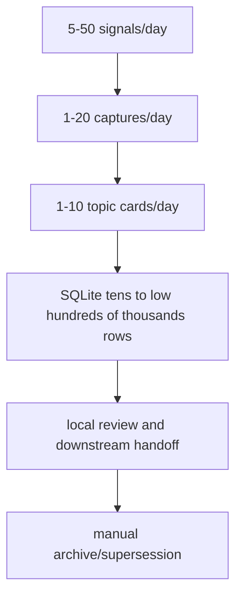

# NFR — Single-user capacity envelope

[canonical fact] v2 SRD already states local-first, single-user, 127.0.0.1, SQLite + FS, and explicitly excludes SaaS/RBAC/container orchestration. Evidence: https://github.com/RayWong1990/ScoutFlow/blob/main/docs/SRD-v2-2026-05-04.md.

[tentative candidate] This NFR file proposes a single-user capacity envelope only. It is not an enterprise SLO, not a cloud reliability target, and not a migration plan.

| NFR dimension | Candidate target | Rationale / boundary |
|---|---|---|
| Signal intake/day | [tentative candidate] 5-50 candidate signals/day | [candidate carry-forward] Enough for one creator/researcher; beyond 50 the user likely needs batch triage, not automatic capture. |
| Manual captures/day | [tentative candidate] 1-20 metadata-only captures/day | [candidate carry-forward] Manual URL capture is intentionally narrow; volume pressure should reopen scope builder, not loosen LP-001. |
| Topic cards/day | [tentative candidate] 1-10 topic-card-lite candidates/day | [candidate carry-forward] The useful unit is a small set of reviewable cards, not a firehose dashboard. |
| SQLite scale | [tentative candidate] 50k-250k rows before needing schema/index review | [candidate carry-forward] SQLite can handle more, but this project should trigger review early because evidence traceability matters more than raw capacity. |
| Local API latency | [tentative candidate] p99 < 100ms for indexed read projections; <500ms for capture creation candidate | [candidate carry-forward] Measured only after local benchmark; current value is target envelope, not verified telemetry. |
| Preview rendering | [tentative candidate] <1s for vault preview of normal metadata note candidate | [candidate carry-forward] Preview should feel immediate; if markdown rendering slows, inspect FS/artifact size before adding infrastructure. |
| Traceability matrix audit | [tentative candidate] 80-150 rows still human-auditable in 30-45 minutes | [candidate carry-forward] Beyond that, split by source type rather than compressing evidence. |
| Daily LLM spend | [tentative candidate] candidate ceiling USD 1-5/day for optional summarization/normalization | [candidate carry-forward] No live pricing was checked; treat as budget placeholder requiring refresh. |
| Local disk | [tentative candidate] 1-5GB/month metadata/evidence-only; media excluded | [candidate carry-forward] If media/audio unlocks later, this NFR must be rewritten. |
| Concurrency | [tentative candidate] one authority writer, up to three active product lanes | [candidate carry-forward] Matches current governance discipline; no queue orchestration expansion implied. |
| Redaction latency | [tentative candidate] redaction before durable write; no raw token/cookie material in ledger | [candidate carry-forward] Security boundary outranks speed. |
| Backup | [tentative candidate] daily manual or local-first snapshot candidate | [candidate carry-forward] No cloud backup/provider adoption is implied. |
| Recovery | [tentative candidate] artifact hashes + receipts sufficient to rebuild trace projections | [candidate carry-forward] Not a guarantee that deleted local files can be recovered. |
| Testing | [tentative candidate] bounded contract/API tests remain stronger than broad visual automation | [candidate carry-forward] Browser automation remains blocked unless separately authorized. |
| Operator cognitive load | [tentative candidate] one README + one matrix + one self-audit should be reviewable in one sitting | [candidate carry-forward] If review takes more than an hour, the pack is too broad for single-user cadence. |

## Capacity anti-enterprise notes

[candidate carry-forward] No multi-region uptime, no 99.9% public SLA, no tenant isolation, no RBAC, no shared org permissions.

[candidate carry-forward] No autoscaling worker pool; if background processing arrives, it should remain local queue / explicit job ledger first.

[candidate carry-forward] No cloud DAM procurement decision; prosumer DAM tools are only evaluation candidates until live research and user selection happen.

[candidate carry-forward] No Temporal/LangGraph orchestration adoption; orchestration pattern can be studied without adding runtime dependency.

[candidate carry-forward] No vector database migration by default; local embeddings or SQLite FTS are future evaluation candidates and require separate gate.

[candidate carry-forward] No cost target can rely on unrefreshed model pricing; this pack blocks live vendor economics due browsing disabled.

## Measurement plan for future local benchmark

[tentative candidate] Measurement step: seed 100/1k/10k captures in temp SQLite only. This is a plan only; no benchmark was executed in this supplement.

[tentative candidate] Measurement step: render 100 vault previews from fixture evidence. This is a plan only; no benchmark was executed in this supplement.

[tentative candidate] Measurement step: measure `/captures/discover` and `/captures/{id}/vault-preview` on 127.0.0.1. This is a plan only; no benchmark was executed in this supplement.

[tentative candidate] Measurement step: record p50/p95/p99 and DB size. This is a plan only; no benchmark was executed in this supplement.

[tentative candidate] Measurement step: archive benchmark receipt under docs/research only after redline scan. This is a plan only; no benchmark was executed in this supplement.

## 4. Single-user scenarios behind the numbers

[tentative candidate] Scenario `light day`: 5 signals, 1 capture, 0-1 topic card. 系统主要用于保存一个可信证据包，latency 目标应体现在打开和复制审计块很顺手。

[tentative candidate] Scenario `normal research day`: 20 signals, 5 captures, 2-4 topic cards. 用户会在 RAW/DiloFlow 之间切换，manifest handoff 比 dashboard completeness 更关键。

[tentative candidate] Scenario `heavy review day`: 50 signals, 20 captures, 10 topic cards. 此时不应扩成批量爬虫；应该提供 triage、dedupe、archive/supersede 和 human gate。

[tentative candidate] Scenario `audit day`: 0 new captures, 80-150 traceability rows. 性能瓶颈不是 API，而是人能否在一坐读完矩阵和 self-audit。

[tentative candidate] Scenario `visual handoff day`: 少量 visual candidates + PF-V readback. 不需要浏览器自动化；需要截图/图像来源、hash、人工 verdict 与 disabled action copy。

## 5. Proposed local benchmark receipt shape

[candidate carry-forward] 未来若要验证本 NFR，应生成 `LOCAL-BENCHMARK-RECEIPT-YYYY-MM-DD.md`，记录 temp DB path、seed counts、commands、p50/p95/p99、SQLite file size、artifact directory size、redaction scan result与删除证明。

[tentative candidate] Benchmark field `benchmark_id`: required in future receipt if NFR is promoted. It is not collected in this supplement.

[tentative candidate] Benchmark field `temp_workspace`: required in future receipt if NFR is promoted. It is not collected in this supplement.

[tentative candidate] Benchmark field `seed_captures`: required in future receipt if NFR is promoted. It is not collected in this supplement.

[tentative candidate] Benchmark field `seed_jobs`: required in future receipt if NFR is promoted. It is not collected in this supplement.

[tentative candidate] Benchmark field `seed_artifacts`: required in future receipt if NFR is promoted. It is not collected in this supplement.

[tentative candidate] Benchmark field `api_endpoint`: required in future receipt if NFR is promoted. It is not collected in this supplement.

[tentative candidate] Benchmark field `p50_ms`: required in future receipt if NFR is promoted. It is not collected in this supplement.

[tentative candidate] Benchmark field `p95_ms`: required in future receipt if NFR is promoted. It is not collected in this supplement.

[tentative candidate] Benchmark field `p99_ms`: required in future receipt if NFR is promoted. It is not collected in this supplement.

[tentative candidate] Benchmark field `db_bytes`: required in future receipt if NFR is promoted. It is not collected in this supplement.

[tentative candidate] Benchmark field `fs_bytes`: required in future receipt if NFR is promoted. It is not collected in this supplement.

[tentative candidate] Benchmark field `redaction_scan`: required in future receipt if NFR is promoted. It is not collected in this supplement.

[tentative candidate] Benchmark field `cleanup_verdict`: required in future receipt if NFR is promoted. It is not collected in this supplement.

[tentative candidate] Benchmark field `operator_notes`: required in future receipt if NFR is promoted. It is not collected in this supplement.

## 6. Cost and model NFR boundaries

[tentative candidate] Cost/model boundary: LLM cost target cannot be final without live provider pricing.

[tentative candidate] Cost/model boundary: ASR speed/cost cannot be final without local engine install and one real sample.

[tentative candidate] Cost/model boundary: prompt caching cannot be counted as savings without provider support check.

[tentative candidate] Cost/model boundary: local embeddings cannot be assumed until model, vector shape, and privacy boundary are selected.

[tentative candidate] Cost/model boundary: MCP server pattern cannot be adopted until local-first threat model is updated.

## 7. Capacity degradation behavior

[tentative candidate] Degradation level `green`: daily workload remains within 5-20 signals and <5 captures; user can review every artifact manually.

[tentative candidate] Degradation level `yellow`: daily workload reaches 50 signals or 20 captures; system should prioritize triage, dedupe, and archive rather than more automation.

[tentative candidate] Degradation level `orange`: traceability matrix exceeds 150 rows; split audit files by source type instead of compressing rows.

[tentative candidate] Degradation level `red`: user asks for batch platform crawling or full media/audio; stop and open runtime/scope gate instead of stretching metadata-only lane.

[candidate carry-forward] NFR review question 1: does this target help one person make better evidence decisions today, or did it import enterprise language that adds ceremony without improving a single-user workflow? If the latter, mark the NFR as `concern` and defer.

[tentative candidate] NFR measurement placeholder 1: record concrete local evidence before promotion; do not treat estimates in this file as telemetry.

[candidate carry-forward] NFR review question 2: does this target help one person make better evidence decisions today, or did it import enterprise language that adds ceremony without improving a single-user workflow? If the latter, mark the NFR as `concern` and defer.

[tentative candidate] NFR measurement placeholder 2: record concrete local evidence before promotion; do not treat estimates in this file as telemetry.

[candidate carry-forward] NFR review question 3: does this target help one person make better evidence decisions today, or did it import enterprise language that adds ceremony without improving a single-user workflow? If the latter, mark the NFR as `concern` and defer.

[tentative candidate] NFR measurement placeholder 3: record concrete local evidence before promotion; do not treat estimates in this file as telemetry.

[candidate carry-forward] NFR review question 4: does this target help one person make better evidence decisions today, or did it import enterprise language that adds ceremony without improving a single-user workflow? If the latter, mark the NFR as `concern` and defer.

[tentative candidate] NFR measurement placeholder 4: record concrete local evidence before promotion; do not treat estimates in this file as telemetry.

[candidate carry-forward] NFR review question 5: does this target help one person make better evidence decisions today, or did it import enterprise language that adds ceremony without improving a single-user workflow? If the latter, mark the NFR as `concern` and defer.

[tentative candidate] NFR measurement placeholder 5: record concrete local evidence before promotion; do not treat estimates in this file as telemetry.

[candidate carry-forward] NFR review question 6: does this target help one person make better evidence decisions today, or did it import enterprise language that adds ceremony without improving a single-user workflow? If the latter, mark the NFR as `concern` and defer.

[tentative candidate] NFR measurement placeholder 6: record concrete local evidence before promotion; do not treat estimates in this file as telemetry.

[candidate carry-forward] NFR review question 7: does this target help one person make better evidence decisions today, or did it import enterprise language that adds ceremony without improving a single-user workflow? If the latter, mark the NFR as `concern` and defer.

[tentative candidate] NFR measurement placeholder 7: record concrete local evidence before promotion; do not treat estimates in this file as telemetry.

[candidate carry-forward] NFR review question 8: does this target help one person make better evidence decisions today, or did it import enterprise language that adds ceremony without improving a single-user workflow? If the latter, mark the NFR as `concern` and defer.

[tentative candidate] NFR measurement placeholder 8: record concrete local evidence before promotion; do not treat estimates in this file as telemetry.

## 8. Human-time budget NFR

[tentative candidate] Human-time target 1: daily review should fit a 20-40 minute personal research block. This is deliberately human-scale; it avoids enterprise “always-on” language and keeps ScoutFlow useful as a personal evidence workbench.

[tentative candidate] Human-time target 2: a single topic-card review should fit 3-8 minutes including edit notes. This is deliberately human-scale; it avoids enterprise “always-on” language and keeps ScoutFlow useful as a personal evidence workbench.

[tentative candidate] Human-time target 3: a traceability audit should surface blockers in the first 10 rows if major gates failed. This is deliberately human-scale; it avoids enterprise “always-on” language and keeps ScoutFlow useful as a personal evidence workbench.

[tentative candidate] Human-time target 4: a handoff manifest should be readable without opening source code. This is deliberately human-scale; it avoids enterprise “always-on” language and keeps ScoutFlow useful as a personal evidence workbench.

[tentative candidate] Human-time target 5: a future benchmark receipt should be shorter than the artifact it measures. This is deliberately human-scale; it avoids enterprise “always-on” language and keeps ScoutFlow useful as a personal evidence workbench.

[tentative candidate] Human-time target 6: a redline failure should stop work faster than a new feature idea can expand scope. This is deliberately human-scale; it avoids enterprise “always-on” language and keeps ScoutFlow useful as a personal evidence workbench.

