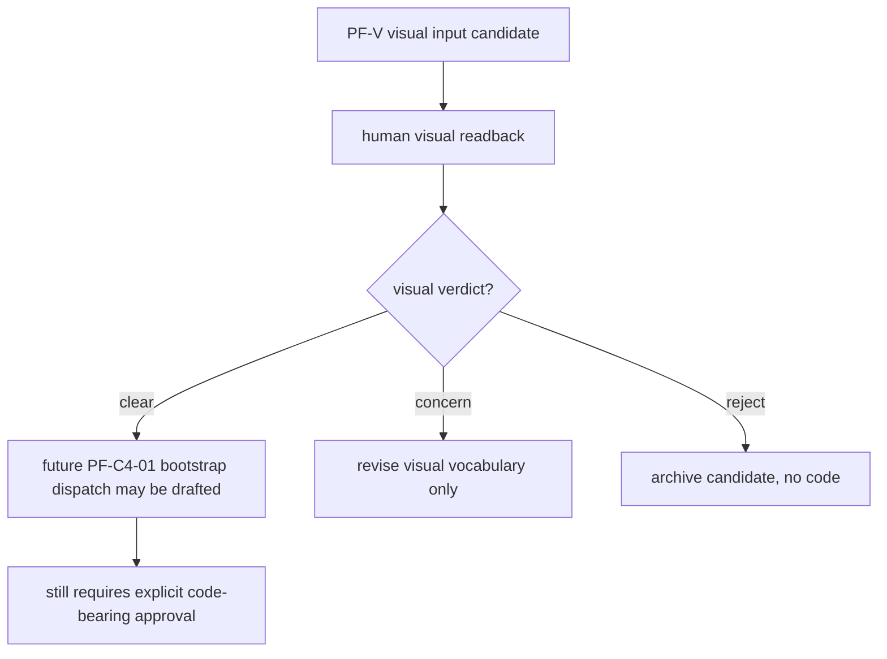
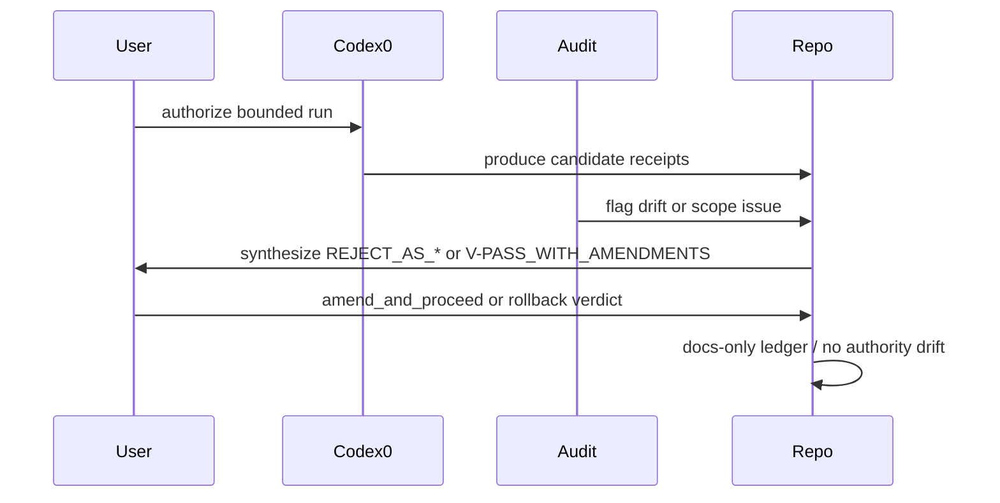

# PRD-v3 Supplement — Worked Examples

[canonical fact] 本文件是前轮 `/mnt/data/cloud-output-U1-prd-v3-srd-v3-2026-05-07.zip` 的 supplement，不重写 PRD-v3/SRD-v3 candidate，不触碰 authority files，也不批准 execution/runtime/migration。Evidence: /mnt/data/cloud-prompt-U1-deep-2026-05-07.md.

[canonical fact] 本轮必须诚实记录 live web browsing limitation；当前环境无法执行 live web search，因此所有 vendor freshness 均不进入 promoted evidence。Evidence blocker: /mnt/data/cloud-prompt-U1-deep-2026-05-07.md.

## 1. Gap scan from previous ZIP

[promoted_addendum-aware inference] Gap scan for `PRD-v3-candidate-2026-05-07.md`: (1) worked examples too compressed; (2) anti-pattern or NFR implications were mostly implicit; (3) cross-link to sibling egress / PF-V / RAW partial state was not rich enough. This supplement bounds the gap instead of silently revising the earlier file.

[promoted_addendum-aware inference] Gap scan for `SRD-v3-candidate-2026-05-07.md`: (1) worked examples too compressed; (2) anti-pattern or NFR implications were mostly implicit; (3) cross-link to sibling egress / PF-V / RAW partial state was not rich enough. This supplement bounds the gap instead of silently revising the earlier file.

[promoted_addendum-aware inference] Gap scan for `AMENDMENT-FOLD-TABLE-2026-05-07.md`: (1) worked examples too compressed; (2) anti-pattern or NFR implications were mostly implicit; (3) cross-link to sibling egress / PF-V / RAW partial state was not rich enough. This supplement bounds the gap instead of silently revising the earlier file.

[promoted_addendum-aware inference] Gap scan for `TRANSITION-GUIDE-V2-TO-V3-2026-05-07.md`: (1) worked examples too compressed; (2) anti-pattern or NFR implications were mostly implicit; (3) cross-link to sibling egress / PF-V / RAW partial state was not rich enough. This supplement bounds the gap instead of silently revising the earlier file.

[promoted_addendum-aware inference] Gap scan for `TRACEABILITY-MATRIX-2026-05-07.md`: (1) worked examples too compressed; (2) anti-pattern or NFR implications were mostly implicit; (3) cross-link to sibling egress / PF-V / RAW partial state was not rich enough. This supplement bounds the gap instead of silently revising the earlier file.

[promoted_addendum-aware inference] Gap scan for `SELF-AUDIT-PRD-V3-2026-05-07.md`: (1) worked examples too compressed; (2) anti-pattern or NFR implications were mostly implicit; (3) cross-link to sibling egress / PF-V / RAW partial state was not rich enough. This supplement bounds the gap instead of silently revising the earlier file.

[promoted_addendum-aware inference] Gap scan for `README-deliverable-index.md`: (1) worked examples too compressed; (2) anti-pattern or NFR implications were mostly implicit; (3) cross-link to sibling egress / PF-V / RAW partial state was not rich enough. This supplement bounds the gap instead of silently revising the earlier file.

## 2. Two worked examples per PRD-v3 section

| PRD-v3 section | Worked example A | Worked example B | Claim discipline |
|---|---|---|---|
| 0. 元信息 / candidate 状态 | [candidate carry-forward] 读者先确认本补充包不替换前轮 ZIP；它只补 example、NFR、egress、audit。 | [candidate carry-forward] 用户拿到 ZIP 后先看 README 与 WEB-EVIDENCE 文件，确认 live web blocker 是否接受。 | Both examples are illustrative; they do not unlock runtime. |
| 1. Mission / 范围 / 非目标 | [candidate carry-forward] 一条 Bilibili URL 先变成 metadata-only evidence，再形成 topic_card_lite candidate；没有 media/audio。 | [candidate carry-forward] PF-V 视觉草图只作为 handoff input，不代表 frontend implementation 或 visual terminal verdict。 | Both examples are illustrative; they do not unlock runtime. |
| 2. 当前功能基线 FR | [candidate carry-forward] Run-3 C1 三个 URL preview proof 可作为 topic-card-lite usefulness proof 的 examples。 | [candidate carry-forward] Run-4 C2 RAW handoff 只有 staging，用户 A-path 跳过真实 RAW copy，所以只能写 partial。 | Both examples are illustrative; they do not unlock runtime. |
| 3. 数据 / 状态 DR | [candidate carry-forward] SQLite 记录 capture/job/artifact state，FS 记录 evidence bundle；二者不相互替代。 | [candidate carry-forward] state words 只说明当前证据阶段，不承诺未来 `transcript_ready` 已发生。 | Both examples are illustrative; they do not unlock runtime. |
| 4. 红线 + 边界 | [candidate carry-forward] PR #231 的 A1/A2/A3 是 accepted_partial_scope_deviation，不是新常态。 | [candidate carry-forward] PR #239 把 synthetic UAT 从 works 降为 partial，说明 evidence wording 不可膨胀。 | Both examples are illustrative; they do not unlock runtime. |
| 5. Phase 2 unlock conditions | [candidate carry-forward] signals/hypotheses/capture_plans/topic_cards 可以作为 IR shape，但任何 runtime still gated。 | [candidate carry-forward] full_signal_workbench 只在 usefulness verdict 后进入 dedicated downstream package。 | Both examples are illustrative; they do not unlock runtime. |
| 6. ScoutFlow → DiloFlow / RAW | [candidate carry-forward] ScoutFlow 输出 evidence + topic_card；DiloFlow 才把它变成 episode script。 | [candidate carry-forward] RAW/Obsidian 只接收 candidate note，不反向覆盖 repo authority。 | Both examples are illustrative; they do not unlock runtime. |
| 7. PF-V 视觉 lane | [candidate carry-forward] image→HTML5→React TSX 是 handoff route，不是 browser automation approval。 | [candidate carry-forward] GPT-Image-2 / local visual artifact 若出现，只能作为 visual vocabulary input，需人工 visual verdict。 | Both examples are illustrative; they do not unlock runtime. |
| 8. v3 Promote Gate Map | [candidate carry-forward] promote 需要 source audit、user verdict、claim label scan、redline scan 和 rollback plan。 | [candidate carry-forward] 若 live web evidence 仍缺失，v3 可保留为 local candidate 但不应声称 external vendor refresh complete。 | Both examples are illustrative; they do not unlock runtime. |
| 9. 追溯 / archive | [candidate carry-forward] archive 保留历史决策，candidate 文件必须显式 `not-authority`。 | [candidate carry-forward] 若用户拒绝某 amendment，rewind 需要从 traceability rows 找对应 PR/section。 | Both examples are illustrative; they do not unlock runtime. |

## 3. Product scenario — PF-V visual lane without frontend unlock

[candidate carry-forward] Scenario: the user is preparing a PF-V lane where visual input may be created by image generation or hand-drawn layout, then translated into HTML5 / React TSX by a future bounded frontend bootstrap. The PRD-level requirement is not “ship a UI”; it is “preserve a handoff surface where visual intent can be audited before code-bearing work begins.”

[canonical fact] Boundary: PR #240 says `ready_for_run_5: yes_pending_pf_v_handoff`, while `can_open_c4: false` because C2 remains partial and PF-C4 hardening is still gated. Evidence: https://github.com/RayWong1990/ScoutFlow/pull/240; https://github.com/RayWong1990/ScoutFlow/blob/ea509022eb05a552777373394a6fc2a5077f27f6/docs/research/post-frozen/runs/CHECKPOINT-Run3-4-final.json.

[tentative candidate] Worked example: a GPT-Image-2 mock, if user supplies one, should be stored as `visual_input_candidate` with hash, source prompt redaction, timestamp, and `human_visual_verdict=pending`. It must not be renamed to `frontend_spec_final`, because there is no approved browser automation, package strategy, or app implementation gate in this supplement.

[promoted_addendum-aware inference] Acceptance shape: the PF-V handoff is useful when a future frontend implementer can answer four questions before touching `apps/**`: what user problem is visible, which evidence card is shown, which action is disabled, and which boundary text prevents runtime creep.

## 4. Product scenario — 4 run collaboration as evidence-ledger behavior

[canonical fact] PR #199 added live authority readback after PR194 and separated zip-derived, PR192-era, PR193/PR194 GitHub, and current localhost seam truth. Evidence: https://github.com/RayWong1990/ScoutFlow/pull/199.

[canonical fact] PR #231 recorded Run-1 external audit synthesis as `REJECT_AS_SCOPE_DRIFT` and chose `amend_and_proceed`, keeping A1/A2/A3 as accepted partial scope deviations while preserving no true-write / no runtime / no migration. Evidence: https://github.com/RayWong1990/ScoutFlow/pull/231.

[canonical fact] PR #239 amended Run-2 receipt traceability, including downgrading synthetic UAT evidence from `works` to `partial`, adding ready_for_run_3 blockers, and preserving docs-only boundary. Evidence: https://github.com/RayWong1990/ScoutFlow/pull/239.

[canonical fact] PR #240 merged Run-3+4 as a single closeout: C1 `pass`, C2 `partial`, raw-handoff-staging only, RAW transfer skipped by user A-path, and no BBDown / yt-dlp / ffmpeg / browser automation / migration. Evidence: https://github.com/RayWong1990/ScoutFlow/pull/240.

[promoted_addendum-aware inference] Worked example: a future commander should copy the amendment pattern when two independent auditors flag traceability drift: stop claiming broad readiness, record the exact partial state, and add a fix ledger that narrows the evidence rather than expanding scope. This is a product requirement because user trust depends on honest degraded verdicts.

## 5. Product scenario — ScoutFlow to RAW / DiloFlow without SoR collision

[candidate carry-forward] The post-dispatch176 RAW bridge candidate says ScoutFlow should be evidence/control/compiler front-end while RAW remains long-lived knowledge/delivery vault. The supplement treats that as a candidate carry-forward, not authority promotion. Evidence: /mnt/data/ScoutFlow-post176-cloud-audit-pack-2026-05-05.zip::04_outputs/post-dispatch176-scoutflow-raw-bridge-candidate-2026-05-05.md.

[tentative candidate] Worked example: ScoutFlow emits `topic_card_candidate.md` with source capture IDs, preview markdown hash, redaction status, and handoff timestamp. RAW imports it into `00-Inbox` as raw material, then may compile it into Obsidian notes. DiloFlow may consume the compiled idea as episode seed, but it must cite the ScoutFlow source bundle rather than relying on memory of the chat.

[promoted_addendum-aware inference] User-visible success criterion: the downstream writer can answer “which evidence caused this paragraph?” without opening ScoutFlow UI. That is why the egress contract is file-first and manifest-first, not SDK-first.

## 6. Promote gate examples

[candidate carry-forward] Promote gate example 1: all v3 sections trace to v2/amendment/run/web-or-limitation evidence. If the condition fails, the v3 candidate remains audit material and v2 remains effective base.

[candidate carry-forward] Promote gate example 2: claim label scanner shows no unlabeled substantive paragraph. If the condition fails, the v3 candidate remains audit material and v2 remains effective base.

[candidate carry-forward] Promote gate example 3: write_enabled=False remains visible in bridge config. If the condition fails, the v3 candidate remains audit material and v2 remains effective base.

[candidate carry-forward] Promote gate example 4: all five overflow lanes remain Hold. If the condition fails, the v3 candidate remains audit material and v2 remains effective base.

[candidate carry-forward] Promote gate example 5: user gives explicit promote verdict after reviewing ZIP. If the condition fails, the v3 candidate remains audit material and v2 remains effective base.

## 7. Boundary recap

[canonical fact] Boundary preserved: no PRD-v3 promotion.

[canonical fact] Boundary preserved: no SRD-v3 promotion.

[canonical fact] Boundary preserved: no true vault write.

[canonical fact] Boundary preserved: no runtime tools.

[canonical fact] Boundary preserved: no browser automation.

[canonical fact] Boundary preserved: no DB migration.

[canonical fact] Boundary preserved: no SDK coupling to DiloFlow/RAW/Obsidian/hermes-agent.

## 8. Detailed worked examples by decision moment

### Example — manual_url intake

[candidate carry-forward] 做法：用户粘贴一条 Bilibili URL，系统只做 local URL parse、canonical BV 提取、capture row 创建、metadata_fetch job enqueue。

[canonical fact] 反边界：系统不得顺手抓取 UP 主主页、推荐列表、评论或弹幕；这些都属于 non-manual expansion。

[promoted_addendum-aware inference] 产品含义是把 quick capture 定义成低摩擦入口，而不是采集爬虫入口。

[tentative candidate] 审计提示：用户可要求 future dispatch 把这个 example 转成 acceptance fixture；在未打开新 dispatch 前，它只作为 PRD explanatory supplement 存档。

### Example — metadata evidence receipt

[candidate carry-forward] 做法：metadata probe 产生 redacted safe metadata evidence，API receipt ingestion 把相对路径登记到 artifact_assets。

[candidate carry-forward] 反边界：Worker 不直接写 SQLite，也不把 raw stdout、cookie、token、QR、browser profile path 放入 ledger。

[promoted_addendum-aware inference] 产品含义是 evidence-ledger 可以被 DiloFlow/RAW 复核，而不是让用户相信一次 chat summary。

[tentative candidate] 审计提示：用户可要求 future dispatch 把这个 example 转成 acceptance fixture；在未打开新 dispatch 前，它只作为 PRD explanatory supplement 存档。

### Example — trust trace review

[candidate carry-forward] 做法：用户打开 Trust Trace，看 capture、metadata_job、probe_evidence、receipt_ledger、media_audio、audit 分层。

[canonical fact] 反边界：UI 不得把 `media_audio=blocked` 显示成 `soon` 或 `available`; disabled affordance 必须解释原因。

[promoted_addendum-aware inference] 产品含义是用户能判断材料可信程度，而不被 UI 误导为全链路完成。

[tentative candidate] 审计提示：用户可要求 future dispatch 把这个 example 转成 acceptance fixture；在未打开新 dispatch 前，它只作为 PRD explanatory supplement 存档。

### Example — topic-card-lite proof

[candidate carry-forward] 做法：Run-3 C1 三条 URL proof 形成 topic-card-lite 的可用性样本，用户 verdict 是 3/3 useful 且 needs-edit。

[canonical fact] 反边界：needs-edit 不能被改写成 final; C1 可用也不能自动打开 full signal workbench。

[promoted_addendum-aware inference] 产品含义是 topic-card-lite 是“可编辑证据卡”，不是最终选题结论。

[tentative candidate] 审计提示：用户可要求 future dispatch 把这个 example 转成 acceptance fixture；在未打开新 dispatch 前，它只作为 PRD explanatory supplement 存档。

### Example — RAW handoff partial

[candidate carry-forward] 做法：Run-4 C2 创建 raw-handoff-staging，但用户 A-path 跳过手动 RAW copy。

[canonical fact] 反边界：staging 文件不得被称为 RAW intake success; 没有 RAW 侧 readback 就只能写 partial。

[promoted_addendum-aware inference] 产品含义是 ScoutFlow 对下游诚实，不把 repo staging 伪装成知识库已吸收。

[tentative candidate] 审计提示：用户可要求 future dispatch 把这个 example 转成 acceptance fixture；在未打开新 dispatch 前，它只作为 PRD explanatory supplement 存档。

### Example — amend_and_proceed

[candidate carry-forward] 做法：当外审发现 scope drift 或 receipt traceability drift，用户可以选择 amend_and_proceed。

[candidate carry-forward] 反边界：amend_and_proceed 不是自动豁免；每次必须记录 finding、severity、decision、forward rule。

[promoted_addendum-aware inference] 产品含义是保留学习速度，同时不牺牲证据边界。

[tentative candidate] 审计提示：用户可要求 future dispatch 把这个 example 转成 acceptance fixture；在未打开新 dispatch 前，它只作为 PRD explanatory supplement 存档。

### Example — PF-V visual handoff

[candidate carry-forward] 做法：用户给出视觉草图或 GPT-Image-2 类图像，ScoutFlow 只登记为 visual_input_candidate。

[candidate carry-forward] 反边界：不生成 browser automation proof，不打开 Playwright，不写 apps/**，不把图像称为 frontend approval。

[promoted_addendum-aware inference] 产品含义是视觉 lane 服务“下一步看什么”，不是取代产品 proof。

[tentative candidate] 审计提示：用户可要求 future dispatch 把这个 example 转成 acceptance fixture；在未打开新 dispatch 前，它只作为 PRD explanatory supplement 存档。

### Example — DiloFlow downstream

[candidate carry-forward] 做法：DiloFlow 读取 topic_card_candidate 与 evidence hash，把它改写成看见看不见的一段脚本种子。

[canonical fact] 反边界：DiloFlow 不能回写 ScoutFlow authority；它最多给出 citation link 或 downstream verdict。

[promoted_addendum-aware inference] 产品含义是下游创作有自由，但证据归属清楚。

[tentative candidate] 审计提示：用户可要求 future dispatch 把这个 example 转成 acceptance fixture；在未打开新 dispatch 前，它只作为 PRD explanatory supplement 存档。

### Example — hermes-agent candidate

[candidate carry-forward] 做法：hermes-agent 可作为未来 normalization sidecar，读取 manifest、输出 candidate JSONL。

[candidate carry-forward] 反边界：不允许它直接写 artifact_assets 或修改 capture state; durable admission 仍由 ScoutFlow API/receipt validator 管。

[promoted_addendum-aware inference] 产品含义是 orchestration 可以增强产能，但不能绕过 authority-first。

[tentative candidate] 审计提示：用户可要求 future dispatch 把这个 example 转成 acceptance fixture；在未打开新 dispatch 前，它只作为 PRD explanatory supplement 存档。

### Example — v3 promote review

[candidate carry-forward] 做法：用户收到 v3 candidate + supplement 后，按 traceability、boundary、self-audit、web evidence 状态做 verdict。

[canonical fact] 反边界：若 live web 仍缺、external audit 仍 404，就不能声称 U1 deep formal gate clear。

[promoted_addendum-aware inference] 产品含义是 promotion 是 human verdict，不是 ZIP 生成动作。

[tentative candidate] 审计提示：用户可要求 future dispatch 把这个 example 转成 acceptance fixture；在未打开新 dispatch 前，它只作为 PRD explanatory supplement 存档。

## 9. Worked examples for rejection / rewind

[candidate carry-forward] Rewind example: 若用户拒绝 A1/A2/A3 accepted_partial_scope_deviation，PRD-v3 对应段落应回退到 v2 base wording，并把相关 supplement 段落标记为 `archive_reference_only`。这不是自动 rollback，而是给 human verdict 提供可执行路线。

[candidate carry-forward] Rewind example: 若用户要求 Run-2 synthetic UAT 必须重做为真实浏览器 UAT，PRD-v3 对应段落应回退到 v2 base wording，并把相关 supplement 段落标记为 `archive_reference_only`。这不是自动 rollback，而是给 human verdict 提供可执行路线。

[candidate carry-forward] Rewind example: 若用户拒绝 C2 partial 作为可进入 v3 的证据，PRD-v3 对应段落应回退到 v2 base wording，并把相关 supplement 段落标记为 `archive_reference_only`。这不是自动 rollback，而是给 human verdict 提供可执行路线。

[candidate carry-forward] Rewind example: 若用户要求 PF-V 必须先有人工 visual verdict，PRD-v3 对应段落应回退到 v2 base wording，并把相关 supplement 段落标记为 `archive_reference_only`。这不是自动 rollback，而是给 human verdict 提供可执行路线。

[candidate carry-forward] Rewind example: 若用户要求 live web refresh 是 promote 前置条件，PRD-v3 对应段落应回退到 v2 base wording，并把相关 supplement 段落标记为 `archive_reference_only`。这不是自动 rollback，而是给 human verdict 提供可执行路线。

## 10. Section-by-section acceptance card examples

### Acceptance card PRD-01

[candidate carry-forward] 输入示例：用户在审计 PRD-v3 第 1 节时，拿一条具体证据链来问“这个段落是否过度承诺”。审计者必须同时查看 v2 base、相关 PR 或 receipt、以及本 supplement 的 boundary note，而不是只读一段漂亮叙述。

[promoted_addendum-aware inference] 正向例子：如果第 1 节只说“candidate IR shape / unlock condition / handoff manifest”，并且后面跟着证据 URL 与 `not-authority` 状态，则该段可以保留为 supplement material。

[promoted_addendum-aware inference] 反向例子：如果第 1 节把 `pending_pf_v_handoff` 写成 “frontend ready”，把 `raw-handoff-staging` 写成 “RAW intake complete”，或者把 `metadata_only` 写成 “full capture pipeline”，则应标记为 over-promotion risk。

[tentative candidate] 用户 verdict 模板：`PRD-01: clear/concern/reject; accepted evidence=...; rewind section=...; required amendment=...`。该模板只是审计便利，不改 repo authority。

### Acceptance card PRD-02

[candidate carry-forward] 输入示例：用户在审计 PRD-v3 第 2 节时，拿一条具体证据链来问“这个段落是否过度承诺”。审计者必须同时查看 v2 base、相关 PR 或 receipt、以及本 supplement 的 boundary note，而不是只读一段漂亮叙述。

[promoted_addendum-aware inference] 正向例子：如果第 2 节只说“candidate IR shape / unlock condition / handoff manifest”，并且后面跟着证据 URL 与 `not-authority` 状态，则该段可以保留为 supplement material。

[promoted_addendum-aware inference] 反向例子：如果第 2 节把 `pending_pf_v_handoff` 写成 “frontend ready”，把 `raw-handoff-staging` 写成 “RAW intake complete”，或者把 `metadata_only` 写成 “full capture pipeline”，则应标记为 over-promotion risk。

[tentative candidate] 用户 verdict 模板：`PRD-02: clear/concern/reject; accepted evidence=...; rewind section=...; required amendment=...`。该模板只是审计便利，不改 repo authority。

### Acceptance card PRD-03

[candidate carry-forward] 输入示例：用户在审计 PRD-v3 第 3 节时，拿一条具体证据链来问“这个段落是否过度承诺”。审计者必须同时查看 v2 base、相关 PR 或 receipt、以及本 supplement 的 boundary note，而不是只读一段漂亮叙述。

[promoted_addendum-aware inference] 正向例子：如果第 3 节只说“candidate IR shape / unlock condition / handoff manifest”，并且后面跟着证据 URL 与 `not-authority` 状态，则该段可以保留为 supplement material。

[promoted_addendum-aware inference] 反向例子：如果第 3 节把 `pending_pf_v_handoff` 写成 “frontend ready”，把 `raw-handoff-staging` 写成 “RAW intake complete”，或者把 `metadata_only` 写成 “full capture pipeline”，则应标记为 over-promotion risk。

[tentative candidate] 用户 verdict 模板：`PRD-03: clear/concern/reject; accepted evidence=...; rewind section=...; required amendment=...`。该模板只是审计便利，不改 repo authority。

### Acceptance card PRD-04

[candidate carry-forward] 输入示例：用户在审计 PRD-v3 第 4 节时，拿一条具体证据链来问“这个段落是否过度承诺”。审计者必须同时查看 v2 base、相关 PR 或 receipt、以及本 supplement 的 boundary note，而不是只读一段漂亮叙述。

[promoted_addendum-aware inference] 正向例子：如果第 4 节只说“candidate IR shape / unlock condition / handoff manifest”，并且后面跟着证据 URL 与 `not-authority` 状态，则该段可以保留为 supplement material。

[promoted_addendum-aware inference] 反向例子：如果第 4 节把 `pending_pf_v_handoff` 写成 “frontend ready”，把 `raw-handoff-staging` 写成 “RAW intake complete”，或者把 `metadata_only` 写成 “full capture pipeline”，则应标记为 over-promotion risk。

[tentative candidate] 用户 verdict 模板：`PRD-04: clear/concern/reject; accepted evidence=...; rewind section=...; required amendment=...`。该模板只是审计便利，不改 repo authority。

### Acceptance card PRD-05

[candidate carry-forward] 输入示例：用户在审计 PRD-v3 第 5 节时，拿一条具体证据链来问“这个段落是否过度承诺”。审计者必须同时查看 v2 base、相关 PR 或 receipt、以及本 supplement 的 boundary note，而不是只读一段漂亮叙述。

[promoted_addendum-aware inference] 正向例子：如果第 5 节只说“candidate IR shape / unlock condition / handoff manifest”，并且后面跟着证据 URL 与 `not-authority` 状态，则该段可以保留为 supplement material。

[promoted_addendum-aware inference] 反向例子：如果第 5 节把 `pending_pf_v_handoff` 写成 “frontend ready”，把 `raw-handoff-staging` 写成 “RAW intake complete”，或者把 `metadata_only` 写成 “full capture pipeline”，则应标记为 over-promotion risk。

[tentative candidate] 用户 verdict 模板：`PRD-05: clear/concern/reject; accepted evidence=...; rewind section=...; required amendment=...`。该模板只是审计便利，不改 repo authority。

### Acceptance card PRD-06

[candidate carry-forward] 输入示例：用户在审计 PRD-v3 第 6 节时，拿一条具体证据链来问“这个段落是否过度承诺”。审计者必须同时查看 v2 base、相关 PR 或 receipt、以及本 supplement 的 boundary note，而不是只读一段漂亮叙述。

[promoted_addendum-aware inference] 正向例子：如果第 6 节只说“candidate IR shape / unlock condition / handoff manifest”，并且后面跟着证据 URL 与 `not-authority` 状态，则该段可以保留为 supplement material。

[promoted_addendum-aware inference] 反向例子：如果第 6 节把 `pending_pf_v_handoff` 写成 “frontend ready”，把 `raw-handoff-staging` 写成 “RAW intake complete”，或者把 `metadata_only` 写成 “full capture pipeline”，则应标记为 over-promotion risk。

[tentative candidate] 用户 verdict 模板：`PRD-06: clear/concern/reject; accepted evidence=...; rewind section=...; required amendment=...`。该模板只是审计便利，不改 repo authority。

### Acceptance card PRD-07

[candidate carry-forward] 输入示例：用户在审计 PRD-v3 第 7 节时，拿一条具体证据链来问“这个段落是否过度承诺”。审计者必须同时查看 v2 base、相关 PR 或 receipt、以及本 supplement 的 boundary note，而不是只读一段漂亮叙述。

[promoted_addendum-aware inference] 正向例子：如果第 7 节只说“candidate IR shape / unlock condition / handoff manifest”，并且后面跟着证据 URL 与 `not-authority` 状态，则该段可以保留为 supplement material。

[promoted_addendum-aware inference] 反向例子：如果第 7 节把 `pending_pf_v_handoff` 写成 “frontend ready”，把 `raw-handoff-staging` 写成 “RAW intake complete”，或者把 `metadata_only` 写成 “full capture pipeline”，则应标记为 over-promotion risk。

[tentative candidate] 用户 verdict 模板：`PRD-07: clear/concern/reject; accepted evidence=...; rewind section=...; required amendment=...`。该模板只是审计便利，不改 repo authority。

### Acceptance card PRD-08

[candidate carry-forward] 输入示例：用户在审计 PRD-v3 第 8 节时，拿一条具体证据链来问“这个段落是否过度承诺”。审计者必须同时查看 v2 base、相关 PR 或 receipt、以及本 supplement 的 boundary note，而不是只读一段漂亮叙述。

[promoted_addendum-aware inference] 正向例子：如果第 8 节只说“candidate IR shape / unlock condition / handoff manifest”，并且后面跟着证据 URL 与 `not-authority` 状态，则该段可以保留为 supplement material。

[promoted_addendum-aware inference] 反向例子：如果第 8 节把 `pending_pf_v_handoff` 写成 “frontend ready”，把 `raw-handoff-staging` 写成 “RAW intake complete”，或者把 `metadata_only` 写成 “full capture pipeline”，则应标记为 over-promotion risk。

[tentative candidate] 用户 verdict 模板：`PRD-08: clear/concern/reject; accepted evidence=...; rewind section=...; required amendment=...`。该模板只是审计便利，不改 repo authority。

### Acceptance card PRD-09

[candidate carry-forward] 输入示例：用户在审计 PRD-v3 第 9 节时，拿一条具体证据链来问“这个段落是否过度承诺”。审计者必须同时查看 v2 base、相关 PR 或 receipt、以及本 supplement 的 boundary note，而不是只读一段漂亮叙述。

[promoted_addendum-aware inference] 正向例子：如果第 9 节只说“candidate IR shape / unlock condition / handoff manifest”，并且后面跟着证据 URL 与 `not-authority` 状态，则该段可以保留为 supplement material。

[promoted_addendum-aware inference] 反向例子：如果第 9 节把 `pending_pf_v_handoff` 写成 “frontend ready”，把 `raw-handoff-staging` 写成 “RAW intake complete”，或者把 `metadata_only` 写成 “full capture pipeline”，则应标记为 over-promotion risk。

[tentative candidate] 用户 verdict 模板：`PRD-09: clear/concern/reject; accepted evidence=...; rewind section=...; required amendment=...`。该模板只是审计便利，不改 repo authority。

### Acceptance card PRD-10

[candidate carry-forward] 输入示例：用户在审计 PRD-v3 第 10 节时，拿一条具体证据链来问“这个段落是否过度承诺”。审计者必须同时查看 v2 base、相关 PR 或 receipt、以及本 supplement 的 boundary note，而不是只读一段漂亮叙述。

[promoted_addendum-aware inference] 正向例子：如果第 10 节只说“candidate IR shape / unlock condition / handoff manifest”，并且后面跟着证据 URL 与 `not-authority` 状态，则该段可以保留为 supplement material。

[promoted_addendum-aware inference] 反向例子：如果第 10 节把 `pending_pf_v_handoff` 写成 “frontend ready”，把 `raw-handoff-staging` 写成 “RAW intake complete”，或者把 `metadata_only` 写成 “full capture pipeline”，则应标记为 over-promotion risk。

[tentative candidate] 用户 verdict 模板：`PRD-10: clear/concern/reject; accepted evidence=...; rewind section=...; required amendment=...`。该模板只是审计便利，不改 repo authority。

## 11. Example frontmatter / manifest snippets for product review

[tentative candidate] Candidate object `visual_input_candidate` should carry: `schema`, `status=candidate`, `authority=not-authority`, `source_evidence_urls[]`, `source_hashes[]`, `created_at`, `review_state`, `redaction_applied`, and `boundary_notes[]`. Missing any of these fields should produce a `concern` verdict rather than silent acceptance.

[candidate carry-forward] Product reason for `visual_input_candidate`: the user needs a small, inspectable object that survives context switching between ChatGPT, Codex, Claude, Hermes, RAW, and DiloFlow. The product requirement is not automation breadth; it is evidence continuity.

[tentative candidate] Candidate object `topic_card_candidate` should carry: `schema`, `status=candidate`, `authority=not-authority`, `source_evidence_urls[]`, `source_hashes[]`, `created_at`, `review_state`, `redaction_applied`, and `boundary_notes[]`. Missing any of these fields should produce a `concern` verdict rather than silent acceptance.

[candidate carry-forward] Product reason for `topic_card_candidate`: the user needs a small, inspectable object that survives context switching between ChatGPT, Codex, Claude, Hermes, RAW, and DiloFlow. The product requirement is not automation breadth; it is evidence continuity.

[tentative candidate] Candidate object `raw_handoff_candidate` should carry: `schema`, `status=candidate`, `authority=not-authority`, `source_evidence_urls[]`, `source_hashes[]`, `created_at`, `review_state`, `redaction_applied`, and `boundary_notes[]`. Missing any of these fields should produce a `concern` verdict rather than silent acceptance.

[candidate carry-forward] Product reason for `raw_handoff_candidate`: the user needs a small, inspectable object that survives context switching between ChatGPT, Codex, Claude, Hermes, RAW, and DiloFlow. The product requirement is not automation breadth; it is evidence continuity.

[tentative candidate] Candidate object `diloflow_seed_candidate` should carry: `schema`, `status=candidate`, `authority=not-authority`, `source_evidence_urls[]`, `source_hashes[]`, `created_at`, `review_state`, `redaction_applied`, and `boundary_notes[]`. Missing any of these fields should produce a `concern` verdict rather than silent acceptance.

[candidate carry-forward] Product reason for `diloflow_seed_candidate`: the user needs a small, inspectable object that survives context switching between ChatGPT, Codex, Claude, Hermes, RAW, and DiloFlow. The product requirement is not automation breadth; it is evidence continuity.

[tentative candidate] Candidate object `promote_gate_review` should carry: `schema`, `status=candidate`, `authority=not-authority`, `source_evidence_urls[]`, `source_hashes[]`, `created_at`, `review_state`, `redaction_applied`, and `boundary_notes[]`. Missing any of these fields should produce a `concern` verdict rather than silent acceptance.

[candidate carry-forward] Product reason for `promote_gate_review`: the user needs a small, inspectable object that survives context switching between ChatGPT, Codex, Claude, Hermes, RAW, and DiloFlow. The product requirement is not automation breadth; it is evidence continuity.

