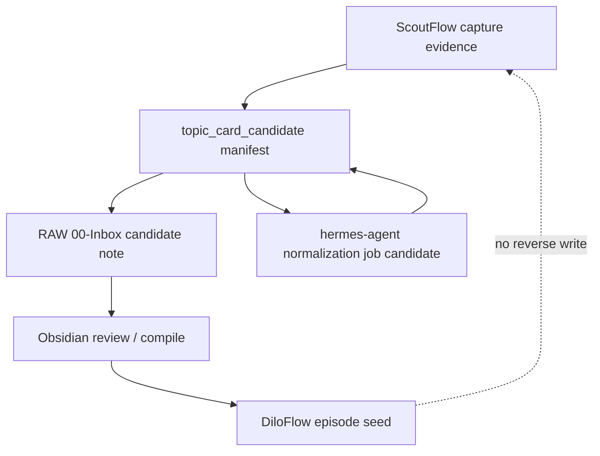
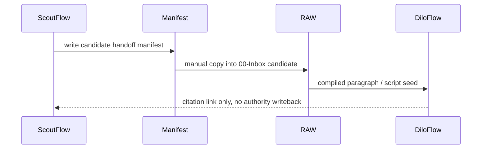

# Sibling Project Egress Contract — file-first handoff, not SDK

[canonical fact] PRD-v2 says RAW / Obsidian / DiloFlow are downstream consumers and not part of ScoutFlow. Evidence: https://github.com/RayWong1990/ScoutFlow/blob/main/docs/PRD-v2-2026-05-04.md.

[candidate carry-forward] The post-dispatch176 RAW bridge candidate frames ScoutFlow as evidence/control/compiler front-end and RAW as long-lived knowledge/delivery vault. Evidence: /mnt/data/ScoutFlow-post176-cloud-audit-pack-2026-05-05.zip::04_outputs/post-dispatch176-scoutflow-raw-bridge-candidate-2026-05-05.md.

[canonical fact] Cross-local search requested by the supplement prompt could not be completed because `/Users/wanglei/workspace/ScoutFlow`, `/Users/wanglei/workspace/DiloFlow`, `/Users/wanglei/workspace/contentflow`, and `~/.claude/skills` were not mounted in this execution environment. This file therefore defines candidate egress contracts from provided prompt facts and repo/ZIP evidence, not local workspace inspection.





## DiloFlow

[tentative candidate] Purpose: consume evidence/topic_card as episode script seed for channel 看见看不见.

[tentative candidate] Manifest: `diloflow_handoff_v0.candidate.json` with `source_capture_ids`, `topic_card_path`, `evidence_hashes`, `handoff_at`, `redaction_applied`.

[tentative candidate] Directory candidate: `handoff/diloflow/YYYY-MM-DD/<capture_id>/` under repo-external downstream workspace.

[tentative candidate] Rule: DiloFlow may edit narrative, but source claim provenance remains ScoutFlow/RAW citation, not chat memory.

## RAW vault

[tentative candidate] Purpose: receive raw note candidate, then compile/enrich in long-lived knowledge OS.

[tentative candidate] Manifest: `raw_handoff_v0.candidate.json` with `frontmatter_mode=raw_4_field`, `raw_target_hint`, `source_preview_path`, `manual_transfer_required=true`.

[tentative candidate] Directory candidate: RAW `00-Inbox/ScoutFlow/<date>/` only after user manual copy.

[tentative candidate] Rule: RAW compile cannot reverse-write repo authority; ScoutFlow staging is not RAW intake proof.

## Obsidian

[tentative candidate] Purpose: local review surface for markdown evidence and compiled notes.

[tentative candidate] Manifest: markdown frontmatter with `source_system: scoutflow`, `status: candidate`, `capture_id`, `artifact_sha256`, `review_state`.

[tentative candidate] Directory candidate: user vault path chosen outside repo; no vault path enters Git unless redacted.

[tentative candidate] Rule: Obsidian properties are review metadata, not ScoutFlow state words.

## hermes-agent

[tentative candidate] Purpose: possible orchestration sidecar / normalization runtime host in future.

[tentative candidate] Manifest: `hermes_job_candidate_v0.json` with `input_artifacts`, `prompt_contract`, `provider_config_ref`, `redaction_policy`, `dry_run=true`.

[tentative candidate] Directory candidate: repo-external temp workdir; no provider secrets or raw API responses in ScoutFlow docs.

[tentative candidate] Rule: hermes-agent can propose normalization but API/receipt validator owns durable admission.

## Common manifest fields

| Field | Required? | Meaning | Boundary |
|---|---:|---|---|
| schema | yes | [candidate carry-forward] candidate schema string | not authority |
| handoff_id | yes | [candidate carry-forward] stable local id for this transfer | not global object id |
| source_capture_ids | yes | [candidate carry-forward] capture IDs or proof artifact IDs | must resolve in ScoutFlow evidence |
| source_urls_redacted | yes | [candidate carry-forward] canonical/source URLs after redaction | no tracking params if sensitive |
| artifact_hashes | yes | [candidate carry-forward] sha256/bytes for transferred files | required before downstream trust |
| handoff_at | yes | [candidate carry-forward] ISO timestamp | records copy intent, not intake verdict |
| downstream_target | yes | [candidate carry-forward] RAW/DiloFlow/Obsidian/hermes-agent | no SDK import |
| redaction_applied | yes | [candidate carry-forward] boolean + policy id | must be true for durable share |
| manual_transfer_required | yes | [candidate carry-forward] explicit true unless future gate changes | prevents false true-write |
| review_state | yes | [candidate carry-forward] candidate/reviewed/rejected | downstream-local state only |

## Redaction and SoR rules

[canonical fact] Egress rule: cookie/token/auth sidecar/browser profile path never enters manifest.

[canonical fact] Egress rule: raw stdout/stderr and provider raw API response never enters manifest.

[canonical fact] Egress rule: ScoutFlow remains SoR for capture evidence and receipts.

[canonical fact] Egress rule: RAW remains SoR for compiled knowledge after intake.

[canonical fact] Egress rule: DiloFlow remains SoR for episode scripts after it edits the seed.

[candidate carry-forward] Egress rule: hermes-agent remains a runtime sidecar candidate, not authority.

[candidate carry-forward] Egress rule: Obsidian is review surface unless user promotes its note in downstream process.

## Detailed manifest templates

### DiloFlow template

[tentative candidate] Template below is candidate-only and must be adapted by downstream owner before use. It defines a file convention, not an SDK or runtime integration.

```yaml
schema: scoutflow.diloflow_handoff.v0.candidate
handoff_id: sf-dilo-<date>-<capture_id>
source_capture_ids: []
topic_card_path: topic-card-candidate.md
evidence_hashes: []
intended_episode: EPxx
redaction_applied: true
handoff_at: <iso8601>
review_state: candidate
```

### RAW template

[tentative candidate] Template below is candidate-only and must be adapted by downstream owner before use. It defines a file convention, not an SDK or runtime integration.

```yaml
schema: scoutflow.raw_handoff.v0.candidate
handoff_id: sf-raw-<date>-<capture_id>
frontmatter_mode: raw_4_field
raw_target_hint: 00-Inbox/ScoutFlow
manual_transfer_required: true
source_preview_path: vault-preview.md
source_hash: sha256...
redaction_applied: true
intake_verdict: pending
```

### Obsidian template

[tentative candidate] Template below is candidate-only and must be adapted by downstream owner before use. It defines a file convention, not an SDK or runtime integration.

```yaml
---
source_system: scoutflow
status: candidate
capture_id: <id>
artifact_sha256: sha256...
review_state: unreviewed
redaction_applied: true
---
# Candidate note
```

### hermes-agent template

[tentative candidate] Template below is candidate-only and must be adapted by downstream owner before use. It defines a file convention, not an SDK or runtime integration.

```yaml
{
  "schema":"scoutflow.hermes_job_candidate.v0",
  "dry_run": true,
  "input_artifacts": [],
  "prompt_contract":"normalization_v0_candidate",
  "redaction_policy":"no_raw_provider_response",
  "durable_admission":"scoutflow_receipt_required"
}
```

## Egress lifecycle states

[candidate carry-forward] Egress state `prepared`: ScoutFlow generated candidate material and manifest but no manual copy occurred.

[candidate carry-forward] Egress state `transferred`: User copied material to downstream path; this records handoff action, not acceptance.

[candidate carry-forward] Egress state `intake_reviewed`: Downstream system or user reviewed format and accepted/rejected material.

[candidate carry-forward] Egress state `compiled`: RAW/Obsidian/DiloFlow transformed material into knowledge/script; ScoutFlow receives citation only.

[candidate carry-forward] Egress state `superseded`: A later candidate replaces this handoff; old material remains archived unless purge gate applies.

[candidate carry-forward] Egress state `purged`: Physical delete due secrets/rights/PII; requires tombstone without sensitive payload.

## Downstream failure modes

[promoted_addendum-aware inference] Failure mode: missing artifact hash. Required response: mark handoff `concern` or `reject`, do not silently import.

[promoted_addendum-aware inference] Failure mode: redaction_applied absent or false. Required response: mark handoff `concern` or `reject`, do not silently import.

[promoted_addendum-aware inference] Failure mode: source capture id does not resolve. Required response: mark handoff `concern` or `reject`, do not silently import.

[promoted_addendum-aware inference] Failure mode: downstream path includes secret/local credential material. Required response: mark handoff `concern` or `reject`, do not silently import.

[promoted_addendum-aware inference] Failure mode: DiloFlow script cites topic card without evidence URL. Required response: mark handoff `concern` or `reject`, do not silently import.

[promoted_addendum-aware inference] Failure mode: RAW compile claims final knowledge before user review. Required response: mark handoff `concern` or `reject`, do not silently import.

[promoted_addendum-aware inference] Failure mode: Obsidian note changes state words incompatible with ScoutFlow. Required response: mark handoff `concern` or `reject`, do not silently import.

[promoted_addendum-aware inference] Failure mode: hermes-agent output lacks provenance validator. Required response: mark handoff `concern` or `reject`, do not silently import.

## Per-downstream acceptance and rejection examples

### DiloFlow egress example 1

[tentative candidate] Accepted candidate: DiloFlow receives a manifest with source capture IDs, artifact hashes, redaction flag, handoff timestamp, and downstream review_state. The manifest points back to ScoutFlow evidence but does not require importing ScoutFlow code or API client.

[promoted_addendum-aware inference] Rejected candidate: DiloFlow receives only a prose summary, chat excerpt, or image without hash/provenance. The downstream user cannot answer which capture, receipt, or topic_card generated the material, so the handoff must be marked `concern`.

[candidate carry-forward] Boundary example: DiloFlow may transform material for its own workflow, but any reverse signal to ScoutFlow must be a citation/verdict/issue, not a direct authority mutation.

### DiloFlow egress example 2

[tentative candidate] Accepted candidate: DiloFlow receives a manifest with source capture IDs, artifact hashes, redaction flag, handoff timestamp, and downstream review_state. The manifest points back to ScoutFlow evidence but does not require importing ScoutFlow code or API client.

[promoted_addendum-aware inference] Rejected candidate: DiloFlow receives only a prose summary, chat excerpt, or image without hash/provenance. The downstream user cannot answer which capture, receipt, or topic_card generated the material, so the handoff must be marked `concern`.

[candidate carry-forward] Boundary example: DiloFlow may transform material for its own workflow, but any reverse signal to ScoutFlow must be a citation/verdict/issue, not a direct authority mutation.

### DiloFlow egress example 3

[tentative candidate] Accepted candidate: DiloFlow receives a manifest with source capture IDs, artifact hashes, redaction flag, handoff timestamp, and downstream review_state. The manifest points back to ScoutFlow evidence but does not require importing ScoutFlow code or API client.

[promoted_addendum-aware inference] Rejected candidate: DiloFlow receives only a prose summary, chat excerpt, or image without hash/provenance. The downstream user cannot answer which capture, receipt, or topic_card generated the material, so the handoff must be marked `concern`.

[candidate carry-forward] Boundary example: DiloFlow may transform material for its own workflow, but any reverse signal to ScoutFlow must be a citation/verdict/issue, not a direct authority mutation.

### DiloFlow egress example 4

[tentative candidate] Accepted candidate: DiloFlow receives a manifest with source capture IDs, artifact hashes, redaction flag, handoff timestamp, and downstream review_state. The manifest points back to ScoutFlow evidence but does not require importing ScoutFlow code or API client.

[promoted_addendum-aware inference] Rejected candidate: DiloFlow receives only a prose summary, chat excerpt, or image without hash/provenance. The downstream user cannot answer which capture, receipt, or topic_card generated the material, so the handoff must be marked `concern`.

[candidate carry-forward] Boundary example: DiloFlow may transform material for its own workflow, but any reverse signal to ScoutFlow must be a citation/verdict/issue, not a direct authority mutation.

### DiloFlow egress example 5

[tentative candidate] Accepted candidate: DiloFlow receives a manifest with source capture IDs, artifact hashes, redaction flag, handoff timestamp, and downstream review_state. The manifest points back to ScoutFlow evidence but does not require importing ScoutFlow code or API client.

[promoted_addendum-aware inference] Rejected candidate: DiloFlow receives only a prose summary, chat excerpt, or image without hash/provenance. The downstream user cannot answer which capture, receipt, or topic_card generated the material, so the handoff must be marked `concern`.

[candidate carry-forward] Boundary example: DiloFlow may transform material for its own workflow, but any reverse signal to ScoutFlow must be a citation/verdict/issue, not a direct authority mutation.

### DiloFlow egress example 6

[tentative candidate] Accepted candidate: DiloFlow receives a manifest with source capture IDs, artifact hashes, redaction flag, handoff timestamp, and downstream review_state. The manifest points back to ScoutFlow evidence but does not require importing ScoutFlow code or API client.

[promoted_addendum-aware inference] Rejected candidate: DiloFlow receives only a prose summary, chat excerpt, or image without hash/provenance. The downstream user cannot answer which capture, receipt, or topic_card generated the material, so the handoff must be marked `concern`.

[candidate carry-forward] Boundary example: DiloFlow may transform material for its own workflow, but any reverse signal to ScoutFlow must be a citation/verdict/issue, not a direct authority mutation.

### RAW vault egress example 1

[tentative candidate] Accepted candidate: RAW vault receives a manifest with source capture IDs, artifact hashes, redaction flag, handoff timestamp, and downstream review_state. The manifest points back to ScoutFlow evidence but does not require importing ScoutFlow code or API client.

[promoted_addendum-aware inference] Rejected candidate: RAW vault receives only a prose summary, chat excerpt, or image without hash/provenance. The downstream user cannot answer which capture, receipt, or topic_card generated the material, so the handoff must be marked `concern`.

[candidate carry-forward] Boundary example: RAW vault may transform material for its own workflow, but any reverse signal to ScoutFlow must be a citation/verdict/issue, not a direct authority mutation.

### RAW vault egress example 2

[tentative candidate] Accepted candidate: RAW vault receives a manifest with source capture IDs, artifact hashes, redaction flag, handoff timestamp, and downstream review_state. The manifest points back to ScoutFlow evidence but does not require importing ScoutFlow code or API client.

[promoted_addendum-aware inference] Rejected candidate: RAW vault receives only a prose summary, chat excerpt, or image without hash/provenance. The downstream user cannot answer which capture, receipt, or topic_card generated the material, so the handoff must be marked `concern`.

[candidate carry-forward] Boundary example: RAW vault may transform material for its own workflow, but any reverse signal to ScoutFlow must be a citation/verdict/issue, not a direct authority mutation.

### RAW vault egress example 3

[tentative candidate] Accepted candidate: RAW vault receives a manifest with source capture IDs, artifact hashes, redaction flag, handoff timestamp, and downstream review_state. The manifest points back to ScoutFlow evidence but does not require importing ScoutFlow code or API client.

[promoted_addendum-aware inference] Rejected candidate: RAW vault receives only a prose summary, chat excerpt, or image without hash/provenance. The downstream user cannot answer which capture, receipt, or topic_card generated the material, so the handoff must be marked `concern`.

[candidate carry-forward] Boundary example: RAW vault may transform material for its own workflow, but any reverse signal to ScoutFlow must be a citation/verdict/issue, not a direct authority mutation.

### RAW vault egress example 4

[tentative candidate] Accepted candidate: RAW vault receives a manifest with source capture IDs, artifact hashes, redaction flag, handoff timestamp, and downstream review_state. The manifest points back to ScoutFlow evidence but does not require importing ScoutFlow code or API client.

[promoted_addendum-aware inference] Rejected candidate: RAW vault receives only a prose summary, chat excerpt, or image without hash/provenance. The downstream user cannot answer which capture, receipt, or topic_card generated the material, so the handoff must be marked `concern`.

[candidate carry-forward] Boundary example: RAW vault may transform material for its own workflow, but any reverse signal to ScoutFlow must be a citation/verdict/issue, not a direct authority mutation.

### RAW vault egress example 5

[tentative candidate] Accepted candidate: RAW vault receives a manifest with source capture IDs, artifact hashes, redaction flag, handoff timestamp, and downstream review_state. The manifest points back to ScoutFlow evidence but does not require importing ScoutFlow code or API client.

[promoted_addendum-aware inference] Rejected candidate: RAW vault receives only a prose summary, chat excerpt, or image without hash/provenance. The downstream user cannot answer which capture, receipt, or topic_card generated the material, so the handoff must be marked `concern`.

[candidate carry-forward] Boundary example: RAW vault may transform material for its own workflow, but any reverse signal to ScoutFlow must be a citation/verdict/issue, not a direct authority mutation.

### RAW vault egress example 6

[tentative candidate] Accepted candidate: RAW vault receives a manifest with source capture IDs, artifact hashes, redaction flag, handoff timestamp, and downstream review_state. The manifest points back to ScoutFlow evidence but does not require importing ScoutFlow code or API client.

[promoted_addendum-aware inference] Rejected candidate: RAW vault receives only a prose summary, chat excerpt, or image without hash/provenance. The downstream user cannot answer which capture, receipt, or topic_card generated the material, so the handoff must be marked `concern`.

[candidate carry-forward] Boundary example: RAW vault may transform material for its own workflow, but any reverse signal to ScoutFlow must be a citation/verdict/issue, not a direct authority mutation.

### Obsidian egress example 1

[tentative candidate] Accepted candidate: Obsidian receives a manifest with source capture IDs, artifact hashes, redaction flag, handoff timestamp, and downstream review_state. The manifest points back to ScoutFlow evidence but does not require importing ScoutFlow code or API client.

[promoted_addendum-aware inference] Rejected candidate: Obsidian receives only a prose summary, chat excerpt, or image without hash/provenance. The downstream user cannot answer which capture, receipt, or topic_card generated the material, so the handoff must be marked `concern`.

[candidate carry-forward] Boundary example: Obsidian may transform material for its own workflow, but any reverse signal to ScoutFlow must be a citation/verdict/issue, not a direct authority mutation.

### Obsidian egress example 2

[tentative candidate] Accepted candidate: Obsidian receives a manifest with source capture IDs, artifact hashes, redaction flag, handoff timestamp, and downstream review_state. The manifest points back to ScoutFlow evidence but does not require importing ScoutFlow code or API client.

[promoted_addendum-aware inference] Rejected candidate: Obsidian receives only a prose summary, chat excerpt, or image without hash/provenance. The downstream user cannot answer which capture, receipt, or topic_card generated the material, so the handoff must be marked `concern`.

[candidate carry-forward] Boundary example: Obsidian may transform material for its own workflow, but any reverse signal to ScoutFlow must be a citation/verdict/issue, not a direct authority mutation.

### Obsidian egress example 3

[tentative candidate] Accepted candidate: Obsidian receives a manifest with source capture IDs, artifact hashes, redaction flag, handoff timestamp, and downstream review_state. The manifest points back to ScoutFlow evidence but does not require importing ScoutFlow code or API client.

[promoted_addendum-aware inference] Rejected candidate: Obsidian receives only a prose summary, chat excerpt, or image without hash/provenance. The downstream user cannot answer which capture, receipt, or topic_card generated the material, so the handoff must be marked `concern`.

[candidate carry-forward] Boundary example: Obsidian may transform material for its own workflow, but any reverse signal to ScoutFlow must be a citation/verdict/issue, not a direct authority mutation.

### Obsidian egress example 4

[tentative candidate] Accepted candidate: Obsidian receives a manifest with source capture IDs, artifact hashes, redaction flag, handoff timestamp, and downstream review_state. The manifest points back to ScoutFlow evidence but does not require importing ScoutFlow code or API client.

[promoted_addendum-aware inference] Rejected candidate: Obsidian receives only a prose summary, chat excerpt, or image without hash/provenance. The downstream user cannot answer which capture, receipt, or topic_card generated the material, so the handoff must be marked `concern`.

[candidate carry-forward] Boundary example: Obsidian may transform material for its own workflow, but any reverse signal to ScoutFlow must be a citation/verdict/issue, not a direct authority mutation.

### Obsidian egress example 5

[tentative candidate] Accepted candidate: Obsidian receives a manifest with source capture IDs, artifact hashes, redaction flag, handoff timestamp, and downstream review_state. The manifest points back to ScoutFlow evidence but does not require importing ScoutFlow code or API client.

[promoted_addendum-aware inference] Rejected candidate: Obsidian receives only a prose summary, chat excerpt, or image without hash/provenance. The downstream user cannot answer which capture, receipt, or topic_card generated the material, so the handoff must be marked `concern`.

[candidate carry-forward] Boundary example: Obsidian may transform material for its own workflow, but any reverse signal to ScoutFlow must be a citation/verdict/issue, not a direct authority mutation.

### Obsidian egress example 6

[tentative candidate] Accepted candidate: Obsidian receives a manifest with source capture IDs, artifact hashes, redaction flag, handoff timestamp, and downstream review_state. The manifest points back to ScoutFlow evidence but does not require importing ScoutFlow code or API client.

[promoted_addendum-aware inference] Rejected candidate: Obsidian receives only a prose summary, chat excerpt, or image without hash/provenance. The downstream user cannot answer which capture, receipt, or topic_card generated the material, so the handoff must be marked `concern`.

[candidate carry-forward] Boundary example: Obsidian may transform material for its own workflow, but any reverse signal to ScoutFlow must be a citation/verdict/issue, not a direct authority mutation.

### hermes-agent egress example 1

[tentative candidate] Accepted candidate: hermes-agent receives a manifest with source capture IDs, artifact hashes, redaction flag, handoff timestamp, and downstream review_state. The manifest points back to ScoutFlow evidence but does not require importing ScoutFlow code or API client.

[promoted_addendum-aware inference] Rejected candidate: hermes-agent receives only a prose summary, chat excerpt, or image without hash/provenance. The downstream user cannot answer which capture, receipt, or topic_card generated the material, so the handoff must be marked `concern`.

[candidate carry-forward] Boundary example: hermes-agent may transform material for its own workflow, but any reverse signal to ScoutFlow must be a citation/verdict/issue, not a direct authority mutation.

### hermes-agent egress example 2

[tentative candidate] Accepted candidate: hermes-agent receives a manifest with source capture IDs, artifact hashes, redaction flag, handoff timestamp, and downstream review_state. The manifest points back to ScoutFlow evidence but does not require importing ScoutFlow code or API client.

[promoted_addendum-aware inference] Rejected candidate: hermes-agent receives only a prose summary, chat excerpt, or image without hash/provenance. The downstream user cannot answer which capture, receipt, or topic_card generated the material, so the handoff must be marked `concern`.

[candidate carry-forward] Boundary example: hermes-agent may transform material for its own workflow, but any reverse signal to ScoutFlow must be a citation/verdict/issue, not a direct authority mutation.

### hermes-agent egress example 3

[tentative candidate] Accepted candidate: hermes-agent receives a manifest with source capture IDs, artifact hashes, redaction flag, handoff timestamp, and downstream review_state. The manifest points back to ScoutFlow evidence but does not require importing ScoutFlow code or API client.

[promoted_addendum-aware inference] Rejected candidate: hermes-agent receives only a prose summary, chat excerpt, or image without hash/provenance. The downstream user cannot answer which capture, receipt, or topic_card generated the material, so the handoff must be marked `concern`.

[candidate carry-forward] Boundary example: hermes-agent may transform material for its own workflow, but any reverse signal to ScoutFlow must be a citation/verdict/issue, not a direct authority mutation.

### hermes-agent egress example 4

[tentative candidate] Accepted candidate: hermes-agent receives a manifest with source capture IDs, artifact hashes, redaction flag, handoff timestamp, and downstream review_state. The manifest points back to ScoutFlow evidence but does not require importing ScoutFlow code or API client.

[promoted_addendum-aware inference] Rejected candidate: hermes-agent receives only a prose summary, chat excerpt, or image without hash/provenance. The downstream user cannot answer which capture, receipt, or topic_card generated the material, so the handoff must be marked `concern`.

[candidate carry-forward] Boundary example: hermes-agent may transform material for its own workflow, but any reverse signal to ScoutFlow must be a citation/verdict/issue, not a direct authority mutation.

### hermes-agent egress example 5

[tentative candidate] Accepted candidate: hermes-agent receives a manifest with source capture IDs, artifact hashes, redaction flag, handoff timestamp, and downstream review_state. The manifest points back to ScoutFlow evidence but does not require importing ScoutFlow code or API client.

[promoted_addendum-aware inference] Rejected candidate: hermes-agent receives only a prose summary, chat excerpt, or image without hash/provenance. The downstream user cannot answer which capture, receipt, or topic_card generated the material, so the handoff must be marked `concern`.

[candidate carry-forward] Boundary example: hermes-agent may transform material for its own workflow, but any reverse signal to ScoutFlow must be a citation/verdict/issue, not a direct authority mutation.

### hermes-agent egress example 6

[tentative candidate] Accepted candidate: hermes-agent receives a manifest with source capture IDs, artifact hashes, redaction flag, handoff timestamp, and downstream review_state. The manifest points back to ScoutFlow evidence but does not require importing ScoutFlow code or API client.

[promoted_addendum-aware inference] Rejected candidate: hermes-agent receives only a prose summary, chat excerpt, or image without hash/provenance. The downstream user cannot answer which capture, receipt, or topic_card generated the material, so the handoff must be marked `concern`.

[candidate carry-forward] Boundary example: hermes-agent may transform material for its own workflow, but any reverse signal to ScoutFlow must be a citation/verdict/issue, not a direct authority mutation.

## Egress audit checklist

[candidate carry-forward] Egress audit item 1: verify `schema`, `status`, `source_capture_ids`, `artifact_hashes`, `redaction_applied`, `handoff_at`, `downstream_target`, `manual_transfer_required`, and `review_state`. Missing fields are not fatal by themselves, but they require a `concern` note before downstream use.

[candidate carry-forward] Egress audit item 2: verify `schema`, `status`, `source_capture_ids`, `artifact_hashes`, `redaction_applied`, `handoff_at`, `downstream_target`, `manual_transfer_required`, and `review_state`. Missing fields are not fatal by themselves, but they require a `concern` note before downstream use.

[candidate carry-forward] Egress audit item 3: verify `schema`, `status`, `source_capture_ids`, `artifact_hashes`, `redaction_applied`, `handoff_at`, `downstream_target`, `manual_transfer_required`, and `review_state`. Missing fields are not fatal by themselves, but they require a `concern` note before downstream use.

[candidate carry-forward] Egress audit item 4: verify `schema`, `status`, `source_capture_ids`, `artifact_hashes`, `redaction_applied`, `handoff_at`, `downstream_target`, `manual_transfer_required`, and `review_state`. Missing fields are not fatal by themselves, but they require a `concern` note before downstream use.

[candidate carry-forward] Egress audit item 5: verify `schema`, `status`, `source_capture_ids`, `artifact_hashes`, `redaction_applied`, `handoff_at`, `downstream_target`, `manual_transfer_required`, and `review_state`. Missing fields are not fatal by themselves, but they require a `concern` note before downstream use.

[candidate carry-forward] Egress audit item 6: verify `schema`, `status`, `source_capture_ids`, `artifact_hashes`, `redaction_applied`, `handoff_at`, `downstream_target`, `manual_transfer_required`, and `review_state`. Missing fields are not fatal by themselves, but they require a `concern` note before downstream use.

[candidate carry-forward] Egress audit item 7: verify `schema`, `status`, `source_capture_ids`, `artifact_hashes`, `redaction_applied`, `handoff_at`, `downstream_target`, `manual_transfer_required`, and `review_state`. Missing fields are not fatal by themselves, but they require a `concern` note before downstream use.

[candidate carry-forward] Egress audit item 8: verify `schema`, `status`, `source_capture_ids`, `artifact_hashes`, `redaction_applied`, `handoff_at`, `downstream_target`, `manual_transfer_required`, and `review_state`. Missing fields are not fatal by themselves, but they require a `concern` note before downstream use.

[candidate carry-forward] Egress audit item 9: verify `schema`, `status`, `source_capture_ids`, `artifact_hashes`, `redaction_applied`, `handoff_at`, `downstream_target`, `manual_transfer_required`, and `review_state`. Missing fields are not fatal by themselves, but they require a `concern` note before downstream use.

[candidate carry-forward] Egress audit item 10: verify `schema`, `status`, `source_capture_ids`, `artifact_hashes`, `redaction_applied`, `handoff_at`, `downstream_target`, `manual_transfer_required`, and `review_state`. Missing fields are not fatal by themselves, but they require a `concern` note before downstream use.

