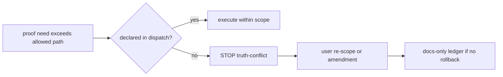
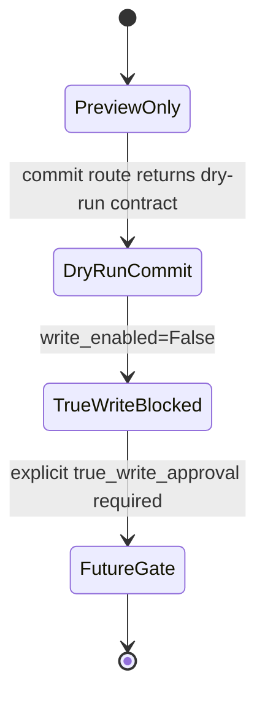

# SRD-v3 Supplement — Anti-patterns and Engineering Tripwires

[canonical fact] This supplement does not modify `services/**`, `apps/**`, `workers/**`, `packages/**`, `data/**`, or `referencerepo/**`. It describes engineering anti-patterns derived from v2 base and post-v2 run evidence. Evidence: https://github.com/RayWong1990/ScoutFlow/blob/main/docs/SRD-v2-2026-05-04.md; https://github.com/RayWong1990/ScoutFlow/pull/231; https://github.com/RayWong1990/ScoutFlow/pull/239; https://github.com/RayWong1990/ScoutFlow/pull/240.

[canonical fact] `write_enabled=False` remains the invariant in bridge config when vault root is absent and when vault root is resolved. Evidence: https://github.com/RayWong1990/ScoutFlow/blob/main/services/api/scoutflow_api/bridge/config.py.

## 1. Anti-pattern map by SRD-v3 section

| SRD-v3 section | Anti-pattern A | Anti-pattern B / guard | Source |
|---|---|---|---|
| 0. 元信息 + 仲裁链 | [promoted_addendum-aware inference] Treating candidate supplement as authority because it has richer prose. | [candidate carry-forward] Put all supplement files behind candidate/not-authority and require user promote verdict. | https://github.com/RayWong1990/ScoutFlow/blob/main/docs/SRD-v2-2026-05-04.md ; https://github.com/RayWong1990/ScoutFlow/pull/231 ; https://github.com/RayWong1990/ScoutFlow/pull/239 ; https://github.com/RayWong1990/ScoutFlow/pull/240 |
| 1. 系统总览 | [promoted_addendum-aware inference] Calling bridge router mount a full bridge runtime unlock. | [candidate carry-forward] Describe mounted routes as preview/dry-run routes only. | https://github.com/RayWong1990/ScoutFlow/blob/main/docs/SRD-v2-2026-05-04.md ; https://github.com/RayWong1990/ScoutFlow/pull/231 ; https://github.com/RayWong1990/ScoutFlow/pull/239 ; https://github.com/RayWong1990/ScoutFlow/pull/240 |
| 2. API contract | [promoted_addendum-aware inference] Adding a new endpoint because an example needs it. | [candidate carry-forward] Use existing `/captures/discover`, `/captures/{id}/vault-preview`, bridge health/config/commit dry-run as anchors. | https://github.com/RayWong1990/ScoutFlow/blob/main/docs/SRD-v2-2026-05-04.md ; https://github.com/RayWong1990/ScoutFlow/pull/231 ; https://github.com/RayWong1990/ScoutFlow/pull/239 ; https://github.com/RayWong1990/ScoutFlow/pull/240 |
| 3. Bridge / Vault boundary | [promoted_addendum-aware inference] Flipping `write_enabled=True` to prove RAW handoff. | [candidate carry-forward] Use staging and manual transfer proof; true write requires separate gate. | https://github.com/RayWong1990/ScoutFlow/blob/main/docs/SRD-v2-2026-05-04.md ; https://github.com/RayWong1990/ScoutFlow/pull/231 ; https://github.com/RayWong1990/ScoutFlow/pull/239 ; https://github.com/RayWong1990/ScoutFlow/pull/240 |
| 4. Phase 2 entity IR | [promoted_addendum-aware inference] Persisting signals/hypotheses as production tables before migration approval. | [candidate carry-forward] Keep IR shape in candidate docs and require U3/schema gate. | https://github.com/RayWong1990/ScoutFlow/blob/main/docs/SRD-v2-2026-05-04.md ; https://github.com/RayWong1990/ScoutFlow/pull/231 ; https://github.com/RayWong1990/ScoutFlow/pull/239 ; https://github.com/RayWong1990/ScoutFlow/pull/240 |
| 5. Runtime / browser / migration | [promoted_addendum-aware inference] Using Playwright or ASR to make a prettier demo. | [candidate carry-forward] Mark as blocked overflow; require explicit runtime/browser/migration dispatch. | https://github.com/RayWong1990/ScoutFlow/blob/main/docs/SRD-v2-2026-05-04.md ; https://github.com/RayWong1990/ScoutFlow/pull/231 ; https://github.com/RayWong1990/ScoutFlow/pull/239 ; https://github.com/RayWong1990/ScoutFlow/pull/240 |
| 6. Multi-agent contract | [promoted_addendum-aware inference] Letting subagents silently expand allowed paths. | [candidate carry-forward] Stop and write truth-conflict or amendment note. | https://github.com/RayWong1990/ScoutFlow/blob/main/docs/SRD-v2-2026-05-04.md ; https://github.com/RayWong1990/ScoutFlow/pull/231 ; https://github.com/RayWong1990/ScoutFlow/pull/239 ; https://github.com/RayWong1990/ScoutFlow/pull/240 |
| 7. PF-V handoff | [promoted_addendum-aware inference] Treating generated image as frontend acceptance. | [candidate carry-forward] Route through human visual verdict and future bootstrap dispatch. | https://github.com/RayWong1990/ScoutFlow/blob/main/docs/SRD-v2-2026-05-04.md ; https://github.com/RayWong1990/ScoutFlow/pull/231 ; https://github.com/RayWong1990/ScoutFlow/pull/239 ; https://github.com/RayWong1990/ScoutFlow/pull/240 |
| 8. DR / local-first | [promoted_addendum-aware inference] Copying enterprise SLO / RBAC / cloud DAM patterns into single-user tool. | [candidate carry-forward] Use local SQLite/FS/plain text assumptions and small capacity envelope. | https://github.com/RayWong1990/ScoutFlow/blob/main/docs/SRD-v2-2026-05-04.md ; https://github.com/RayWong1990/ScoutFlow/pull/231 ; https://github.com/RayWong1990/ScoutFlow/pull/239 ; https://github.com/RayWong1990/ScoutFlow/pull/240 |
| 9. 追溯 / archive | [promoted_addendum-aware inference] Deleting old receipts because v3 is cleaner. | [candidate carry-forward] Append archive/supersession notes; do not erase audit trail. | https://github.com/RayWong1990/ScoutFlow/blob/main/docs/SRD-v2-2026-05-04.md ; https://github.com/RayWong1990/ScoutFlow/pull/231 ; https://github.com/RayWong1990/ScoutFlow/pull/239 ; https://github.com/RayWong1990/ScoutFlow/pull/240 |

## 2. Silent flexibility anti-patterns observed or implied by 4 runs

[promoted_addendum-aware inference] Anti-pattern `A1 production code expansion`: PF-LP-02 expanded production code outside declared §4 path; kept only as accepted partial scope deviation, not reusable precedent. Guard: preserve exact verdict vocabulary (`T-PASS`, `partial`, `REJECT_AS_*`, `concern`) and keep user authorization recorded. Evidence: https://github.com/RayWong1990/ScoutFlow/pull/231.

[promoted_addendum-aware inference] Anti-pattern `A2 test harness expansion`: PF-LP-13 touched `tests/conftest.py`; acceptable only because side effect was low and later rule requires explicit path declaration. Guard: preserve exact verdict vocabulary (`T-PASS`, `partial`, `REJECT_AS_*`, `concern`) and keep user authorization recorded. Evidence: https://github.com/RayWong1990/ScoutFlow/pull/231.

[promoted_addendum-aware inference] Anti-pattern `A3 companion test de-dup`: PF-LP-01 changed companion contract tests; future edits need declared allowed paths or amendment within bounded window. Guard: preserve exact verdict vocabulary (`T-PASS`, `partial`, `REJECT_AS_*`, `concern`) and keep user authorization recorded. Evidence: https://github.com/RayWong1990/ScoutFlow/pull/231.

[promoted_addendum-aware inference] Anti-pattern `Run-2 synthetic UAT inflation`: The `works` wording was downgraded to `partial`; synthetic proof cannot become browser visual UAT by wording. Guard: preserve exact verdict vocabulary (`T-PASS`, `partial`, `REJECT_AS_*`, `concern`) and keep user authorization recorded. Evidence: https://github.com/RayWong1990/ScoutFlow/pull/239.

[promoted_addendum-aware inference] Anti-pattern `Run-2 SHA flattening`: execution-final SHA and audit-final-after-receipt-bundle SHA must be separated to avoid traceability drift. Guard: preserve exact verdict vocabulary (`T-PASS`, `partial`, `REJECT_AS_*`, `concern`) and keep user authorization recorded. Evidence: https://github.com/RayWong1990/ScoutFlow/pull/239.

[promoted_addendum-aware inference] Anti-pattern `Run-3+4 single PR closeout`: Single-shot direct merge preserved honest C2 partial state, but future runs must not use it to hide per-dispatch drift. Guard: preserve exact verdict vocabulary (`T-PASS`, `partial`, `REJECT_AS_*`, `concern`) and keep user authorization recorded. Evidence: https://github.com/RayWong1990/ScoutFlow/pull/240.

[promoted_addendum-aware inference] Anti-pattern `RAW transfer skip`: User A-path skipped RAW copy; staged notes in repo are not RAW intake proof. Guard: preserve exact verdict vocabulary (`T-PASS`, `partial`, `REJECT_AS_*`, `concern`) and keep user authorization recorded. Evidence: https://github.com/RayWong1990/ScoutFlow/pull/240.

[promoted_addendum-aware inference] Anti-pattern `PF-C4 premature opening`: `can_open_c4=false` despite C1 usefulness; C2 partial and PF-V handoff keep hardening gated. Guard: preserve exact verdict vocabulary (`T-PASS`, `partial`, `REJECT_AS_*`, `concern`) and keep user authorization recorded. Evidence: https://github.com/RayWong1990/ScoutFlow/pull/240.

## 3. Implementation guardrails

[candidate carry-forward] Guardrail 1: Bridge route handlers must return fail-loud errors or dry-run payloads when handlers/config are unavailable; they must not create files as a side effect.

[candidate carry-forward] Guardrail 2: Vault preview markdown can be rendered for proof, but commit dry-run cannot mutate RAW or vault until true_write_approval replaces write-disabled semantics.

[candidate carry-forward] Guardrail 3: API schemas may include future-shaped fields only as candidate IR if validators reject unsupported writes.

[candidate carry-forward] Guardrail 4: A frontend component may display disabled actions for audio or runtime lanes, but copy must say blocked, not upcoming by default.

[candidate carry-forward] Guardrail 5: Any local server or npm build used as proof must be logged as local proof, not global runtime approval.

[candidate carry-forward] Guardrail 6: Agent orchestration may use Codex/Claude/Hermes handoff language, but single writer per conflict domain remains the enforced rule.

[candidate carry-forward] Guardrail 7: Traceability rows must not use “source: memory”; every row needs a URL, file path, or limitation marker.

[candidate carry-forward] Guardrail 8: If external audit report path 2026-05-07 remains 404, its absence is a blocker, not a blank area to invent from PR body.

## 4. Detailed anti-pattern playbook

### Anti-pattern — Authority shadow-write

[promoted_addendum-aware inference] 错误实现：工程师为了让状态看起来同步，直接改 `docs/current.md` 或 task-index 来配合 candidate 输出。

[candidate carry-forward] 修复或边界：立即停止；candidate ZIP 不能写 authority。若需要 authority sync，必须新 authority-writer dispatch。

[tentative candidate] 审计动作：把该 anti-pattern 加入 future commander prompt 的 stop-line checklist；若执行中触发，记录 `REJECT_AS_*` 或 `partial`，不要用 T-PASS 掩盖。

### Anti-pattern — Dry-run route mutates file

[promoted_addendum-aware inference] 错误实现：`vault-commit` dry-run 路径为了方便 demo 写入 RAW 或本地 vault。

[candidate carry-forward] 修复或边界：保持 dry-run payload；true write only after true_write_approval and config invariant replacement。

[tentative candidate] 审计动作：把该 anti-pattern 加入 future commander prompt 的 stop-line checklist；若执行中触发，记录 `REJECT_AS_*` 或 `partial`，不要用 T-PASS 掩盖。

### Anti-pattern — Fixture frontmatter treated as governance

[promoted_addendum-aware inference] 错误实现：测试 fixture markdown 因有 frontmatter 被红线扫描当成 governance doc。

[candidate carry-forward] 修复或边界：沿用 Run-1 A6：governance markdown scope 与 fixture markdown scope 分离。

[tentative candidate] 审计动作：把该 anti-pattern 加入 future commander prompt 的 stop-line checklist；若执行中触发，记录 `REJECT_AS_*` 或 `partial`，不要用 T-PASS 掩盖。

### Anti-pattern — Sub-agent local memory evidence

[promoted_addendum-aware inference] 错误实现：子 agent 说“我看到了”但没有 URL、file path、hash、receipt。

[candidate carry-forward] 修复或边界：不接收；所有 material claim 要落入 report、checkpoint、diff bundle 或 limitation marker。

[tentative candidate] 审计动作：把该 anti-pattern 加入 future commander prompt 的 stop-line checklist；若执行中触发，记录 `REJECT_AS_*` 或 `partial`，不要用 T-PASS 掩盖。

### Anti-pattern — Synthetic proof renamed real proof

[promoted_addendum-aware inference] 错误实现：curl/local placeholder proof 被写成 real browser visual UAT。

[candidate carry-forward] 修复或边界：沿用 PR #239 修正：降级为 partial，并列 blocking reason。

[tentative candidate] 审计动作：把该 anti-pattern 加入 future commander prompt 的 stop-line checklist；若执行中触发，记录 `REJECT_AS_*` 或 `partial`，不要用 T-PASS 掩盖。

### Anti-pattern — Single PR hides partials

[promoted_addendum-aware inference] 错误实现：把多个 dispatch 合并成一个 PR 后，只报总体 green，不列 partial dispatch。

[candidate carry-forward] 修复或边界：沿用 PR #240：C1/C2 分开，C2 partial dispatches 明列。

[tentative candidate] 审计动作：把该 anti-pattern 加入 future commander prompt 的 stop-line checklist；若执行中触发，记录 `REJECT_AS_*` 或 `partial`，不要用 T-PASS 掩盖。

### Anti-pattern — RAW staging treated as RAW intake

[promoted_addendum-aware inference] 错误实现：repo 中 `raw-handoff-staging/` 存在就说 RAW 侧已接收。

[candidate carry-forward] 修复或边界：必须有 RAW 侧手动 copy/readback/intake result；否则 partial。

[tentative candidate] 审计动作：把该 anti-pattern 加入 future commander prompt 的 stop-line checklist；若执行中触发，记录 `REJECT_AS_*` 或 `partial`，不要用 T-PASS 掩盖。

### Anti-pattern — Config env unlock

[promoted_addendum-aware inference] 错误实现：设置 SCOUTFLOW_VAULT_ROOT 后误认为 write_enabled 自动 true。

[candidate carry-forward] 修复或边界：bridge config 当前两分支都 write_enabled=False；env 只能影响 preview root resolution。

[tentative candidate] 审计动作：把该 anti-pattern 加入 future commander prompt 的 stop-line checklist；若执行中触发，记录 `REJECT_AS_*` 或 `partial`，不要用 T-PASS 掩盖。

### Anti-pattern — Route mount equals readiness

[promoted_addendum-aware inference] 错误实现：bridge router mounted 后就宣布 Bridge/Vault ready。

[candidate carry-forward] 修复或边界：mount 是 contract surface；readiness 需要 handler behavior、tests、human gates。

[tentative candidate] 审计动作：把该 anti-pattern 加入 future commander prompt 的 stop-line checklist；若执行中触发，记录 `REJECT_AS_*` 或 `partial`，不要用 T-PASS 掩盖。

### Anti-pattern — Model benchmark drives architecture

[promoted_addendum-aware inference] 错误实现：看到某 ASR/LLM benchmark 就把 vendor 写入 SRD。

[candidate carry-forward] 修复或边界：没有 live web + local spike + cost/security gate，不得采纳 vendor。

[tentative candidate] 审计动作：把该 anti-pattern 加入 future commander prompt 的 stop-line checklist；若执行中触发，记录 `REJECT_AS_*` 或 `partial`，不要用 T-PASS 掩盖。

### Anti-pattern — Temporal/LangGraph premature dependency

[promoted_addendum-aware inference] 错误实现：因 multi-agent trend 直接加入 durable workflow runtime。

[candidate carry-forward] 修复或边界：先保留 orchestrator-worker pattern as candidate; dependency adoption needs NFR and local proof。

[tentative candidate] 审计动作：把该 anti-pattern 加入 future commander prompt 的 stop-line checklist；若执行中触发，记录 `REJECT_AS_*` 或 `partial`，不要用 T-PASS 掩盖。

### Anti-pattern — Enterprise DAM pattern creep

[promoted_addendum-aware inference] 错误实现：把 Brandfolder/Air 这类 DAM 的团队权限/资产审批照搬给单用户。

[candidate carry-forward] 修复或边界：单用户先用 manifest + local folder + review_state；DAM research only evaluation-candidate。

[tentative candidate] 审计动作：把该 anti-pattern 加入 future commander prompt 的 stop-line checklist；若执行中触发，记录 `REJECT_AS_*` 或 `partial`，不要用 T-PASS 掩盖。

### Anti-pattern — Obsidian as authority

[promoted_addendum-aware inference] 错误实现：因为 Obsidian 好用，就让 Obsidian note frontmatter 变成 ScoutFlow state。

[candidate carry-forward] 修复或边界：Obsidian 是 review surface; ScoutFlow state remains SQLite + FS + state words。

[tentative candidate] 审计动作：把该 anti-pattern 加入 future commander prompt 的 stop-line checklist；若执行中触发，记录 `REJECT_AS_*` 或 `partial`，不要用 T-PASS 掩盖。

### Anti-pattern — DiloFlow back-propagation

[promoted_addendum-aware inference] 错误实现：DiloFlow 修改脚本后自动改 ScoutFlow topic card。

[candidate carry-forward] 修复或边界：下游可回传 citation/verdict，不可直接写 ScoutFlow authority。

[tentative candidate] 审计动作：把该 anti-pattern 加入 future commander prompt 的 stop-line checklist；若执行中触发，记录 `REJECT_AS_*` 或 `partial`，不要用 T-PASS 掩盖。

### Anti-pattern — Prompt output trusted without validator

[promoted_addendum-aware inference] 错误实现：LLM normalization JSONL 直接进 ledger。

[candidate carry-forward] 修复或边界：future U3/validator gate must resolve every segment/claim/quote provenance before durable admission。

[tentative candidate] 审计动作：把该 anti-pattern 加入 future commander prompt 的 stop-line checklist；若执行中触发，记录 `REJECT_AS_*` 或 `partial`，不要用 T-PASS 掩盖。

## 5. Engineering acceptance snippets

[canonical fact] Acceptance snippet: `write_enabled` observed false in config before and after vault root resolution.

[canonical fact] Acceptance snippet: `raw_handoff_staging` exists but downstream RAW readback absent -> partial.

[canonical fact] Acceptance snippet: `browser_automation` absent from dispatch -> no Playwright proof accepted.

[canonical fact] Acceptance snippet: `migration` absent from dispatch -> services/api/migrations/** forbidden.

[canonical fact] Acceptance snippet: `runtime_tools` absent from dispatch -> BBDown/yt-dlp/ffmpeg/ASR blocked.

## 6. Anti-pattern test cases for future dispatch authors

### Test case AP-01

[promoted_addendum-aware inference] Setup: a future dispatch author wants to make a proof stronger than the declared allowed paths. In AP-01, the tempting shortcut is to touch an adjacent file, add a helper, or reinterpret a partial result as T-PASS because the user is moving quickly.

[candidate carry-forward] Expected response: the author must write a truth-conflict or amendment note before continuing. If the user explicitly authorizes amend_and_proceed, the receipt must record why rollback is worse, what risk remains, and which forward rule prevents recurrence.

[canonical fact] Hard boundary reminder: no BBDown live, no yt-dlp, no ffmpeg, no ASR, no browser automation, no migration, no true vault write, and no authority rewrite are approved by this supplement.

[tentative candidate] Audit assertion: AP-01 is not a runnable test; it is a mental test case to include in future commander prompts and review checklists.

### Test case AP-02

[promoted_addendum-aware inference] Setup: a future dispatch author wants to make a proof stronger than the declared allowed paths. In AP-02, the tempting shortcut is to touch an adjacent file, add a helper, or reinterpret a partial result as T-PASS because the user is moving quickly.

[candidate carry-forward] Expected response: the author must write a truth-conflict or amendment note before continuing. If the user explicitly authorizes amend_and_proceed, the receipt must record why rollback is worse, what risk remains, and which forward rule prevents recurrence.

[canonical fact] Hard boundary reminder: no BBDown live, no yt-dlp, no ffmpeg, no ASR, no browser automation, no migration, no true vault write, and no authority rewrite are approved by this supplement.

[tentative candidate] Audit assertion: AP-02 is not a runnable test; it is a mental test case to include in future commander prompts and review checklists.

### Test case AP-03

[promoted_addendum-aware inference] Setup: a future dispatch author wants to make a proof stronger than the declared allowed paths. In AP-03, the tempting shortcut is to touch an adjacent file, add a helper, or reinterpret a partial result as T-PASS because the user is moving quickly.

[candidate carry-forward] Expected response: the author must write a truth-conflict or amendment note before continuing. If the user explicitly authorizes amend_and_proceed, the receipt must record why rollback is worse, what risk remains, and which forward rule prevents recurrence.

[canonical fact] Hard boundary reminder: no BBDown live, no yt-dlp, no ffmpeg, no ASR, no browser automation, no migration, no true vault write, and no authority rewrite are approved by this supplement.

[tentative candidate] Audit assertion: AP-03 is not a runnable test; it is a mental test case to include in future commander prompts and review checklists.

### Test case AP-04

[promoted_addendum-aware inference] Setup: a future dispatch author wants to make a proof stronger than the declared allowed paths. In AP-04, the tempting shortcut is to touch an adjacent file, add a helper, or reinterpret a partial result as T-PASS because the user is moving quickly.

[candidate carry-forward] Expected response: the author must write a truth-conflict or amendment note before continuing. If the user explicitly authorizes amend_and_proceed, the receipt must record why rollback is worse, what risk remains, and which forward rule prevents recurrence.

[canonical fact] Hard boundary reminder: no BBDown live, no yt-dlp, no ffmpeg, no ASR, no browser automation, no migration, no true vault write, and no authority rewrite are approved by this supplement.

[tentative candidate] Audit assertion: AP-04 is not a runnable test; it is a mental test case to include in future commander prompts and review checklists.

### Test case AP-05

[promoted_addendum-aware inference] Setup: a future dispatch author wants to make a proof stronger than the declared allowed paths. In AP-05, the tempting shortcut is to touch an adjacent file, add a helper, or reinterpret a partial result as T-PASS because the user is moving quickly.

[candidate carry-forward] Expected response: the author must write a truth-conflict or amendment note before continuing. If the user explicitly authorizes amend_and_proceed, the receipt must record why rollback is worse, what risk remains, and which forward rule prevents recurrence.

[canonical fact] Hard boundary reminder: no BBDown live, no yt-dlp, no ffmpeg, no ASR, no browser automation, no migration, no true vault write, and no authority rewrite are approved by this supplement.

[tentative candidate] Audit assertion: AP-05 is not a runnable test; it is a mental test case to include in future commander prompts and review checklists.

### Test case AP-06

[promoted_addendum-aware inference] Setup: a future dispatch author wants to make a proof stronger than the declared allowed paths. In AP-06, the tempting shortcut is to touch an adjacent file, add a helper, or reinterpret a partial result as T-PASS because the user is moving quickly.

[candidate carry-forward] Expected response: the author must write a truth-conflict or amendment note before continuing. If the user explicitly authorizes amend_and_proceed, the receipt must record why rollback is worse, what risk remains, and which forward rule prevents recurrence.

[canonical fact] Hard boundary reminder: no BBDown live, no yt-dlp, no ffmpeg, no ASR, no browser automation, no migration, no true vault write, and no authority rewrite are approved by this supplement.

[tentative candidate] Audit assertion: AP-06 is not a runnable test; it is a mental test case to include in future commander prompts and review checklists.

### Test case AP-07

[promoted_addendum-aware inference] Setup: a future dispatch author wants to make a proof stronger than the declared allowed paths. In AP-07, the tempting shortcut is to touch an adjacent file, add a helper, or reinterpret a partial result as T-PASS because the user is moving quickly.

[candidate carry-forward] Expected response: the author must write a truth-conflict or amendment note before continuing. If the user explicitly authorizes amend_and_proceed, the receipt must record why rollback is worse, what risk remains, and which forward rule prevents recurrence.

[canonical fact] Hard boundary reminder: no BBDown live, no yt-dlp, no ffmpeg, no ASR, no browser automation, no migration, no true vault write, and no authority rewrite are approved by this supplement.

[tentative candidate] Audit assertion: AP-07 is not a runnable test; it is a mental test case to include in future commander prompts and review checklists.

### Test case AP-08

[promoted_addendum-aware inference] Setup: a future dispatch author wants to make a proof stronger than the declared allowed paths. In AP-08, the tempting shortcut is to touch an adjacent file, add a helper, or reinterpret a partial result as T-PASS because the user is moving quickly.

[candidate carry-forward] Expected response: the author must write a truth-conflict or amendment note before continuing. If the user explicitly authorizes amend_and_proceed, the receipt must record why rollback is worse, what risk remains, and which forward rule prevents recurrence.

[canonical fact] Hard boundary reminder: no BBDown live, no yt-dlp, no ffmpeg, no ASR, no browser automation, no migration, no true vault write, and no authority rewrite are approved by this supplement.

[tentative candidate] Audit assertion: AP-08 is not a runnable test; it is a mental test case to include in future commander prompts and review checklists.

### Test case AP-09

[promoted_addendum-aware inference] Setup: a future dispatch author wants to make a proof stronger than the declared allowed paths. In AP-09, the tempting shortcut is to touch an adjacent file, add a helper, or reinterpret a partial result as T-PASS because the user is moving quickly.

[candidate carry-forward] Expected response: the author must write a truth-conflict or amendment note before continuing. If the user explicitly authorizes amend_and_proceed, the receipt must record why rollback is worse, what risk remains, and which forward rule prevents recurrence.

[canonical fact] Hard boundary reminder: no BBDown live, no yt-dlp, no ffmpeg, no ASR, no browser automation, no migration, no true vault write, and no authority rewrite are approved by this supplement.

[tentative candidate] Audit assertion: AP-09 is not a runnable test; it is a mental test case to include in future commander prompts and review checklists.

### Test case AP-10

[promoted_addendum-aware inference] Setup: a future dispatch author wants to make a proof stronger than the declared allowed paths. In AP-10, the tempting shortcut is to touch an adjacent file, add a helper, or reinterpret a partial result as T-PASS because the user is moving quickly.

[candidate carry-forward] Expected response: the author must write a truth-conflict or amendment note before continuing. If the user explicitly authorizes amend_and_proceed, the receipt must record why rollback is worse, what risk remains, and which forward rule prevents recurrence.

[canonical fact] Hard boundary reminder: no BBDown live, no yt-dlp, no ffmpeg, no ASR, no browser automation, no migration, no true vault write, and no authority rewrite are approved by this supplement.

[tentative candidate] Audit assertion: AP-10 is not a runnable test; it is a mental test case to include in future commander prompts and review checklists.

### Test case AP-11

[promoted_addendum-aware inference] Setup: a future dispatch author wants to make a proof stronger than the declared allowed paths. In AP-11, the tempting shortcut is to touch an adjacent file, add a helper, or reinterpret a partial result as T-PASS because the user is moving quickly.

[candidate carry-forward] Expected response: the author must write a truth-conflict or amendment note before continuing. If the user explicitly authorizes amend_and_proceed, the receipt must record why rollback is worse, what risk remains, and which forward rule prevents recurrence.

[canonical fact] Hard boundary reminder: no BBDown live, no yt-dlp, no ffmpeg, no ASR, no browser automation, no migration, no true vault write, and no authority rewrite are approved by this supplement.

[tentative candidate] Audit assertion: AP-11 is not a runnable test; it is a mental test case to include in future commander prompts and review checklists.

### Test case AP-12

[promoted_addendum-aware inference] Setup: a future dispatch author wants to make a proof stronger than the declared allowed paths. In AP-12, the tempting shortcut is to touch an adjacent file, add a helper, or reinterpret a partial result as T-PASS because the user is moving quickly.

[candidate carry-forward] Expected response: the author must write a truth-conflict or amendment note before continuing. If the user explicitly authorizes amend_and_proceed, the receipt must record why rollback is worse, what risk remains, and which forward rule prevents recurrence.

[canonical fact] Hard boundary reminder: no BBDown live, no yt-dlp, no ffmpeg, no ASR, no browser automation, no migration, no true vault write, and no authority rewrite are approved by this supplement.

[tentative candidate] Audit assertion: AP-12 is not a runnable test; it is a mental test case to include in future commander prompts and review checklists.

### Test case AP-13

[promoted_addendum-aware inference] Setup: a future dispatch author wants to make a proof stronger than the declared allowed paths. In AP-13, the tempting shortcut is to touch an adjacent file, add a helper, or reinterpret a partial result as T-PASS because the user is moving quickly.

[candidate carry-forward] Expected response: the author must write a truth-conflict or amendment note before continuing. If the user explicitly authorizes amend_and_proceed, the receipt must record why rollback is worse, what risk remains, and which forward rule prevents recurrence.

[canonical fact] Hard boundary reminder: no BBDown live, no yt-dlp, no ffmpeg, no ASR, no browser automation, no migration, no true vault write, and no authority rewrite are approved by this supplement.

[tentative candidate] Audit assertion: AP-13 is not a runnable test; it is a mental test case to include in future commander prompts and review checklists.

### Test case AP-14

[promoted_addendum-aware inference] Setup: a future dispatch author wants to make a proof stronger than the declared allowed paths. In AP-14, the tempting shortcut is to touch an adjacent file, add a helper, or reinterpret a partial result as T-PASS because the user is moving quickly.

[candidate carry-forward] Expected response: the author must write a truth-conflict or amendment note before continuing. If the user explicitly authorizes amend_and_proceed, the receipt must record why rollback is worse, what risk remains, and which forward rule prevents recurrence.

[canonical fact] Hard boundary reminder: no BBDown live, no yt-dlp, no ffmpeg, no ASR, no browser automation, no migration, no true vault write, and no authority rewrite are approved by this supplement.

[tentative candidate] Audit assertion: AP-14 is not a runnable test; it is a mental test case to include in future commander prompts and review checklists.

### Test case AP-15

[promoted_addendum-aware inference] Setup: a future dispatch author wants to make a proof stronger than the declared allowed paths. In AP-15, the tempting shortcut is to touch an adjacent file, add a helper, or reinterpret a partial result as T-PASS because the user is moving quickly.

[candidate carry-forward] Expected response: the author must write a truth-conflict or amendment note before continuing. If the user explicitly authorizes amend_and_proceed, the receipt must record why rollback is worse, what risk remains, and which forward rule prevents recurrence.

[canonical fact] Hard boundary reminder: no BBDown live, no yt-dlp, no ffmpeg, no ASR, no browser automation, no migration, no true vault write, and no authority rewrite are approved by this supplement.

[tentative candidate] Audit assertion: AP-15 is not a runnable test; it is a mental test case to include in future commander prompts and review checklists.

## 7. Concrete redline scanner phrases

[canonical fact] Phrase to reject or manually review: `true write is now enabled`. If it appears outside a negative/redline context, the reviewer should mark boundary_preservation_check=`concern` or `reject`.

[canonical fact] Phrase to reject or manually review: `Phase 2 is live`. If it appears outside a negative/redline context, the reviewer should mark boundary_preservation_check=`concern` or `reject`.

[canonical fact] Phrase to reject or manually review: `browser automation approved`. If it appears outside a negative/redline context, the reviewer should mark boundary_preservation_check=`concern` or `reject`.

[canonical fact] Phrase to reject or manually review: `migration approved`. If it appears outside a negative/redline context, the reviewer should mark boundary_preservation_check=`concern` or `reject`.

[canonical fact] Phrase to reject or manually review: `BBDown is enabled`. If it appears outside a negative/redline context, the reviewer should mark boundary_preservation_check=`concern` or `reject`.

[canonical fact] Phrase to reject or manually review: `yt-dlp is enabled`. If it appears outside a negative/redline context, the reviewer should mark boundary_preservation_check=`concern` or `reject`.

[canonical fact] Phrase to reject or manually review: `ASR runtime ready`. If it appears outside a negative/redline context, the reviewer should mark boundary_preservation_check=`concern` or `reject`.

[canonical fact] Phrase to reject or manually review: `RAW intake complete without RAW readback`. If it appears outside a negative/redline context, the reviewer should mark boundary_preservation_check=`concern` or `reject`.

[canonical fact] Phrase to reject or manually review: `frontend approved by image`. If it appears outside a negative/redline context, the reviewer should mark boundary_preservation_check=`concern` or `reject`.

[canonical fact] Phrase to reject or manually review: `DiloFlow wrote ScoutFlow authority`. If it appears outside a negative/redline context, the reviewer should mark boundary_preservation_check=`concern` or `reject`.

