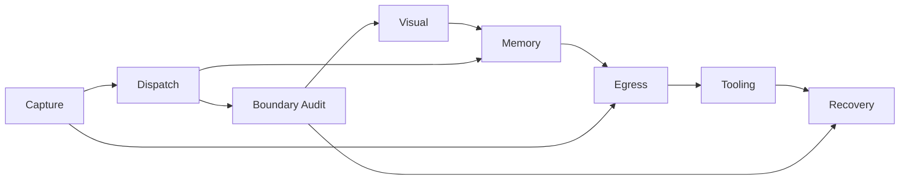

# MASTER RUNBOOK INDEX — U10 Prosumer SOP Library

[candidate master] 本文件是 8 cluster × 68 runbook 的总导航。它依据上传的 U10 prompt 与 ScoutFlow post176 audit pack 做 synthesis；不是 ScoutFlow repo authority，不写 current/task-index/decision-log，不批准任何实际运行。

## Risk matrix

| Cluster | Count | Critical | High | Medium | Low | Primary stop-line |
|---|---:|---:|---:|---:|---:|---|
| Capture / Acquisition | 10 | 2 | 4 | 4 | 0 | candidate-only; no runtime/authority unlock |
| Dispatch / Multi-Agent | 12 | 1 | 3 | 6 | 2 | candidate-only; no runtime/authority unlock |
| Boundary / Audit | 10 | 6 | 3 | 1 | 0 | candidate-only; no runtime/authority unlock |
| Visual Production | 10 | 0 | 3 | 5 | 2 | candidate-only; no runtime/authority unlock |
| Memory / Cross-Session | 7 | 0 | 1 | 4 | 2 | candidate-only; no runtime/authority unlock |
| Egress / Downstream | 7 | 2 | 1 | 4 | 0 | candidate-only; no runtime/authority unlock |
| Tooling | 6 | 2 | 2 | 2 | 0 | candidate-only; no runtime/authority unlock |
| Recovery | 6 | 2 | 3 | 1 | 0 | candidate-only; no runtime/authority unlock |

## Runbook cross-link

### Capture / Acquisition

- `RB-CAP-01` — Single Bilibili URL metadata-only capture（Phase 1A 窄门） — risk=`medium` — trigger=bilibili, manual_url, metadata_only
- `RB-CAP-02` — Single XHS URL capture（只读 triage，不创建 runtime capture） — risk=`high` — trigger=XHS, 小红书, read-only triage
- `RB-CAP-03` — Single YouTube URL capture（later 平台规划，不执行 runtime） — risk=`high` — trigger=YouTube, youtube, later platform
- `RB-CAP-04` — Batch URL ingestion（Phase 2 gate before batch） — risk=`high` — trigger=batch, URL list, 批量导入
- `RB-CAP-05` — Failed capture retry + rollback（失败采集重试与证据回滚） — risk=`medium` — trigger=failed capture, retry, rollback
- `RB-CAP-06` — 网络降级 / 弱网 capture（degraded metadata path） — risk=`medium` — trigger=弱网, network degraded, timeout
- `RB-CAP-07` — BBDown legal posture recheck before run（工具姿态复核） — risk=`critical` — trigger=BBDown, legal posture, C&D
- `RB-CAP-08` — ASR local install verify（Whisper / Parakeet / Voxtral 候选检查，不安装） — risk=`critical` — trigger=ASR, Whisper, Parakeet
- `RB-CAP-09` — Capture scope gate enforce（LP-001 推荐/关键词/RAW gap 不直接 capture） — risk=`high` — trigger=LP-001, recommendation, keyword
- `RB-CAP-10` — Quick capture vs scope-gated capture（快速采集与门控采集选择） — risk=`medium` — trigger=quick capture, scope-gated, metadata_only

### Dispatch / Multi-Agent

- `RB-DSP-01` — Single dispatch 派给 Codex（主写入 / PR owner） — risk=`medium` — trigger=Codex, single dispatch, PR owner
- `RB-DSP-02` — Single dispatch 派给 CC1（review / IA / contract lane） — risk=`medium` — trigger=CC1, Claude Code, review lane
- `RB-DSP-03` — Single dispatch 派给 Hermes（research / rebuttal / external critique） — risk=`low` — trigger=Hermes, OpenClaw, research
- `RB-DSP-04` — Parallel multi-window dispatch（3-5 worktree 编排） — risk=`high` — trigger=parallel, multi-window, worktree
- `RB-DSP-05` — amend_and_proceed pattern（先修提示/包再继续） — risk=`medium` — trigger=amend_and_proceed, amend, repair prompt
- `RB-DSP-06` — 3-window cloud audit（Codex / GPT Pro / Hermes 三方外审） — risk=`medium` — trigger=3-window audit, cloud audit, Codex
- `RB-DSP-07` — silent flexibility detect（模型静默灵活性识别） — risk=`medium` — trigger=silent flexibility, scope drift, 模型自行变更
- `RB-DSP-08` — silent flexibility recover（PR226-228 类修复/收束） — risk=`high` — trigger=silent flexibility recover, scope repair, PR226
- `RB-DSP-09` — single-writer enforce（LP-006 authority writer guard） — risk=`critical` — trigger=LP-006, single writer, authority writer
- `RB-DSP-10` — dispatch ledger record（与 U5 ledger 联动） — risk=`medium` — trigger=dispatch ledger, run summary, ledger
- `RB-DSP-11` — cost attribution record（费用/模型/窗口归因） — risk=`low` — trigger=cost attribution, model cost, token cost
- `RB-DSP-12` — packed PR vs per-dispatch PR 决策 — risk=`high` — trigger=packed PR, per-dispatch PR, PR factory

### Boundary / Audit

- `RB-BND-01` — write_enabled scan（bridge/vault true-write 扫描） — risk=`critical` — trigger=write_enabled, vault true write, dry_run
- `RB-BND-02` — 5 overflow lane Hold scan（DB/runtime/ASR/browser/migration） — risk=`critical` — trigger=overflow, Hold, DB vNext
- `RB-BND-03` — Authority files scan（current/task-index/decision-log/AGENTS） — risk=`critical` — trigger=authority files, current.md, task-index.md
- `RB-BND-04` — Credential / secret scan（strict pattern + exclude rule） — risk=`critical` — trigger=secret scan, credential, cookie
- `RB-BND-05` — PII redaction scan（regex + word boundary） — risk=`high` — trigger=PII, redaction, 手机号
- `RB-BND-06` — Legal posture recheck（Bilibili C&D / yt-dlp / scrapers） — risk=`critical` — trigger=legal posture, Bilibili, yt-dlp
- `RB-BND-07` — can_open_C4 / can_open_runtime / can_open_migration 三 flag verify — risk=`critical` — trigger=can_open_C4, can_open_runtime, can_open_migration
- `RB-BND-08` — Post-merge integrity check（origin/main SHA / authority untouched / hard redlines） — risk=`high` — trigger=post-merge, origin/main, SHA
- `RB-BND-09` — Boundary scan automation（CI / pre-commit hook） — risk=`high` — trigger=CI, pre-commit, boundary scan
- `RB-BND-10` — Frontmatter status validator（candidate / not-authority） — risk=`medium` — trigger=frontmatter, status, candidate

### Visual Production

- `RB-VIS-01` — GPT-Image-2 batch generation（云端 ZIP 工作流） — risk=`medium` — trigger=GPT-Image-2, image batch, visual ZIP
- `RB-VIS-02` — Pattern A-J refinement loop（视觉模式十案迭代） — risk=`medium` — trigger=Pattern A, Pattern J, visual pattern
- `RB-VIS-03` — Image → React TSX（PF-V handoff） — risk=`high` — trigger=image to TSX, React TSX, PF-V
- `RB-VIS-04` — 5-Gate self-audit（3 自动 + 2 human-in-loop） — risk=`high` — trigger=5 Gate, self-audit, human visual review
- `RB-VIS-05` — Design token cascade rebuild（token 层级重建） — risk=`medium` — trigger=design token, cascade, color token
- `RB-VIS-06` — State library register（8 panel × 6 state） — risk=`medium` — trigger=state library, 8 panel, 6 state
- `RB-VIS-07` — Visual asset perceptual hash dedup（视觉资产去重） — risk=`low` — trigger=perceptual hash, asset dedup, pHash
- `RB-VIS-08` — WCAG 2.2 contrast ≥4.5:1 audit（可读性门） — risk=`medium` — trigger=WCAG, contrast, 4.5:1
- `RB-VIS-09` — Storybook-style browser launch（本地预览门控） — risk=`high` — trigger=Storybook, localhost, browser launch
- `RB-VIS-10` — Visual asset cross-phase reuse query（跨阶段素材复用查询） — risk=`low` — trigger=asset reuse, cross-phase, visual query

### Memory / Cross-Session

- `RB-MEM-01` — Handoff 创建（≤80 行 + Step 5 next-session prompt） — risk=`medium` — trigger=handoff create, ≤80行, next-session prompt
- `RB-MEM-02` — Handoff 阅读（next session 起手） — risk=`low` — trigger=handoff read, next session, readback
- `RB-MEM-03` — /clear 时机决策（60% 黄 / 85% 红） — risk=`medium` — trigger=/clear, token budget, 60%
- `RB-MEM-04` — /compact 操作 + focus arg（压缩而不丢边界） — risk=`medium` — trigger=/compact, focus arg, context compression
- `RB-MEM-05` — MEMORY.md 维护（200 行限制 / 归档过时） — risk=`low` — trigger=MEMORY.md, 200行, archive stale
- `RB-MEM-06` — 跨 session prompt 输出（沉淀六步 Step 5） — risk=`medium` — trigger=cross-session prompt, Step 5, next prompt
- `RB-MEM-07` — PreCompact 兜底 + SessionStart(compact) 恢复 — risk=`high` — trigger=PreCompact, SessionStart, compact recovery

### Egress / Downstream

- `RB-EGR-01` — DiloFlow handoff（manifest publish） — risk=`medium` — trigger=DiloFlow, handoff, manifest publish
- `RB-EGR-02` — RAW vault staging（永不直写） — risk=`critical` — trigger=RAW vault, staging, 00-Inbox
- `RB-EGR-03` — Obsidian export（properties / highlights / note candidate） — risk=`medium` — trigger=Obsidian, export, properties
- `RB-EGR-04` — hermes-agent integration（research lane handoff） — risk=`medium` — trigger=hermes-agent, integration, research lane
- `RB-EGR-05` — Supersede protocol（旧版本 deprecated） — risk=`high` — trigger=supersede, deprecated, old version
- `RB-EGR-06` — Redaction enforce（PII / 凭据 / 法律敏感） — risk=`critical` — trigger=redaction enforce, PII, credential
- `RB-EGR-07` — Cross-system manifest schema validate（跨系统 manifest 验证） — risk=`medium` — trigger=manifest schema, cross-system, RAW

### Tooling

- `RB-TOL-01` — Whisper local preflight（ASR 工具候选，不启用 audio_transcript） — risk=`critical` — trigger=Whisper, ASR, preflight
- `RB-TOL-02` — bge-m3 embedding preflight（向量化候选） — risk=`high` — trigger=bge-m3, embedding, vector
- `RB-TOL-03` — ollama local model verify（本地模型工具门控） — risk=`medium` — trigger=ollama, local model, LLM
- `RB-TOL-04` — sqlite-vec preflight（SQLite vector extension 候选） — risk=`critical` — trigger=sqlite-vec, SQLite, vector extension
- `RB-TOL-05` — mlx local acceleration verify（Apple Silicon 推理候选） — risk=`medium` — trigger=mlx, Apple Silicon, local acceleration
- `RB-TOL-06` — cc-resilient.sh wrapper（Claude/Codex resiliency 脚本候选） — risk=`high` — trigger=cc-resilient.sh, resiliency, wrapper

### Recovery

- `RB-REC-01` — ~/workspace/raw wiped（RAW 工作区误删恢复） — risk=`critical` — trigger=raw wiped, workspace/raw, 误删
- `RB-REC-02` — SQLite corrupt（SQLite authority 损坏恢复） — risk=`critical` — trigger=SQLite corrupt, database corruption, authority DB
- `RB-REC-03` — git 误删（tracked file deletion recovery） — risk=`high` — trigger=git delete, 误删, restore file
- `RB-REC-04` — worktree 占用 / 冲突恢复（parallel lane unblock） — risk=`medium` — trigger=worktree occupied, branch lock, same file conflict
- `RB-REC-05` — branch 误删（remote/local branch recovery） — risk=`high` — trigger=branch deleted, 误删分支, reflog
- `RB-REC-06` — token over budget（上下文超预算恢复） — risk=`high` — trigger=token over budget, context overflow, 85%

[canonical fact] 全库共同锚点：Phase 1A 只批准 Bilibili manual_url metadata_only 的窄闭环；XHS/YouTube runtime、audio_transcript、BBDown live、yt-dlp、ffmpeg、ASR、browser automation、migration、vault true write 均保持 gated。

[operator inference] 使用顺序建议：先查 Boundary/Audit 是否阻断，再查具体场景 cluster；如果任务涉及多模型或多 worktree，同时打开 Dispatch 与 Memory runbook；如果任务涉及下游，必须打开 Egress 与 Redaction runbook。

[environment limitation] 当前容器未发现 `~/.claude/rules/*` 与 ContentFlow L1 本地 retrospective，因此相关引用按 prompt-provided path 和 prompt-stated lesson anchor 保留，stdout 标注未验证。

## Operator reading path appendix

[master route] 使用 master index 时，先从风险矩阵反向定位：critical/high 场景先读 Boundary 或 Recovery，再读目标 cluster；medium/low 场景也必须读 linked rules 和 linked dispatch。这样可以避免用户从“我想做什么”直接跳到“我该跑什么命令”。

[decision example] 当同一个请求同时包含 `capture`、`ASR`、`RAW` 和 `publish`，不要串成一条长流水线。正确做法是拆成 Capture scope gate、Tooling preflight、Egress staging、Boundary redaction 四个独立候选步骤，每一步都有自己的 rollback。

[quality bar] master index 不把 68 个 SOP 简化为企业 ITIL 流程；它只提供 single-user prosumer 的选择面。每个文件仍保留 candidate/not-authority，避免让索引本身成为新的 authority。
