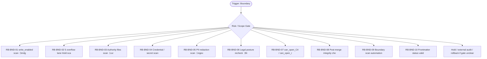

# RB Index — Boundary Cluster

[candidate index] 本索引用于在 `Boundary / Audit` cluster 内快速选择 runbook。它不是 authority，也不批准执行；它只把 trigger、risk、linked dispatch、verification focus 与 rollback focus 放在一个页面里，减少用户每次重新推理。

| Runbook | Trigger keywords | Risk | Use when | Primary rollback |
|---|---|---:|---|---|
| `RB-BND-01` | write_enabled, vault true write, dry_run, commit | critical | 扫描 vault/bridge 相关输出是否仍保持 write_enabled=false、dry_run=true、committed=false。 | 如果 `不得把 preview/dry-run 当 true write；不得改配置解禁。` 出现则 hold / supersede / rollback |
| `RB-BND-02` | overflow, Hold, DB vNext, ASR | critical | 确认 DB vNext、runtime、ASR、browser automation、migration/vault true write 仍在 overflow/Hold。 | 如果 `不得让 hardening lane 夹带 blocked runtime。` 出现则 hold / supersede / rollback |
| `RB-BND-03` | authority files, current.md, task-index.md, decision-log.md | critical | 检查 coupled authority surface 是否被正确 owner 更新，且状态彼此一致。 | 如果 `不得把 draft/research/handoff 写成 authority。` 出现则 hold / supersede / rollback |
| `RB-BND-04` | secret scan, credential, cookie, token | critical | 在任何 durable artifact 前扫描 credential/cookie/token/signed URL/browser profile path。 | 如果 `不得把 raw stdout/stderr 原文复制进报告；不得把 auth sidecar 当 evidence。` 出现则 hold / supersede / rollback |
| `RB-BND-05` | PII, redaction, 手机号, 邮箱 | high | 对 evidence、handoff、RAW candidate、dispatch report 做 PII 与敏感字段边界扫描。 | 如果 `不得过度依赖宽松 regex；不得把 false negative 当安全通过。` 出现则 hold / supersede / rollback |
| `RB-BND-06` | legal posture, Bilibili, yt-dlp, scraper | critical | 每次触及下载、scraper、自动化、平台条款相关动作前，重查法律/平台姿态并要求明确授权。 | 如果 `不得引用旧 research note 作为当前法律结论；不得在无法联网时声称已复核最新条款。` 出现则 hold / supersede / rollback |
| `RB-BND-07` | can_open_C4, can_open_runtime, can_open_migration, gate flags | critical | 把 hardening、runtime、migration 三类 gate 分开验证，避免 C4 hardening 被误读成 runtime/migration。 | 如果 `不得用 can_open_C4 推导 can_open_runtime。` 出现则 hold / supersede / rollback |
| `RB-BND-08` | post-merge, origin/main, SHA, integrity | high | PR 合并后复核 origin/main SHA、authority surface、hard redline、CI status 与 expected diff shape。 | 如果 `不得只看 PR merged 标签；不得跳过 authority/readback。` 出现则 hold / supersede / rollback |
| `RB-BND-09` | CI, pre-commit, boundary scan, automation | high | 把 redline、frontmatter、forbidden paths、bundle pollution、secret scan 变成自动检查。 | 如果 `不得让 automation 替代人类审批；不得在 CI 中暴露 secrets。` 出现则 hold / supersede / rollback |
| `RB-BND-10` | frontmatter, status, candidate, not-authority | medium | 检查候选文件是否显式标注 candidate / not-authority / not execution approval。 | 如果 `不得让 filename 或目录名代替 frontmatter；不得缺少 risk_level。` 出现则 hold / supersede / rollback |

[canonical fact] 本索引继承的全局事实包括：PRD-v2/SRD-v2 是当前 base；candidate addenda 不是 global runtime approval；blocked runtime、ASR、browser automation、migration、vault true write 必须另立 gate。

[operator note] 选择 runbook 时先看 trigger，再看 negative trigger。若一个输入同时命中两个 cluster，优先级为 Boundary/Audit > Recovery > Capture/Tooling > Dispatch > Egress > Visual > Memory。这个优先级用于安全收缩，不用于扩大权限。

[verification note] 每个 runbook 都必须具备 trigger、preconditions、steps、verification、rollback、lessons、linked、footer。缺少 rollback 或把 rollback 写成空泛声明时，不允许进入执行。

[linked note] 本 cluster 默认 linked rules: ~/.claude/rules/security.md, ~/.claude/rules/testing.md, ~/.claude/rules/development-workflow.md, ~/.claude/rules/execution-discipline.md；当前容器未验证这些 `~/.claude/rules/*` 文件存在，因此索引以 prompt-provided canonical path 引用，并在 README/stdout 标注 `linked_rules_validated=false`。

## Cluster operator appendix

[index use] `Boundary / Audit` index 的主要用途是路由，不是替代单个 runbook。先用 trigger keywords 找候选，再用 negative trigger 和 preconditions 排除误命中；最后才进入 steps。把 redline 当成独立审计面：先证明未触碰，再讨论功能是否完成；grep 结果只是一层证据。

[route anti-pattern] 最危险的捷径是用“没有明显关键词”替代 authority scan，或忽略 frontmatter wording 中的隐性批准语。 如果两个 runbook 都看似匹配，优先选择 risk_level 更高、rollback 更具体、forbidden path 更窄的那个；不要为了省时间选步骤更短的文件。

[index checklist]
- 使用 `Boundary / Audit` cluster 时，先按 risk_level 选择 runbook，再按 trigger_keywords 排除相邻场景。

[handoff expectation] handoff 必须包含 scan command、matched files、false-positive rule、human review notes、hold reason 和 unblock owner。 index 文件只给选择依据；真正执行或派发仍要回到单文件 SOP，把 allowed_paths、forbidden_paths、validation command、rollback plan 写完整。
