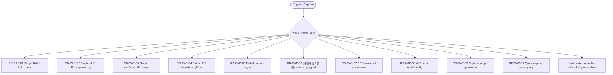

# RB Index — Capture Cluster

[candidate index] 本索引用于在 `Capture / Acquisition` cluster 内快速选择 runbook。它不是 authority，也不批准执行；它只把 trigger、risk、linked dispatch、verification focus 与 rollback focus 放在一个页面里，减少用户每次重新推理。

| Runbook | Trigger keywords | Risk | Use when | Primary rollback |
|---|---|---:|---|---|
| `RB-CAP-01` | bilibili, manual_url, metadata_only, 单条URL | medium | 只处理用户明确给出的单个 Bilibili URL，目标是拿到 redacted metadata evidence、receipt ledger 和 trust-trace safe summary。 | 如果 `不得下载媒体、不得触发 BBDown live、不得扩到作者主页/推荐列表/评论/ASR。` 出现则 hold / supersede / rollback |
| `RB-CAP-02` | XHS, 小红书, read-only triage, unsupported runtime | high | 遇到 XHS 单条 URL 时，仅做 read-only triage 与 future gate 记录，当前不创建 runtime capture。 | 如果 `不得伪装成官方 API，不得让 scraper/browser profile/cookie 进入 evidence，不得创建 capture。` 出现则 hold / supersede / rollback |
| `RB-CAP-03` | YouTube, youtube, later platform, yt-dlp | high | 把 YouTube URL 作为 later-platform candidate 归档，产出 planning note 与 blocked reason。 | 如果 `不得运行 yt-dlp、不得下载、不得假设平台已经进入 Phase 1A。` 出现则 hold / supersede / rollback |
| `RB-CAP-04` | batch, URL list, 批量导入, Phase 2 | high | 用户给出多条 URL 或 URL 列表时，先走 capture_plan 与 batch gate，而不是逐条偷跑 quick capture。 | 如果 `不得把 batch list 当作多个单条 quick capture 自动展开。` 出现则 hold / supersede / rollback |
| `RB-CAP-05` | failed capture, retry, rollback, capture failed | medium | metadata-only capture 失败后，区分 transient network、platform_result 非 ok、redaction fail、receipt fail。 | 如果 `不得删除失败证据来制造成功状态；不得把 no-auth evidence 写成 ok receipt。` 出现则 hold / supersede / rollback |
| `RB-CAP-06` | 弱网, network degraded, timeout, offline | medium | 网络不稳定时收缩到预检、URL canonicalize、排队记录与 later retry，不让半截数据进入 durable path。 | 如果 `不得在超时后追加未 redacted stdout；不得扩大重试次数导致平台风险。` 出现则 hold / supersede / rollback |
| `RB-CAP-07` | BBDown, legal posture, C&D, tool surface | critical | 任何涉及 BBDown 的计划都先复核 legal posture、repo authority、C-BBD draft status 和 explicit approval。 | 如果 `不得运行 BBDown live；不得把 research note 当 runtime approval。` 出现则 hold / supersede / rollback |
| `RB-CAP-08` | ASR, Whisper, Parakeet, Voxtral | critical | 评估 ASR 本地安装前，只做版本/环境/磁盘/合规 checklist，不执行安装，不打开 audio_transcript。 | 如果 `不得安装模型、不得跑音频、不得把 audio transcript 状态写入 authority。` 出现则 hold / supersede / rollback |
| `RB-CAP-09` | LP-001, recommendation, keyword, RAW gap | high | 当输入来自推荐信号、关键词扫描、RAW 缺口或 topic idea 时，先转成 signal/hypothesis/capture_plan candidate。 | 如果 `不得直接创建 capture，不得把用户想法等同 URL approval。` 出现则 hold / supersede / rollback |
| `RB-CAP-10` | quick capture, scope-gated, metadata_only, operator decision | medium | 在 single-user 模式下快速判断一个输入是否满足 quick capture 窄门，或必须转入 scope-gated 流程。 | 如果 `不得因为用户着急就跳过 precondition；不得把 quick capture 扩义成任意平台抓取。` 出现则 hold / supersede / rollback |

[canonical fact] 本索引继承的全局事实包括：PRD-v2/SRD-v2 是当前 base；candidate addenda 不是 global runtime approval；blocked runtime、ASR、browser automation、migration、vault true write 必须另立 gate。

[operator note] 选择 runbook 时先看 trigger，再看 negative trigger。若一个输入同时命中两个 cluster，优先级为 Boundary/Audit > Recovery > Capture/Tooling > Dispatch > Egress > Visual > Memory。这个优先级用于安全收缩，不用于扩大权限。

[verification note] 每个 runbook 都必须具备 trigger、preconditions、steps、verification、rollback、lessons、linked、footer。缺少 rollback 或把 rollback 写成空泛声明时，不允许进入执行。

[linked note] 本 cluster 默认 linked rules: ~/.claude/rules/security.md, ~/.claude/rules/execution-discipline.md, ~/.claude/rules/parallel-safety.md；当前容器未验证这些 `~/.claude/rules/*` 文件存在，因此索引以 prompt-provided canonical path 引用，并在 README/stdout 标注 `linked_rules_validated=false`。

## Cluster operator appendix

[index use] `Capture / Acquisition` index 的主要用途是路由，不是替代单个 runbook。先用 trigger keywords 找候选，再用 negative trigger 和 preconditions 排除误命中；最后才进入 steps。把 URL、平台、preset 与 evidence sink 分开确认；任何 recommendation、keyword、RAW gap 都先降级成 signal，不直接进入 capture。

[route anti-pattern] 最危险的捷径是把 metadata success 外推为 media/audio readiness，或把“用户给过平台名”误读成“用户给了可采集 URL”。 如果两个 runbook 都看似匹配，优先选择 risk_level 更高、rollback 更具体、forbidden path 更窄的那个；不要为了省时间选步骤更短的文件。

[index checklist]
- 使用 `Capture / Acquisition` cluster 时，先按 risk_level 选择 runbook，再按 trigger_keywords 排除相邻场景。

[handoff expectation] handoff 必须包含 source_url_hash、platform、preset、forbidden_runtime、rollback_sink 和下一步是否需要 legal posture recheck。 index 文件只给选择依据；真正执行或派发仍要回到单文件 SOP，把 allowed_paths、forbidden_paths、validation command、rollback plan 写完整。
