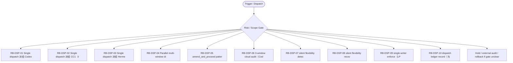

# RB Index — Dispatch Cluster

[candidate index] 本索引用于在 `Dispatch / Multi-Agent` cluster 内快速选择 runbook。它不是 authority，也不批准执行；它只把 trigger、risk、linked dispatch、verification focus 与 rollback focus 放在一个页面里，减少用户每次重新推理。

| Runbook | Trigger keywords | Risk | Use when | Primary rollback |
|---|---|---:|---|---|
| `RB-DSP-01` | Codex, single dispatch, PR owner, 主写入 | medium | 把一个明确 scoped、可验证、边界清楚的任务交给 Codex 作为主写入者。 | 如果 `不得让 Codex 绕过 ledger、不得让 review-only 任务变成 authority edit。` 出现则 hold / supersede / rollback |
| `RB-DSP-02` | CC1, Claude Code, review lane, contract review | medium | 把 IA、UX、contract review、risk inventory 交给 CC1，默认 read-only，必要时输出 patch suggestion。 | 如果 `不得默认写 authority；不得把 chat critique 当 repo fact。` 出现则 hold / supersede / rollback |
| `RB-DSP-03` | Hermes, OpenClaw, research, rebuttal | low | 把外部视角、竞品、反驳、premortem 交给 Hermes 风格窗口，产出 candidate findings。 | 如果 `不得把外部建议直接 promote；不得引入 runtime/tooling without gate。` 出现则 hold / supersede / rollback |
| `RB-DSP-04` | parallel, multi-window, worktree, lane max | high | 当任务可拆成无同文件冲突的 research/spec/prototype lanes 时，按 lane cap 并行。 | 如果 `不得让多个 writer 同时改 current/task-index/decision-log；不得超出 scoped product_lane_max。` 出现则 hold / supersede / rollback |
| `RB-DSP-05` | amend_and_proceed, amend, repair prompt, proceed | medium | 当 dispatch pack、prompt、manifest 或 dependency 表有局部缺陷但主目标仍成立时，先 amend，再 proceed。 | 如果 `不得用 amend 掩盖红线；遇 hard_redline_adjacent 必须 stop 或降级。` 出现则 hold / supersede / rollback |
| `RB-DSP-06` | 3-window audit, cloud audit, Codex, GPT Pro | medium | 对 material task 同时收集主写入、外审、反驳窗口意见，再合成 single operator decision。 | 如果 `不得让三份报告相互投票替代事实源；PR diff/workflow 才是 high-risk truth。` 出现则 hold / supersede / rollback |
| `RB-DSP-07` | silent flexibility, scope drift, 模型自行变更, detect | medium | 识别模型在未说明情况下改了路径、scope、字段、approval wording 或 validation standard。 | 如果 `不得把“看起来更好”的改动当默认获批；必须追问 diff 与理由。` 出现则 hold / supersede / rollback |
| `RB-DSP-08` | silent flexibility recover, scope repair, PR226, PR227 | high | 当已经发生 silent scope drift 时，用 repair note、supersede、rollback 或 narrower PR 收束。 | 如果 `不得把越界产物直接保留为 authority；不得事后补一句“按用户意图”。` 出现则 hold / supersede / rollback |
| `RB-DSP-09` | LP-006, single writer, authority writer, current.md | critical | 任何触碰 current.md/task-index.md/decision-log/AGENTS/contracts-index 的任务，先指定唯一 writer。 | 如果 `不得双写 coupled authority surface；不得让 pool worker 改 authority。` 出现则 hold / supersede / rollback |
| `RB-DSP-10` | dispatch ledger, run summary, ledger, U5 | medium | 每个 dispatch 完成、失败、defer、supersede 后，写入统一 ledger record 与 evidence pointer。 | 如果 `不得只把结果留在聊天记录或临时 handoff。` 出现则 hold / supersede / rollback |
| `RB-DSP-11` | cost attribution, model cost, token cost, window cost | low | 记录多模型 fleet 的窗口、角色、耗时、产出类型与失败原因，供后续调度优化。 | 如果 `不得虚报 thinking minutes；不得把成本表当绩效评价。` 出现则 hold / supersede / rollback |
| `RB-DSP-12` | packed PR, per-dispatch PR, PR factory, merge strategy | high | 决定多个 dispatch 是合并成 packed PR，还是每个 dispatch 单独 PR。 | 如果 `不得为了吞吐把不同 risk class 混入一个 PR；不得让 packed PR 逃避 review。` 出现则 hold / supersede / rollback |

[canonical fact] 本索引继承的全局事实包括：PRD-v2/SRD-v2 是当前 base；candidate addenda 不是 global runtime approval；blocked runtime、ASR、browser automation、migration、vault true write 必须另立 gate。

[operator note] 选择 runbook 时先看 trigger，再看 negative trigger。若一个输入同时命中两个 cluster，优先级为 Boundary/Audit > Recovery > Capture/Tooling > Dispatch > Egress > Visual > Memory。这个优先级用于安全收缩，不用于扩大权限。

[verification note] 每个 runbook 都必须具备 trigger、preconditions、steps、verification、rollback、lessons、linked、footer。缺少 rollback 或把 rollback 写成空泛声明时，不允许进入执行。

[linked note] 本 cluster 默认 linked rules: ~/.claude/rules/agents.md, ~/.claude/rules/parallel-safety.md, ~/.claude/rules/execution-discipline.md, ~/.claude/rules/session-closure.md；当前容器未验证这些 `~/.claude/rules/*` 文件存在，因此索引以 prompt-provided canonical path 引用，并在 README/stdout 标注 `linked_rules_validated=false`。

## Cluster operator appendix

[index use] `Dispatch / Multi-Agent` index 的主要用途是路由，不是替代单个 runbook。先用 trigger keywords 找候选，再用 negative trigger 和 preconditions 排除误命中；最后才进入 steps。先决定 owner、lane、allowed_paths、forbidden_paths 与 validation command，再派模型；多窗口只解决吞吐，不替代 authority。

[route anti-pattern] 最危险的捷径是让两个窗口同时写同一 authority surface，或者把模型自行扩展的 silent flexibility 当作默认修正。 如果两个 runbook 都看似匹配，优先选择 risk_level 更高、rollback 更具体、forbidden path 更窄的那个；不要为了省时间选步骤更短的文件。

[index checklist]
- 使用 `Dispatch / Multi-Agent` cluster 时，先按 risk_level 选择 runbook，再按 trigger_keywords 排除相邻场景。

[handoff expectation] handoff 必须包含 dispatch_id、agent、worktree、allowed_paths、forbidden_paths、merge rule、amendments 和 stop condition。 index 文件只给选择依据；真正执行或派发仍要回到单文件 SOP，把 allowed_paths、forbidden_paths、validation command、rollback plan 写完整。
