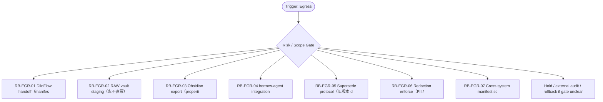

# RB Index — Egress Cluster

[candidate index] 本索引用于在 `Egress / Downstream` cluster 内快速选择 runbook。它不是 authority，也不批准执行；它只把 trigger、risk、linked dispatch、verification focus 与 rollback focus 放在一个页面里，减少用户每次重新推理。

| Runbook | Trigger keywords | Risk | Use when | Primary rollback |
|---|---|---:|---|---|
| `RB-EGR-01` | DiloFlow, handoff, manifest publish, downstream | medium | 把 ScoutFlow proof packet 转给 DiloFlow 前生成 manifest、source labels、blocked lanes 与 redaction proof。 | 如果 `不得把 downstream request 写成 ScoutFlow authority；不得省略 evidence hashes。` 出现则 hold / supersede / rollback |
| `RB-EGR-02` | RAW vault, staging, 00-Inbox, vault preview | critical | 把 vault preview 转为 RAW 00-Inbox candidate 前进行 staging，不直接 true write。 | 如果 `不得让 ScoutFlow 修改 RAW 顶层结构；不得把 committed=true 写入未批准包。` 出现则 hold / supersede / rollback |
| `RB-EGR-03` | Obsidian, export, properties, highlights | medium | 将候选材料导出为 Obsidian 可读 note，保留 metadata、source URL、blocked lanes、next action。 | 如果 `不得写入 credential material；不得把 clipped note 当 final knowledge。` 出现则 hold / supersede / rollback |
| `RB-EGR-04` | hermes-agent, integration, research lane, handoff | medium | 把 ScoutFlow candidate packet 交给 hermes-agent 做 research/rebuttal，限定 read-only 与输出格式。 | 如果 `不得让 hermes-agent 直接改 repo/RAW；不得接受无 claim label 的长评。` 出现则 hold / supersede / rollback |
| `RB-EGR-05` | supersede, deprecated, old version, replacement | high | 当旧 runbook、handoff、spec、asset 被新版本取代时，写 supersede chain 与 migration note。 | 如果 `不得删除旧证据；不得留下两个 active truth。` 出现则 hold / supersede / rollback |
| `RB-EGR-06` | redaction enforce, PII, credential, legal sensitive | critical | 任何交付到 RAW/DiloFlow/Obsidian/Hermes 前，都执行 redaction 与 legal-sensitive review。 | 如果 `不得把内部日志原样传给下游；不得让 downstream 存放不可追溯敏感字段。` 出现则 hold / supersede / rollback |
| `RB-EGR-07` | manifest schema, cross-system, RAW, DiloFlow | medium | 验证跨系统 handoff manifest 的必填字段、source labels、hash、blocked_lanes 与 rollback pointer。 | 如果 `不得把 manifest 当附件清单而缺少语义字段。` 出现则 hold / supersede / rollback |

[canonical fact] 本索引继承的全局事实包括：PRD-v2/SRD-v2 是当前 base；candidate addenda 不是 global runtime approval；blocked runtime、ASR、browser automation、migration、vault true write 必须另立 gate。

[operator note] 选择 runbook 时先看 trigger，再看 negative trigger。若一个输入同时命中两个 cluster，优先级为 Boundary/Audit > Recovery > Capture/Tooling > Dispatch > Egress > Visual > Memory。这个优先级用于安全收缩，不用于扩大权限。

[verification note] 每个 runbook 都必须具备 trigger、preconditions、steps、verification、rollback、lessons、linked、footer。缺少 rollback 或把 rollback 写成空泛声明时，不允许进入执行。

[linked note] 本 cluster 默认 linked rules: ~/.claude/rules/security.md, ~/.claude/rules/session-closure.md, ~/.claude/rules/execution-discipline.md；当前容器未验证这些 `~/.claude/rules/*` 文件存在，因此索引以 prompt-provided canonical path 引用，并在 README/stdout 标注 `linked_rules_validated=false`。

## Cluster operator appendix

[index use] `Egress / Downstream` index 的主要用途是路由，不是替代单个 runbook。先用 trigger keywords 找候选，再用 negative trigger 和 preconditions 排除误命中；最后才进入 steps。下游输出必须保留 manifest、redaction、supersede 与 destination schema；RAW vault staging 永远不是 true write approval。

[route anti-pattern] 最危险的捷径是把 preview artifact 直接发布到 Obsidian/DiloFlow/Hermes，或让旧版本和新版本并行有效。 如果两个 runbook 都看似匹配，优先选择 risk_level 更高、rollback 更具体、forbidden path 更窄的那个；不要为了省时间选步骤更短的文件。

[index checklist]
- 使用 `Egress / Downstream` cluster 时，先按 risk_level 选择 runbook，再按 trigger_keywords 排除相邻场景。

[handoff expectation] handoff 必须包含 artifact_id、destination、redaction_hash、schema_version、superseded_by 和 rollback broadcast plan。 index 文件只给选择依据；真正执行或派发仍要回到单文件 SOP，把 allowed_paths、forbidden_paths、validation command、rollback plan 写完整。
