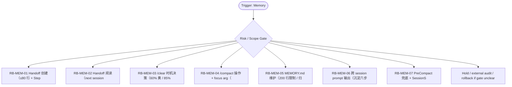

# RB Index — Memory Cluster

[candidate index] 本索引用于在 `Memory / Cross-Session` cluster 内快速选择 runbook。它不是 authority，也不批准执行；它只把 trigger、risk、linked dispatch、verification focus 与 rollback focus 放在一个页面里，减少用户每次重新推理。

| Runbook | Trigger keywords | Risk | Use when | Primary rollback |
|---|---|---:|---|---|
| `RB-MEM-01` | handoff create, ≤80行, next-session prompt, session closure | medium | 在 /clear、换窗、交接给另一个模型前创建可执行 handoff。 | 如果 `不得写成流水账；不得缺少下一步 prompt 与停线项。` 出现则 hold / supersede / rollback |
| `RB-MEM-02` | handoff read, next session, readback, cold start | low | 新窗口开工前按 handoff 顺序读 authority、recent diff、blocked lanes、next action。 | 如果 `不得只读摘要不看 authority；不得假设上个窗口无 drift。` 出现则 hold / supersede / rollback |
| `RB-MEM-03` | /clear, token budget, 60%, 85% | medium | 按 token occupancy 和任务边界决定是否 /clear，不按 session 时长或情绪。 | 如果 `不得在红灯状态继续做 authority edit；不得在无 handoff 时 /clear。` 出现则 hold / supersede / rollback |
| `RB-MEM-04` | /compact, focus arg, context compression, token hygiene | medium | 使用 /compact 时提供 focus arg，保留 current task、redlines、rollback、next verification。 | 如果 `不得把 blocked lanes 压没；不得把 candidate/authority label 丢失。` 出现则 hold / supersede / rollback |
| `RB-MEM-05` | MEMORY.md, 200行, archive stale, memory maintenance | low | 维护长期记忆时只保留稳定偏好、固定边界与当前项目指针，过时内容归档。 | 如果 `不得把临时推理、未验证事实、旧 PR 状态写成长期记忆。` 出现则 hold / supersede / rollback |
| `RB-MEM-06` | cross-session prompt, Step 5, next prompt, closure six steps | medium | 会话结束时输出下一窗口可直接复制的 prompt，包含目标、source、constraints、stop lines。 | 如果 `不得只写“继续”；不得省略 artifact links 与 audit notes。` 出现则 hold / supersede / rollback |
| `RB-MEM-07` | PreCompact, SessionStart, compact recovery, fallback | high | 当模型或工具触发自动 compact 前后，用兜底 note 恢复任务状态与边界。 | 如果 `不得假设 compact 后上下文完整；不得继续执行高风险动作直到 readback。` 出现则 hold / supersede / rollback |

[canonical fact] 本索引继承的全局事实包括：PRD-v2/SRD-v2 是当前 base；candidate addenda 不是 global runtime approval；blocked runtime、ASR、browser automation、migration、vault true write 必须另立 gate。

[operator note] 选择 runbook 时先看 trigger，再看 negative trigger。若一个输入同时命中两个 cluster，优先级为 Boundary/Audit > Recovery > Capture/Tooling > Dispatch > Egress > Visual > Memory。这个优先级用于安全收缩，不用于扩大权限。

[verification note] 每个 runbook 都必须具备 trigger、preconditions、steps、verification、rollback、lessons、linked、footer。缺少 rollback 或把 rollback 写成空泛声明时，不允许进入执行。

[linked note] 本 cluster 默认 linked rules: ~/.claude/rules/session-closure.md, ~/.claude/rules/token-hygiene.md, ~/.claude/rules/execution-discipline.md；当前容器未验证这些 `~/.claude/rules/*` 文件存在，因此索引以 prompt-provided canonical path 引用，并在 README/stdout 标注 `linked_rules_validated=false`。

## Cluster operator appendix

[index use] `Memory / Cross-Session` index 的主要用途是路由，不是替代单个 runbook。先用 trigger keywords 找候选，再用 negative trigger 和 preconditions 排除误命中；最后才进入 steps。跨 session 不是摘要越长越好，而是保留下一轮可执行的边界、未解锁项、证据位置和 next-session prompt。

[route anti-pattern] 最危险的捷径是用 /clear 或 /compact 清掉 boundary context，导致下一窗口重新发明 scope 或漏掉 rollback。 如果两个 runbook 都看似匹配，优先选择 risk_level 更高、rollback 更具体、forbidden path 更窄的那个；不要为了省时间选步骤更短的文件。

[index checklist]
- 使用 `Memory / Cross-Session` cluster 时，先按 risk_level 选择 runbook，再按 trigger_keywords 排除相邻场景。

[handoff expectation] handoff 必须包含 last_safe_state、open_questions、blocked_lanes、next_prompt、source_refs 和 forbidden assumptions。 index 文件只给选择依据；真正执行或派发仍要回到单文件 SOP，把 allowed_paths、forbidden_paths、validation command、rollback plan 写完整。
