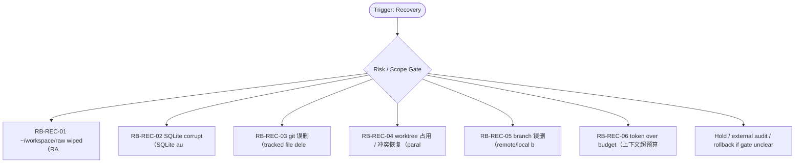

# RB Index — Recovery Cluster

[candidate index] 本索引用于在 `Recovery` cluster 内快速选择 runbook。它不是 authority，也不批准执行；它只把 trigger、risk、linked dispatch、verification focus 与 rollback focus 放在一个页面里，减少用户每次重新推理。

| Runbook | Trigger keywords | Risk | Use when | Primary rollback |
|---|---|---:|---|---|
| `RB-REC-01` | raw wiped, workspace/raw, 误删, restore | critical | 发现 RAW 工作区被误删或大面积丢失时，立即冻结写入、保留现场、按备份/manifest 恢复。 | 如果 `不得用 ScoutFlow preview 反向重建 RAW truth；不得继续下游写入。` 出现则 hold / supersede / rollback |
| `RB-REC-02` | SQLite corrupt, database corruption, authority DB, restore | critical | SQLite authority DB 损坏时，停止 API/worker，备份损坏文件，使用 integrity_check 与最近备份恢复。 | 如果 `不得直接手工编辑 DB；不得让 worker 继续写。` 出现则 hold / supersede / rollback |
| `RB-REC-03` | git delete, 误删, restore file, tracked docs | high | 误删 tracked 文件后，先看 git status/diff，确认是否 authority 文件，再从 HEAD 或 merge-base 恢复。 | 如果 `不得用聊天记忆重写文件；不得覆盖他人 worktree 变更。` 出现则 hold / supersede / rollback |
| `RB-REC-04` | worktree occupied, branch lock, same file conflict, parallel lane | medium | 多 worktree 并行时出现占用、锁、同文件冲突，按 owner/lane/allowed_paths 解除。 | 如果 `不得强删他人 worktree；不得在冲突状态写 authority。` 出现则 hold / supersede / rollback |
| `RB-REC-05` | branch deleted, 误删分支, reflog, remote branch | high | 分支误删时，使用 reflog、PR head、remote tracking 或 commit SHA 恢复。 | 如果 `不得重新创建同名分支指向未知 commit；不得失去 PR lineage。` 出现则 hold / supersede / rollback |
| `RB-REC-06` | token over budget, context overflow, 85%, recovery | high | 上下文超过红线后，暂停高风险动作，写 PreCompact note，做 /compact 或 /clear 后 readback。 | 如果 `不得继续 merge/authority edit；不得靠记忆补全 omitted constraints。` 出现则 hold / supersede / rollback |

[canonical fact] 本索引继承的全局事实包括：PRD-v2/SRD-v2 是当前 base；candidate addenda 不是 global runtime approval；blocked runtime、ASR、browser automation、migration、vault true write 必须另立 gate。

[operator note] 选择 runbook 时先看 trigger，再看 negative trigger。若一个输入同时命中两个 cluster，优先级为 Boundary/Audit > Recovery > Capture/Tooling > Dispatch > Egress > Visual > Memory。这个优先级用于安全收缩，不用于扩大权限。

[verification note] 每个 runbook 都必须具备 trigger、preconditions、steps、verification、rollback、lessons、linked、footer。缺少 rollback 或把 rollback 写成空泛声明时，不允许进入执行。

[linked note] 本 cluster 默认 linked rules: ~/.claude/rules/session-closure.md, ~/.claude/rules/security.md, ~/.claude/rules/execution-discipline.md；当前容器未验证这些 `~/.claude/rules/*` 文件存在，因此索引以 prompt-provided canonical path 引用，并在 README/stdout 标注 `linked_rules_validated=false`。

## Cluster operator appendix

[index use] `Recovery / Incident` index 的主要用途是路由，不是替代单个 runbook。先用 trigger keywords 找候选，再用 negative trigger 和 preconditions 排除误命中；最后才进入 steps。恢复类 SOP 先保存证据，再收敛写入；不要因为焦虑恢复而覆盖 crash site、损坏 DB 或误删分支线索。

[route anti-pattern] 最危险的捷径是直接 reset/recreate/rm，导致可诊断证据消失，或者让 worker/API 在损坏状态继续写。 如果两个 runbook 都看似匹配，优先选择 risk_level 更高、rollback 更具体、forbidden path 更窄的那个；不要为了省时间选步骤更短的文件。

[index checklist]
- 使用 `Recovery / Incident` cluster 时，先按 risk_level 选择 runbook，再按 trigger_keywords 排除相邻场景。

[handoff expectation] handoff 必须包含 incident_id、frozen_surface、backup_path、restore_candidate、verification command 和 communication note。 index 文件只给选择依据；真正执行或派发仍要回到单文件 SOP，把 allowed_paths、forbidden_paths、validation command、rollback plan 写完整。
