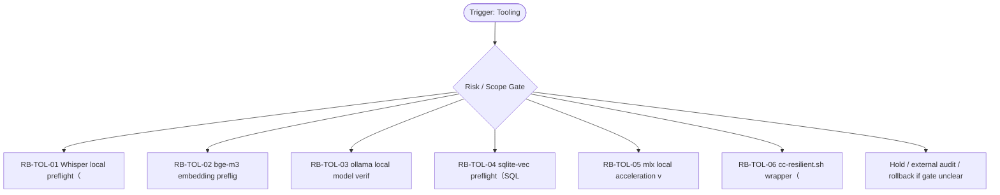

# RB Index — Tooling Cluster

[candidate index] 本索引用于在 `Tooling` cluster 内快速选择 runbook。它不是 authority，也不批准执行；它只把 trigger、risk、linked dispatch、verification focus 与 rollback focus 放在一个页面里，减少用户每次重新推理。

| Runbook | Trigger keywords | Risk | Use when | Primary rollback |
|---|---|---:|---|---|
| `RB-TOL-01` | Whisper, ASR, preflight, audio_transcript | critical | 只做 Whisper 候选 preflight：硬件、磁盘、模型许可、数据路径、approval gate。 | 如果 `不得安装或运行音频；不得创建 transcript artifact。` 出现则 hold / supersede / rollback |
| `RB-TOL-02` | bge-m3, embedding, vector, preflight | high | 评估 bge-m3 是否适合本地向量化候选，检查数据脱敏、chunk lineage、storage boundary。 | 如果 `不得把 RAW/private note 未脱敏送入模型；不得创建 production index。` 出现则 hold / supersede / rollback |
| `RB-TOL-03` | ollama, local model, LLM, verify | medium | 验证 ollama 本地模型候选时，确认模型来源、磁盘、prompt logging、PII policy。 | 如果 `不得把生产凭据/RAW 私密材料用于测试；不得自动拉取模型。` 出现则 hold / supersede / rollback |
| `RB-TOL-04` | sqlite-vec, SQLite, vector extension, migration | critical | 评估 sqlite-vec 前确认 DB vNext/migration gate 未开，只能做 research note。 | 如果 `不得改 schema、不得加载 extension 到 production DB、不得写 migration。` 出现则 hold / supersede / rollback |
| `RB-TOL-05` | mlx, Apple Silicon, local acceleration, verify | medium | 验证 mlx 工具候选时，检查硬件、模型、许可、日志、缓存与回滚。 | 如果 `不得下载大模型或跑私密内容；不得承诺性能。` 出现则 hold / supersede / rollback |
| `RB-TOL-06` | cc-resilient.sh, resiliency, wrapper, retry script | high | 为 Claude/Codex 命令包装 retry/resume 时，先定义日志脱敏、exit code、scope lock。 | 如果 `不得自动重试高风险命令；不得记录 secrets；不得绕过 human gate。` 出现则 hold / supersede / rollback |

[canonical fact] 本索引继承的全局事实包括：PRD-v2/SRD-v2 是当前 base；candidate addenda 不是 global runtime approval；blocked runtime、ASR、browser automation、migration、vault true write 必须另立 gate。

[operator note] 选择 runbook 时先看 trigger，再看 negative trigger。若一个输入同时命中两个 cluster，优先级为 Boundary/Audit > Recovery > Capture/Tooling > Dispatch > Egress > Visual > Memory。这个优先级用于安全收缩，不用于扩大权限。

[verification note] 每个 runbook 都必须具备 trigger、preconditions、steps、verification、rollback、lessons、linked、footer。缺少 rollback 或把 rollback 写成空泛声明时，不允许进入执行。

[linked note] 本 cluster 默认 linked rules: ~/.claude/rules/development-workflow.md, ~/.claude/rules/testing.md, ~/.claude/rules/security.md；当前容器未验证这些 `~/.claude/rules/*` 文件存在，因此索引以 prompt-provided canonical path 引用，并在 README/stdout 标注 `linked_rules_validated=false`。

## Cluster operator appendix

[index use] `Tooling / Local AI` index 的主要用途是路由，不是替代单个 runbook。先用 trigger keywords 找候选，再用 negative trigger 和 preconditions 排除误命中；最后才进入 steps。工具安装/探测只做 preflight，不把可安装性写成已批准运行；每个工具都要有环境、版本、资源与 rollback 条件。

[route anti-pattern] 最危险的捷径是在候选 runbook 中执行 pip/brew/model pull，或把本机 probe 当成所有用户环境的事实。 如果两个 runbook 都看似匹配，优先选择 risk_level 更高、rollback 更具体、forbidden path 更窄的那个；不要为了省时间选步骤更短的文件。

[index checklist]
- 使用 `Tooling / Local AI` cluster 时，先按 risk_level 选择 runbook，再按 trigger_keywords 排除相邻场景。

[handoff expectation] handoff 必须包含 tool_name、probe_command、expected_output、install_blocker、resource_budget 和 next approval gate。 index 文件只给选择依据；真正执行或派发仍要回到单文件 SOP，把 allowed_paths、forbidden_paths、validation command、rollback plan 写完整。
