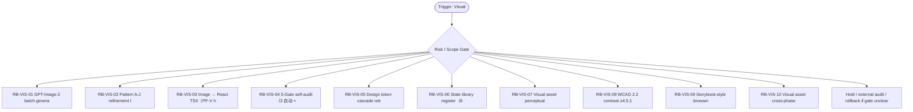

# RB Index — Visual Cluster

[candidate index] 本索引用于在 `Visual Production` cluster 内快速选择 runbook。它不是 authority，也不批准执行；它只把 trigger、risk、linked dispatch、verification focus 与 rollback focus 放在一个页面里，减少用户每次重新推理。

| Runbook | Trigger keywords | Risk | Use when | Primary rollback |
|---|---|---:|---|---|
| `RB-VIS-01` | GPT-Image-2, image batch, visual ZIP, batch generation | medium | 为 H5/operator workstation 视觉素材批量生成候选图，打包为 ZIP，供人类 review。 | 如果 `不得把生成图当 UI approval；不得包含敏感截图或凭据。` 出现则 hold / supersede / rollback |
| `RB-VIS-02` | Pattern A, Pattern J, visual pattern, refinement loop | medium | 围绕 A-J 十个视觉方向进行 prompt、评审、淘汰、合并与下一轮 refinement。 | 如果 `不得让 generic admin/dashboard tone 覆盖 ScoutFlow operator workstation 语气。` 出现则 hold / supersede / rollback |
| `RB-VIS-03` | image to TSX, React TSX, PF-V, handoff | high | 把已通过人审的图像候选转为 React TSX 任务包，保留 source prompt、asset hash 与 constraints。 | 如果 `不得移植 donor code/IA/layout primitive；不得绕过 package approval。` 出现则 hold / supersede / rollback |
| `RB-VIS-04` | 5 Gate, self-audit, human visual review, CI visual | high | 对视觉任务执行功能、边界、lint/build、截图/可访问性、人类视觉终判五门检查。 | 如果 `不得把 3 个自动门通过说成 5 Gate 全过。` 出现则 hold / supersede / rollback |
| `RB-VIS-05` | design token, cascade, color token, spacing token | medium | 调整设计 token 时先建立 cascade map，确认影响组件、状态、截图与 contrast。 | 如果 `不得引入 Tailwind/Panda/shadcn package 变更作为默认前提。` 出现则 hold / supersede / rollback |
| `RB-VIS-06` | state library, 8 panel, 6 state, panel state | medium | 为 H5 八面板六状态建立状态素材库，绑定 empty/loading/error/metadata_fetched/blocked/review 等可视状态。 | 如果 `不得新增未批准 state words；不得把 UI 状态升级为 authority state。` 出现则 hold / supersede / rollback |
| `RB-VIS-07` | perceptual hash, asset dedup, pHash, duplicate image | low | 对图片、截图、视觉草案计算感知哈希，减少重复与混乱。 | 如果 `不得把 hash 相似当版权或合规结论；不得删原始 proof。` 出现则 hold / supersede / rollback |
| `RB-VIS-08` | WCAG, contrast, 4.5:1, accessibility | medium | 对文字/背景、状态色、警示色执行 WCAG 2.2 对比度审计。 | 如果 `不得只看设计图美观；不得用截图压缩图代替实际 token 值。` 出现则 hold / supersede / rollback |
| `RB-VIS-09` | Storybook, localhost, browser launch, visual review | high | 需要浏览器预览时，先确认 browser automation gate、截图 gate 与 local-only 边界。 | 如果 `不得在未授权时运行 Playwright/browser automation；不得把 static harness 当 execution proof。` 出现则 hold / supersede / rollback |
| `RB-VIS-10` | asset reuse, cross-phase, visual query, OpenDesign | low | 查询 Wave3B/Wave4/Wave5 视觉素材能否复用到新任务，标注 source、approval、risk。 | 如果 `不得复用带敏感信息或未审查截图；不得让旧 mood 覆盖新 IA。` 出现则 hold / supersede / rollback |

[canonical fact] 本索引继承的全局事实包括：PRD-v2/SRD-v2 是当前 base；candidate addenda 不是 global runtime approval；blocked runtime、ASR、browser automation、migration、vault true write 必须另立 gate。

[operator note] 选择 runbook 时先看 trigger，再看 negative trigger。若一个输入同时命中两个 cluster，优先级为 Boundary/Audit > Recovery > Capture/Tooling > Dispatch > Egress > Visual > Memory。这个优先级用于安全收缩，不用于扩大权限。

[verification note] 每个 runbook 都必须具备 trigger、preconditions、steps、verification、rollback、lessons、linked、footer。缺少 rollback 或把 rollback 写成空泛声明时，不允许进入执行。

[linked note] 本 cluster 默认 linked rules: ~/.claude/rules/aesthetic-first-principles.md, ~/.claude/rules/testing.md, ~/.claude/rules/execution-discipline.md；当前容器未验证这些 `~/.claude/rules/*` 文件存在，因此索引以 prompt-provided canonical path 引用，并在 README/stdout 标注 `linked_rules_validated=false`。

## Cluster operator appendix

[index use] `Visual Production` index 的主要用途是路由，不是替代单个 runbook。先用 trigger keywords 找候选，再用 negative trigger 和 preconditions 排除误命中；最后才进入 steps。视觉生产先定义 state、token、asset lineage 与 5-Gate；生成图像或 TSX 之前先确认不改 authority state words。

[route anti-pattern] 最危险的捷径是把漂亮图当成可用界面，跳过 contrast、empty/error state、dedup、browser preview 与 handoff。 如果两个 runbook 都看似匹配，优先选择 risk_level 更高、rollback 更具体、forbidden path 更窄的那个；不要为了省时间选步骤更短的文件。

[index checklist]
- 使用 `Visual Production` cluster 时，先按 risk_level 选择 runbook，再按 trigger_keywords 排除相邻场景。

[handoff expectation] handoff 必须包含 asset_id、prompt_version、state binding、token mapping、preview route、known defects 和 reuse query。 index 文件只给选择依据；真正执行或派发仍要回到单文件 SOP，把 allowed_paths、forbidden_paths、validation command、rollback plan 写完整。
