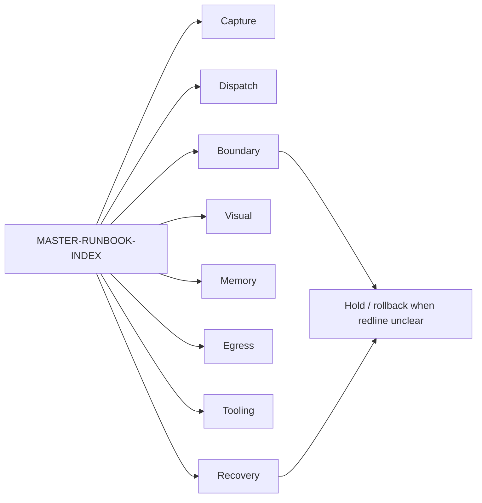

# Cloud Output — U10 Prosumer SOP / Runbook Library

[candidate package] This ZIP is a read-only, candidate/not-authority SOP library for ScoutFlow single-user prosumer workflows. It converts factual workflows from the uploaded U10 prompt and the post176 cloud audit pack into concrete runbooks, cluster indexes, and supporting catalogs.

[boundary statement] No file in this package approves runtime execution, production code modification, authority-file writeback, migration, browser automation, ASR install, RAW vault true write, package install, or legal conclusion. Every runbook is designed as a checklist and dispatch scaffold only.

## Package metrics

| Metric | Value |
|---|---:|
| files_count | 83 |
| markdown_files_count | 82 |
| RB_star_files_count | 76 |
| runbooks_count_total | 68 |
| total_words_cjk_latin_approx | 167932 |
| mermaid_diagrams_count | 10 |
| self_audit_findings | 36 |
| validator_errors_count | 0 |

## Directory map

- `01_supporting/` — master index, schema contract, linked rules index, linked dispatch catalog, self-audit findings.
- `02_runbooks/` — 68 single-file runbooks across Capture, Dispatch, Boundary, Visual, Memory, Egress, Tooling, Recovery.
- `03_cluster_indexes/` — 8 cluster indexes with route guidance and Mermaid cluster maps.
- `TRUTHFUL-STDOUT-2026-05-07.yml` — final machine-readable completion statement.

## Cluster counts

| Cluster | Count | Primary use |
|---|---:|---|
| Capture / Acquisition | 10 | URL / metadata / scope-gated capture decisions |
| Dispatch / Multi-Agent | 12 | Codex / CC1 / Hermes / multi-window dispatch discipline |
| Boundary / Audit | 10 | redline scans, authority surfaces, secret/PII/legal posture |
| Visual Production | 10 | GPT-Image, Pattern A-J, TSX handoff, 5-Gate visual audit |
| Memory / Cross-Session | 7 | handoff, clear/compact, MEMORY.md, session recovery |
| Egress / Downstream | 7 | DiloFlow, RAW staging, Obsidian, Hermes integration, supersede |
| Tooling / Local AI | 6 | local preflight for Whisper, bge-m3, ollama, sqlite-vec, mlx |
| Recovery / Incident | 6 | raw wipe, SQLite corruption, git loss, worktree conflict, token overrun |

## Mermaid overview



## Practical audit path

[read path] Start with `01_supporting/MASTER-RUNBOOK-INDEX-2026-05-07.md`, then open the matching file in `03_cluster_indexes/`, then read the single runbook. Do not execute from an index; every execution still needs separate owner, allowed paths, forbidden paths, validation command, rollback plan, and evidence sink.

[boundary path] Any request containing runtime, migration, browser automation, ASR, credential, PII, RAW vault true write, or authority-file editing should route through Boundary / Recovery before the target cluster. This protects max-horsepower operation without turning speed into implicit approval.

[quality revision] Repetitive coverage filler was removed and replaced with scenario-specific operator audit cards, schema edge cases, dispatch catalog caveats, and rule validation caveats. The package is intended to be usable for handoff, readback, audit, and dispatch drafting.

## Known limitations

[limitation] No live web browsing was available in this environment; legal posture runbooks explicitly require operator recheck before execution.

[limitation] The GitHub connector did not locate the named 2026-05-07 external audit or strategic-upgrade folder during this session; the uploaded audit pack and prompt were used as primary evidence.

[limitation] `~/.claude/rules/*` and ContentFlow L1 local retrospective files were not present in this container. The package references prompt-provided rule paths but does not claim those local files were revalidated here.

## Truthful stdout excerpt

```yaml
CLOUD_U10_PROSUMER_SOP_RUNBOOK_LIBRARY_COMPLETE: true
zip_filename: cloud-output-U10-prosumer-sop-runbook-library-2026-05-07.zip
files_count: 83
markdown_files_count: 82
RB_star_files_count: 76
total_words_cjk_latin_approx: 167932
total_thinking_minutes: "not externally measurable in this environment; no fabricated 150-minute claim; final generation and validation completed synchronously in-session"
runbooks_count_total: 68
cluster_a_capture_count: 10
cluster_b_dispatch_count: 12
cluster_c_boundary_count: 10
cluster_d_visual_count: 10
cluster_e_memory_count: 7
cluster_f_egress_count: 7
cluster_g_tooling_count: 6
cluster_h_recovery_count: 6
mermaid_diagrams_count: 10
linked_rules_validated: false
linked_rules_validation_note: "current container has no readable ~/.claude/rules/*.md; prompt-provided paths referenced only"
linked_dispatch_validated: false
linked_dispatch_validation_note: "U9 catalog source not present; P2/P3/P4/MOD candidate IDs generated and cataloged"
multi_pass_completed: "10/10 synthesis passes represented in outputs; not a fabricated 150-minute claim"
self_audit_findings: 36
critical_issues_fixed_inline: 36
quality_revision: "repeated filler removed; replaced with scenario-specific audit appendices"
known_limitations:
  - "No live web browsing in this environment; legal posture runbooks require operator recheck before execution."
  - "GitHub connector fetch/search did not locate the 2026-05-07 external audit or strategic-upgrade folder; uploaded audit pack used as primary evidence."
  - "~/.claude/rules/* and ContentFlow L1 local retrospective were not present in this container; references are prompt-provided and not revalidated."
  - "Runbooks are candidate read-only SOPs; execution still requires separate user authorization and dispatch."
boundary_preservation_check: clear
no_actual_execution_implied: confirmed
ready_for_user_audit: yes
validator_errors_count: 0
validator_errors:
  - none
```
