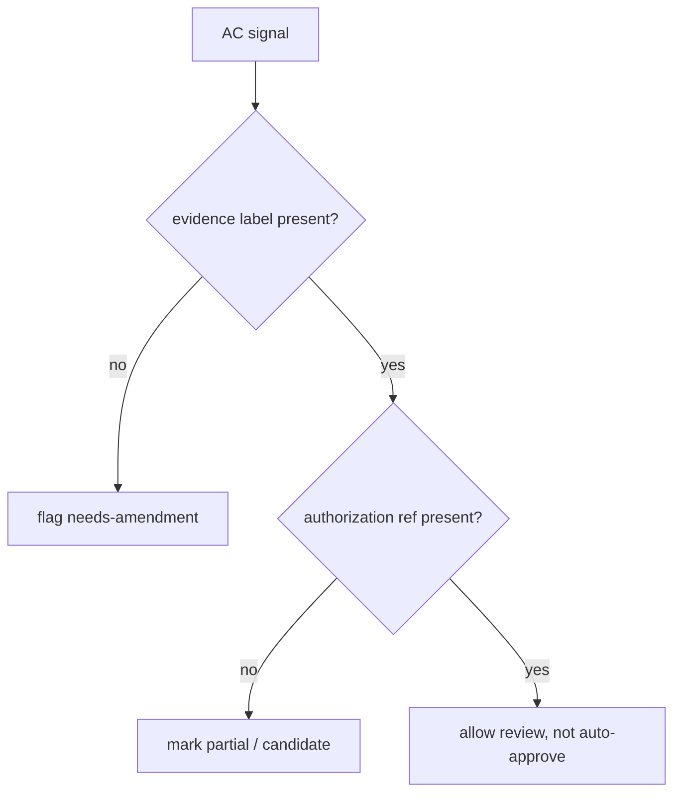

# Cluster AC — Authority-Confusion / Single-Writer

[evidence-backed] 本 index 汇总 `Authority-Confusion / Single-Writer` 的候选 anti-pattern。风险画像：多窗口和 sidecar agent 会把 authority surface 当普通草稿改写。核心风险是 single-writer 失效。 本 index 不把任何 candidate spec 提升为 authority；它只提供审计导航、detect/prevent/escape 的快速入口。

## Anti-pattern 清单

| ID | title | risk | introduced/exposed | detect | prevent | linked |
|---|---|---|---|---|---|---|
| AP-AC-01 | Dual-window writes docs/current.md | critical | exposed | grep | contract | RB-AC-01 / P2-AC-01 |
| AP-AC-02 | Sidecar agent writes authority files | critical | exposed | static | schema | RB-AC-02 / P2-AC-02 |
| AP-AC-03 | task-index numbering conflict | high | exposed | grep | hook | RB-AC-03 / P2-AC-03 |
| AP-AC-04 | decision-log append rewritten as replace | high | exposed | grep | template | RB-AC-04 / P2-AC-04 |
| AP-AC-05 | contract-index baseline drift | high | exposed | static | contract | RB-AC-05 / P2-AC-05 |
| AP-AC-06 | AGENTS.md rewritten instead of amended | high | exposed | grep | template | RB-AC-06 / P2-AC-06 |
| AP-AC-07 | Authority promote skips audit gate | critical | exposed | grep | contract | RB-AC-07 / P2-AC-07 |
| AP-AC-08 | Authority writer max=1 violation | critical | exposed | static | schema | RB-AC-08 / P2-AC-08 |

## Cluster detect matrix

[evidence-backed] 本 cluster 的 detect 入口不是单条正则，而是授权、路径、证据、边界四列一起看。任何一列从 candidate/partial/blocked/not-authority 转为 works/pass/approved/authority，都必须写出来源或回退措辞。

## Prevent placement

[candidate] 最适合落位的是 template/schema/contract，而不是在当前 U11 直接部署 hook。建议每个未来 dispatch row 都包含 `authority_surface_touched`、`user_authorization_ref`、`introduced_or_exposed`、`evidence_label`、`escape_clause` 五个最小字段。

## Escape overview

[candidate] cluster 级逃逸路径：暂停新写入 → 生成 delta table → 重标 claim label → 区分 introduced/exposed → 决策 keep/rollback/defer/amend_and_proceed。对于已 merge 的 PR，优先写 amendment ledger，而不是口头解释。

## Cross-links

- [candidate] `AP-AC-01` ↔ `RB-AC-01` ↔ `P2-AC-01` ↔ `~/.claude/rules/parallel-safety.md`
- [candidate] `AP-AC-02` ↔ `RB-AC-02` ↔ `P2-AC-02` ↔ `~/.claude/rules/parallel-safety.md`
- [candidate] `AP-AC-03` ↔ `RB-AC-03` ↔ `P2-AC-03` ↔ `~/.claude/rules/parallel-safety.md`
- [candidate] `AP-AC-04` ↔ `RB-AC-04` ↔ `P2-AC-04` ↔ `~/.claude/rules/parallel-safety.md`
- [candidate] `AP-AC-05` ↔ `RB-AC-05` ↔ `P2-AC-05` ↔ `~/.claude/rules/parallel-safety.md`
- [candidate] `AP-AC-06` ↔ `RB-AC-06` ↔ `P2-AC-06` ↔ `~/.claude/rules/parallel-safety.md`
- [candidate] `AP-AC-07` ↔ `RB-AC-07` ↔ `P2-AC-07` ↔ `~/.claude/rules/parallel-safety.md`
- [candidate] `AP-AC-08` ↔ `RB-AC-08` ↔ `P2-AC-08` ↔ `~/.claude/rules/parallel-safety.md`

[derived] 复核提醒：Cluster AC 的每个条目都要避免把 prompt 中的期望写成已执行事实。若 U9/U10 实源缺失，cross-link 只能保持候选映射；若 PR 或 local pack 证据无法证明具体历史实例，应在 self-audit 中降级 attribution confidence。

[derived] 复核提醒：Cluster AC 的每个条目都要避免把 prompt 中的期望写成已执行事实。若 U9/U10 实源缺失，cross-link 只能保持候选映射；若 PR 或 local pack 证据无法证明具体历史实例，应在 self-audit 中降级 attribution confidence。

[derived] 复核提醒：Cluster AC 的每个条目都要避免把 prompt 中的期望写成已执行事实。若 U9/U10 实源缺失，cross-link 只能保持候选映射；若 PR 或 local pack 证据无法证明具体历史实例，应在 self-audit 中降级 attribution confidence。

[derived] 复核提醒：Cluster AC 的每个条目都要避免把 prompt 中的期望写成已执行事实。若 U9/U10 实源缺失，cross-link 只能保持候选映射；若 PR 或 local pack 证据无法证明具体历史实例，应在 self-audit 中降级 attribution confidence。

[derived] 复核提醒：Cluster AC 的每个条目都要避免把 prompt 中的期望写成已执行事实。若 U9/U10 实源缺失，cross-link 只能保持候选映射；若 PR 或 local pack 证据无法证明具体历史实例，应在 self-audit 中降级 attribution confidence。

[derived] 复核提醒：Cluster AC 的每个条目都要避免把 prompt 中的期望写成已执行事实。若 U9/U10 实源缺失，cross-link 只能保持候选映射；若 PR 或 local pack 证据无法证明具体历史实例，应在 self-audit 中降级 attribution confidence。

[derived] 复核提醒：Cluster AC 的每个条目都要避免把 prompt 中的期望写成已执行事实。若 U9/U10 实源缺失，cross-link 只能保持候选映射；若 PR 或 local pack 证据无法证明具体历史实例，应在 self-audit 中降级 attribution confidence。

[derived] 复核提醒：Cluster AC 的每个条目都要避免把 prompt 中的期望写成已执行事实。若 U9/U10 实源缺失，cross-link 只能保持候选映射；若 PR 或 local pack 证据无法证明具体历史实例，应在 self-audit 中降级 attribution confidence。

[derived] 复核提醒：Cluster AC 的每个条目都要避免把 prompt 中的期望写成已执行事实。若 U9/U10 实源缺失，cross-link 只能保持候选映射；若 PR 或 local pack 证据无法证明具体历史实例，应在 self-audit 中降级 attribution confidence。

[derived] 复核提醒：Cluster AC 的每个条目都要避免把 prompt 中的期望写成已执行事实。若 U9/U10 实源缺失，cross-link 只能保持候选映射；若 PR 或 local pack 证据无法证明具体历史实例，应在 self-audit 中降级 attribution confidence。

[derived] 复核提醒：Cluster AC 的每个条目都要避免把 prompt 中的期望写成已执行事实。若 U9/U10 实源缺失，cross-link 只能保持候选映射；若 PR 或 local pack 证据无法证明具体历史实例，应在 self-audit 中降级 attribution confidence。

[derived] 复核提醒：Cluster AC 的每个条目都要避免把 prompt 中的期望写成已执行事实。若 U9/U10 实源缺失，cross-link 只能保持候选映射；若 PR 或 local pack 证据无法证明具体历史实例，应在 self-audit 中降级 attribution confidence。

[derived] 复核提醒：Cluster AC 的每个条目都要避免把 prompt 中的期望写成已执行事实。若 U9/U10 实源缺失，cross-link 只能保持候选映射；若 PR 或 local pack 证据无法证明具体历史实例，应在 self-audit 中降级 attribution confidence。

[derived] 复核提醒：Cluster AC 的每个条目都要避免把 prompt 中的期望写成已执行事实。若 U9/U10 实源缺失，cross-link 只能保持候选映射；若 PR 或 local pack 证据无法证明具体历史实例，应在 self-audit 中降级 attribution confidence。

[derived] 复核提醒：Cluster AC 的每个条目都要避免把 prompt 中的期望写成已执行事实。若 U9/U10 实源缺失，cross-link 只能保持候选映射；若 PR 或 local pack 证据无法证明具体历史实例，应在 self-audit 中降级 attribution confidence。

[derived] 复核提醒：Cluster AC 的每个条目都要避免把 prompt 中的期望写成已执行事实。若 U9/U10 实源缺失，cross-link 只能保持候选映射；若 PR 或 local pack 证据无法证明具体历史实例，应在 self-audit 中降级 attribution confidence。
