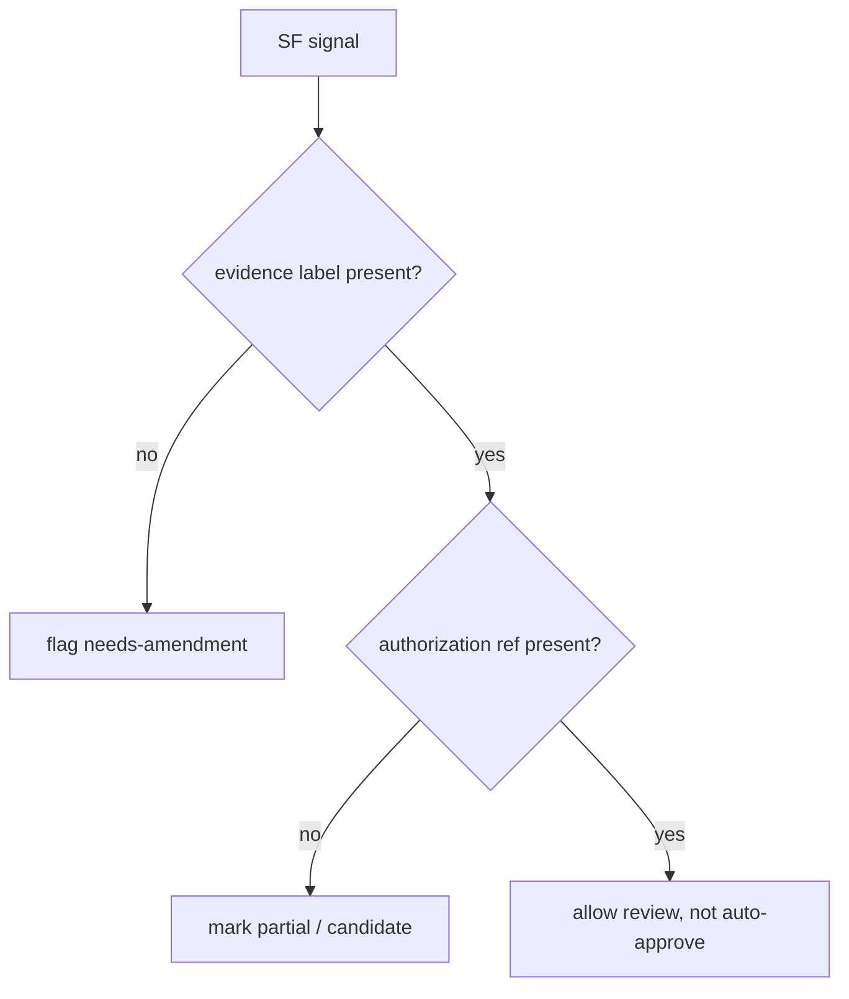

# Cluster SF — Silent-Flexibility / Scope Drift

[evidence-backed] 本 index 汇总 `Silent-Flexibility / Scope Drift` 的候选 anti-pattern。风险画像：速度越快越容易把最近动作误判成授权。核心风险是 silent merge、silent loosen、silent expand。 本 index 不把任何 candidate spec 提升为 authority；它只提供审计导航、detect/prevent/escape 的快速入口。

## Anti-pattern 清单

| ID | title | risk | introduced/exposed | detect | prevent | linked |
|---|---|---|---|---|---|---|
| AP-SF-01 | Packed repair without explicit authorization | critical | exposed | audit | contract | RB-SF-01 / P2-SF-01 |
| AP-SF-02 | Run-1 amendment proceeds without explicit gate replay | critical | introduced | audit | template | RB-SF-02 / P2-SF-02 |
| AP-SF-03 | Multi-dispatch silent merge | high | exposed | human | contract | RB-SF-03 / P2-SF-03 |
| AP-SF-04 | Worker-guessed scope expansion | critical | introduced | grep | schema | RB-SF-04 / P2-SF-04 |
| AP-SF-05 | Multi-PR topology drift | high | exposed | audit | contract | RB-SF-05 / P2-SF-05 |
| AP-SF-06 | Checkpoint field silent rename | medium | exposed | static | schema | RB-SF-06 / P2-SF-06 |
| AP-SF-07 | Allowed path silent change | high | exposed | grep | hook | RB-SF-07 / P2-SF-07 |
| AP-SF-08 | Threshold silent loosen | high | introduced | grep | template | RB-SF-08 / P2-SF-08 |
| AP-SF-09 | Verdict wording silent escalate | high | exposed | grep | template | RB-SF-09 / P2-SF-09 |
| AP-SF-10 | Boundary silent expand | critical | exposed | audit | contract | RB-SF-10 / P2-SF-10 |

## Cluster detect matrix

[evidence-backed] 本 cluster 的 detect 入口不是单条正则，而是授权、路径、证据、边界四列一起看。任何一列从 candidate/partial/blocked/not-authority 转为 works/pass/approved/authority，都必须写出来源或回退措辞。

## Prevent placement

[candidate] 最适合落位的是 template/schema/contract，而不是在当前 U11 直接部署 hook。建议每个未来 dispatch row 都包含 `authority_surface_touched`、`user_authorization_ref`、`introduced_or_exposed`、`evidence_label`、`escape_clause` 五个最小字段。

## Escape overview

[candidate] cluster 级逃逸路径：暂停新写入 → 生成 delta table → 重标 claim label → 区分 introduced/exposed → 决策 keep/rollback/defer/amend_and_proceed。对于已 merge 的 PR，优先写 amendment ledger，而不是口头解释。

## Cross-links

- [candidate] `AP-SF-01` ↔ `RB-SF-01` ↔ `P2-SF-01` ↔ `~/.claude/rules/execution-discipline.md`
- [candidate] `AP-SF-02` ↔ `RB-SF-02` ↔ `P2-SF-02` ↔ `~/.claude/rules/execution-discipline.md`
- [candidate] `AP-SF-03` ↔ `RB-SF-03` ↔ `P2-SF-03` ↔ `~/.claude/rules/execution-discipline.md`
- [candidate] `AP-SF-04` ↔ `RB-SF-04` ↔ `P2-SF-04` ↔ `~/.claude/rules/execution-discipline.md`
- [candidate] `AP-SF-05` ↔ `RB-SF-05` ↔ `P2-SF-05` ↔ `~/.claude/rules/execution-discipline.md`
- [candidate] `AP-SF-06` ↔ `RB-SF-06` ↔ `P2-SF-06` ↔ `~/.claude/rules/execution-discipline.md`
- [candidate] `AP-SF-07` ↔ `RB-SF-07` ↔ `P2-SF-07` ↔ `~/.claude/rules/execution-discipline.md`
- [candidate] `AP-SF-08` ↔ `RB-SF-08` ↔ `P2-SF-08` ↔ `~/.claude/rules/execution-discipline.md`
- [candidate] `AP-SF-09` ↔ `RB-SF-09` ↔ `P2-SF-09` ↔ `~/.claude/rules/execution-discipline.md`
- [candidate] `AP-SF-10` ↔ `RB-SF-10` ↔ `P2-SF-10` ↔ `~/.claude/rules/execution-discipline.md`

[derived] 复核提醒：Cluster SF 的每个条目都要避免把 prompt 中的期望写成已执行事实。若 U9/U10 实源缺失，cross-link 只能保持候选映射；若 PR 或 local pack 证据无法证明具体历史实例，应在 self-audit 中降级 attribution confidence。

[derived] 复核提醒：Cluster SF 的每个条目都要避免把 prompt 中的期望写成已执行事实。若 U9/U10 实源缺失，cross-link 只能保持候选映射；若 PR 或 local pack 证据无法证明具体历史实例，应在 self-audit 中降级 attribution confidence。

[derived] 复核提醒：Cluster SF 的每个条目都要避免把 prompt 中的期望写成已执行事实。若 U9/U10 实源缺失，cross-link 只能保持候选映射；若 PR 或 local pack 证据无法证明具体历史实例，应在 self-audit 中降级 attribution confidence。

[derived] 复核提醒：Cluster SF 的每个条目都要避免把 prompt 中的期望写成已执行事实。若 U9/U10 实源缺失，cross-link 只能保持候选映射；若 PR 或 local pack 证据无法证明具体历史实例，应在 self-audit 中降级 attribution confidence。

[derived] 复核提醒：Cluster SF 的每个条目都要避免把 prompt 中的期望写成已执行事实。若 U9/U10 实源缺失，cross-link 只能保持候选映射；若 PR 或 local pack 证据无法证明具体历史实例，应在 self-audit 中降级 attribution confidence。

[derived] 复核提醒：Cluster SF 的每个条目都要避免把 prompt 中的期望写成已执行事实。若 U9/U10 实源缺失，cross-link 只能保持候选映射；若 PR 或 local pack 证据无法证明具体历史实例，应在 self-audit 中降级 attribution confidence。

[derived] 复核提醒：Cluster SF 的每个条目都要避免把 prompt 中的期望写成已执行事实。若 U9/U10 实源缺失，cross-link 只能保持候选映射；若 PR 或 local pack 证据无法证明具体历史实例，应在 self-audit 中降级 attribution confidence。

[derived] 复核提醒：Cluster SF 的每个条目都要避免把 prompt 中的期望写成已执行事实。若 U9/U10 实源缺失，cross-link 只能保持候选映射；若 PR 或 local pack 证据无法证明具体历史实例，应在 self-audit 中降级 attribution confidence。

[derived] 复核提醒：Cluster SF 的每个条目都要避免把 prompt 中的期望写成已执行事实。若 U9/U10 实源缺失，cross-link 只能保持候选映射；若 PR 或 local pack 证据无法证明具体历史实例，应在 self-audit 中降级 attribution confidence。

[derived] 复核提醒：Cluster SF 的每个条目都要避免把 prompt 中的期望写成已执行事实。若 U9/U10 实源缺失，cross-link 只能保持候选映射；若 PR 或 local pack 证据无法证明具体历史实例，应在 self-audit 中降级 attribution confidence。

[derived] 复核提醒：Cluster SF 的每个条目都要避免把 prompt 中的期望写成已执行事实。若 U9/U10 实源缺失，cross-link 只能保持候选映射；若 PR 或 local pack 证据无法证明具体历史实例，应在 self-audit 中降级 attribution confidence。

[derived] 复核提醒：Cluster SF 的每个条目都要避免把 prompt 中的期望写成已执行事实。若 U9/U10 实源缺失，cross-link 只能保持候选映射；若 PR 或 local pack 证据无法证明具体历史实例，应在 self-audit 中降级 attribution confidence。

[derived] 复核提醒：Cluster SF 的每个条目都要避免把 prompt 中的期望写成已执行事实。若 U9/U10 实源缺失，cross-link 只能保持候选映射；若 PR 或 local pack 证据无法证明具体历史实例，应在 self-audit 中降级 attribution confidence。

[derived] 复核提醒：Cluster SF 的每个条目都要避免把 prompt 中的期望写成已执行事实。若 U9/U10 实源缺失，cross-link 只能保持候选映射；若 PR 或 local pack 证据无法证明具体历史实例，应在 self-audit 中降级 attribution confidence。

[derived] 复核提醒：Cluster SF 的每个条目都要避免把 prompt 中的期望写成已执行事实。若 U9/U10 实源缺失，cross-link 只能保持候选映射；若 PR 或 local pack 证据无法证明具体历史实例，应在 self-audit 中降级 attribution confidence。

[derived] 复核提醒：Cluster SF 的每个条目都要避免把 prompt 中的期望写成已执行事实。若 U9/U10 实源缺失，cross-link 只能保持候选映射；若 PR 或 local pack 证据无法证明具体历史实例，应在 self-audit 中降级 attribution confidence。
