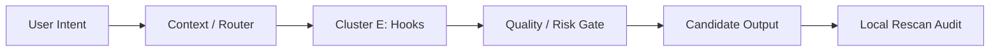

# Cluster E: Hooks

## Scope

Hooks 是自动化风险最高的层之一。PreToolUse 和 PostToolUse 可以保护路径，也可能造成 cascade cancel；SessionStart/End 可以改善 continuity，也可能把临时事实错误地固化。hook 索引必须用事件名、输入、输出、副作用和禁用条件来描述。 本索引只描述目录和治理建议，不激活任何能力，不修改任何 settings，不把 prompt 中的 expected path 当成已经存在的本地事实。所有条目都需要在真实机器上经过 local rescan 后再升级状态。

## Entry Table

| entry_id | kind | activation | risk | file |
|---|---|---|---|---|
| hook-pretooluse | hook | hook/auto | high | `05_CLUSTER_E_HOOKS/01-hook-pretooluse.md` |
| hook-posttooluse | hook | hook/auto | high | `05_CLUSTER_E_HOOKS/02-hook-posttooluse.md` |
| hook-stop | hook | hook/auto | medium | `05_CLUSTER_E_HOOKS/03-hook-stop.md` |
| hook-sessionstart | hook | hook/auto | medium | `05_CLUSTER_E_HOOKS/04-hook-sessionstart.md` |
| hook-sessionend | hook | hook/auto | medium | `05_CLUSTER_E_HOOKS/05-hook-sessionend.md` |
| hook-precompact | hook | hook/auto | medium | `05_CLUSTER_E_HOOKS/06-hook-precompact.md` |
| hook-userpromptsubmit | hook | hook/auto | medium | `05_CLUSTER_E_HOOKS/07-hook-userpromptsubmit.md` |
| hook-notification | hook | hook/auto | low | `05_CLUSTER_E_HOOKS/08-hook-notification.md` |
| hook-subagentstop | hook | hook/auto | medium | `05_CLUSTER_E_HOOKS/09-hook-subagentstop.md` |
| hook-prefilewritegate | hook | hook/auto | high | `05_CLUSTER_E_HOOKS/10-hook-prefilewritegate.md` |

## Governance Summary

本 cluster 的核心治理问题是“边界压缩”：只保留足够完成任务的最窄入口，把高风险操作留给显式授权，把重复入口合并到 owner entry。若用户发出模糊请求，应优先通过 routing/context/source-verifier 明确事实范围，再调用本 cluster 中的具体条目。若一个条目同时属于文档、执行、记忆、浏览器或数据库多个层面，应拆为 entry 与 workflow 两层，不应把所有职责塞进一个超级工具。

## Risk Hotspots

高/中风险条目数量：9。这些条目在迁移到真实目录时，需要额外检查：事件自动触发、settings 注册、插件版本、外部服务权限、文件写入范围、并行 writer、以及是否可能把 candidate 误写成 authority。对于 GUI、database、browser、repo 写入类入口，需要保留最小参数、截图或日志证据、以及明确的回滚说明。

## Redundancy Candidates

本 cluster 与其他 cluster 可能有重叠。例如 Global Skill 与 Agent 可能同名；Plugin 可能包装同名 command；MCP server 可能提供和 script 相似的数据读取能力。初步处理原则是：skill 管“如何做”、agent 管“谁做”、MCP 管“访问什么外部状态”、hook 管“何时自动触发”、script 管“可重复命令”、workflow 管“多工具如何协同”。按这个原则可以显著降低 tool sprawl。

## Upgrade Path

升级时先验证 source path，再读取 frontmatter 或 manifest，最后写回 catalog。不要直接按本包的 expected path 改 settings；本包只是候选目录。升级版应能回答四个问题：这个入口真实存在吗？它何时触发？它会读取或写入什么？它和哪个 entry 冲突或互补？只有四个问题都有证据，才把 `verification_status` 改成 `verified-local-path`。

## Mermaid Mini-map

