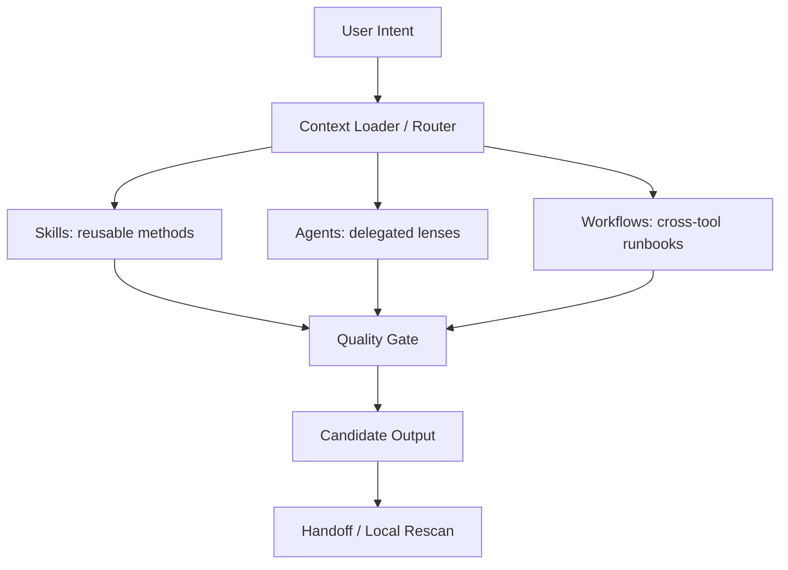
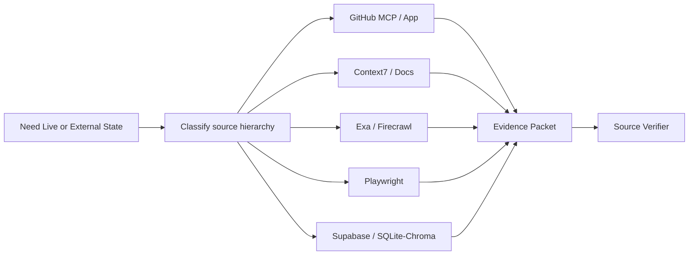
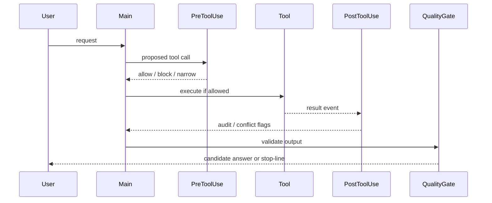
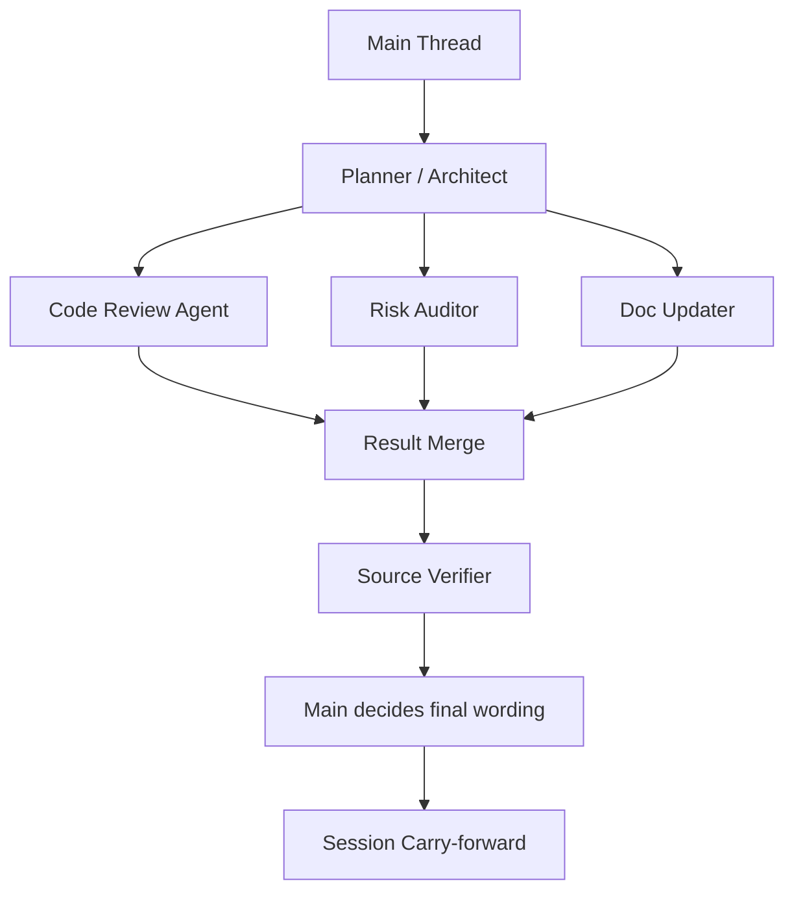
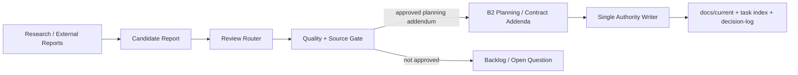

# Cross Tool Collaboration Graph

本图谱把 U12 catalog 的八个 cluster 放到同一协作面上。核心思想：用户意图先进入 context/routing；事实声明进入 source verification；具体任务进入 skill/agent/MCP/script；自动事件由 hook 保护；最终由 quality gate、handoff 和 authority discipline 收束。任何路径都不应该绕过 evidence 与 stop-line。

## Diagram 1 — Capability Layer Map

## Diagram 2 — External State Access

## Diagram 3 — Hook Risk Flow

## Diagram 4 — Agent Delegation and Recovery

## Diagram 5 — ScoutFlow/RAW Authority Boundary

## Interpretation

这五张图共同说明：U12 catalog 不是“工具越多越好”的清单，而是一个压制混乱的控制平面。Skills 和 agents 解决“如何做”和“谁做”；MCP/plugin 解决“访问什么外部状态”；hook/script 解决“何时自动保护”和“如何重复执行”；workflow 解决“如何把多工具串成可审计动作”。当任一节点产生候选结果，必须回到 source verifier 与 quality gate，而不是直接写 authority。

## Conflict Signals in the Graph

冲突信号包括：同一 intent 同时命中 skill 与 agent；PostToolUse 在主线程准备 single Write 后又追加行为；plugin cache 暴露的 command 与全局 skill 同名；MCP server 和 filesystem/script 都能读同一敏感路径；session memory hook 把临时判断写成长记忆；GUI bridge 在 file/API route 可用时仍强行走浏览器。解决办法是 owner-first：给每个 intent 指定默认 owner，其他入口只作为 secondary lens。
