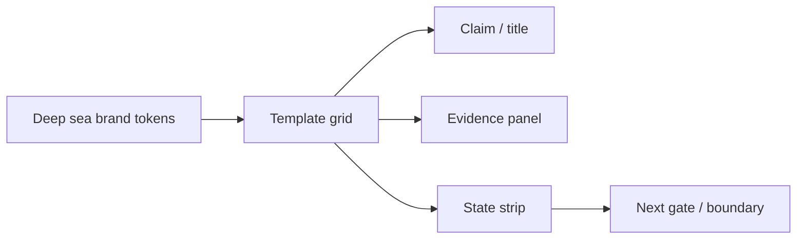

# TEMPLATE-05 PPT Summary / Closeout

## Template mission

`PPT Summary / Closeout` is a multi-medium brand surface for ScoutFlow. It must feel like the same evidence workstation whether exported as a slide, poster, social card or H5 view.

| Field | Value |
|---|---|
| template_id | `ppt-summary` |
| canvas / size | 16:9 1920x1080 |
| primary slots | verdict strip, risks, next gates |
| linked_visual_asset | `U4:ppt-summary` pending external refresh |
| linked_state | `ready / candidate / future_gate / blocked` |
| license | ScoutFlow-original layout spec; no third-party template copied |

## Grid and safe zones

| Medium | Safe zone | Notes |
|---|---|---|
| PPT 16:9 | 96px outer / 48px inner | speaker content must not collide with footer evidence |
| Poster | 8-12% outer margin | title and state strip visible from distance |
| Social 1:1 | 96px crop-safe center | platform crop must not remove verdict or state |
| Social 9:16 | 120px top/bottom caution | mobile UI overlays can obscure bottom |
| H5 | browser safe area + keyboard | URL/action/current state must remain accessible |

## Token recipe

- Background: `sf.canvas.0` with one low-opacity pattern.
- Evidence cards: `sf.panel.bg` + `sf.border.panel` + 16/24px padding.
- Accent: `sf.accent.cyan` only on one primary path/action.
- Status: `sf.success`, `sf.warning`, `sf.error` always paired with visible text.
- Type: title <= 28px in app/H5; poster/PPT may scale but maintain same hierarchy.

## Good / bad examples

Good: template carries current state, evidence source, phase label, and next gate. Bad: template becomes generic SaaS marketing, hides blocked lanes, or replaces proof chain with decorative metrics.

## Export notes

- PPT: avoid auto-resized text that collapses Chinese line-height.
- Poster: no tiny URL/ID text below practical reading size; use state summary if detail is too dense.
- Social: keep one claim per card; use `candidate` or `not-authority` label visibly.
- H5: keep canonical panel order; no new package assumptions.

## Mermaid slot map

## Boundary / 边界声明

- `status`: candidate；`authority`: not-authority；本文件不是 CSS token 合并、frontend implementation、package install、browser automation、runtime、vault true write、migration 或 authority writeback 批准。
- 可被 PF-V / GPT-Image-2 / future dispatch 作为视觉 atlas 输入；不可把本文内任何 token、SVG、layout 或 template 直接解释成 production contract。
- 所有主观 5-Gate 判断保持 human-in-loop；自动化只能提供截图、contrast、DOM 或 manifest evidence，不能替代最终视觉判断。
- 第三方库仅作为参考类别；本 atlas 内联 SVG 均按 ScoutFlow-original candidate 处理，未复制第三方 path。若未来改用第三方 icon/illustration，必须重新验证 license。

### TEMPLATE-05 PPT Summary / Closeout — audit expansion 1

### Review discipline / 审查纪律

1. 先判断 L1 information architecture：URL Bar → Live Metadata → Capture Scope → Trust Trace 的扫描顺序不可被模板、装饰图、sidebar 或 KPI 区域改写。
2. 再判断 L2 structure：panel、row、badge、detail shelf、graph node、template slot 必须共享 8dp rhythm 与同一套语义 token，不允许在局部硬编码新的蓝色、阴影或圆角。
3. 最后判断 L3 mood：深海蓝、低眩光、operator workstation、evidence-first、single-user dense surface；强视觉不是荧光科技感，也不是营销 hero 图。
4. 对任何 `blocked` / `future_gate` / `candidate` lane，必须有文字、badge、位置与视觉权重共同表达；颜色不能成为唯一信号。
5. 任何截图、render pass、contrast pass 都只能作为 evidence；若 Gate 1-5 任一失败，最终 verdict 必须是 `visual_not_passed`。

本节适用于 `TEMPLATE-05 PPT Summary / Closeout`：审查者应记录 source label、state word、token reference、layout slot、failure class、defer condition 与 human reviewer note。若证据缺失，写 `needs_evidence`，不得写 `passed by assumption`。

### TEMPLATE-05 PPT Summary / Closeout — audit expansion 2

### 5-Gate alignment / 五门对齐

| Gate | Local acceptance | Failure signal |
|---|---|---|
| Gate 1 hierarchy | 主动作或主证据 3 秒内可识别 | 装饰、图表、future lane 抢第一注意点 |
| Gate 2 spacing/alignment | 8dp grid、共同 baseline、稳定 panel padding | row、badge、图节点漂移，导致扫描断裂 |
| Gate 3 occlusion | tooltip/toast/legend 不遮 URL/current state/node label | overlay 遮住可操作或可审计信息 |
| Gate 4 typography/readability | 中英混排、URL、ID、timestamp 可读 | 小字、低对比、截断造成状态误判 |
| Gate 5 visual weight | active/current/proven 高于 blocked/candidate/future | danger 或 decorative glow 反向支配界面 |

本节适用于 `TEMPLATE-05 PPT Summary / Closeout`：审查者应记录 source label、state word、token reference、layout slot、failure class、defer condition 与 human reviewer note。若证据缺失，写 `needs_evidence`，不得写 `passed by assumption`。

### TEMPLATE-05 PPT Summary / Closeout — audit expansion 3

### Implementation seam / 实现缝合位

推荐未来实现路径为 CSS Variables + CSS Modules + container queries。`tokens.ts` 只可作为 typed mirror；Style Dictionary、Tokens Studio、Tailwind、Panda、shadcn、React Flow、Lucide、Radix、TanStack 或 React 版本升级都不得从本文件自动推出。若某个 dispatch 需要这些 package，应在独立 package gate 中提出，不在 visual atlas 中夹带批准。

本节适用于 `TEMPLATE-05 PPT Summary / Closeout`：审查者应记录 source label、state word、token reference、layout slot、failure class、defer condition 与 human reviewer note。若证据缺失，写 `needs_evidence`，不得写 `passed by assumption`。

### TEMPLATE-05 PPT Summary / Closeout — audit expansion 4

### Linked-state grammar / 状态语法

每个视觉对象至少绑定一个 state word：`idle`、`editing`、`requested`、`settling`、`ready`、`allowed`、`candidate`、`future_gate`、`blocked`、`stale`、`probe_failed`、`preview_only`。状态应同时体现在文案、badge、border/fill、position/order 与可访问名称中。`audio_transcript`、media processing、browser automation、migration、vault true write 仍必须以 blocked/future-gated 方式出现，不得藏进 tooltip。

本节适用于 `TEMPLATE-05 PPT Summary / Closeout`：审查者应记录 source label、state word、token reference、layout slot、failure class、defer condition 与 human reviewer note。若证据缺失，写 `needs_evidence`，不得写 `passed by assumption`。

### TEMPLATE-05 PPT Summary / Closeout — audit expansion 5

### Review discipline / 审查纪律

1. 先判断 L1 information architecture：URL Bar → Live Metadata → Capture Scope → Trust Trace 的扫描顺序不可被模板、装饰图、sidebar 或 KPI 区域改写。
2. 再判断 L2 structure：panel、row、badge、detail shelf、graph node、template slot 必须共享 8dp rhythm 与同一套语义 token，不允许在局部硬编码新的蓝色、阴影或圆角。
3. 最后判断 L3 mood：深海蓝、低眩光、operator workstation、evidence-first、single-user dense surface；强视觉不是荧光科技感，也不是营销 hero 图。
4. 对任何 `blocked` / `future_gate` / `candidate` lane，必须有文字、badge、位置与视觉权重共同表达；颜色不能成为唯一信号。
5. 任何截图、render pass、contrast pass 都只能作为 evidence；若 Gate 1-5 任一失败，最终 verdict 必须是 `visual_not_passed`。

本节适用于 `TEMPLATE-05 PPT Summary / Closeout`：审查者应记录 source label、state word、token reference、layout slot、failure class、defer condition 与 human reviewer note。若证据缺失，写 `needs_evidence`，不得写 `passed by assumption`。

### TEMPLATE-05 PPT Summary / Closeout — audit expansion 6

### 5-Gate alignment / 五门对齐

| Gate | Local acceptance | Failure signal |
|---|---|---|
| Gate 1 hierarchy | 主动作或主证据 3 秒内可识别 | 装饰、图表、future lane 抢第一注意点 |
| Gate 2 spacing/alignment | 8dp grid、共同 baseline、稳定 panel padding | row、badge、图节点漂移，导致扫描断裂 |
| Gate 3 occlusion | tooltip/toast/legend 不遮 URL/current state/node label | overlay 遮住可操作或可审计信息 |
| Gate 4 typography/readability | 中英混排、URL、ID、timestamp 可读 | 小字、低对比、截断造成状态误判 |
| Gate 5 visual weight | active/current/proven 高于 blocked/candidate/future | danger 或 decorative glow 反向支配界面 |

本节适用于 `TEMPLATE-05 PPT Summary / Closeout`：审查者应记录 source label、state word、token reference、layout slot、failure class、defer condition 与 human reviewer note。若证据缺失，写 `needs_evidence`，不得写 `passed by assumption`。

### TEMPLATE-05 PPT Summary / Closeout — audit expansion 7

### Implementation seam / 实现缝合位

推荐未来实现路径为 CSS Variables + CSS Modules + container queries。`tokens.ts` 只可作为 typed mirror；Style Dictionary、Tokens Studio、Tailwind、Panda、shadcn、React Flow、Lucide、Radix、TanStack 或 React 版本升级都不得从本文件自动推出。若某个 dispatch 需要这些 package，应在独立 package gate 中提出，不在 visual atlas 中夹带批准。

本节适用于 `TEMPLATE-05 PPT Summary / Closeout`：审查者应记录 source label、state word、token reference、layout slot、failure class、defer condition 与 human reviewer note。若证据缺失，写 `needs_evidence`，不得写 `passed by assumption`。

### TEMPLATE-05 PPT Summary / Closeout — audit expansion 8

### Linked-state grammar / 状态语法

每个视觉对象至少绑定一个 state word：`idle`、`editing`、`requested`、`settling`、`ready`、`allowed`、`candidate`、`future_gate`、`blocked`、`stale`、`probe_failed`、`preview_only`。状态应同时体现在文案、badge、border/fill、position/order 与可访问名称中。`audio_transcript`、media processing、browser automation、migration、vault true write 仍必须以 blocked/future-gated 方式出现，不得藏进 tooltip。

本节适用于 `TEMPLATE-05 PPT Summary / Closeout`：审查者应记录 source label、state word、token reference、layout slot、failure class、defer condition 与 human reviewer note。若证据缺失，写 `needs_evidence`，不得写 `passed by assumption`。

### TEMPLATE-05 PPT Summary / Closeout — audit expansion 9

### Review discipline / 审查纪律

1. 先判断 L1 information architecture：URL Bar → Live Metadata → Capture Scope → Trust Trace 的扫描顺序不可被模板、装饰图、sidebar 或 KPI 区域改写。
2. 再判断 L2 structure：panel、row、badge、detail shelf、graph node、template slot 必须共享 8dp rhythm 与同一套语义 token，不允许在局部硬编码新的蓝色、阴影或圆角。
3. 最后判断 L3 mood：深海蓝、低眩光、operator workstation、evidence-first、single-user dense surface；强视觉不是荧光科技感，也不是营销 hero 图。
4. 对任何 `blocked` / `future_gate` / `candidate` lane，必须有文字、badge、位置与视觉权重共同表达；颜色不能成为唯一信号。
5. 任何截图、render pass、contrast pass 都只能作为 evidence；若 Gate 1-5 任一失败，最终 verdict 必须是 `visual_not_passed`。

本节适用于 `TEMPLATE-05 PPT Summary / Closeout`：审查者应记录 source label、state word、token reference、layout slot、failure class、defer condition 与 human reviewer note。若证据缺失，写 `needs_evidence`，不得写 `passed by assumption`。
