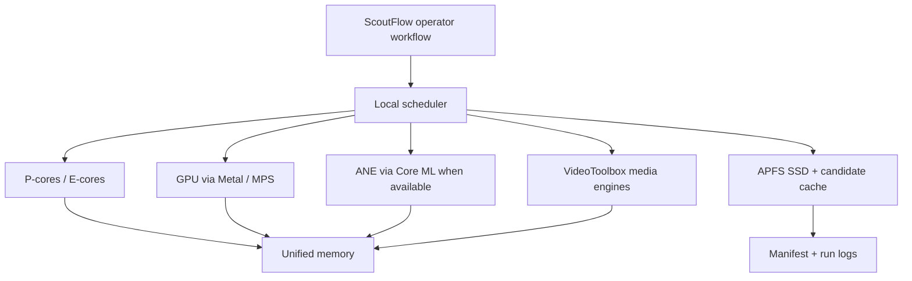

# MASTER OPTIMIZATION ATLAS

## Claim label legend

This pack uses explicit claim labels because U14 is a candidate research artifact, not production authority.

- `[prompt-provided]` means the item comes from the uploaded U14 prompt or from the uploaded post176 pack inspected in this session.
- `[post176-evidence]` means the note is derived from the local post176 zip contents; the repeated boundary there says ASR, FFmpeg, browser automation, `audio_transcript`, runtime unlock, and vault true write were not proved or approved.
- `[baseline-knowledge]` means stable general engineering knowledge available before the cutoff, such as Apple Silicon unified memory, Metal, MPS, Core ML, VideoToolbox, FFmpeg, PyTorch MPS, MLX, llama.cpp, Ollama, SQLite, and local media processing concepts.
- `[recipe-spec]` means a recommended configuration, benchmark protocol, fallback ladder, or integration shape that still needs local proof.
- `[requires-local-verification]` means the statement must be checked on the user's Mac with `system_profiler`, `sysctl`, `powermetrics`, package introspection, model hashes, and paste-time benchmark logs.
- `[not-web-verified-2026]` means the named framework, model, version, or vendor status would normally require live browsing. Live web was unavailable here, so no current vendor claim is asserted.
- `[privacy-boundary]` means raw materials stay local by default; cloud API replacement is explicitly not approved by this pack.

## Boundary preservation

`candidate / not-authority` is intentional. This file does not install software, does not load LaunchAgents, does not modify macOS settings, does not run ASR, does not transcode media, does not inspect private model directories, does not approve vault true writes, and does not present benchmark numbers as self-run evidence. Any command is a future local run specification only. A future operator must paste evidence before promotion.

## Executive atlas

[prompt-provided] The U14 mission is to turn Apple Silicon local horsepower into a ScoutFlow productivity advantage across ASR, embedding/retrieval, LLM inference, image post-processing, video/audio preprocessing, system integration, resource management, and profiling. The atlas provides the cross-cluster map.

## Hardware topology

## Recipe inventory

| Recipe | Cluster | File | Framework | Model |
|---|---|---|---|---|
| A01 | A_ASR | [Whisper.cpp Metal baseline for local ASR intake](../01_cluster_A_asr/A01-whisper-cpp-metal-baseline-for-local-asr-intake.md) | whisper.cpp + Metal | Whisper family GGML/GGUF local models |
| A02 | A_ASR | [Whisper.cpp quantization and thread tuning](../01_cluster_A_asr/A02-whisper-cpp-quantization-and-thread-tuning.md) | whisper.cpp + Metal + Accelerate | Whisper quantized local variants |
| A03 | A_ASR | [faster-whisper CTranslate2 Apple Silicon evaluation](../01_cluster_A_asr/A03-faster-whisper-ctranslate2-apple-silicon-evaluation.md) | faster-whisper / CTranslate2 | Whisper converted model |
| A04 | A_ASR | [Whisper-MPS fork evaluation lane](../01_cluster_A_asr/A04-whisper-mps-fork-evaluation-lane.md) | Whisper-MPS / PyTorch MPS | Whisper PyTorch checkpoint |
| A05 | A_ASR | [Parakeet TDT 0.6B Apple Silicon ASR candidate](../01_cluster_A_asr/A05-parakeet-tdt-0-6b-apple-silicon-asr-candidate.md) | Parakeet local wrapper | Parakeet TDT 0.6B |
| A06 | A_ASR | [Voxtral Mini audio-language candidate](../01_cluster_A_asr/A06-voxtral-mini-audio-language-candidate.md) | Voxtral local audio LLM wrapper | Voxtral Mini |
| A07 | A_ASR | [Real-time transcription with streaming chunks and backpressure](../01_cluster_A_asr/A07-real-time-transcription-with-streaming-chunks-and-backpressure.md) | whisper.cpp streaming controller | Whisper small/base local models |
| A08 | A_ASR | [Hallucination detection and recovery for transcripts](../01_cluster_A_asr/A08-hallucination-detection-and-recovery-for-transcripts.md) | ASR quality guard | Whisper plus local text/audio checks |
| A09 | A_ASR | [Speaker diarization and multilingual code-switch policy](../01_cluster_A_asr/A09-speaker-diarization-and-multilingual-code-switch-policy.md) | pyannote-style diarization + language router | speaker diarization model plus multilingual ASR |
| A10 | A_ASR | [VAD preprocessing with Silero MPS candidate](../01_cluster_A_asr/A10-vad-preprocessing-with-silero-mps-candidate.md) | Silero VAD / PyTorch MPS watchlist | Silero VAD model |
| B01 | B_EMBEDDING_RETRIEVAL | [sentence-transformers MPS embedding triage](../02_cluster_B_embedding_retrieval/B01-sentence-transformers-mps-embedding-triage.md) | sentence-transformers + PyTorch MPS | bge-m3 / nomic / mxbai candidates |
| B02 | B_EMBEDDING_RETRIEVAL | [sqlite-vec and sqlite-vss local index policy](../02_cluster_B_embedding_retrieval/B02-sqlite-vec-and-sqlite-vss-local-index-policy.md) | SQLite vector extensions | sqlite-vec / sqlite-vss |
| B03 | B_EMBEDDING_RETRIEVAL | [LanceDB Apple Silicon visual-DAM sidecar](../02_cluster_B_embedding_retrieval/B03-lancedb-apple-silicon-visual-dam-sidecar.md) | LanceDB local | text and multimodal embedding rows |
| B04 | B_EMBEDDING_RETRIEVAL | [DuckDB vector and analytic retrieval sidecar](../02_cluster_B_embedding_retrieval/B04-duckdb-vector-and-analytic-retrieval-sidecar.md) | DuckDB + vector extension watchlist | dense vectors plus metadata tables |
| B05 | B_EMBEDDING_RETRIEVAL | [Ollama local embedding API for privacy-first retrieval](../02_cluster_B_embedding_retrieval/B05-ollama-local-embedding-api-for-privacy-first-retrieval.md) | Ollama local API | local embedding models |
| B06 | B_EMBEDDING_RETRIEVAL | [Apple Foundation Models embedding watchlist](../02_cluster_B_embedding_retrieval/B06-apple-foundation-models-embedding-watchlist.md) | Apple Foundation Models Swift API watchlist | system embedding model if available |
| B07 | B_EMBEDDING_RETRIEVAL | [Hybrid BM25 plus dense reranking pipeline](../02_cluster_B_embedding_retrieval/B07-hybrid-bm25-plus-dense-reranking-pipeline.md) | SQLite FTS5 + dense vectors + local reranker | BM25 plus embedding model plus reranker |
| B08 | B_EMBEDDING_RETRIEVAL | [Incremental index and full rebuild strategy](../02_cluster_B_embedding_retrieval/B08-incremental-index-and-full-rebuild-strategy.md) | index coordinator | embedding/index models |
| C01 | C_LLM_INFERENCE | [llama.cpp Metal model matrix for local reasoning](../03_cluster_C_llm_inference/C01-llama-cpp-metal-model-matrix-for-local-reasoning.md) | llama.cpp + Metal | Llama / Qwen / DeepSeek / Phi GGUF candidates |
| C02 | C_LLM_INFERENCE | [Ollama Apple Silicon local serve policy](../03_cluster_C_llm_inference/C02-ollama-apple-silicon-local-serve-policy.md) | Ollama | local chat and embedding models |
| C03 | C_LLM_INFERENCE | [mlx-lm inference for Apple-native experiments](../03_cluster_C_llm_inference/C03-mlx-lm-inference-for-apple-native-experiments.md) | MLX / mlx-lm | MLX-compatible local LLM |
| C04 | C_LLM_INFERENCE | [Apple Foundation Models Swift integration watchlist](../03_cluster_C_llm_inference/C04-apple-foundation-models-swift-integration-watchlist.md) | Apple Foundation Models Swift API watchlist | system local language model if available |
| C05 | C_LLM_INFERENCE | [Multi-model concurrent local serving](../03_cluster_C_llm_inference/C05-multi-model-concurrent-local-serving.md) | Ollama / llama.cpp servers / scheduler | small plus large local models |
| C06 | C_LLM_INFERENCE | [Quantization tradeoff policy Q4/Q5/Q8](../03_cluster_C_llm_inference/C06-quantization-tradeoff-policy-q4-q5-q8.md) | llama.cpp GGUF quantization | Q4_K_M / Q5_K_M / Q8_0 candidates |
| C07 | C_LLM_INFERENCE | [Context window optimization and chunk packing](../03_cluster_C_llm_inference/C07-context-window-optimization-and-chunk-packing.md) | local LLM prompt builder | local chat model |
| C08 | C_LLM_INFERENCE | [Prompt and KV cache policy for repeated local tasks](../03_cluster_C_llm_inference/C08-prompt-and-kv-cache-policy-for-repeated-local-tasks.md) | llama.cpp / Ollama cache behavior | local LLM with cache support |
| C09 | C_LLM_INFERENCE | [Streaming output and token throughput UX](../03_cluster_C_llm_inference/C09-streaming-output-and-token-throughput-ux.md) | local LLM streaming API | Ollama/llama.cpp compatible models |
| C10 | C_LLM_INFERENCE | [Local LLM-as-a-judge benchmark harness](../03_cluster_C_llm_inference/C10-local-llm-as-a-judge-benchmark-harness.md) | local judge model + rubric | small local judge plus reference set |
| D01 | D_IMAGE_VISUAL | [Pillow Sharp OpenCV Apple Silicon image baseline](../04_cluster_D_image_visual/D01-pillow-sharp-opencv-apple-silicon-image-baseline.md) | Pillow / Sharp / OpenCV | native image operations |
| D02 | D_IMAGE_VISUAL | [Vision framework face and text detection adapter](../04_cluster_D_image_visual/D02-vision-framework-face-and-text-detection-adapter.md) | Apple Vision framework / Swift | Vision OCR and face detectors |
| D03 | D_IMAGE_VISUAL | [Core ML conversion and inference recipe](../04_cluster_D_image_visual/D03-core-ml-conversion-and-inference-recipe.md) | Core ML / coremltools | converted vision or classifier model |
| D04 | D_IMAGE_VISUAL | [GPT-Image-2 post-processing crop dedup thumbnail pipeline](../04_cluster_D_image_visual/D04-gpt-image-2-post-processing-crop-dedup-thumbnail-pipeline.md) | ImageIO / Sharp / pHash / manifest | generated image outputs |
| D05 | D_IMAGE_VISUAL | [Perceptual hash batch deduplication](../04_cluster_D_image_visual/D05-perceptual-hash-batch-deduplication.md) | pHash / imagehash / OpenCV | visual duplicate detector |
| D06 | D_IMAGE_VISUAL | [Stable Diffusion local MLX candidate](../04_cluster_D_image_visual/D06-stable-diffusion-local-mlx-candidate.md) | MLX stable diffusion / local image generation | MLX-compatible diffusion model |
| D07 | D_IMAGE_VISUAL | [Background removal with MPS candidate](../04_cluster_D_image_visual/D07-background-removal-with-mps-candidate.md) | rembg / PyTorch MPS / Core ML alternative | segmentation/background removal model |
| D08 | D_IMAGE_VISUAL | [8K image handling and memory pressure policy](../04_cluster_D_image_visual/D08-8k-image-handling-and-memory-pressure-policy.md) | ImageIO / libvips / tiled processing | large image pipeline |
| E01 | E_VIDEO_AUDIO | [FFmpeg VideoToolbox hardware acceleration baseline](../05_cluster_E_video_audio/E01-ffmpeg-videotoolbox-hardware-acceleration-baseline.md) | FFmpeg + VideoToolbox | h264/hevc videotoolbox codecs |
| E02 | E_VIDEO_AUDIO | [VideoToolbox Swift encoder decoder probe](../05_cluster_E_video_audio/E02-videotoolbox-swift-encoder-decoder-probe.md) | VideoToolbox / AVFoundation Swift | native media pipeline |
| E03 | E_VIDEO_AUDIO | [Audio extraction 44.1k to 16k mono for ASR](../05_cluster_E_video_audio/E03-audio-extraction-44-1k-to-16k-mono-for-asr.md) | FFmpeg / afconvert | ASR-ready WAV |
| E04 | E_VIDEO_AUDIO | [Subtitle render and transcript sidecar generation](../05_cluster_E_video_audio/E04-subtitle-render-and-transcript-sidecar-generation.md) | FFmpeg / subtitle tools | SRT/VTT/ASS sidecars |
| E05 | E_VIDEO_AUDIO | [Frame extraction for visual-DAM and OCR](../05_cluster_E_video_audio/E05-frame-extraction-for-visual-dam-and-ocr.md) | FFmpeg / VideoToolbox decode / ImageIO | video frames |
| E06 | E_VIDEO_AUDIO | [Container conversion and stream-copy policy](../05_cluster_E_video_audio/E06-container-conversion-and-stream-copy-policy.md) | FFmpeg / AVFoundation | media containers |
| F01 | F_SYSTEM_INTEGRATION | [LaunchAgent spec for local candidate workers](../06_cluster_F_system_integration/F01-launchagent-spec-for-local-candidate-workers.md) | launchd / LaunchAgent spec only | ScoutFlow local worker |
| F02 | F_SYSTEM_INTEGRATION | [Spotlight and mdimporter integration watchlist](../06_cluster_F_system_integration/F02-spotlight-and-mdimporter-integration-watchlist.md) | Spotlight / mdimporter | metadata importer |
| F03 | F_SYSTEM_INTEGRATION | [xattr metadata policy for local assets](../06_cluster_F_system_integration/F03-xattr-metadata-policy-for-local-assets.md) | xattr / Finder metadata | asset metadata tags |
| F04 | F_SYSTEM_INTEGRATION | [Activity Monitor and powermetrics capture protocol](../06_cluster_F_system_integration/F04-activity-monitor-and-powermetrics-capture-protocol.md) | Activity Monitor / powermetrics | system telemetry |
| F05 | F_SYSTEM_INTEGRATION | [Energy budget mode management](../06_cluster_F_system_integration/F05-energy-budget-mode-management.md) | macOS power observation / scheduler policy | safe balanced max modes |
| F06 | F_SYSTEM_INTEGRATION | [Thermal throttle detection and downgrade](../06_cluster_F_system_integration/F06-thermal-throttle-detection-and-downgrade.md) | powermetrics / scheduler guard | thermal state policy |
| F07 | F_SYSTEM_INTEGRATION | [Memory pressure detection and queue admission](../06_cluster_F_system_integration/F07-memory-pressure-detection-and-queue-admission.md) | memory_pressure / vm_stat / scheduler | unified memory guard |
| F08 | F_SYSTEM_INTEGRATION | [Background task assertion and sleep policy](../06_cluster_F_system_integration/F08-background-task-assertion-and-sleep-policy.md) | caffeinate / NSProcessInfo watchlist | long-running local jobs |
| G01 | G_RESOURCE_MANAGEMENT | [Unified Memory budget for mixed local AI workloads](../07_cluster_G_resource_management/G01-unified-memory-budget-for-mixed-local-ai-workloads.md) | scheduler / memory budget | ASR + LLM + embedding + image models |
| G02 | G_RESOURCE_MANAGEMENT | [GPU and ANE scheduling policy](../07_cluster_G_resource_management/G02-gpu-and-ane-scheduling-policy.md) | Metal / MPS / Core ML / ANE watchlist | accelerator-capable tasks |
| G03 | G_RESOURCE_MANAGEMENT | [Process priority and niceness policy](../07_cluster_G_resource_management/G03-process-priority-and-niceness-policy.md) | nice / renice / launchd hints | local workers |
| G04 | G_RESOURCE_MANAGEMENT | [I/O throttle and cache-aware batching](../07_cluster_G_resource_management/G04-i-o-throttle-and-cache-aware-batching.md) | filesystem scheduler policy | APFS local SSD workload |
| G05 | G_RESOURCE_MANAGEMENT | [APFS disk cache and derived artifact policy](../07_cluster_G_resource_management/G05-apfs-disk-cache-and-derived-artifact-policy.md) | APFS / cache manager | candidate cache |
| G06 | G_RESOURCE_MANAGEMENT | [Battery versus A/C execution policy](../07_cluster_G_resource_management/G06-battery-versus-a-c-execution-policy.md) | power-source scheduler | job mode matrix |
| H01 | H_BENCHMARKING_PROFILING | [Unified benchmark harness manifest](../08_cluster_H_benchmarking_profiling/H01-unified-benchmark-harness-manifest.md) | Python/CLI benchmark harness | all local workloads |
| H02 | H_BENCHMARKING_PROFILING | [ASR benchmark corpus and scoring protocol](../08_cluster_H_benchmarking_profiling/H02-asr-benchmark-corpus-and-scoring-protocol.md) | ASR benchmark harness | Whisper / Parakeet / Voxtral candidates |
| H03 | H_BENCHMARKING_PROFILING | [Embedding retrieval benchmark protocol](../08_cluster_H_benchmarking_profiling/H03-embedding-retrieval-benchmark-protocol.md) | retrieval benchmark harness | embedding and BM25 candidates |
| H04 | H_BENCHMARKING_PROFILING | [LLM benchmark prompt suite](../08_cluster_H_benchmarking_profiling/H04-llm-benchmark-prompt-suite.md) | local LLM benchmark harness | llama.cpp / Ollama / MLX candidates |
| H05 | H_BENCHMARKING_PROFILING | [Image pipeline benchmark manifest](../08_cluster_H_benchmarking_profiling/H05-image-pipeline-benchmark-manifest.md) | image benchmark harness | crop / dedup / thumbnail / OCR |
| H06 | H_BENCHMARKING_PROFILING | [Video audio profiling bundle and regression dashboard](../08_cluster_H_benchmarking_profiling/H06-video-audio-profiling-bundle-and-regression-dashboard.md) | FFmpeg benchmark + profile bundle + dashboard | VideoToolbox / FFmpeg / system telemetry |

## Cross-cluster dispatch model

[recipe-spec] The operator should route work through three gates. The first gate is privacy and source preservation: raw material must be classified, hashed, and left immutable. The second gate is resource admission: the scheduler checks power source, memory pressure, thermal state, and current heavy jobs. The third gate is quality: transcripts, embeddings, summaries, thumbnails, and media derivatives must pass schema and review checks before they feed vault or DAM lanes.

[recipe-spec] ASR feeds retrieval through transcript chunks, speaker turns, language tags, and timestamped segments. Image and video feed visual-DAM through thumbnails, pHash clusters, OCR regions, frame manifests, and captions. LLM inference sits behind retrieval and review rather than in front of raw evidence. System integration and resource management surround all clusters as safety controls.

## Optimization principles

- Local-first is the default privacy posture.
- Small reliable hot paths beat oversized impressive demos.
- Benchmark contracts are not benchmark results.
- Model and package versions must be captured before comparison.
- Unified memory budget matters more than isolated accelerator marketing.
- Fallback ladders are first-class product design.
- Derived artifacts must be rebuildable from raw sources.
- Runtime unlock is separate from candidate research.

## Maturity ladder

[recipe-spec] Level zero is idea only. Level one is candidate recipe, which this pack provides. Level two is local dry run with no private data. Level three is local benchmark with fixtures and pasted evidence. Level four is private-data pilot with operator approval and rollback. Level five is production lane, which this pack does not grant. Recipes in this pack are level one only.

## Extended operating rationale — MASTER OPTIMIZATION ATLAS

**Rationale 1.** Use a fixed fixture set before scaling. For audio, include silence, music bed, cross talk, compressed platform audio, Chinese-English code switching, and long-form speech. For images, include screenshots, transparent PNG, huge JPEG, duplicate variants, and generated outputs. For video, include H.264, HEVC, variable frame rate, subtitles, and audio-only cases. The purpose is to reveal bottlenecks that matter to ScoutFlow, not to win a synthetic benchmark.

**Rationale 2.** Prefer local evidence over intuition. Apple Silicon performance can change when model size, quantization, context length, display load, package build flags, power source, and thermal state change. A fast demo is not enough. The run log should include command, input hash, model hash, version, power mode, memory pressure, thermal note, wall time, and fallback status.

**Rationale 3.** Keep the operator in control. In a one-person prosumer system, the fastest path is not always the best path. The better path often keeps the Mac responsive, preserves raw evidence, avoids silent mutation, and creates deterministic derived artifacts. A run that finishes earlier but loses timestamps, EXIF, model identity, or cache provenance should be considered a regression.

**Rationale 4.** Separate hot path and cold path. The hot path should use the smallest reliable model or transform for routing, triage, deduplication, or metadata extraction. The cold path can use a larger model only after chunking, VAD, BM25 filtering, pHash clustering, or reranking reduces the input set. This protects unified memory and keeps the UI usable.

**Rationale 5.** Design fallbacks before celebrating the fast path. Every recipe needs a smaller model fallback, a CPU-only or deterministic fallback, a deferred batch mode, and a dry-run metadata mode. Fallbacks are how the system survives missing frameworks, stale package versions, model license constraints, memory pressure, thermal throttling, and battery operation.

**Rationale 6.** Do not overfit to a single metric. Useful ScoutFlow metrics include throughput, quality, timestamp drift, retrieval success, memory peak, cache hit rate, downgrade frequency, queue latency, UI responsiveness, operator review time, and failure recoverability. A slightly slower configuration can be the better production candidate if it is more stable under mixed workloads.

**Rationale 7.** Treat 2026 framework status as a watchlist until verified. The prompt asks for current MLX, Core ML, Metal, MPS, ANE, Foundation Models, Whisper, Parakeet, Voxtral, Ollama, llama.cpp, and FFmpeg status. Live browsing was disabled, so this pack avoids claiming current releases or vendor benchmark results. It provides capture commands instead.

**Rationale 8.** Protect privacy by default. Local inference is preferred because raw ScoutFlow material may include unpublished ideas, private meetings, research prompts, screenshots, and DAM assets. Cloud endpoints may be useful for public experiments, but they are not approved as a replacement for private workflows in this U14 artifact.

**Rationale 9.** Emit boring structured artifacts. Each candidate run should produce JSONL or Markdown with recipe id, source hash, model identity, package version, command id, output schema version, timestamps, metrics, quality flags, and fallback flags. Structured logs make later vault writes, DAM indexing, retrieval debugging, and regression review possible.

**Rationale 10.** Preserve raw evidence. Optimization should never rewrite source audio, video, images, or notes in place. Derived transcripts, thumbnails, embeddings, crops, masks, frames, subtitles, and benchmark logs should live under a candidate cache with hash-linked paths. If a derivative is wrong, the system must be able to rebuild it without guessing settings.

**Rationale 11.** Use staged concurrency. Running ASR, embedding, local LLM inference, thumbnailing, OCR, and video transcode at once can overwhelm unified memory even on strong Apple Silicon hardware. Start with one heavy accelerator job plus one light coordinator, then increase concurrency only when memory pressure, thermals, and UI responsiveness remain stable.

**Rationale 12.** Define downgrade triggers. A recipe should name the signs that move a run from max-horsepower mode to balanced or safe mode: memory pressure yellow/red, swap growth, battery drain, thermal warnings, lower token throughput, repeated hallucination flags, timestamp gaps, or operator jank. Downgrades are a reliability feature, not a failure.

**Rationale 13.** Use a fixed fixture set before scaling. For audio, include silence, music bed, cross talk, compressed platform audio, Chinese-English code switching, and long-form speech. For images, include screenshots, transparent PNG, huge JPEG, duplicate variants, and generated outputs. For video, include H.264, HEVC, variable frame rate, subtitles, and audio-only cases. The purpose is to reveal bottlenecks that matter to ScoutFlow, not to win a synthetic benchmark.

**Rationale 14.** Prefer local evidence over intuition. Apple Silicon performance can change when model size, quantization, context length, display load, package build flags, power source, and thermal state change. A fast demo is not enough. The run log should include command, input hash, model hash, version, power mode, memory pressure, thermal note, wall time, and fallback status.

**Rationale 15.** Keep the operator in control. In a one-person prosumer system, the fastest path is not always the best path. The better path often keeps the Mac responsive, preserves raw evidence, avoids silent mutation, and creates deterministic derived artifacts. A run that finishes earlier but loses timestamps, EXIF, model identity, or cache provenance should be considered a regression.

**Rationale 16.** Separate hot path and cold path. The hot path should use the smallest reliable model or transform for routing, triage, deduplication, or metadata extraction. The cold path can use a larger model only after chunking, VAD, BM25 filtering, pHash clustering, or reranking reduces the input set. This protects unified memory and keeps the UI usable.

**Rationale 17.** Design fallbacks before celebrating the fast path. Every recipe needs a smaller model fallback, a CPU-only or deterministic fallback, a deferred batch mode, and a dry-run metadata mode. Fallbacks are how the system survives missing frameworks, stale package versions, model license constraints, memory pressure, thermal throttling, and battery operation.

**Rationale 18.** Do not overfit to a single metric. Useful ScoutFlow metrics include throughput, quality, timestamp drift, retrieval success, memory peak, cache hit rate, downgrade frequency, queue latency, UI responsiveness, operator review time, and failure recoverability. A slightly slower configuration can be the better production candidate if it is more stable under mixed workloads.

**Rationale 19.** Treat 2026 framework status as a watchlist until verified. The prompt asks for current MLX, Core ML, Metal, MPS, ANE, Foundation Models, Whisper, Parakeet, Voxtral, Ollama, llama.cpp, and FFmpeg status. Live browsing was disabled, so this pack avoids claiming current releases or vendor benchmark results. It provides capture commands instead.

**Rationale 20.** Protect privacy by default. Local inference is preferred because raw ScoutFlow material may include unpublished ideas, private meetings, research prompts, screenshots, and DAM assets. Cloud endpoints may be useful for public experiments, but they are not approved as a replacement for private workflows in this U14 artifact.

**Rationale 21.** Emit boring structured artifacts. Each candidate run should produce JSONL or Markdown with recipe id, source hash, model identity, package version, command id, output schema version, timestamps, metrics, quality flags, and fallback flags. Structured logs make later vault writes, DAM indexing, retrieval debugging, and regression review possible.

**Rationale 22.** Preserve raw evidence. Optimization should never rewrite source audio, video, images, or notes in place. Derived transcripts, thumbnails, embeddings, crops, masks, frames, subtitles, and benchmark logs should live under a candidate cache with hash-linked paths. If a derivative is wrong, the system must be able to rebuild it without guessing settings.

**Rationale 23.** Use staged concurrency. Running ASR, embedding, local LLM inference, thumbnailing, OCR, and video transcode at once can overwhelm unified memory even on strong Apple Silicon hardware. Start with one heavy accelerator job plus one light coordinator, then increase concurrency only when memory pressure, thermals, and UI responsiveness remain stable.

**Rationale 24.** Define downgrade triggers. A recipe should name the signs that move a run from max-horsepower mode to balanced or safe mode: memory pressure yellow/red, swap growth, battery drain, thermal warnings, lower token throughput, repeated hallucination flags, timestamp gaps, or operator jank. Downgrades are a reliability feature, not a failure.

