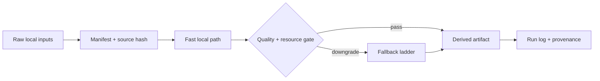

# Cluster B — Embedding & Retrieval Index

## Claim label legend

This pack uses explicit claim labels because U14 is a candidate research artifact, not production authority.

- `[prompt-provided]` means the item comes from the uploaded U14 prompt or from the uploaded post176 pack inspected in this session.
- `[post176-evidence]` means the note is derived from the local post176 zip contents; the repeated boundary there says ASR, FFmpeg, browser automation, `audio_transcript`, runtime unlock, and vault true write were not proved or approved.
- `[baseline-knowledge]` means stable general engineering knowledge available before the cutoff, such as Apple Silicon unified memory, Metal, MPS, Core ML, VideoToolbox, FFmpeg, PyTorch MPS, MLX, llama.cpp, Ollama, SQLite, and local media processing concepts.
- `[recipe-spec]` means a recommended configuration, benchmark protocol, fallback ladder, or integration shape that still needs local proof.
- `[requires-local-verification]` means the statement must be checked on the user's Mac with `system_profiler`, `sysctl`, `powermetrics`, package introspection, model hashes, and paste-time benchmark logs.
- `[not-web-verified-2026]` means the named framework, model, version, or vendor status would normally require live browsing. Live web was unavailable here, so no current vendor claim is asserted.
- `[privacy-boundary]` means raw materials stay local by default; cloud API replacement is explicitly not approved by this pack.

## Boundary preservation

`candidate / not-authority` is intentional. This file does not install software, does not load LaunchAgents, does not modify macOS settings, does not run ASR, does not transcode media, does not inspect private model directories, does not approve vault true writes, and does not present benchmark numbers as self-run evidence. Any command is a future local run specification only. A future operator must paste evidence before promotion.

## Scope

[prompt-provided] This index covers local embedding, vector stores, hybrid search, visual-DAM retrieval. It connects the cluster recipes and provides a dispatch surface for a human operator. The design rule is simple: choose the smallest local path that preserves raw evidence, then collect paste-time metrics before expanding model size, accelerator use, or concurrency.

## Recipes

| Recipe | File | Framework | Model | Min chip | Memory |
|---|---|---|---|---|---:|
| B01 | [sentence-transformers MPS embedding triage](B01-sentence-transformers-mps-embedding-triage.md) | sentence-transformers + PyTorch MPS | bge-m3 / nomic / mxbai candidates | M2 | 16 GB |
| B02 | [sqlite-vec and sqlite-vss local index policy](B02-sqlite-vec-and-sqlite-vss-local-index-policy.md) | SQLite vector extensions | sqlite-vec / sqlite-vss | M1 | 8 GB |
| B03 | [LanceDB Apple Silicon visual-DAM sidecar](B03-lancedb-apple-silicon-visual-dam-sidecar.md) | LanceDB local | text and multimodal embedding rows | M2 | 16 GB |
| B04 | [DuckDB vector and analytic retrieval sidecar](B04-duckdb-vector-and-analytic-retrieval-sidecar.md) | DuckDB + vector extension watchlist | dense vectors plus metadata tables | M2 | 16 GB |
| B05 | [Ollama local embedding API for privacy-first retrieval](B05-ollama-local-embedding-api-for-privacy-first-retrieval.md) | Ollama local API | local embedding models | M1 | 8 GB |
| B06 | [Apple Foundation Models embedding watchlist](B06-apple-foundation-models-embedding-watchlist.md) | Apple Foundation Models Swift API watchlist | system embedding model if available | M5 | 16 GB |
| B07 | [Hybrid BM25 plus dense reranking pipeline](B07-hybrid-bm25-plus-dense-reranking-pipeline.md) | SQLite FTS5 + dense vectors + local reranker | BM25 plus embedding model plus reranker | M1 | 8 GB |
| B08 | [Incremental index and full rebuild strategy](B08-incremental-index-and-full-rebuild-strategy.md) | index coordinator | embedding/index models | M1 | 8 GB |

## Cluster flow

## Decision rules

[recipe-spec] Start with deterministic transformations and explicit manifests. Do not promote a framework because it claims Apple Silicon support; promote it only when local backend evidence and quality review are pasted. Do not compare a tuned fast path against an untuned safe path. Compare full ladder against full ladder: fast path, smaller model path, CPU or deterministic fallback, dry-run path, and manual review path.

[requires-local-verification] This index does not include live 2026 vendor evidence. It therefore does not rank current frameworks by release status. Any MLX, Core ML, Metal, MPS, Foundation Models, VideoToolbox, Ollama, llama.cpp, Whisper, Parakeet, Voxtral, embedding model, or vector-store assumption remains a local verification item.

## Integration contract

[privacy-boundary] Outputs from this cluster may feed ScoutFlow vault, visual-DAM, retrieval, or review lanes only as candidate derivatives. A derived artifact must include source hash, recipe id, model/framework version, command/script revision, run timestamp, and downgrade flag. The raw input and operator approval remain authority.

## Review checklist

- All files preserve `candidate / not-authority`.
- Recipes contain required frontmatter fields.
- Benchmark cells are contracts, not results.
- Cloud API replacement is explicitly not recommended for private material.
- Fallback ladders are specific enough for future local runs.
- Model and framework license capture is required.
- Resource gates include memory pressure and thermal state where relevant.
- Outputs are structured for future vault or DAM consumers.

## Extended operating rationale — Cluster B — Embedding & Retrieval

**Rationale 1.** Retrieval quality depends on chunking, metadata, exact match, dense embeddings, reranking, and stale-index control. Apple Silicon acceleration helps only after the schema is rebuildable and the query set reflects real operator tasks. Exact lexical search should remain available even when dense embeddings are enabled.

**Rationale 2.** Embedding artifacts are derived representations of private content. They can leak sensitive semantics even when raw text is not stored nearby. Index paths, backup policy, model hash, and purge capability should be part of the retrieval recipe, not an afterthought.

**Rationale 3.** Use a fixed fixture set before scaling. For audio, include silence, music bed, cross talk, compressed platform audio, Chinese-English code switching, and long-form speech. For images, include screenshots, transparent PNG, huge JPEG, duplicate variants, and generated outputs. For video, include H.264, HEVC, variable frame rate, subtitles, and audio-only cases. The purpose is to reveal bottlenecks that matter to ScoutFlow, not to win a synthetic benchmark.

**Rationale 4.** Prefer local evidence over intuition. Apple Silicon performance can change when model size, quantization, context length, display load, package build flags, power source, and thermal state change. A fast demo is not enough. The run log should include command, input hash, model hash, version, power mode, memory pressure, thermal note, wall time, and fallback status.

**Rationale 5.** Keep the operator in control. In a one-person prosumer system, the fastest path is not always the best path. The better path often keeps the Mac responsive, preserves raw evidence, avoids silent mutation, and creates deterministic derived artifacts. A run that finishes earlier but loses timestamps, EXIF, model identity, or cache provenance should be considered a regression.

**Rationale 6.** Separate hot path and cold path. The hot path should use the smallest reliable model or transform for routing, triage, deduplication, or metadata extraction. The cold path can use a larger model only after chunking, VAD, BM25 filtering, pHash clustering, or reranking reduces the input set. This protects unified memory and keeps the UI usable.

**Rationale 7.** Design fallbacks before celebrating the fast path. Every recipe needs a smaller model fallback, a CPU-only or deterministic fallback, a deferred batch mode, and a dry-run metadata mode. Fallbacks are how the system survives missing frameworks, stale package versions, model license constraints, memory pressure, thermal throttling, and battery operation.

**Rationale 8.** Do not overfit to a single metric. Useful ScoutFlow metrics include throughput, quality, timestamp drift, retrieval success, memory peak, cache hit rate, downgrade frequency, queue latency, UI responsiveness, operator review time, and failure recoverability. A slightly slower configuration can be the better production candidate if it is more stable under mixed workloads.

**Rationale 9.** Treat 2026 framework status as a watchlist until verified. The prompt asks for current MLX, Core ML, Metal, MPS, ANE, Foundation Models, Whisper, Parakeet, Voxtral, Ollama, llama.cpp, and FFmpeg status. Live browsing was disabled, so this pack avoids claiming current releases or vendor benchmark results. It provides capture commands instead.

**Rationale 10.** Protect privacy by default. Local inference is preferred because raw ScoutFlow material may include unpublished ideas, private meetings, research prompts, screenshots, and DAM assets. Cloud endpoints may be useful for public experiments, but they are not approved as a replacement for private workflows in this U14 artifact.

**Rationale 11.** Emit boring structured artifacts. Each candidate run should produce JSONL or Markdown with recipe id, source hash, model identity, package version, command id, output schema version, timestamps, metrics, quality flags, and fallback flags. Structured logs make later vault writes, DAM indexing, retrieval debugging, and regression review possible.

**Rationale 12.** Preserve raw evidence. Optimization should never rewrite source audio, video, images, or notes in place. Derived transcripts, thumbnails, embeddings, crops, masks, frames, subtitles, and benchmark logs should live under a candidate cache with hash-linked paths. If a derivative is wrong, the system must be able to rebuild it without guessing settings.

**Rationale 13.** Use staged concurrency. Running ASR, embedding, local LLM inference, thumbnailing, OCR, and video transcode at once can overwhelm unified memory even on strong Apple Silicon hardware. Start with one heavy accelerator job plus one light coordinator, then increase concurrency only when memory pressure, thermals, and UI responsiveness remain stable.

**Rationale 14.** Define downgrade triggers. A recipe should name the signs that move a run from max-horsepower mode to balanced or safe mode: memory pressure yellow/red, swap growth, battery drain, thermal warnings, lower token throughput, repeated hallucination flags, timestamp gaps, or operator jank. Downgrades are a reliability feature, not a failure.

**Rationale 15.** Retrieval quality depends on chunking, metadata, exact match, dense embeddings, reranking, and stale-index control. Apple Silicon acceleration helps only after the schema is rebuildable and the query set reflects real operator tasks. Exact lexical search should remain available even when dense embeddings are enabled.

