# 2026-05-05 Wave 5 and authority-sync timeline

This timeline view is sorted by `merged_at`, not by PR number. That distinction matters because several PRs in the #199-#230 window were created and merged in tight batches where number order and merge order can differ. The timeline is a retrieval surface, not a canonical chronology replacement.

| merged_at | PR | cluster | introduced/exposed | title |
|---|---:|---|---|---|
| 2026-05-05T16:58:24Z | #161 | C01 Wave 5 Candidate Factory | introduced | T-P1A-124: Topic card vault rendering candidate |
| 2026-05-05T17:03:20Z | #162 | C01 Wave 5 Candidate Factory | introduced | T-P1A-125: Topic card preview shape candidate |
| 2026-05-05T17:05:17Z | #163 | C01 Wave 5 Candidate Factory | introduced | T-P1A-126: Capture plan dry-run note shape |
| 2026-05-05T17:07:45Z | #164 | C01 Wave 5 Candidate Factory | introduced | T-P1A-127: Wave 5 docs-pack PR factory packaging |
| 2026-05-05T17:09:11Z | #165 | C01 Wave 5 Candidate Factory | introduced | T-P1A-128: Wave 5 file-domain matrix draft |
| 2026-05-05T17:10:36Z | #166 | C01 Wave 5 Candidate Factory | introduced | T-P1A-129: Wave 5 dependency graph draft |
| 2026-05-05T17:12:03Z | #167 | C01 Wave 5 Candidate Factory | introduced | T-P1A-130: Signal workbench API placeholder contract |
| 2026-05-05T17:13:28Z | #168 | C01 Wave 5 Candidate Factory | introduced | T-P1A-131: Topic card frontend IA candidate |
| 2026-05-05T17:14:53Z | #169 | C01 Wave 5 Candidate Factory | introduced | T-P1A-132: Capture plan frontend IA candidate |
| 2026-05-05T17:16:18Z | #170 | C01 Wave 5 Candidate Factory | introduced | T-P1A-133: Hypothesis comparison UX candidate |
| 2026-05-05T17:18:45Z | #171 | C01 Wave 5 Candidate Factory | exposed | T-P1A-134: Signal ingestion audit lane candidate |
| 2026-05-05T17:22:00Z | #172 | C01 Wave 5 Candidate Factory | introduced | T-P1A-135: Wave 5 visual reporting candidate |
| 2026-05-05T17:24:28Z | #173 | C01 Wave 5 Candidate Factory | introduced | T-P1A-136: Localhost review roster for Wave 5 surfaces |
| 2026-05-05T17:26:56Z | #174 | C01 Wave 5 Candidate Factory | introduced | T-P1A-137: STEP3 commander prompt contract note |
| 2026-05-05T17:29:01Z | #175 | C01 Wave 5 Candidate Factory | introduced | T-P1A-138: Cloud draft resume and packaging rules |
| 2026-05-05T17:30:25Z | #176 | C01 Wave 5 Candidate Factory | exposed | T-P1A-139: Readback delta application rules |
| 2026-05-05T17:32:52Z | #177 | C01 Wave 5 Candidate Factory | introduced | T-P1A-140: Deferred and overflow registry candidate |
| 2026-05-05T17:37:45Z | #178 | C01 Wave 5 Candidate Factory | introduced | T-P1A-141: Bridge hardening post-110 continuation |
| 2026-05-05T17:40:14Z | #179 | C01 Wave 5 Candidate Factory | introduced | T-P1A-142: Vault preview continuation candidate |
| 2026-05-05T17:42:49Z | #180 | C01 Wave 5 Candidate Factory | introduced | T-P1A-143: Vault dry-run continuation candidate |
| 2026-05-05T17:45:18Z | #181 | C01 Wave 5 Candidate Factory | introduced | T-P1A-144: 5 Gate CI continuation note |
| 2026-05-05T17:46:43Z | #182 | C01 Wave 5 Candidate Factory | introduced | T-P1A-145: Playwright smoke extension candidate |
| 2026-05-05T17:49:13Z | #183 | C01 Wave 5 Candidate Factory | introduced | T-P1A-146: Visual regression reporting continuation |
| 2026-05-05T17:51:40Z | #184 | C01 Wave 5 Candidate Factory | introduced | T-P1A-147: Runtime-log schema for Dispatch127-176 run |
| 2026-05-05T17:53:05Z | #185 | C01 Wave 5 Candidate Factory | introduced | T-P1A-148: RUN-SUMMARY schema for Dispatch127-176 run |
| 2026-05-05T17:54:30Z | #186 | C01 Wave 5 Candidate Factory | introduced | T-P1A-149: Product-lane override evidence packet |
| 2026-05-05T17:55:55Z | #187 | C01 Wave 5 Candidate Factory | introduced | T-P1A-150: Global pool staging health-check contract |
| 2026-05-05T17:57:20Z | #188 | C01 Wave 5 Candidate Factory | introduced | T-P1A-151: Branch protection and merge policy note |
| 2026-05-05T18:04:01Z | #189 | C02 Authority Sync / Wave Closeout | exposed | T-P1A-152: Wave 5 closeout template |
| 2026-05-05T18:08:50Z | #190 | C02 Authority Sync / Wave Closeout | introduced | T-P1A-153: Wave 6 ledger-open candidate |
| 2026-05-05T18:11:57Z | #191 | C02 Authority Sync / Wave Closeout | introduced | T-P1A-154: Overflow candidate registry for DB vNext and blocked runtime lanes |
| 2026-05-05T18:13:24Z | #192 | C02 Authority Sync / Wave Closeout | introduced | T-P1A-155: STEP3 cold-start handoff packet contract |
| 2026-05-05T23:41:19Z | #193 | C02 Authority Sync / Wave Closeout | exposed | docs: close out batch abc authority sync |

```mermaid
flowchart TD
    P1["#161 T-P1A-124: Topic card vault rendering "]
    P2["#162 T-P1A-125: Topic card preview shape ca"]
    P1 --> P2
    P3["#163 T-P1A-126: Capture plan dry-run note s"]
    P2 --> P3
    P4["#164 T-P1A-127: Wave 5 docs-pack PR factory"]
    P3 --> P4
    P5["#165 T-P1A-128: Wave 5 file-domain matrix d"]
    P4 --> P5
    P6["#166 T-P1A-129: Wave 5 dependency graph dra"]
    P5 --> P6
    P7["#167 T-P1A-130: Signal workbench API placeh"]
    P6 --> P7
    P8["#168 T-P1A-131: Topic card frontend IA cand"]
    P7 --> P8
    P9["#169 T-P1A-132: Capture plan frontend IA ca"]
    P8 --> P9
    P10["#170 T-P1A-133: Hypothesis comparison UX ca"]
    P9 --> P10
    P11["#171 T-P1A-134: Signal ingestion audit lane"]
    P10 --> P11
    P12["#172 T-P1A-135: Wave 5 visual reporting can"]
    P11 --> P12
    P13["#173 T-P1A-136: Localhost review roster for"]
    P12 --> P13
    P14["#174 T-P1A-137: STEP3 commander prompt cont"]
    P13 --> P14
    P15["#175 T-P1A-138: Cloud draft resume and pack"]
    P14 --> P15
    P16["#176 T-P1A-139: Readback delta application "]
    P15 --> P16
    P17["#177 T-P1A-140: Deferred and overflow regis"]
    P16 --> P17
    P18["#178 T-P1A-141: Bridge hardening post-110 c"]
    P17 --> P18
    P19["#179 T-P1A-142: Vault preview continuation "]
    P18 --> P19
    P20["#180 T-P1A-143: Vault dry-run continuation "]
    P19 --> P20
    P21["#181 T-P1A-144: 5 Gate CI continuation note"]
    P20 --> P21
    P22["#182 T-P1A-145: Playwright smoke extension "]
    P21 --> P22
    P23["#183 T-P1A-146: Visual regression reporting"]
    P22 --> P23
    P24["#184 T-P1A-147: Runtime-log schema for Disp"]
    P23 --> P24
    P25["#185 T-P1A-148: RUN-SUMMARY schema for Disp"]
    P24 --> P25
```

## Reading note

Read candidate and authority-sync PRs differently. Candidate PRs introduce planning or evidence surfaces; authority-sync PRs may write canonical wording but still often preserve `NOT_EXECUTION_APPROVED`. Amendment PRs should be read as corrections to the historical record, not as blame assignment to the latest PR.
