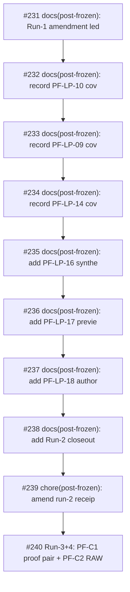

# 2026-05-06 amendments and Run-3+4 timeline

This timeline view is sorted by `merged_at`, not by PR number. That distinction matters because several PRs in the #199-#230 window were created and merged in tight batches where number order and merge order can differ. The timeline is a retrieval surface, not a canonical chronology replacement.

| merged_at | PR | cluster | introduced/exposed | title |
|---|---:|---|---|---|
| 2026-05-06T10:50:13Z | #231 | C06 Run-1 Amendment | exposed | docs(post-frozen): Run-1 amendment ledger + 3 external audits |
| 2026-05-06T10:55:46Z | #232 | C07 Run-2 Evidence / Receipt Closeout | exposed | docs(post-frozen): record PF-LP-10 coverage evidence under #228 |
| 2026-05-06T10:58:55Z | #233 | C07 Run-2 Evidence / Receipt Closeout | exposed | docs(post-frozen): record PF-LP-09 coverage evidence under #228 |
| 2026-05-06T10:59:00Z | #234 | C07 Run-2 Evidence / Receipt Closeout | exposed | docs(post-frozen): record PF-LP-14 coverage evidence under #228 |
| 2026-05-06T11:00:11Z | #235 | C07 Run-2 Evidence / Receipt Closeout | exposed | docs(post-frozen): add PF-LP-16 synthetic localhost evidence |
| 2026-05-06T11:01:33Z | #236 | C07 Run-2 Evidence / Receipt Closeout | exposed | docs(post-frozen): add PF-LP-17 preview-only readback |
| 2026-05-06T11:02:40Z | #237 | C07 Run-2 Evidence / Receipt Closeout | exposed | docs(post-frozen): add PF-LP-18 authority-safe closeout note |
| 2026-05-06T11:06:21Z | #238 | C07 Run-2 Evidence / Receipt Closeout | exposed | docs(post-frozen): add Run-2 closeout receipt bundle |
| 2026-05-06T13:36:29Z | #239 | C08 Run-2 Amendment | exposed | chore(post-frozen): amend run-2 receipt traceability |
| 2026-05-06T16:03:36Z | #240 | C09 Run-3+4 Combined Closeout | both | Run-3+4: PF-C1 proof pair + PF-C2 RAW handoff (24 dispatch / C1 pass / C2 partial pending RAW intake) |

## Reading note

Read candidate and authority-sync PRs differently. Candidate PRs introduce planning or evidence surfaces; authority-sync PRs may write canonical wording but still often preserve `NOT_EXECUTION_APPROVED`. Amendment PRs should be read as corrections to the historical record, not as blame assignment to the latest PR.
