# 2026-05-06 Run-1 / Run-2 build-up timeline

This timeline view is sorted by `merged_at`, not by PR number. That distinction matters because several PRs in the #199-#230 window were created and merged in tight batches where number order and merge order can differ. The timeline is a retrieval surface, not a canonical chronology replacement.

| merged_at | PR | cluster | introduced/exposed | title |
|---|---:|---|---|---|
| 2026-05-06T03:08:39Z | #194 | C03 Post176 / STEP0 / PF-META | introduced | docs: add web GPT STEP0 authoring templates |
| 2026-05-06T03:29:56Z | #195 | C03 Post176 / STEP0 / PF-META | exposed | docs: close out dispatch127-176 residual risks |
| 2026-05-06T03:34:46Z | #196 | C03 Post176 / STEP0 / PF-META | introduced | docs: add post-dispatch176 research candidates |
| 2026-05-06T08:36:39Z | #197 | C03 Post176 / STEP0 / PF-META | introduced | docs(post-frozen): PF-META-01-FIX v2 commander-ready deliverables |
| 2026-05-06T08:57:03Z | #199 | C04 PF-LP Run-1 | exposed | docs(post-frozen): add live authority readback after PR194 |
| 2026-05-06T09:02:50Z | #198 | C03 Post176 / STEP0 / PF-META | exposed | docs: record pr197 check readback |
| 2026-05-06T09:09:41Z | #200 | C04 PF-LP Run-1 | introduced | docs(post-frozen): add overflow registry v0 |
| 2026-05-06T09:09:47Z | #201 | C04 PF-LP Run-1 | introduced | docs(post-frozen): add vault preview env contract |
| 2026-05-06T09:09:52Z | #202 | C04 PF-LP Run-1 | introduced | docs(post-frozen): add successor entry scope memo |
| 2026-05-06T09:09:57Z | #203 | C04 PF-LP Run-1 | introduced | docs(post-frozen): add near-term execution matrix |
| 2026-05-06T09:12:41Z | #204 | C04 PF-LP Run-1 | both | feat(api): mount bridge router in create_app |
| 2026-05-06T09:19:49Z | #205 | C04 PF-LP Run-1 | both | test(api): add bridge vault preview smoke coverage |
| 2026-05-06T09:24:43Z | #206 | C04 PF-LP Run-1 | both | test(contracts): add bridge openapi golden contract |
| 2026-05-06T09:49:08Z | #208 | C05 PF-LP Run-2 / Window-2 / PF-GLOBAL / PF-C3 | introduced | docs: add PF-C3-01 object inventory |
| 2026-05-06T09:49:22Z | #209 | C05 PF-LP Run-2 / Window-2 / PF-GLOBAL / PF-C3 | introduced | tools: add PF-GLOBAL-01 manifest verifier |
| 2026-05-06T09:49:36Z | #210 | C05 PF-LP Run-2 / Window-2 / PF-GLOBAL / PF-C3 | introduced | docs: add PF-GLOBAL-02 near-term commander prompt |
| 2026-05-06T09:49:50Z | #211 | C05 PF-LP Run-2 / Window-2 / PF-GLOBAL / PF-C3 | introduced | docs: add PF-GLOBAL-03 preview review checklist |
| 2026-05-06T09:50:04Z | #212 | C05 PF-LP Run-2 / Window-2 / PF-GLOBAL / PF-C3 | introduced | docs: add PF-GLOBAL-04 proof scorecard schema |
| 2026-05-06T09:50:18Z | #213 | C05 PF-LP Run-2 / Window-2 / PF-GLOBAL / PF-C3 | introduced | docs: add PF-GLOBAL-05 runlog resume protocol |
| 2026-05-06T09:50:29Z | #207 | C05 PF-LP Run-2 / Window-2 / PF-GLOBAL / PF-C3 | introduced | PF-LP-04: add capture station createCapture client |
| 2026-05-06T09:50:32Z | #214 | C05 PF-LP Run-2 / Window-2 / PF-GLOBAL / PF-C3 | exposed | docs: add PF-GLOBAL-06 audit packet generator candidate |
| 2026-05-06T09:51:01Z | #215 | C05 PF-LP Run-2 / Window-2 / PF-GLOBAL / PF-C3 | introduced | docs: add PF-GLOBAL-07 branch grouping policy |
| 2026-05-06T09:51:16Z | #217 | C05 PF-LP Run-2 / Window-2 / PF-GLOBAL / PF-C3 | introduced | docs: add PF-GLOBAL-08 human gate calendar |
| 2026-05-06T09:51:30Z | #218 | C05 PF-LP Run-2 / Window-2 / PF-GLOBAL / PF-C3 | introduced | docs: add PF-GLOBAL-09 kill switch registry |
| 2026-05-06T09:51:45Z | #219 | C05 PF-LP Run-2 / Window-2 / PF-GLOBAL / PF-C3 | introduced | docs: add PF-GLOBAL-10 external research queue |
| 2026-05-06T09:51:58Z | #220 | C05 PF-LP Run-2 / Window-2 / PF-GLOBAL / PF-C3 | introduced | docs: add PF-GLOBAL-11 runtime lane research note |
| 2026-05-06T09:52:12Z | #221 | C05 PF-LP Run-2 / Window-2 / PF-GLOBAL / PF-C3 | exposed | docs: add PF-GLOBAL-12 reservoir closeout map |
| 2026-05-06T09:53:12Z | #222 | C05 PF-LP Run-2 / Window-2 / PF-GLOBAL / PF-C3 | introduced | docs: add PF-C3-02 keep list |
| 2026-05-06T09:53:25Z | #223 | C05 PF-LP Run-2 / Window-2 / PF-GLOBAL / PF-C3 | introduced | docs: add PF-C3-03 compress list |
| 2026-05-06T09:54:05Z | #224 | C05 PF-LP Run-2 / Window-2 / PF-GLOBAL / PF-C3 | introduced | docs: add PF-C3-05 language patch |
| 2026-05-06T09:54:41Z | #225 | C05 PF-LP Run-2 / Window-2 / PF-GLOBAL / PF-C3 | exposed | docs: add PF-C3-06 closeout |
| 2026-05-06T09:57:32Z | #227 | C05 PF-LP Run-2 / Window-2 / PF-GLOBAL / PF-C3 | introduced | docs: add window2 docs run bundle |
| 2026-05-06T10:03:32Z | #216 | C05 PF-LP Run-2 / Window-2 / PF-GLOBAL / PF-C3 | both | PF-LP-05: wire url bar create capture submit |
| 2026-05-06T10:03:33Z | #226 | C05 PF-LP Run-2 / Window-2 / PF-GLOBAL / PF-C3 | both | PF-LP-06/07: add preview shell bridge |
| 2026-05-06T10:09:19Z | #228 | C05 PF-LP Run-2 / Window-2 / PF-GLOBAL / PF-C3 | both | PF-LP-06-15 repair: land preview shell and panel loop |
| 2026-05-06T10:11:39Z | #230 | C05 PF-LP Run-2 / Window-2 / PF-GLOBAL / PF-C3 | introduced | PF-LP-12: add localhost preview dev runbook |

```mermaid
flowchart TD
    P1["#194 docs: add web GPT STEP0 authoring temp"]
    P2["#195 docs: close out dispatch127-176 residu"]
    P1 --> P2
    P3["#196 docs: add post-dispatch176 research ca"]
    P2 --> P3
    P4["#197 docs(post-frozen): PF-META-01-FIX v2 c"]
    P3 --> P4
    P5["#199 docs(post-frozen): add live authority "]
    P4 --> P5
    P6["#198 docs: record pr197 check readback"]
    P5 --> P6
    P7["#200 docs(post-frozen): add overflow regist"]
    P6 --> P7
    P8["#201 docs(post-frozen): add vault preview e"]
    P7 --> P8
    P9["#202 docs(post-frozen): add successor entry"]
    P8 --> P9
    P10["#203 docs(post-frozen): add near-term execu"]
    P9 --> P10
    P11["#204 feat(api): mount bridge router in crea"]
    P10 --> P11
    P12["#205 test(api): add bridge vault preview sm"]
    P11 --> P12
    P13["#206 test(contracts): add bridge openapi go"]
    P12 --> P13
    P14["#208 docs: add PF-C3-01 object inventory"]
    P13 --> P14
    P15["#209 tools: add PF-GLOBAL-01 manifest verif"]
    P14 --> P15
    P16["#210 docs: add PF-GLOBAL-02 near-term comma"]
    P15 --> P16
    P17["#211 docs: add PF-GLOBAL-03 preview review "]
    P16 --> P17
    P18["#212 docs: add PF-GLOBAL-04 proof scorecard"]
    P17 --> P18
    P19["#213 docs: add PF-GLOBAL-05 runlog resume p"]
    P18 --> P19
    P20["#207 PF-LP-04: add capture station createCa"]
    P19 --> P20
    P21["#214 docs: add PF-GLOBAL-06 audit packet ge"]
    P20 --> P21
    P22["#215 docs: add PF-GLOBAL-07 branch grouping"]
    P21 --> P22
    P23["#217 docs: add PF-GLOBAL-08 human gate cale"]
    P22 --> P23
    P24["#218 docs: add PF-GLOBAL-09 kill switch reg"]
    P23 --> P24
    P25["#219 docs: add PF-GLOBAL-10 external resear"]
    P24 --> P25
```

## Reading note

Read candidate and authority-sync PRs differently. Candidate PRs introduce planning or evidence surfaces; authority-sync PRs may write canonical wording but still often preserve `NOT_EXECUTION_APPROVED`. Amendment PRs should be read as corrections to the historical record, not as blame assignment to the latest PR.
