# All included PR sequence

This timeline view is sorted by `merged_at`, not by PR number. That distinction matters because several PRs in the #199-#230 window were created and merged in tight batches where number order and merge order can differ. The timeline is a retrieval surface, not a canonical chronology replacement.

| merged_at | PR | cluster | introduced/exposed | title |
|---|---:|---|---|---|
| 2025-05-04T21:29:10Z | #1 | C00 Bootstrap / Dispatch Import | introduced | feat(dispatch): import Dispatch-002 audit bundle and smoke script |
| 2026-05-05T16:58:24Z | #161 | C01 Wave 5 Candidate Factory | introduced | T-P1A-124: Topic card vault rendering candidate |
| 2026-05-05T17:03:20Z | #162 | C01 Wave 5 Candidate Factory | introduced | T-P1A-125: Topic card preview shape candidate |
| 2026-05-05T17:05:17Z | #163 | C01 Wave 5 Candidate Factory | introduced | T-P1A-126: Capture plan dry-run note shape |
| 2026-05-05T17:07:45Z | #164 | C01 Wave 5 Candidate Factory | introduced | T-P1A-127: Wave 5 docs-pack PR factory packaging |
| 2026-05-05T17:09:11Z | #165 | C01 Wave 5 Candidate Factory | introduced | T-P1A-128: Wave 5 file-domain matrix draft |
| 2026-05-05T17:10:36Z | #166 | C01 Wave 5 Candidate Factory | introduced | T-P1A-129: Wave 5 dependency graph draft |
| 2026-05-05T17:12:03Z | #167 | C01 Wave 5 Candidate Factory | introduced | T-P1A-130: Signal workbench API placeholder contract |
| 2026-05-05T17:13:28Z | #168 | C01 Wave 5 Candidate Factory | introduced | T-P1A-131: Topic card frontend IA candidate |
| 2026-05-05T17:14:53Z | #169 | C01 Wave 5 Candidate Factory | introduced | T-P1A-132: Capture plan frontend IA candidate |
| 2026-05-05T17:16:18Z | #170 | C01 Wave 5 Candidate Factory | introduced | T-P1A-133: Hypothesis comparison UX candidate |
| 2026-05-05T17:18:45Z | #171 | C01 Wave 5 Candidate Factory | exposed | T-P1A-134: Signal ingestion audit lane candidate |
| 2026-05-05T17:22:00Z | #172 | C01 Wave 5 Candidate Factory | introduced | T-P1A-135: Wave 5 visual reporting candidate |
| 2026-05-05T17:24:28Z | #173 | C01 Wave 5 Candidate Factory | introduced | T-P1A-136: Localhost review roster for Wave 5 surfaces |
| 2026-05-05T17:26:56Z | #174 | C01 Wave 5 Candidate Factory | introduced | T-P1A-137: STEP3 commander prompt contract note |
| 2026-05-05T17:29:01Z | #175 | C01 Wave 5 Candidate Factory | introduced | T-P1A-138: Cloud draft resume and packaging rules |
| 2026-05-05T17:30:25Z | #176 | C01 Wave 5 Candidate Factory | exposed | T-P1A-139: Readback delta application rules |
| 2026-05-05T17:32:52Z | #177 | C01 Wave 5 Candidate Factory | introduced | T-P1A-140: Deferred and overflow registry candidate |
| 2026-05-05T17:37:45Z | #178 | C01 Wave 5 Candidate Factory | introduced | T-P1A-141: Bridge hardening post-110 continuation |
| 2026-05-05T17:40:14Z | #179 | C01 Wave 5 Candidate Factory | introduced | T-P1A-142: Vault preview continuation candidate |
| 2026-05-05T17:42:49Z | #180 | C01 Wave 5 Candidate Factory | introduced | T-P1A-143: Vault dry-run continuation candidate |
| 2026-05-05T17:45:18Z | #181 | C01 Wave 5 Candidate Factory | introduced | T-P1A-144: 5 Gate CI continuation note |
| 2026-05-05T17:46:43Z | #182 | C01 Wave 5 Candidate Factory | introduced | T-P1A-145: Playwright smoke extension candidate |
| 2026-05-05T17:49:13Z | #183 | C01 Wave 5 Candidate Factory | introduced | T-P1A-146: Visual regression reporting continuation |
| 2026-05-05T17:51:40Z | #184 | C01 Wave 5 Candidate Factory | introduced | T-P1A-147: Runtime-log schema for Dispatch127-176 run |
| 2026-05-05T17:53:05Z | #185 | C01 Wave 5 Candidate Factory | introduced | T-P1A-148: RUN-SUMMARY schema for Dispatch127-176 run |
| 2026-05-05T17:54:30Z | #186 | C01 Wave 5 Candidate Factory | introduced | T-P1A-149: Product-lane override evidence packet |
| 2026-05-05T17:55:55Z | #187 | C01 Wave 5 Candidate Factory | introduced | T-P1A-150: Global pool staging health-check contract |
| 2026-05-05T17:57:20Z | #188 | C01 Wave 5 Candidate Factory | introduced | T-P1A-151: Branch protection and merge policy note |
| 2026-05-05T18:04:01Z | #189 | C02 Authority Sync / Wave Closeout | exposed | T-P1A-152: Wave 5 closeout template |
| 2026-05-05T18:08:50Z | #190 | C02 Authority Sync / Wave Closeout | introduced | T-P1A-153: Wave 6 ledger-open candidate |
| 2026-05-05T18:11:57Z | #191 | C02 Authority Sync / Wave Closeout | introduced | T-P1A-154: Overflow candidate registry for DB vNext and blocked runtime lanes |
| 2026-05-05T18:13:24Z | #192 | C02 Authority Sync / Wave Closeout | introduced | T-P1A-155: STEP3 cold-start handoff packet contract |
| 2026-05-05T23:41:19Z | #193 | C02 Authority Sync / Wave Closeout | exposed | docs: close out batch abc authority sync |
| 2026-05-06T03:08:39Z | #194 | C03 Post176 / STEP0 / PF-META | introduced | docs: add web GPT STEP0 authoring templates |
| 2026-05-06T03:29:56Z | #195 | C03 Post176 / STEP0 / PF-META | exposed | docs: close out dispatch127-176 residual risks |
| 2026-05-06T03:34:46Z | #196 | C03 Post176 / STEP0 / PF-META | introduced | docs: add post-dispatch176 research candidates |
| 2026-05-06T08:36:39Z | #197 | C03 Post176 / STEP0 / PF-META | introduced | docs(post-frozen): PF-META-01-FIX v2 commander-ready deliverables |
| 2026-05-06T08:57:03Z | #199 | C04 PF-LP Run-1 | exposed | docs(post-frozen): add live authority readback after PR194 |
| 2026-05-06T09:02:50Z | #198 | C03 Post176 / STEP0 / PF-META | exposed | docs: record pr197 check readback |
| 2026-05-06T09:09:41Z | #200 | C04 PF-LP Run-1 | introduced | docs(post-frozen): add overflow registry v0 |
| 2026-05-06T09:09:47Z | #201 | C04 PF-LP Run-1 | introduced | docs(post-frozen): add vault preview env contract |
| 2026-05-06T09:09:52Z | #202 | C04 PF-LP Run-1 | introduced | docs(post-frozen): add successor entry scope memo |
| 2026-05-06T09:09:57Z | #203 | C04 PF-LP Run-1 | introduced | docs(post-frozen): add near-term execution matrix |
| 2026-05-06T09:12:41Z | #204 | C04 PF-LP Run-1 | both | feat(api): mount bridge router in create_app |
| 2026-05-06T09:19:49Z | #205 | C04 PF-LP Run-1 | both | test(api): add bridge vault preview smoke coverage |
| 2026-05-06T09:24:43Z | #206 | C04 PF-LP Run-1 | both | test(contracts): add bridge openapi golden contract |
| 2026-05-06T09:49:08Z | #208 | C05 PF-LP Run-2 / Window-2 / PF-GLOBAL / PF-C3 | introduced | docs: add PF-C3-01 object inventory |
| 2026-05-06T09:49:22Z | #209 | C05 PF-LP Run-2 / Window-2 / PF-GLOBAL / PF-C3 | introduced | tools: add PF-GLOBAL-01 manifest verifier |
| 2026-05-06T09:49:36Z | #210 | C05 PF-LP Run-2 / Window-2 / PF-GLOBAL / PF-C3 | introduced | docs: add PF-GLOBAL-02 near-term commander prompt |
| 2026-05-06T09:49:50Z | #211 | C05 PF-LP Run-2 / Window-2 / PF-GLOBAL / PF-C3 | introduced | docs: add PF-GLOBAL-03 preview review checklist |
| 2026-05-06T09:50:04Z | #212 | C05 PF-LP Run-2 / Window-2 / PF-GLOBAL / PF-C3 | introduced | docs: add PF-GLOBAL-04 proof scorecard schema |
| 2026-05-06T09:50:18Z | #213 | C05 PF-LP Run-2 / Window-2 / PF-GLOBAL / PF-C3 | introduced | docs: add PF-GLOBAL-05 runlog resume protocol |
| 2026-05-06T09:50:29Z | #207 | C05 PF-LP Run-2 / Window-2 / PF-GLOBAL / PF-C3 | introduced | PF-LP-04: add capture station createCapture client |
| 2026-05-06T09:50:32Z | #214 | C05 PF-LP Run-2 / Window-2 / PF-GLOBAL / PF-C3 | exposed | docs: add PF-GLOBAL-06 audit packet generator candidate |
| 2026-05-06T09:51:01Z | #215 | C05 PF-LP Run-2 / Window-2 / PF-GLOBAL / PF-C3 | introduced | docs: add PF-GLOBAL-07 branch grouping policy |
| 2026-05-06T09:51:16Z | #217 | C05 PF-LP Run-2 / Window-2 / PF-GLOBAL / PF-C3 | introduced | docs: add PF-GLOBAL-08 human gate calendar |
| 2026-05-06T09:51:30Z | #218 | C05 PF-LP Run-2 / Window-2 / PF-GLOBAL / PF-C3 | introduced | docs: add PF-GLOBAL-09 kill switch registry |
| 2026-05-06T09:51:45Z | #219 | C05 PF-LP Run-2 / Window-2 / PF-GLOBAL / PF-C3 | introduced | docs: add PF-GLOBAL-10 external research queue |
| 2026-05-06T09:51:58Z | #220 | C05 PF-LP Run-2 / Window-2 / PF-GLOBAL / PF-C3 | introduced | docs: add PF-GLOBAL-11 runtime lane research note |
| 2026-05-06T09:52:12Z | #221 | C05 PF-LP Run-2 / Window-2 / PF-GLOBAL / PF-C3 | exposed | docs: add PF-GLOBAL-12 reservoir closeout map |
| 2026-05-06T09:53:12Z | #222 | C05 PF-LP Run-2 / Window-2 / PF-GLOBAL / PF-C3 | introduced | docs: add PF-C3-02 keep list |
| 2026-05-06T09:53:25Z | #223 | C05 PF-LP Run-2 / Window-2 / PF-GLOBAL / PF-C3 | introduced | docs: add PF-C3-03 compress list |
| 2026-05-06T09:54:05Z | #224 | C05 PF-LP Run-2 / Window-2 / PF-GLOBAL / PF-C3 | introduced | docs: add PF-C3-05 language patch |
| 2026-05-06T09:54:41Z | #225 | C05 PF-LP Run-2 / Window-2 / PF-GLOBAL / PF-C3 | exposed | docs: add PF-C3-06 closeout |
| 2026-05-06T09:57:32Z | #227 | C05 PF-LP Run-2 / Window-2 / PF-GLOBAL / PF-C3 | introduced | docs: add window2 docs run bundle |
| 2026-05-06T10:03:32Z | #216 | C05 PF-LP Run-2 / Window-2 / PF-GLOBAL / PF-C3 | both | PF-LP-05: wire url bar create capture submit |
| 2026-05-06T10:03:33Z | #226 | C05 PF-LP Run-2 / Window-2 / PF-GLOBAL / PF-C3 | both | PF-LP-06/07: add preview shell bridge |
| 2026-05-06T10:09:19Z | #228 | C05 PF-LP Run-2 / Window-2 / PF-GLOBAL / PF-C3 | both | PF-LP-06-15 repair: land preview shell and panel loop |
| 2026-05-06T10:11:39Z | #230 | C05 PF-LP Run-2 / Window-2 / PF-GLOBAL / PF-C3 | introduced | PF-LP-12: add localhost preview dev runbook |
| 2026-05-06T10:50:13Z | #231 | C06 Run-1 Amendment | exposed | docs(post-frozen): Run-1 amendment ledger + 3 external audits |
| 2026-05-06T10:55:46Z | #232 | C07 Run-2 Evidence / Receipt Closeout | exposed | docs(post-frozen): record PF-LP-10 coverage evidence under #228 |
| 2026-05-06T10:58:55Z | #233 | C07 Run-2 Evidence / Receipt Closeout | exposed | docs(post-frozen): record PF-LP-09 coverage evidence under #228 |
| 2026-05-06T10:59:00Z | #234 | C07 Run-2 Evidence / Receipt Closeout | exposed | docs(post-frozen): record PF-LP-14 coverage evidence under #228 |
| 2026-05-06T11:00:11Z | #235 | C07 Run-2 Evidence / Receipt Closeout | exposed | docs(post-frozen): add PF-LP-16 synthetic localhost evidence |
| 2026-05-06T11:01:33Z | #236 | C07 Run-2 Evidence / Receipt Closeout | exposed | docs(post-frozen): add PF-LP-17 preview-only readback |
| 2026-05-06T11:02:40Z | #237 | C07 Run-2 Evidence / Receipt Closeout | exposed | docs(post-frozen): add PF-LP-18 authority-safe closeout note |
| 2026-05-06T11:06:21Z | #238 | C07 Run-2 Evidence / Receipt Closeout | exposed | docs(post-frozen): add Run-2 closeout receipt bundle |
| 2026-05-06T13:36:29Z | #239 | C08 Run-2 Amendment | exposed | chore(post-frozen): amend run-2 receipt traceability |
| 2026-05-06T16:03:36Z | #240 | C09 Run-3+4 Combined Closeout | both | Run-3+4: PF-C1 proof pair + PF-C2 RAW handoff (24 dispatch / C1 pass / C2 partial pending RAW intake) |

```mermaid
flowchart TD
    P1["#1 feat(dispatch): import Dispatch-002 au"]
    P2["#161 T-P1A-124: Topic card vault rendering "]
    P1 --> P2
    P3["#162 T-P1A-125: Topic card preview shape ca"]
    P2 --> P3
    P4["#163 T-P1A-126: Capture plan dry-run note s"]
    P3 --> P4
    P5["#164 T-P1A-127: Wave 5 docs-pack PR factory"]
    P4 --> P5
    P6["#165 T-P1A-128: Wave 5 file-domain matrix d"]
    P5 --> P6
    P7["#166 T-P1A-129: Wave 5 dependency graph dra"]
    P6 --> P7
    P8["#167 T-P1A-130: Signal workbench API placeh"]
    P7 --> P8
    P9["#168 T-P1A-131: Topic card frontend IA cand"]
    P8 --> P9
    P10["#169 T-P1A-132: Capture plan frontend IA ca"]
    P9 --> P10
    P11["#170 T-P1A-133: Hypothesis comparison UX ca"]
    P10 --> P11
    P12["#171 T-P1A-134: Signal ingestion audit lane"]
    P11 --> P12
    P13["#172 T-P1A-135: Wave 5 visual reporting can"]
    P12 --> P13
    P14["#173 T-P1A-136: Localhost review roster for"]
    P13 --> P14
    P15["#174 T-P1A-137: STEP3 commander prompt cont"]
    P14 --> P15
    P16["#175 T-P1A-138: Cloud draft resume and pack"]
    P15 --> P16
    P17["#176 T-P1A-139: Readback delta application "]
    P16 --> P17
    P18["#177 T-P1A-140: Deferred and overflow regis"]
    P17 --> P18
    P19["#178 T-P1A-141: Bridge hardening post-110 c"]
    P18 --> P19
    P20["#179 T-P1A-142: Vault preview continuation "]
    P19 --> P20
    P21["#180 T-P1A-143: Vault dry-run continuation "]
    P20 --> P21
    P22["#181 T-P1A-144: 5 Gate CI continuation note"]
    P21 --> P22
    P23["#182 T-P1A-145: Playwright smoke extension "]
    P22 --> P23
    P24["#183 T-P1A-146: Visual regression reporting"]
    P23 --> P24
    P25["#184 T-P1A-147: Runtime-log schema for Disp"]
    P24 --> P25
```

## Reading note

Read candidate and authority-sync PRs differently. Candidate PRs introduce planning or evidence surfaces; authority-sync PRs may write canonical wording but still often preserve `NOT_EXECUTION_APPROVED`. Amendment PRs should be read as corrections to the historical record, not as blame assignment to the latest PR.
