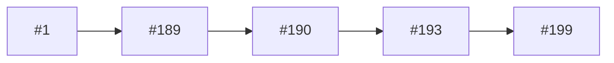

# Bootstrap and authority surfaces

## Purpose

This topic view groups PR decisions by theme instead of merge chronology. Use it when the question is “what have we already decided about this surface?” rather than “what happened next?” The view is intentionally candidate-level; it points to PR cards and patterns but does not overwrite canonical project files.

| PR | merged_at | kind | introduced/exposed | title |
|---:|---|---|---|---|
| #1 | 2025-05-04T21:29:10Z | audit-evidence | introduced | feat(dispatch): import Dispatch-002 audit bundle and smoke script |
| #189 | 2026-05-05T18:04:01Z | authority-sync | exposed | T-P1A-152: Wave 5 closeout template |
| #190 | 2026-05-05T18:08:50Z | authority-sync | introduced | T-P1A-153: Wave 6 ledger-open candidate |
| #193 | 2026-05-05T23:41:19Z | authority-sync | exposed | docs: close out batch abc authority sync |
| #199 | 2026-05-06T08:57:03Z | authority-sync | exposed | docs(post-frozen): add live authority readback after PR194 |

## Synthesis

The theme shows ScoutFlow's preference for bounded progression. Even when work moves into app code or test contracts, the surrounding language keeps preview-only, candidate-only, no-write, or no-authority constraints visible. That allows later amendment PRs to repair traceability without erasing useful work. The topic view is therefore a map of decisions plus caveats.

## Reuse guidance

When authoring a future PR in this topic, open the related PR cards first. Copy the boundary posture, not necessarily the implementation details. If a new PR changes authority state, add a separate authority-sync or amendment card so the decision lineage remains searchable.
