# PF-GLOBAL controls and run protocols

## Purpose

This topic view groups PR decisions by theme instead of merge chronology. Use it when the question is “what have we already decided about this surface?” rather than “what happened next?” The view is intentionally candidate-level; it points to PR cards and patterns but does not overwrite canonical project files.

| PR | merged_at | kind | introduced/exposed | title |
|---:|---|---|---|---|
| #209 | 2026-05-06T09:49:22Z | other | introduced | tools: add PF-GLOBAL-01 manifest verifier |
| #210 | 2026-05-06T09:49:36Z | other | introduced | docs: add PF-GLOBAL-02 near-term commander prompt |
| #211 | 2026-05-06T09:49:50Z | other | introduced | docs: add PF-GLOBAL-03 preview review checklist |
| #212 | 2026-05-06T09:50:04Z | contract | introduced | docs: add PF-GLOBAL-04 proof scorecard schema |
| #213 | 2026-05-06T09:50:18Z | other | introduced | docs: add PF-GLOBAL-05 runlog resume protocol |
| #214 | 2026-05-06T09:50:32Z | audit-evidence | exposed | docs: add PF-GLOBAL-06 audit packet generator candidate |
| #215 | 2026-05-06T09:51:01Z | other | introduced | docs: add PF-GLOBAL-07 branch grouping policy |
| #216 | 2026-05-06T10:03:32Z | implementation-boundary | both | PF-LP-05: wire url bar create capture submit |
| #217 | 2026-05-06T09:51:16Z | boundary | introduced | docs: add PF-GLOBAL-08 human gate calendar |
| #218 | 2026-05-06T09:51:30Z | boundary | introduced | docs: add PF-GLOBAL-09 kill switch registry |
| #219 | 2026-05-06T09:51:45Z | other | introduced | docs: add PF-GLOBAL-10 external research queue |
| #220 | 2026-05-06T09:51:58Z | candidate-scope | introduced | docs: add PF-GLOBAL-11 runtime lane research note |
| #221 | 2026-05-06T09:52:12Z | audit-evidence | exposed | docs: add PF-GLOBAL-12 reservoir closeout map |

```mermaid
flowchart LR
    PR209["#209"]
    PR210["#210"]
    PR211["#211"]
    PR212["#212"]
    PR213["#213"]
    PR214["#214"]
    PR215["#215"]
    PR216["#216"]
    PR217["#217"]
    PR218["#218"]
    PR219["#219"]
    PR220["#220"]
    PR221["#221"]
    PR209 --> PR210
    PR210 --> PR211
    PR211 --> PR212
    PR212 --> PR213
    PR213 --> PR214
    PR214 --> PR215
    PR215 --> PR216
    PR216 --> PR217
    PR217 --> PR218
    PR218 --> PR219
    PR219 --> PR220
    PR220 --> PR221
```

## Synthesis

The theme shows ScoutFlow's preference for bounded progression. Even when work moves into app code or test contracts, the surrounding language keeps preview-only, candidate-only, no-write, or no-authority constraints visible. That allows later amendment PRs to repair traceability without erasing useful work. The topic view is therefore a map of decisions plus caveats.

## Reuse guidance

When authoring a future PR in this topic, open the related PR cards first. Copy the boundary posture, not necessarily the implementation details. If a new PR changes authority state, add a separate authority-sync or amendment card so the decision lineage remains searchable.
