# PF-LP bridge, preview, createCapture

## Purpose

This topic view groups PR decisions by theme instead of merge chronology. Use it when the question is “what have we already decided about this surface?” rather than “what happened next?” The view is intentionally candidate-level; it points to PR cards and patterns but does not overwrite canonical project files.

| PR | merged_at | kind | introduced/exposed | title |
|---:|---|---|---|---|
| #201 | 2026-05-06T09:09:47Z | contract | introduced | docs(post-frozen): add vault preview env contract |
| #204 | 2026-05-06T09:12:41Z | contract | both | feat(api): mount bridge router in create_app |
| #205 | 2026-05-06T09:19:49Z | implementation-boundary | both | test(api): add bridge vault preview smoke coverage |
| #206 | 2026-05-06T09:24:43Z | contract | both | test(contracts): add bridge openapi golden contract |
| #207 | 2026-05-06T09:50:29Z | implementation-boundary | introduced | PF-LP-04: add capture station createCapture client |
| #216 | 2026-05-06T10:03:32Z | implementation-boundary | both | PF-LP-05: wire url bar create capture submit |
| #226 | 2026-05-06T10:03:33Z | implementation-boundary | both | PF-LP-06/07: add preview shell bridge |
| #228 | 2026-05-06T10:09:19Z | contract | both | PF-LP-06-15 repair: land preview shell and panel loop |
| #230 | 2026-05-06T10:11:39Z | boundary | introduced | PF-LP-12: add localhost preview dev runbook |
| #235 | 2026-05-06T11:00:11Z | other | exposed | docs(post-frozen): add PF-LP-16 synthetic localhost evidence |
| #236 | 2026-05-06T11:01:33Z | audit-evidence | exposed | docs(post-frozen): add PF-LP-17 preview-only readback |
| #237 | 2026-05-06T11:02:40Z | authority-sync | exposed | docs(post-frozen): add PF-LP-18 authority-safe closeout note |

```mermaid
flowchart LR
    PR201["#201"]
    PR204["#204"]
    PR205["#205"]
    PR206["#206"]
    PR207["#207"]
    PR216["#216"]
    PR226["#226"]
    PR228["#228"]
    PR230["#230"]
    PR235["#235"]
    PR236["#236"]
    PR237["#237"]
    PR201 --> PR204
    PR204 --> PR205
    PR205 --> PR206
    PR206 --> PR207
    PR207 --> PR216
    PR216 --> PR226
    PR226 --> PR228
    PR228 --> PR230
    PR230 --> PR235
    PR235 --> PR236
    PR236 --> PR237
```

## Synthesis

The theme shows ScoutFlow's preference for bounded progression. Even when work moves into app code or test contracts, the surrounding language keeps preview-only, candidate-only, no-write, or no-authority constraints visible. That allows later amendment PRs to repair traceability without erasing useful work. The topic view is therefore a map of decisions plus caveats.

## Reuse guidance

When authoring a future PR in this topic, open the related PR cards first. Copy the boundary posture, not necessarily the implementation details. If a new PR changes authority state, add a separate authority-sync or amendment card so the decision lineage remains searchable.
