# Wave 5 governance, packaging, CI, logs

## Purpose

This topic view groups PR decisions by theme instead of merge chronology. Use it when the question is “what have we already decided about this surface?” rather than “what happened next?” The view is intentionally candidate-level; it points to PR cards and patterns but does not overwrite canonical project files.

| PR | merged_at | kind | introduced/exposed | title |
|---:|---|---|---|---|
| #164 | 2026-05-05T17:07:45Z | authority-sync | introduced | T-P1A-127: Wave 5 docs-pack PR factory packaging |
| #165 | 2026-05-05T17:09:11Z | candidate-scope | introduced | T-P1A-128: Wave 5 file-domain matrix draft |
| #166 | 2026-05-05T17:10:36Z | candidate-scope | introduced | T-P1A-129: Wave 5 dependency graph draft |
| #167 | 2026-05-05T17:12:03Z | authority-sync | introduced | T-P1A-130: Signal workbench API placeholder contract |
| #168 | 2026-05-05T17:13:28Z | candidate-scope | introduced | T-P1A-131: Topic card frontend IA candidate |
| #169 | 2026-05-05T17:14:53Z | authority-sync | introduced | T-P1A-132: Capture plan frontend IA candidate |
| #170 | 2026-05-05T17:16:18Z | candidate-scope | introduced | T-P1A-133: Hypothesis comparison UX candidate |
| #171 | 2026-05-05T17:18:45Z | audit-evidence | exposed | T-P1A-134: Signal ingestion audit lane candidate |
| #172 | 2026-05-05T17:22:00Z | candidate-scope | introduced | T-P1A-135: Wave 5 visual reporting candidate |
| #173 | 2026-05-05T17:24:28Z | other | introduced | T-P1A-136: Localhost review roster for Wave 5 surfaces |
| #174 | 2026-05-05T17:26:56Z | authority-sync | introduced | T-P1A-137: STEP3 commander prompt contract note |
| #175 | 2026-05-05T17:29:01Z | candidate-scope | introduced | T-P1A-138: Cloud draft resume and packaging rules |
| #176 | 2026-05-05T17:30:25Z | authority-sync | exposed | T-P1A-139: Readback delta application rules |
| #177 | 2026-05-05T17:32:52Z | boundary | introduced | T-P1A-140: Deferred and overflow registry candidate |
| #178 | 2026-05-05T17:37:45Z | implementation-boundary | introduced | T-P1A-141: Bridge hardening post-110 continuation |
| #179 | 2026-05-05T17:40:14Z | candidate-scope | introduced | T-P1A-142: Vault preview continuation candidate |
| #180 | 2026-05-05T17:42:49Z | authority-sync | introduced | T-P1A-143: Vault dry-run continuation candidate |
| #181 | 2026-05-05T17:45:18Z | authority-sync | introduced | T-P1A-144: 5 Gate CI continuation note |
| #182 | 2026-05-05T17:46:43Z | candidate-scope | introduced | T-P1A-145: Playwright smoke extension candidate |
| #183 | 2026-05-05T17:49:13Z | other | introduced | T-P1A-146: Visual regression reporting continuation |
| #184 | 2026-05-05T17:51:40Z | contract | introduced | T-P1A-147: Runtime-log schema for Dispatch127-176 run |
| #185 | 2026-05-05T17:53:05Z | contract | introduced | T-P1A-148: RUN-SUMMARY schema for Dispatch127-176 run |
| #186 | 2026-05-05T17:54:30Z | other | introduced | T-P1A-149: Product-lane override evidence packet |
| #187 | 2026-05-05T17:55:55Z | contract | introduced | T-P1A-150: Global pool staging health-check contract |
| #188 | 2026-05-05T17:57:20Z | candidate-scope | introduced | T-P1A-151: Branch protection and merge policy note |
| #189 | 2026-05-05T18:04:01Z | authority-sync | exposed | T-P1A-152: Wave 5 closeout template |
| #190 | 2026-05-05T18:08:50Z | authority-sync | introduced | T-P1A-153: Wave 6 ledger-open candidate |
| #191 | 2026-05-05T18:11:57Z | authority-sync | introduced | T-P1A-154: Overflow candidate registry for DB vNext and blocked runtime lanes |
| #192 | 2026-05-05T18:13:24Z | authority-sync | introduced | T-P1A-155: STEP3 cold-start handoff packet contract |

```mermaid
flowchart LR
    PR164["#164"]
    PR165["#165"]
    PR166["#166"]
    PR167["#167"]
    PR168["#168"]
    PR169["#169"]
    PR170["#170"]
    PR171["#171"]
    PR172["#172"]
    PR173["#173"]
    PR174["#174"]
    PR175["#175"]
    PR176["#176"]
    PR177["#177"]
    PR178["#178"]
    PR179["#179"]
    PR180["#180"]
    PR181["#181"]
    PR164 --> PR165
    PR165 --> PR166
    PR166 --> PR167
    PR167 --> PR168
    PR168 --> PR169
    PR169 --> PR170
    PR170 --> PR171
    PR171 --> PR172
    PR172 --> PR173
    PR173 --> PR174
    PR174 --> PR175
    PR175 --> PR176
    PR176 --> PR177
    PR177 --> PR178
    PR178 --> PR179
    PR179 --> PR180
    PR180 --> PR181
```

## Synthesis

The theme shows ScoutFlow's preference for bounded progression. Even when work moves into app code or test contracts, the surrounding language keeps preview-only, candidate-only, no-write, or no-authority constraints visible. That allows later amendment PRs to repair traceability without erasing useful work. The topic view is therefore a map of decisions plus caveats.

## Reuse guidance

When authoring a future PR in this topic, open the related PR cards first. Copy the boundary posture, not necessarily the implementation details. If a new PR changes authority state, add a separate authority-sync or amendment card so the decision lineage remains searchable.
