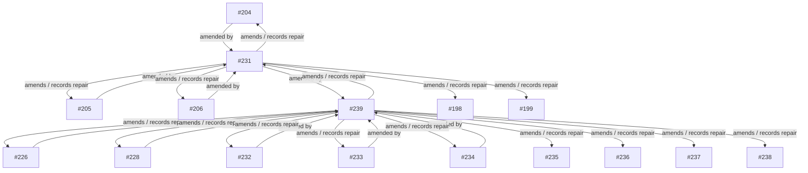

# Amend Trail Map

This map only includes amendment relationships that were visible in the PR body summaries inspected for this delivery. It deliberately does not invent links to U11 anti-pattern IDs, because the U11 registry was not loaded. The purpose is to keep repair lineage queryable while preserving uncertainty.

## Anchor readings

- **#231** records Run-1 audit rejection as scope drift and chooses `amend_and_proceed` rather than rollback. It references #204/#205/#206 and surrounding boundary notes.
- **#239** repairs Run-2 receipt traceability, downgrades synthetic UAT/readback from `works` to `partial`, adds blockers, records the #231 gate bypass, and clarifies #226/#228 topology.
- **#240** demonstrates compressed closeout with partial signal preserved: C1 pass, C2 partial, C4 blocked, Run-5 pending PF-V handoff.

## Table

| From | To | relationship | evidence basis |
|---:|---:|---|---|
| #204 | #231 | amended_by | PR body/title summary in this atlas build |
| #205 | #231 | amended_by | PR body/title summary in this atlas build |
| #206 | #231 | amended_by | PR body/title summary in this atlas build |
| #226 | #239 | amended_by | PR body/title summary in this atlas build |
| #228 | #239 | amended_by | PR body/title summary in this atlas build |
| #231 | #204 | amends | PR body/title summary in this atlas build |
| #231 | #205 | amends | PR body/title summary in this atlas build |
| #231 | #206 | amends | PR body/title summary in this atlas build |
| #231 | #198 | amends | PR body/title summary in this atlas build |
| #231 | #199 | amends | PR body/title summary in this atlas build |
| #231 | #239 | amended_by | PR body/title summary in this atlas build |
| #232 | #239 | amended_by | PR body/title summary in this atlas build |
| #233 | #239 | amended_by | PR body/title summary in this atlas build |
| #234 | #239 | amended_by | PR body/title summary in this atlas build |
| #239 | #226 | amends | PR body/title summary in this atlas build |
| #239 | #228 | amends | PR body/title summary in this atlas build |
| #239 | #231 | amends | PR body/title summary in this atlas build |
| #239 | #232 | amends | PR body/title summary in this atlas build |
| #239 | #233 | amends | PR body/title summary in this atlas build |
| #239 | #234 | amends | PR body/title summary in this atlas build |
| #239 | #235 | amends | PR body/title summary in this atlas build |
| #239 | #236 | amends | PR body/title summary in this atlas build |
| #239 | #237 | amends | PR body/title summary in this atlas build |
| #239 | #238 | amends | PR body/title summary in this atlas build |

## Audit caution

`amends` here means “the later PR body explicitly records, repairs, or reframes the earlier PR.” It does not always mean the later PR changed the earlier diff. This distinction is important for ScoutFlow because several decisions are **receipt repairs** or **claim downgrades**, not code reversions.
