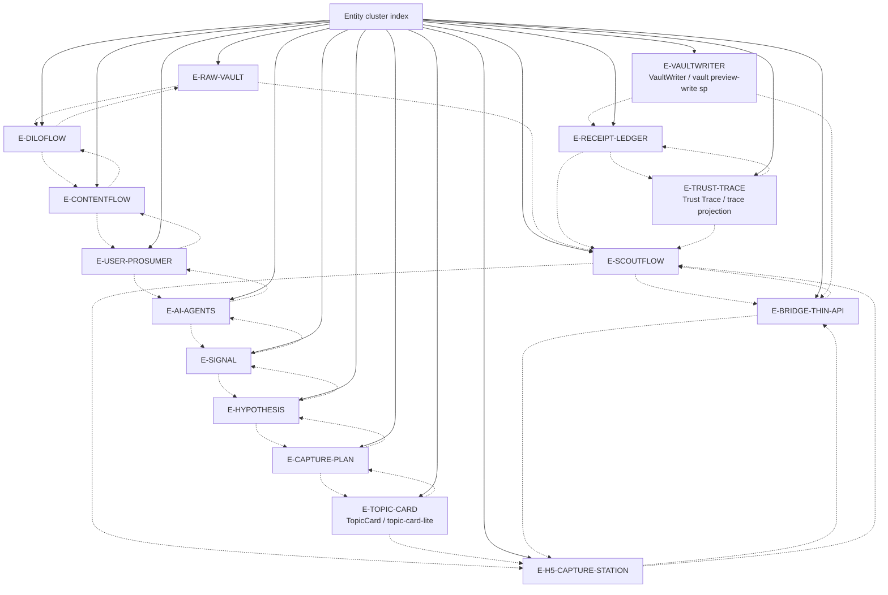

# Entity cluster index

Entities define actors, objects, and system surfaces. This index is a navigation aid, not a replacement for the individual node files or source documents.

## Node table

| node_id | title | risk | degree |
|---|---|---:|---:|
| `E-SCOUTFLOW` | ScoutFlow / 采集线 | critical | 8 |
| `E-RAW-VAULT` | RAW vault / 长期知识 SoR | critical | 5 |
| `E-DILOFLOW` | DiloFlow sibling consumer | medium | 4 |
| `E-CONTENTFLOW` | ContentFlow / L retrospective sibling source | medium | 4 |
| `E-USER-PROSUMER` | 用户：single-user prosumer / 最大马力 owner | critical | 7 |
| `E-AI-AGENTS` | AI agent mesh: GPT Pro / Codex / CC / Hermes / OpenClaw | high | 5 |
| `E-SIGNAL` | Signal entity v0 | high | 3 |
| `E-HYPOTHESIS` | Hypothesis entity v0 | high | 3 |
| `E-CAPTURE-PLAN` | CapturePlan entity v0 | high | 3 |
| `E-TOPIC-CARD` | TopicCard / topic-card-lite | critical | 9 |
| `E-H5-CAPTURE-STATION` | H5 Capture Station / strong visual surface | high | 6 |
| `E-BRIDGE-THIN-API` | Bridge / Thin API boundary | critical | 7 |
| `E-VAULTWRITER` | VaultWriter / vault preview-write split | critical | 9 |
| `E-RECEIPT-LEDGER` | Receipt ledger / artifact_assets | critical | 6 |
| `E-TRUST-TRACE` | Trust Trace / trace projection | high | 4 |

## Cluster reading guidance

Read this cluster with three questions. First, which nodes are canonical/promoted facts and which are candidate synthesis? Second, which nodes are approval gates rather than progress claims? Third, which nodes should be read before any new dispatch or implementation starts? For ScoutFlow, the answer almost always routes back through `R-CURRENT-TASK-DECISION`, `T-AUTHORITY-FIRST`, `T-CANDIDATE-NOT-AUTHORITY`, and `T-EXECUTION-GATES`.

The cluster is deliberately redundant with the master graph. Redundancy here is defensive: a cold-start reader may enter from entities, lessons, feedback, or risk. Every path should rediscover the same hard boundaries: frozen dispatch evidence, no runtime/migration/front-end/vault true-write approval by default, and no second knowledge base.

## Maintenance note

When a node is added or removed, regenerate this index from the adjacency JSON. Manual edits to cluster diagrams are discouraged because they are a common source of graph drift.
