# Theme cluster index

Themes define cross-session strategic axes and boundaries. This index is a navigation aid, not a replacement for the individual node files or source documents.

```mermaid
flowchart TD
  ROOT["Theme cluster index"]
  ROOT --> T_AUTHORITY_FIRST["T-AUTHORITY-FIRST<br/>Authority-first 四层与 SoR discipline"]
  T_AUTHORITY_FIRST -.-> E_AI_AGENTS["E-AI-AGENTS"]
  T_AUTHORITY_FIRST -.-> E_BRIDGE_THIN_API["E-BRIDGE-THIN-API"]
  ROOT --> T_MAX_HORSEPOWER["T-MAX-HORSEPOWER<br/>最大马力开发 / 安全前提下并行"]
  T_MAX_HORSEPOWER -.-> E_USER_PROSUMER["E-USER-PROSUMER"]
  T_MAX_HORSEPOWER -.-> T_AUTHORITY_FIRST["T-AUTHORITY-FIRST"]
  ROOT --> T_STRONG_VISUAL["T-STRONG-VISUAL<br/>强视觉一级 axis / 5-Gate aesthetic"]
  T_STRONG_VISUAL -.-> E_H5_CAPTURE_STATION["E-H5-CAPTURE-STATION"]
  T_STRONG_VISUAL -.-> E_TOPIC_CARD["E-TOPIC-CARD"]
  ROOT --> T_SINGLE_USER_LOCAL_FIRST["T-SINGLE-USER-LOCAL-FIRST<br/>single-user / local-first 产品边界"]
  T_SINGLE_USER_LOCAL_FIRST -.-> E_USER_PROSUMER["E-USER-PROSUMER"]
  T_SINGLE_USER_LOCAL_FIRST -.-> F_SINGLE_USER_PROSUMER["F-SINGLE-USER-PROSUMER"]
  ROOT --> T_CANDIDATE_NOT_AUTHORITY["T-CANDIDATE-NOT-AUTHORITY<br/>candidate/not-authority discipline"]
  T_CANDIDATE_NOT_AUTHORITY -.-> E_BRIDGE_THIN_API["E-BRIDGE-THIN-API"]
  T_CANDIDATE_NOT_AUTHORITY -.-> E_RAW_VAULT["E-RAW-VAULT"]
  ROOT --> T_EXECUTION_GATES["T-EXECUTION-GATES<br/>runtime / migration / frontend / vis"]
  T_EXECUTION_GATES -.-> L_MIGRATION_DRIFT["L-MIGRATION-DRIFT"]
  T_EXECUTION_GATES -.-> L_RUNTIME_APPROVAL_DRIFT["L-RUNTIME-APPROVAL-DRIFT"]
  ROOT --> T_PRODUCT_PROOF_NOT_BREADTH["T-PRODUCT-PROOF-NOT-BREADTH<br/>post176 主线：proof not breadth"]
  T_PRODUCT_PROOF_NOT_BREADTH -.-> L_PRODUCT_CLOSURE_MISTAKE["L-PRODUCT-CLOSURE-MISTAKE"]
  T_PRODUCT_PROOF_NOT_BREADTH -.-> P_PROOF_PAIR_CANARY["P-PROOF-PAIR-CANARY"]
  ROOT --> T_SCOUTFLOW_RAW_BOUNDARY["T-SCOUTFLOW-RAW-BOUNDARY<br/>ScoutFlow ↔ RAW SoR boundary"]
  T_SCOUTFLOW_RAW_BOUNDARY -.-> E_RAW_VAULT["E-RAW-VAULT"]
  T_SCOUTFLOW_RAW_BOUNDARY -.-> E_TOPIC_CARD["E-TOPIC-CARD"]
  ROOT --> T_PARALLEL_LANES["T-PARALLEL-LANES<br/>3 product lanes + 1 authority writer"]
  T_PARALLEL_LANES -.-> E_AI_AGENTS["E-AI-AGENTS"]
  T_PARALLEL_LANES -.-> F_SAFE_PARALLEL["F-SAFE-PARALLEL"]
  ROOT --> T_OVERFLOW_REGISTRY["T-OVERFLOW-REGISTRY<br/>overflow registry / blocked lanes di"]
  T_OVERFLOW_REGISTRY -.-> T_EXECUTION_GATES["T-EXECUTION-GATES"]
  T_OVERFLOW_REGISTRY -.-> T_PARALLEL_LANES["T-PARALLEL-LANES"]
  ROOT --> T_PREVIEW_ONLY_VAULT["T-PREVIEW-ONLY-VAULT<br/>preview-only / write_enabled=False b"]
  T_PREVIEW_ONLY_VAULT -.-> L_VAULT_PREVIEW_AS_TRUE_WRITE["L-VAULT-PREVIEW-AS-TRUE-WRITE"]
  T_PREVIEW_ONLY_VAULT -.-> T_CANDIDATE_NOT_AUTHORITY["T-CANDIDATE-NOT-AUTHORITY"]
  ROOT --> T_RUNBOOK_READBACK["T-RUNBOOK-READBACK<br/>readback delta / runbook discipline"]
  T_RUNBOOK_READBACK -.-> P_HANDOFF_COLD_START["P-HANDOFF-COLD-START"]
  T_RUNBOOK_READBACK -.-> T_PREVIEW_ONLY_VAULT["T-PREVIEW-ONLY-VAULT"]
  ROOT --> T_THIN_API_BOUNDARY["T-THIN-API-BOUNDARY<br/>Thin API is the only write channel"]
  T_THIN_API_BOUNDARY -.-> E_BRIDGE_THIN_API["E-BRIDGE-THIN-API"]
  T_THIN_API_BOUNDARY -.-> E_VAULTWRITER["E-VAULTWRITER"]
  ROOT --> T_SECOND_KM_RISK["T-SECOND-KM-RISK<br/>第二知识库风险 / mirror drift"]
  T_SECOND_KM_RISK -.-> E_DILOFLOW["E-DILOFLOW"]
  T_SECOND_KM_RISK -.-> F_NOT_HEAVY_KM["F-NOT-HEAVY-KM"]
  ROOT --> T_FROZEN_DISPATCH_EVIDENCE["T-FROZEN-DISPATCH-EVIDENCE<br/>Dispatch126-176 frozen history, not "]
  T_FROZEN_DISPATCH_EVIDENCE -.-> F_DISPATCH_FROZEN_CORRECTION["F-DISPATCH-FROZEN-CORRECTION"]
  T_FROZEN_DISPATCH_EVIDENCE -.-> M_DISPATCH127_176_FROZEN["M-DISPATCH127-176-FROZEN"]
```

## Node table

| node_id | title | risk | degree |
|---|---|---:|---:|
| `T-AUTHORITY-FIRST` | Authority-first 四层与 SoR discipline | critical | 31 |
| `T-MAX-HORSEPOWER` | 最大马力开发 / 安全前提下并行 | high | 3 |
| `T-STRONG-VISUAL` | 强视觉一级 axis / 5-Gate aesthetic | high | 9 |
| `T-SINGLE-USER-LOCAL-FIRST` | single-user / local-first 产品边界 | high | 4 |
| `T-CANDIDATE-NOT-AUTHORITY` | candidate/not-authority discipline | critical | 45 |
| `T-EXECUTION-GATES` | runtime / migration / frontend / visual gates | critical | 6 |
| `T-PRODUCT-PROOF-NOT-BREADTH` | post176 主线：proof not breadth | critical | 6 |
| `T-SCOUTFLOW-RAW-BOUNDARY` | ScoutFlow ↔ RAW SoR boundary | critical | 12 |
| `T-PARALLEL-LANES` | 3 product lanes + 1 authority writer | critical | 7 |
| `T-OVERFLOW-REGISTRY` | overflow registry / blocked lanes discipline | high | 3 |
| `T-PREVIEW-ONLY-VAULT` | preview-only / write_enabled=False boundary | critical | 6 |
| `T-RUNBOOK-READBACK` | readback delta / runbook discipline | high | 3 |
| `T-THIN-API-BOUNDARY` | Thin API is the only write channel | critical | 12 |
| `T-SECOND-KM-RISK` | 第二知识库风险 / mirror drift | critical | 5 |
| `T-FROZEN-DISPATCH-EVIDENCE` | Dispatch126-176 frozen history, not reopening | critical | 7 |

## Cluster reading guidance

Read this cluster with three questions. First, which nodes are canonical/promoted facts and which are candidate synthesis? Second, which nodes are approval gates rather than progress claims? Third, which nodes should be read before any new dispatch or implementation starts? For ScoutFlow, the answer almost always routes back through `R-CURRENT-TASK-DECISION`, `T-AUTHORITY-FIRST`, `T-CANDIDATE-NOT-AUTHORITY`, and `T-EXECUTION-GATES`.

The cluster is deliberately redundant with the master graph. Redundancy here is defensive: a cold-start reader may enter from entities, lessons, feedback, or risk. Every path should rediscover the same hard boundaries: frozen dispatch evidence, no runtime/migration/front-end/vault true-write approval by default, and no second knowledge base.

## Maintenance note

When a node is added or removed, regenerate this index from the adjacency JSON. Manual edits to cluster diagrams are discouraged because they are a common source of graph drift.
