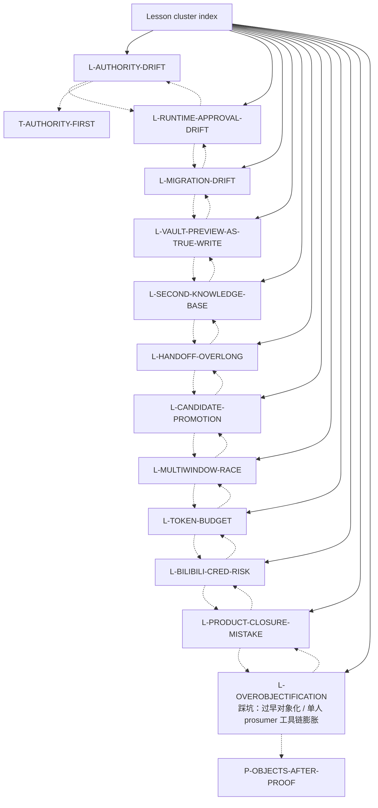

# Lesson cluster index

Lessons preserve historical failure modes and stop lines. This index is a navigation aid, not a replacement for the individual node files or source documents.

## Node table

| node_id | title | risk | degree |
|---|---|---:|---:|
| `L-AUTHORITY-DRIFT` | 踩坑：authority drift | critical | 3 |
| `L-RUNTIME-APPROVAL-DRIFT` | 踩坑：runtime approval drift | critical | 4 |
| `L-MIGRATION-DRIFT` | 踩坑：DB/migration 被 candidate 偷渡 | critical | 4 |
| `L-VAULT-PREVIEW-AS-TRUE-WRITE` | 踩坑：把 vault preview 当 true write | critical | 6 |
| `L-SECOND-KNOWLEDGE-BASE` | 踩坑：第二知识库 / mirror truth | critical | 4 |
| `L-HANDOFF-OVERLONG` | 踩坑：handoff 过长但不可执行 | high | 3 |
| `L-CANDIDATE-PROMOTION` | 踩坑：candidate 漂移成 authority | critical | 3 |
| `L-MULTIWINDOW-RACE` | 踩坑：多窗口 race / authority writer 冲突 | critical | 5 |
| `L-TOKEN-BUDGET` | 踩坑：token over budget / 全量读取错觉 | high | 3 |
| `L-BILIBILI-CRED-RISK` | 踩坑：Bilibili / credential / C&D 风险 | critical | 4 |
| `L-PRODUCT-CLOSURE-MISTAKE` | 踩坑：工程闭环误当产品闭环 | critical | 4 |
| `L-OVEROBJECTIFICATION` | 踩坑：过早对象化 / 单人 prosumer 工具链膨胀 | high | 3 |

## Cluster reading guidance

Read this cluster with three questions. First, which nodes are canonical/promoted facts and which are candidate synthesis? Second, which nodes are approval gates rather than progress claims? Third, which nodes should be read before any new dispatch or implementation starts? For ScoutFlow, the answer almost always routes back through `R-CURRENT-TASK-DECISION`, `T-AUTHORITY-FIRST`, `T-CANDIDATE-NOT-AUTHORITY`, and `T-EXECUTION-GATES`.

The cluster is deliberately redundant with the master graph. Redundancy here is defensive: a cold-start reader may enter from entities, lessons, feedback, or risk. Every path should rediscover the same hard boundaries: frozen dispatch evidence, no runtime/migration/front-end/vault true-write approval by default, and no second knowledge base.

## Maintenance note

When a node is added or removed, regenerate this index from the adjacency JSON. Manual edits to cluster diagrams are discouraged because they are a common source of graph drift.
