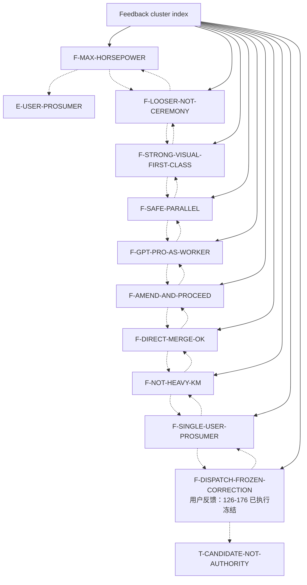

# Feedback cluster index

Feedback nodes capture user operating preferences and hard corrections. This index is a navigation aid, not a replacement for the individual node files or source documents.

## Node table

| node_id | title | risk | degree |
|---|---|---:|---:|
| `F-MAX-HORSEPOWER` | 用户反馈：最大化马力 / 最大效率 | critical | 3 |
| `F-LOOSER-NOT-CEREMONY` | 用户反馈：松一点，不堆 ceremony | high | 3 |
| `F-STRONG-VISUAL-FIRST-CLASS` | 用户反馈：强视觉是一级轴 | high | 3 |
| `F-SAFE-PARALLEL` | 用户反馈：安全前提下最大并行 | critical | 5 |
| `F-GPT-PRO-AS-WORKER` | 用户反馈：用 GPT Pro 干活 | medium | 3 |
| `F-AMEND-AND-PROCEED` | 用户反馈：amend_and_proceed | high | 3 |
| `F-DIRECT-MERGE-OK` | 用户反馈：可直 merge，但要不越界 | medium | 3 |
| `F-NOT-HEAVY-KM` | 用户反馈：不要重 KM / 第二知识库 | critical | 4 |
| `F-SINGLE-USER-PROSUMER` | 用户反馈：单人 prosumer max horsepower | high | 3 |
| `F-DISPATCH-FROZEN-CORRECTION` | 用户反馈：126-176 已执行冻结 | critical | 3 |

## Cluster reading guidance

Read this cluster with three questions. First, which nodes are canonical/promoted facts and which are candidate synthesis? Second, which nodes are approval gates rather than progress claims? Third, which nodes should be read before any new dispatch or implementation starts? For ScoutFlow, the answer almost always routes back through `R-CURRENT-TASK-DECISION`, `T-AUTHORITY-FIRST`, `T-CANDIDATE-NOT-AUTHORITY`, and `T-EXECUTION-GATES`.

The cluster is deliberately redundant with the master graph. Redundancy here is defensive: a cold-start reader may enter from entities, lessons, feedback, or risk. Every path should rediscover the same hard boundaries: frozen dispatch evidence, no runtime/migration/front-end/vault true-write approval by default, and no second knowledge base.

## Maintenance note

When a node is added or removed, regenerate this index from the adjacency JSON. Manual edits to cluster diagrams are discouraged because they are a common source of graph drift.
