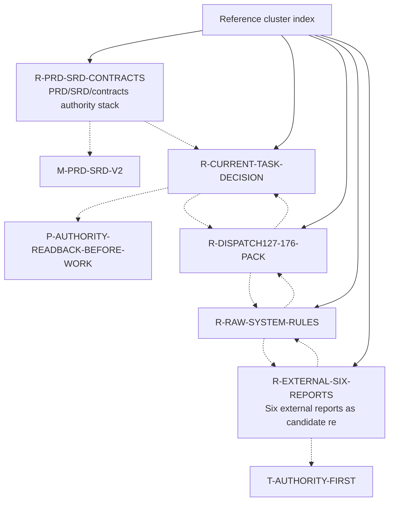

# Reference cluster index

References identify canonical or evidence corpora used by the atlas. This index is a navigation aid, not a replacement for the individual node files or source documents.

## Node table

| node_id | title | risk | degree |
|---|---|---:|---:|
| `R-PRD-SRD-CONTRACTS` | PRD/SRD/contracts authority stack | critical | 3 |
| `R-CURRENT-TASK-DECISION` | current/task-index/decision-log live readback | critical | 4 |
| `R-DISPATCH127-176-PACK` | Dispatch127-176 autoexec frozen pack | high | 3 |
| `R-RAW-SYSTEM-RULES` | RAW system rules and frontmatter contracts | high | 3 |
| `R-EXTERNAL-SIX-REPORTS` | Six external reports as candidate research corpus | high | 3 |

## Cluster reading guidance

Read this cluster with three questions. First, which nodes are canonical/promoted facts and which are candidate synthesis? Second, which nodes are approval gates rather than progress claims? Third, which nodes should be read before any new dispatch or implementation starts? For ScoutFlow, the answer almost always routes back through `R-CURRENT-TASK-DECISION`, `T-AUTHORITY-FIRST`, `T-CANDIDATE-NOT-AUTHORITY`, and `T-EXECUTION-GATES`.

The cluster is deliberately redundant with the master graph. Redundancy here is defensive: a cold-start reader may enter from entities, lessons, feedback, or risk. Every path should rediscover the same hard boundaries: frozen dispatch evidence, no runtime/migration/front-end/vault true-write approval by default, and no second knowledge base.

## Maintenance note

When a node is added or removed, regenerate this index from the adjacency JSON. Manual edits to cluster diagrams are discouraged because they are a common source of graph drift.
